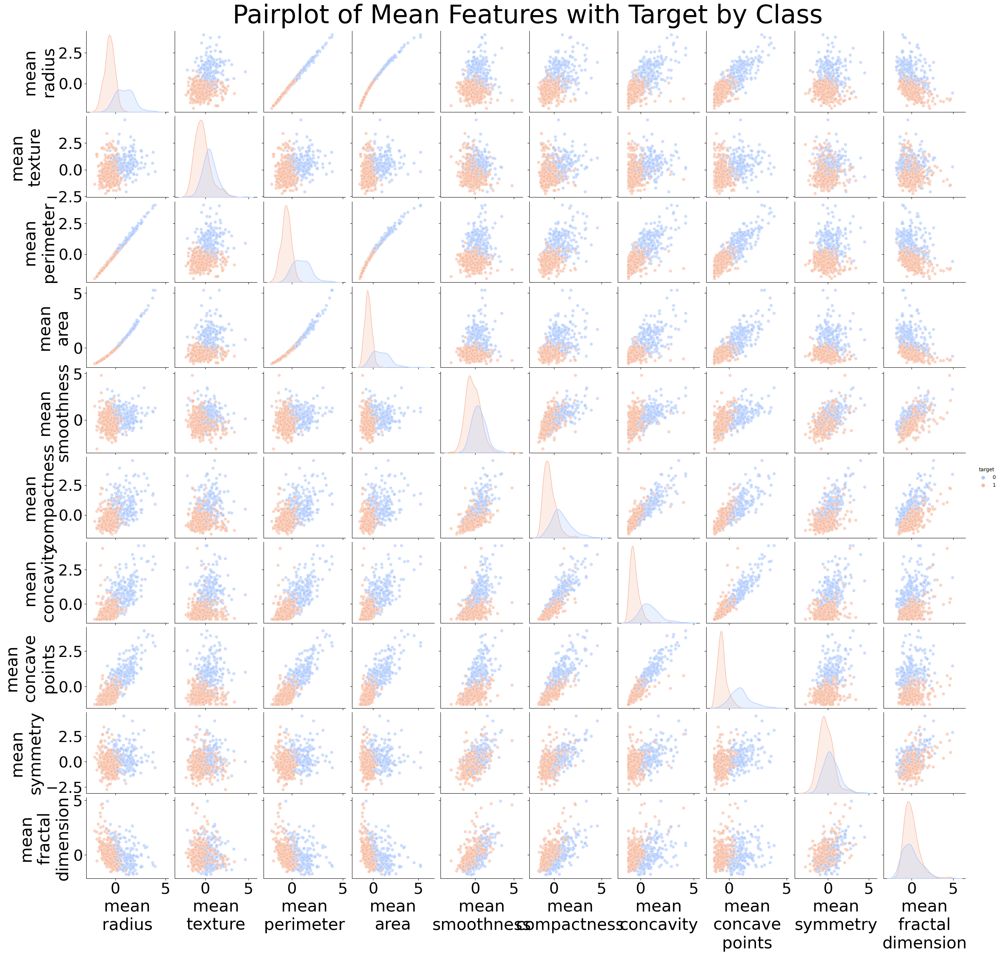
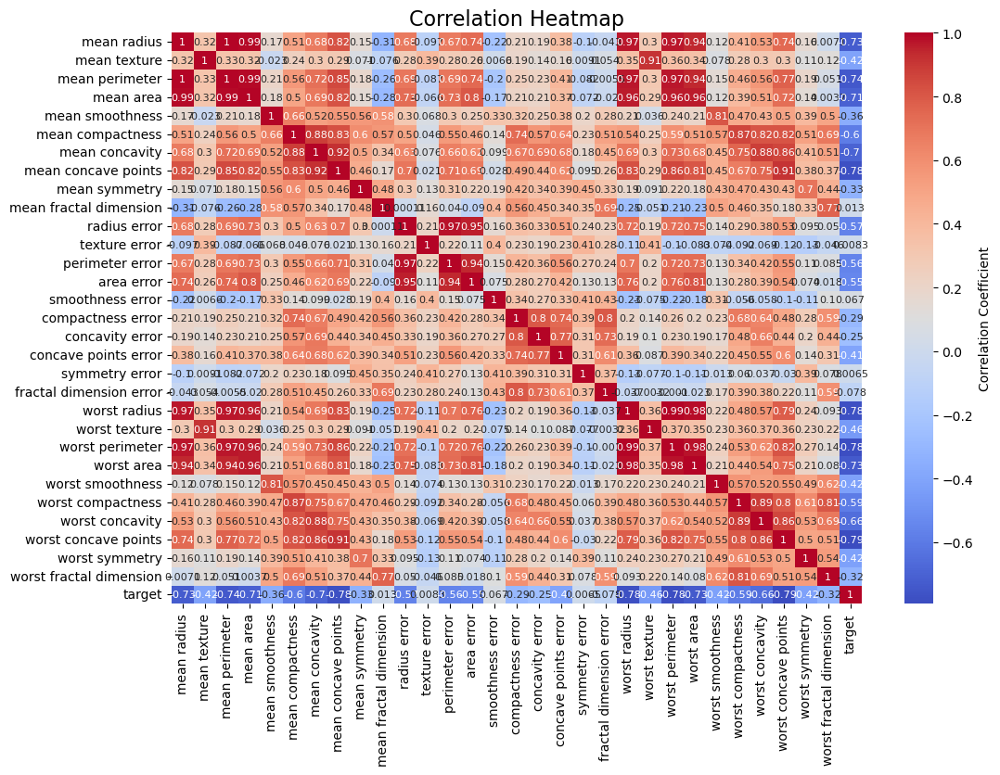
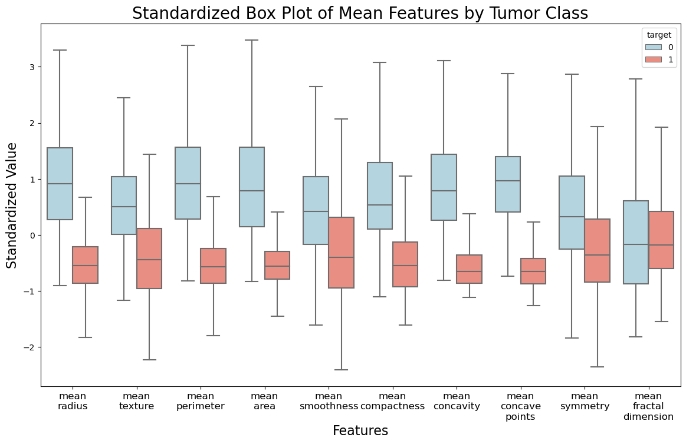
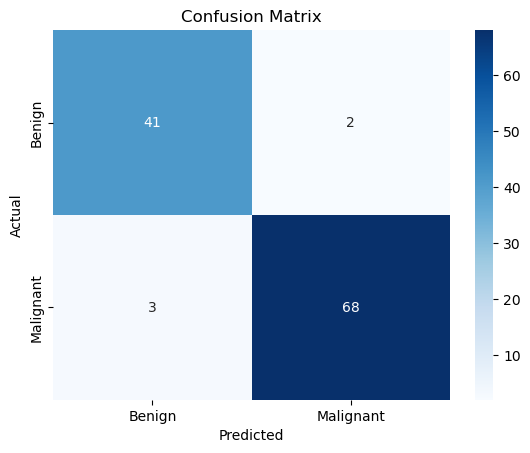
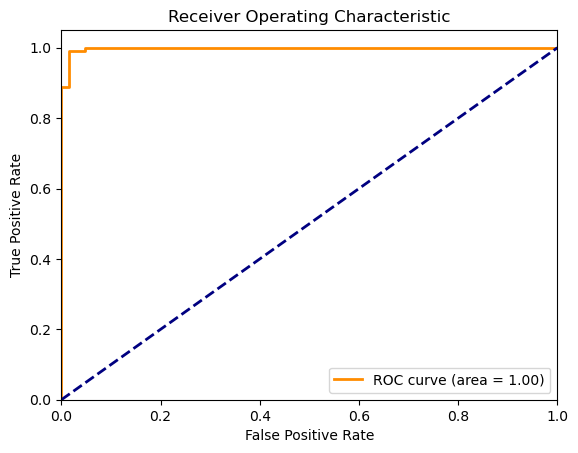

# Classification of samples: benign or malignant, using Support Vector Machines (SVM) #

### Summary ###
1. Import Libraries
Import essential libraries for data manipulation and visualization, such as pandas, numpy, and matplotlib.
Import libraries specific to machine learning, including sklearn modules for model training, evaluation, and preprocessing.
2. Load Dataset
Use pandas to load the dataset into a DataFrame, either from a local file or a URL. In this case, from sklearn.datasets import load_breast_cancer
data = load_breast_cancer()

3. Inspect the first few rows of the DataFrame using df.head() to understand the data structure.

4. Explore the Dataset
Use df.info() to check the data types and look for missing values.
Generate summary statistics with df.describe() to understand feature distributions and identify any outliers.

5. Preprocess the Data
Handle any missing values through imputation or removal as necessary.
Standardize the feature values using StandardScaler to ensure they are on a similar scale, which is crucial for SVM performance.

6. Split the Data
Use train_test_split from sklearn to randomly split the dataset into training and testing sets.
Define the proportion of data to be used for testing (commonly 20% to 30%).

7. Train the SVM Model
Initialize an SVM model using SVC() from sklearn, choosing an appropriate kernel (e.g., linear, RBF).
Fit the model on the training data using the fit() method.

8. Make Predictions
Use the trained model to predict labels for the test set with the predict() method.
Store the predicted labels for evaluation.

9. Evaluate the Model
Generate a confusion matrix to see how many predictions were correct versus incorrect.
Create a classification report to evaluate precision, recall, and F1-score for each class.

10. Tune the SVM Model (Optional)
Use GridSearchCV to explore different hyperparameters (e.g., C, gamma, kernel types) for model optimization.
Fit the grid search on the training data and select the best parameters based on cross-validation performance.

11. Visualize the Results (Optional)
If the dataset is 3D, create a scatter plot of the test data colored by the actual labels.
Overlay the SVM decision boundary to visualize how the model separates the classes.

12. Save the Model (Optional)
Use joblib or pickle to save the trained SVM model to a file for future use.
Provide a file path and filename for easy access later.


### Import Libraries ###


```python
import numpy as np
import pandas as pd
import matplotlib.pyplot as plt
import seaborn as sns
from sklearn.model_selection import train_test_split
from sklearn.preprocessing import StandardScaler
from sklearn.svm import SVC
from sklearn.metrics import classification_report, confusion_matrix

```

### Load Dataset ###


```python
from sklearn.datasets import load_breast_cancer
data = load_breast_cancer()
df = pd.DataFrame(data.data, columns=data.feature_names)
df['target'] = data.target
df
```


<div>
<style scoped>
    .dataframe tbody tr th:only-of-type {
        vertical-align: middle;
    }

    .dataframe tbody tr th {
        vertical-align: top;
    }

    .dataframe thead th {
        text-align: right;
    }
</style>
<table border="1" class="dataframe">
  <thead>
    <tr style="text-align: right;">
      <th></th>
      <th>mean radius</th>
      <th>mean texture</th>
      <th>mean perimeter</th>
      <th>mean area</th>
      <th>mean smoothness</th>
      <th>mean compactness</th>
      <th>mean concavity</th>
      <th>mean concave points</th>
      <th>mean symmetry</th>
      <th>mean fractal dimension</th>
      <th>...</th>
      <th>worst texture</th>
      <th>worst perimeter</th>
      <th>worst area</th>
      <th>worst smoothness</th>
      <th>worst compactness</th>
      <th>worst concavity</th>
      <th>worst concave points</th>
      <th>worst symmetry</th>
      <th>worst fractal dimension</th>
      <th>target</th>
    </tr>
  </thead>
  <tbody>
    <tr>
      <th>0</th>
      <td>17.99</td>
      <td>10.38</td>
      <td>122.80</td>
      <td>1001.0</td>
      <td>0.11840</td>
      <td>0.27760</td>
      <td>0.30010</td>
      <td>0.14710</td>
      <td>0.2419</td>
      <td>0.07871</td>
      <td>...</td>
      <td>17.33</td>
      <td>184.60</td>
      <td>2019.0</td>
      <td>0.16220</td>
      <td>0.66560</td>
      <td>0.7119</td>
      <td>0.2654</td>
      <td>0.4601</td>
      <td>0.11890</td>
      <td>0</td>
    </tr>
    <tr>
      <th>1</th>
      <td>20.57</td>
      <td>17.77</td>
      <td>132.90</td>
      <td>1326.0</td>
      <td>0.08474</td>
      <td>0.07864</td>
      <td>0.08690</td>
      <td>0.07017</td>
      <td>0.1812</td>
      <td>0.05667</td>
      <td>...</td>
      <td>23.41</td>
      <td>158.80</td>
      <td>1956.0</td>
      <td>0.12380</td>
      <td>0.18660</td>
      <td>0.2416</td>
      <td>0.1860</td>
      <td>0.2750</td>
      <td>0.08902</td>
      <td>0</td>
    </tr>
    <tr>
      <th>2</th>
      <td>19.69</td>
      <td>21.25</td>
      <td>130.00</td>
      <td>1203.0</td>
      <td>0.10960</td>
      <td>0.15990</td>
      <td>0.19740</td>
      <td>0.12790</td>
      <td>0.2069</td>
      <td>0.05999</td>
      <td>...</td>
      <td>25.53</td>
      <td>152.50</td>
      <td>1709.0</td>
      <td>0.14440</td>
      <td>0.42450</td>
      <td>0.4504</td>
      <td>0.2430</td>
      <td>0.3613</td>
      <td>0.08758</td>
      <td>0</td>
    </tr>
    <tr>
      <th>3</th>
      <td>11.42</td>
      <td>20.38</td>
      <td>77.58</td>
      <td>386.1</td>
      <td>0.14250</td>
      <td>0.28390</td>
      <td>0.24140</td>
      <td>0.10520</td>
      <td>0.2597</td>
      <td>0.09744</td>
      <td>...</td>
      <td>26.50</td>
      <td>98.87</td>
      <td>567.7</td>
      <td>0.20980</td>
      <td>0.86630</td>
      <td>0.6869</td>
      <td>0.2575</td>
      <td>0.6638</td>
      <td>0.17300</td>
      <td>0</td>
    </tr>
    <tr>
      <th>4</th>
      <td>20.29</td>
      <td>14.34</td>
      <td>135.10</td>
      <td>1297.0</td>
      <td>0.10030</td>
      <td>0.13280</td>
      <td>0.19800</td>
      <td>0.10430</td>
      <td>0.1809</td>
      <td>0.05883</td>
      <td>...</td>
      <td>16.67</td>
      <td>152.20</td>
      <td>1575.0</td>
      <td>0.13740</td>
      <td>0.20500</td>
      <td>0.4000</td>
      <td>0.1625</td>
      <td>0.2364</td>
      <td>0.07678</td>
      <td>0</td>
    </tr>
    <tr>
      <th>...</th>
      <td>...</td>
      <td>...</td>
      <td>...</td>
      <td>...</td>
      <td>...</td>
      <td>...</td>
      <td>...</td>
      <td>...</td>
      <td>...</td>
      <td>...</td>
      <td>...</td>
      <td>...</td>
      <td>...</td>
      <td>...</td>
      <td>...</td>
      <td>...</td>
      <td>...</td>
      <td>...</td>
      <td>...</td>
      <td>...</td>
      <td>...</td>
    </tr>
    <tr>
      <th>564</th>
      <td>21.56</td>
      <td>22.39</td>
      <td>142.00</td>
      <td>1479.0</td>
      <td>0.11100</td>
      <td>0.11590</td>
      <td>0.24390</td>
      <td>0.13890</td>
      <td>0.1726</td>
      <td>0.05623</td>
      <td>...</td>
      <td>26.40</td>
      <td>166.10</td>
      <td>2027.0</td>
      <td>0.14100</td>
      <td>0.21130</td>
      <td>0.4107</td>
      <td>0.2216</td>
      <td>0.2060</td>
      <td>0.07115</td>
      <td>0</td>
    </tr>
    <tr>
      <th>565</th>
      <td>20.13</td>
      <td>28.25</td>
      <td>131.20</td>
      <td>1261.0</td>
      <td>0.09780</td>
      <td>0.10340</td>
      <td>0.14400</td>
      <td>0.09791</td>
      <td>0.1752</td>
      <td>0.05533</td>
      <td>...</td>
      <td>38.25</td>
      <td>155.00</td>
      <td>1731.0</td>
      <td>0.11660</td>
      <td>0.19220</td>
      <td>0.3215</td>
      <td>0.1628</td>
      <td>0.2572</td>
      <td>0.06637</td>
      <td>0</td>
    </tr>
    <tr>
      <th>566</th>
      <td>16.60</td>
      <td>28.08</td>
      <td>108.30</td>
      <td>858.1</td>
      <td>0.08455</td>
      <td>0.10230</td>
      <td>0.09251</td>
      <td>0.05302</td>
      <td>0.1590</td>
      <td>0.05648</td>
      <td>...</td>
      <td>34.12</td>
      <td>126.70</td>
      <td>1124.0</td>
      <td>0.11390</td>
      <td>0.30940</td>
      <td>0.3403</td>
      <td>0.1418</td>
      <td>0.2218</td>
      <td>0.07820</td>
      <td>0</td>
    </tr>
    <tr>
      <th>567</th>
      <td>20.60</td>
      <td>29.33</td>
      <td>140.10</td>
      <td>1265.0</td>
      <td>0.11780</td>
      <td>0.27700</td>
      <td>0.35140</td>
      <td>0.15200</td>
      <td>0.2397</td>
      <td>0.07016</td>
      <td>...</td>
      <td>39.42</td>
      <td>184.60</td>
      <td>1821.0</td>
      <td>0.16500</td>
      <td>0.86810</td>
      <td>0.9387</td>
      <td>0.2650</td>
      <td>0.4087</td>
      <td>0.12400</td>
      <td>0</td>
    </tr>
    <tr>
      <th>568</th>
      <td>7.76</td>
      <td>24.54</td>
      <td>47.92</td>
      <td>181.0</td>
      <td>0.05263</td>
      <td>0.04362</td>
      <td>0.00000</td>
      <td>0.00000</td>
      <td>0.1587</td>
      <td>0.05884</td>
      <td>...</td>
      <td>30.37</td>
      <td>59.16</td>
      <td>268.6</td>
      <td>0.08996</td>
      <td>0.06444</td>
      <td>0.0000</td>
      <td>0.0000</td>
      <td>0.2871</td>
      <td>0.07039</td>
      <td>1</td>
    </tr>
  </tbody>
</table>
<p>569 rows × 31 columns</p>
</div>


## Exploratory Data Analysis EAD ##

Attribute Information:

1) ID number
2) Diagnosis (M = malignant, B = benign)
3-32)

Ten real-valued features are computed for each cell nucleus:

a) radius (mean of distances from center to points on the perimeter)
b) texture (standard deviation of gray-scale values)
c) perimeter
d) area
e) smoothness (local variation in radius lengths)
f) compactness (perimeter^2 / area - 1.0)
g) concavity (severity of concave portions of the contour)
h) concave points (number of concave portions of the contour)
i) symmetry
j) fractal dimension ("coastline approximation" - 1)

The mean, standard error and "worst" or largest (mean of the three
largest values) of these features were computed for each image,
resulting in 30 features. For instance, field 3 is Mean Radius, field
13 is Radius SE, field 23 is Worst Radius.

All feature values are recoded with four significant digits.

Missing attribute values: none

Class distribution: 357 benign target =1 , 212 malignant target = 0


```python
df.describe()
```


<div>
<style scoped>
    .dataframe tbody tr th:only-of-type {
        vertical-align: middle;
    }

    .dataframe tbody tr th {
        vertical-align: top;
    }

    .dataframe thead th {
        text-align: right;
    }
</style>
<table border="1" class="dataframe">
  <thead>
    <tr style="text-align: right;">
      <th></th>
      <th>mean radius</th>
      <th>mean texture</th>
      <th>mean perimeter</th>
      <th>mean area</th>
      <th>mean smoothness</th>
      <th>mean compactness</th>
      <th>mean concavity</th>
      <th>mean concave points</th>
      <th>mean symmetry</th>
      <th>mean fractal dimension</th>
      <th>...</th>
      <th>worst texture</th>
      <th>worst perimeter</th>
      <th>worst area</th>
      <th>worst smoothness</th>
      <th>worst compactness</th>
      <th>worst concavity</th>
      <th>worst concave points</th>
      <th>worst symmetry</th>
      <th>worst fractal dimension</th>
      <th>target</th>
    </tr>
  </thead>
  <tbody>
    <tr>
      <th>count</th>
      <td>569.000000</td>
      <td>569.000000</td>
      <td>569.000000</td>
      <td>569.000000</td>
      <td>569.000000</td>
      <td>569.000000</td>
      <td>569.000000</td>
      <td>569.000000</td>
      <td>569.000000</td>
      <td>569.000000</td>
      <td>...</td>
      <td>569.000000</td>
      <td>569.000000</td>
      <td>569.000000</td>
      <td>569.000000</td>
      <td>569.000000</td>
      <td>569.000000</td>
      <td>569.000000</td>
      <td>569.000000</td>
      <td>569.000000</td>
      <td>569.000000</td>
    </tr>
    <tr>
      <th>mean</th>
      <td>14.127292</td>
      <td>19.289649</td>
      <td>91.969033</td>
      <td>654.889104</td>
      <td>0.096360</td>
      <td>0.104341</td>
      <td>0.088799</td>
      <td>0.048919</td>
      <td>0.181162</td>
      <td>0.062798</td>
      <td>...</td>
      <td>25.677223</td>
      <td>107.261213</td>
      <td>880.583128</td>
      <td>0.132369</td>
      <td>0.254265</td>
      <td>0.272188</td>
      <td>0.114606</td>
      <td>0.290076</td>
      <td>0.083946</td>
      <td>0.627417</td>
    </tr>
    <tr>
      <th>std</th>
      <td>3.524049</td>
      <td>4.301036</td>
      <td>24.298981</td>
      <td>351.914129</td>
      <td>0.014064</td>
      <td>0.052813</td>
      <td>0.079720</td>
      <td>0.038803</td>
      <td>0.027414</td>
      <td>0.007060</td>
      <td>...</td>
      <td>6.146258</td>
      <td>33.602542</td>
      <td>569.356993</td>
      <td>0.022832</td>
      <td>0.157336</td>
      <td>0.208624</td>
      <td>0.065732</td>
      <td>0.061867</td>
      <td>0.018061</td>
      <td>0.483918</td>
    </tr>
    <tr>
      <th>min</th>
      <td>6.981000</td>
      <td>9.710000</td>
      <td>43.790000</td>
      <td>143.500000</td>
      <td>0.052630</td>
      <td>0.019380</td>
      <td>0.000000</td>
      <td>0.000000</td>
      <td>0.106000</td>
      <td>0.049960</td>
      <td>...</td>
      <td>12.020000</td>
      <td>50.410000</td>
      <td>185.200000</td>
      <td>0.071170</td>
      <td>0.027290</td>
      <td>0.000000</td>
      <td>0.000000</td>
      <td>0.156500</td>
      <td>0.055040</td>
      <td>0.000000</td>
    </tr>
    <tr>
      <th>25%</th>
      <td>11.700000</td>
      <td>16.170000</td>
      <td>75.170000</td>
      <td>420.300000</td>
      <td>0.086370</td>
      <td>0.064920</td>
      <td>0.029560</td>
      <td>0.020310</td>
      <td>0.161900</td>
      <td>0.057700</td>
      <td>...</td>
      <td>21.080000</td>
      <td>84.110000</td>
      <td>515.300000</td>
      <td>0.116600</td>
      <td>0.147200</td>
      <td>0.114500</td>
      <td>0.064930</td>
      <td>0.250400</td>
      <td>0.071460</td>
      <td>0.000000</td>
    </tr>
    <tr>
      <th>50%</th>
      <td>13.370000</td>
      <td>18.840000</td>
      <td>86.240000</td>
      <td>551.100000</td>
      <td>0.095870</td>
      <td>0.092630</td>
      <td>0.061540</td>
      <td>0.033500</td>
      <td>0.179200</td>
      <td>0.061540</td>
      <td>...</td>
      <td>25.410000</td>
      <td>97.660000</td>
      <td>686.500000</td>
      <td>0.131300</td>
      <td>0.211900</td>
      <td>0.226700</td>
      <td>0.099930</td>
      <td>0.282200</td>
      <td>0.080040</td>
      <td>1.000000</td>
    </tr>
    <tr>
      <th>75%</th>
      <td>15.780000</td>
      <td>21.800000</td>
      <td>104.100000</td>
      <td>782.700000</td>
      <td>0.105300</td>
      <td>0.130400</td>
      <td>0.130700</td>
      <td>0.074000</td>
      <td>0.195700</td>
      <td>0.066120</td>
      <td>...</td>
      <td>29.720000</td>
      <td>125.400000</td>
      <td>1084.000000</td>
      <td>0.146000</td>
      <td>0.339100</td>
      <td>0.382900</td>
      <td>0.161400</td>
      <td>0.317900</td>
      <td>0.092080</td>
      <td>1.000000</td>
    </tr>
    <tr>
      <th>max</th>
      <td>28.110000</td>
      <td>39.280000</td>
      <td>188.500000</td>
      <td>2501.000000</td>
      <td>0.163400</td>
      <td>0.345400</td>
      <td>0.426800</td>
      <td>0.201200</td>
      <td>0.304000</td>
      <td>0.097440</td>
      <td>...</td>
      <td>49.540000</td>
      <td>251.200000</td>
      <td>4254.000000</td>
      <td>0.222600</td>
      <td>1.058000</td>
      <td>1.252000</td>
      <td>0.291000</td>
      <td>0.663800</td>
      <td>0.207500</td>
      <td>1.000000</td>
    </tr>
  </tbody>
</table>
<p>8 rows × 31 columns</p>
</div>


```python
#The dataset includes 30 features related to the characteristics of the cell nuclei
print(df.columns)
```

    Index(['mean radius', 'mean texture', 'mean perimeter', 'mean area',
           'mean smoothness', 'mean compactness', 'mean concavity',
           'mean concave points', 'mean symmetry', 'mean fractal dimension',
           'radius error', 'texture error', 'perimeter error', 'area error',
           'smoothness error', 'compactness error', 'concavity error',
           'concave points error', 'symmetry error', 'fractal dimension error',
           'worst radius', 'worst texture', 'worst perimeter', 'worst area',
           'worst smoothness', 'worst compactness', 'worst concavity',
           'worst concave points', 'worst symmetry', 'worst fractal dimension',
           'target'],
          dtype='object')
    

### Pair Plot (For relationships between all features) ###
Seaborn’s pairplot is excellent for visualizing relationships between multiple variables at once, especially in small datasets.


```python
import seaborn as sns
import matplotlib.pyplot as plt

# Define the correct column names for the 'mean' features
features = ['mean radius', 'mean texture', 'mean perimeter', 'mean area', 
            'mean smoothness', 'mean compactness', 'mean concavity', 
            'mean concave points', 'mean symmetry', 'mean fractal dimension']

# Create a Seaborn pairplot with the correct features and target
g = sns.pairplot(df[features + ['target']], diag_kind='kde', hue='target', palette="coolwarm",
                 plot_kws={'alpha': 0.6, 's': 40}, diag_kws={'fill': True})  # Replacing 'shade' with 'fill'

# Break long axis labels into two lines and adjust font sizes
for ax in g.axes.flat:
    ax.set_xlabel("\n".join(ax.get_xlabel().split()), fontsize=32)  # Split the x-axis label into multiple lines
    ax.set_ylabel("\n".join(ax.get_ylabel().split()), fontsize=32)  # Split the y-axis label into multiple lines
    ax.tick_params(axis='both', which='major', labelsize=30)  # Set tick labels font size

# Add a title for clarity
plt.suptitle('Pairplot of Mean Features with Target by Class', size=50)
plt.subplots_adjust(top=0.95)

# Show the plot
plt.show()

```


    

    


Blue to benign (0)
Orange to malignant (1)


```python
import seaborn as sns
import matplotlib.pyplot as plt

# Calculate the correlation matrix
corr = df.corr()

# Create a heatmap with smaller labels
plt.figure(figsize=(12, 8))  # Optional: Adjust figure size for better visibility
sns.heatmap(corr, annot=True, cmap='coolwarm', 
            annot_kws={"size": 8},  # Size of the annotations
            xticklabels=1,  # Frequency of x-tick labels (1 means show every label)
            yticklabels=1,  # Frequency of y-tick labels (1 means show every label)
            cbar_kws={'label': 'Correlation Coefficient'})  # Color bar label

# Add a title
plt.title('Correlation Heatmap', fontsize=16)
plt.show()

```


    

    


```python
import seaborn as sns
import matplotlib.pyplot as plt
import pandas as pd
from sklearn.datasets import load_breast_cancer
from sklearn.preprocessing import StandardScaler

# Load the dataset
data = load_breast_cancer()
df = pd.DataFrame(data.data, columns=data.feature_names)
df['target'] = data.target

# Define the features to plot
features = ['mean radius', 'mean texture', 'mean perimeter', 'mean area', 
            'mean smoothness', 'mean compactness', 'mean concavity', 
            'mean concave points', 'mean symmetry', 'mean fractal dimension']

# Standardize the features
scaler = StandardScaler()
df[features] = scaler.fit_transform(df[features])

# Melt the DataFrame to long format
df_melted = df.melt(id_vars='target', value_vars=features, var_name='Feature', value_name='Value')

# Create the box plot
plt.figure(figsize=(14, 8))
box_plot = sns.boxplot(data=df_melted, x='Feature', y='Value', hue='target', 
                       palette={0: "lightblue", 1: "salmon"}, showfliers=False)

# Add title and labels
plt.title('Standardized Box Plot of Mean Features by Tumor Class', fontsize=20)
plt.xlabel('Features', fontsize=16)
plt.ylabel('Standardized Value', fontsize=16)

# Adjust x-axis label size and format to prevent overlap
plt.xticks(ticks=range(len(features)), labels=[feature.replace(" ", "\n") for feature in features], fontsize=12)


# Show the plot
plt.show()

```


    

    


```python
df.describe()  # Summary statistics
```


<div>
<style scoped>
    .dataframe tbody tr th:only-of-type {
        vertical-align: middle;
    }

    .dataframe tbody tr th {
        vertical-align: top;
    }

    .dataframe thead th {
        text-align: right;
    }
</style>
<table border="1" class="dataframe">
  <thead>
    <tr style="text-align: right;">
      <th></th>
      <th>mean radius</th>
      <th>mean texture</th>
      <th>mean perimeter</th>
      <th>mean area</th>
      <th>mean smoothness</th>
      <th>mean compactness</th>
      <th>mean concavity</th>
      <th>mean concave points</th>
      <th>mean symmetry</th>
      <th>mean fractal dimension</th>
      <th>...</th>
      <th>worst texture</th>
      <th>worst perimeter</th>
      <th>worst area</th>
      <th>worst smoothness</th>
      <th>worst compactness</th>
      <th>worst concavity</th>
      <th>worst concave points</th>
      <th>worst symmetry</th>
      <th>worst fractal dimension</th>
      <th>target</th>
    </tr>
  </thead>
  <tbody>
    <tr>
      <th>count</th>
      <td>5.690000e+02</td>
      <td>5.690000e+02</td>
      <td>5.690000e+02</td>
      <td>5.690000e+02</td>
      <td>5.690000e+02</td>
      <td>5.690000e+02</td>
      <td>5.690000e+02</td>
      <td>5.690000e+02</td>
      <td>5.690000e+02</td>
      <td>5.690000e+02</td>
      <td>...</td>
      <td>569.000000</td>
      <td>569.000000</td>
      <td>569.000000</td>
      <td>569.000000</td>
      <td>569.000000</td>
      <td>569.000000</td>
      <td>569.000000</td>
      <td>569.000000</td>
      <td>569.000000</td>
      <td>569.000000</td>
    </tr>
    <tr>
      <th>mean</th>
      <td>-3.162867e-15</td>
      <td>-6.530609e-15</td>
      <td>-7.078891e-16</td>
      <td>-8.799835e-16</td>
      <td>6.132177e-15</td>
      <td>-1.120369e-15</td>
      <td>-4.421380e-16</td>
      <td>9.732500e-16</td>
      <td>-1.971670e-15</td>
      <td>-1.453631e-15</td>
      <td>...</td>
      <td>25.677223</td>
      <td>107.261213</td>
      <td>880.583128</td>
      <td>0.132369</td>
      <td>0.254265</td>
      <td>0.272188</td>
      <td>0.114606</td>
      <td>0.290076</td>
      <td>0.083946</td>
      <td>0.627417</td>
    </tr>
    <tr>
      <th>std</th>
      <td>1.000880e+00</td>
      <td>1.000880e+00</td>
      <td>1.000880e+00</td>
      <td>1.000880e+00</td>
      <td>1.000880e+00</td>
      <td>1.000880e+00</td>
      <td>1.000880e+00</td>
      <td>1.000880e+00</td>
      <td>1.000880e+00</td>
      <td>1.000880e+00</td>
      <td>...</td>
      <td>6.146258</td>
      <td>33.602542</td>
      <td>569.356993</td>
      <td>0.022832</td>
      <td>0.157336</td>
      <td>0.208624</td>
      <td>0.065732</td>
      <td>0.061867</td>
      <td>0.018061</td>
      <td>0.483918</td>
    </tr>
    <tr>
      <th>min</th>
      <td>-2.029648e+00</td>
      <td>-2.229249e+00</td>
      <td>-1.984504e+00</td>
      <td>-1.454443e+00</td>
      <td>-3.112085e+00</td>
      <td>-1.610136e+00</td>
      <td>-1.114873e+00</td>
      <td>-1.261820e+00</td>
      <td>-2.744117e+00</td>
      <td>-1.819865e+00</td>
      <td>...</td>
      <td>12.020000</td>
      <td>50.410000</td>
      <td>185.200000</td>
      <td>0.071170</td>
      <td>0.027290</td>
      <td>0.000000</td>
      <td>0.000000</td>
      <td>0.156500</td>
      <td>0.055040</td>
      <td>0.000000</td>
    </tr>
    <tr>
      <th>25%</th>
      <td>-6.893853e-01</td>
      <td>-7.259631e-01</td>
      <td>-6.919555e-01</td>
      <td>-6.671955e-01</td>
      <td>-7.109628e-01</td>
      <td>-7.470860e-01</td>
      <td>-7.437479e-01</td>
      <td>-7.379438e-01</td>
      <td>-7.032397e-01</td>
      <td>-7.226392e-01</td>
      <td>...</td>
      <td>21.080000</td>
      <td>84.110000</td>
      <td>515.300000</td>
      <td>0.116600</td>
      <td>0.147200</td>
      <td>0.114500</td>
      <td>0.064930</td>
      <td>0.250400</td>
      <td>0.071460</td>
      <td>0.000000</td>
    </tr>
    <tr>
      <th>50%</th>
      <td>-2.150816e-01</td>
      <td>-1.046362e-01</td>
      <td>-2.359800e-01</td>
      <td>-2.951869e-01</td>
      <td>-3.489108e-02</td>
      <td>-2.219405e-01</td>
      <td>-3.422399e-01</td>
      <td>-3.977212e-01</td>
      <td>-7.162650e-02</td>
      <td>-1.782793e-01</td>
      <td>...</td>
      <td>25.410000</td>
      <td>97.660000</td>
      <td>686.500000</td>
      <td>0.131300</td>
      <td>0.211900</td>
      <td>0.226700</td>
      <td>0.099930</td>
      <td>0.282200</td>
      <td>0.080040</td>
      <td>1.000000</td>
    </tr>
    <tr>
      <th>75%</th>
      <td>4.693926e-01</td>
      <td>5.841756e-01</td>
      <td>4.996769e-01</td>
      <td>3.635073e-01</td>
      <td>6.361990e-01</td>
      <td>4.938569e-01</td>
      <td>5.260619e-01</td>
      <td>6.469351e-01</td>
      <td>5.307792e-01</td>
      <td>4.709834e-01</td>
      <td>...</td>
      <td>29.720000</td>
      <td>125.400000</td>
      <td>1084.000000</td>
      <td>0.146000</td>
      <td>0.339100</td>
      <td>0.382900</td>
      <td>0.161400</td>
      <td>0.317900</td>
      <td>0.092080</td>
      <td>1.000000</td>
    </tr>
    <tr>
      <th>max</th>
      <td>3.971288e+00</td>
      <td>4.651889e+00</td>
      <td>3.976130e+00</td>
      <td>5.250529e+00</td>
      <td>4.770911e+00</td>
      <td>4.568425e+00</td>
      <td>4.243589e+00</td>
      <td>3.927930e+00</td>
      <td>4.484751e+00</td>
      <td>4.910919e+00</td>
      <td>...</td>
      <td>49.540000</td>
      <td>251.200000</td>
      <td>4254.000000</td>
      <td>0.222600</td>
      <td>1.058000</td>
      <td>1.252000</td>
      <td>0.291000</td>
      <td>0.663800</td>
      <td>0.207500</td>
      <td>1.000000</td>
    </tr>
  </tbody>
</table>
<p>8 rows × 31 columns</p>
</div>


```python
df.info()  # Overview of the data structure
```

    <class 'pandas.core.frame.DataFrame'>
    RangeIndex: 569 entries, 0 to 568
    Data columns (total 31 columns):
     #   Column                   Non-Null Count  Dtype  
    ---  ------                   --------------  -----  
     0   mean radius              569 non-null    float64
     1   mean texture             569 non-null    float64
     2   mean perimeter           569 non-null    float64
     3   mean area                569 non-null    float64
     4   mean smoothness          569 non-null    float64
     5   mean compactness         569 non-null    float64
     6   mean concavity           569 non-null    float64
     7   mean concave points      569 non-null    float64
     8   mean symmetry            569 non-null    float64
     9   mean fractal dimension   569 non-null    float64
     10  radius error             569 non-null    float64
     11  texture error            569 non-null    float64
     12  perimeter error          569 non-null    float64
     13  area error               569 non-null    float64
     14  smoothness error         569 non-null    float64
     15  compactness error        569 non-null    float64
     16  concavity error          569 non-null    float64
     17  concave points error     569 non-null    float64
     18  symmetry error           569 non-null    float64
     19  fractal dimension error  569 non-null    float64
     20  worst radius             569 non-null    float64
     21  worst texture            569 non-null    float64
     22  worst perimeter          569 non-null    float64
     23  worst area               569 non-null    float64
     24  worst smoothness         569 non-null    float64
     25  worst compactness        569 non-null    float64
     26  worst concavity          569 non-null    float64
     27  worst concave points     569 non-null    float64
     28  worst symmetry           569 non-null    float64
     29  worst fractal dimension  569 non-null    float64
     30  target                   569 non-null    int32  
    dtypes: float64(30), int32(1)
    memory usage: 135.7 KB
    


```python
df['target'].value_counts()  # Check the distribution of target labels
```


    1    357
    0    212
    Name: target, dtype: int64


### 4. Preprocess the Data: Handle Missing Values, Scale the Features (SVM performs better with standardized features) ###


```python
df.isnull().sum()  # Check for missing values
```


    mean radius                0
    mean texture               0
    mean perimeter             0
    mean area                  0
    mean smoothness            0
    mean compactness           0
    mean concavity             0
    mean concave points        0
    mean symmetry              0
    mean fractal dimension     0
    radius error               0
    texture error              0
    perimeter error            0
    area error                 0
    smoothness error           0
    compactness error          0
    concavity error            0
    concave points error       0
    symmetry error             0
    fractal dimension error    0
    worst radius               0
    worst texture              0
    worst perimeter            0
    worst area                 0
    worst smoothness           0
    worst compactness          0
    worst concavity            0
    worst concave points       0
    worst symmetry             0
    worst fractal dimension    0
    target                     0
    dtype: int64


```python
X = df.drop('target', axis=1)
y = df['target']

scaler = StandardScaler()
X_scaled = scaler.fit_transform(X)

```

5. Split the Data


```python
# Assuming df is your DataFrame with the selected features and target
selected_features = ['mean radius', 'mean texture', 'mean perimeter', 
                    'mean area', 'mean concavity', 'mean compactness', 
                    'worst radius']

X = df[selected_features].values
y = df['target'].values

# Check shapes
print("X shape:", X.shape)
print("y shape:", y.shape)

# Scale the features
from sklearn.preprocessing import StandardScaler
scaler = StandardScaler()
X_scaled = scaler.fit_transform(X)

# Check shapes again after scaling
print("X_scaled shape:", X_scaled.shape)

# Split the dataset
X_train, X_test, y_train, y_test = train_test_split(X_scaled, y, test_size=0.2, random_state=42)
print("X_train:", X_train.shape)
print("X_test:", X_test.shape)
```

    X shape: (569, 7)
    y shape: (569,)
    X_scaled shape: (569, 7)
    X_train: (455, 7)
    X_test: (114, 7)
    


```python
print("X_scaled shape:", X_scaled.shape)
print("y shape:", y.shape)

```

    X_scaled shape: (569, 7)
    y shape: (569,)
    

6.  Train the SVM Model


```python
X_train, X_test, y_train, y_test = train_test_split(X_scaled, y, test_size=0.2, random_state=42)
```


```python
model = SVC(kernel='linear')  # Linear kernel
model.fit(X_train, y_train)  # Train the model
```


    SVC(kernel='linear')


7. Make Predictions


```python
y_pred = model.predict(X_test)
y_pred
```


    array([1, 0, 0, 1, 1, 0, 0, 0, 1, 1, 1, 0, 1, 0, 1, 0, 1, 1, 1, 0, 1, 1,
           0, 1, 1, 1, 1, 1, 1, 0, 1, 1, 1, 1, 1, 1, 0, 1, 0, 1, 1, 0, 1, 1,
           1, 1, 1, 1, 1, 1, 0, 0, 1, 1, 1, 1, 1, 0, 1, 1, 1, 0, 0, 1, 1, 1,
           0, 0, 1, 1, 0, 0, 1, 0, 1, 1, 1, 1, 1, 1, 0, 1, 0, 0, 0, 0, 0, 0,
           1, 1, 1, 1, 1, 1, 1, 1, 0, 0, 1, 0, 0, 1, 0, 0, 1, 1, 1, 0, 1, 1,
           0, 1, 0, 0])


8. Evaluate the Model


```python

print(confusion_matrix(y_test, y_pred))  # Confusion matrix
```

    [[41  2]
     [ 3 68]]
    

## Confusion Matrix Elements

The confusion matrix provides insight into the performance of a classification model by summarizing the counts of true and false predictions. Each element in the matrix is defined as follows:

|                         | **Predicted Negative (0)** | **Predicted Positive (1)** |
|-------------------------|-----------------------------|-----------------------------|
| **Actual Negative (0)** | True Negative (TN) = 41     | False Positive (FP) = 2     |
| **Actual Positive (1)** | False Negative (FN) = 3     | True Positive (TP) = 68     |

### Definitions of Each Element

- **True Negative (TN)**:  
  The model correctly predicted the negative class.  
  **Value**: 41

- **False Positive (FP)**:  
  The model incorrectly predicted the positive class when it was actually negative.  
  **Value**: 2

- **False Negative (FN)**:  
  The model incorrectly predicted the negative class when it was actually positive.  
  **Value**: 3

- **True Positive (TP)**:  
  The model correctly predicted the positive class.  
  **Value**: 68


 ### Confusion Matrix Heatmap:  ###

Visualize the confusion matrix to see how many predictions fall into each category.


```python
import seaborn as sns
import matplotlib.pyplot as plt
from sklearn.metrics import confusion_matrix

cm = confusion_matrix(y_test, y_pred)
sns.heatmap(cm, annot=True, fmt='d', cmap='Blues', 
            xticklabels=['Benign', 'Malignant'], 
            yticklabels=['Benign', 'Malignant'])
plt.ylabel('Actual')
plt.xlabel('Predicted')
plt.title('Confusion Matrix')
plt.show()
```


    

    


 
 ##  Classification Report ##

The classification report provides key performance metrics for the model's predictions.


```python

print(classification_report(y_test, y_pred))  # Precision, recall, F1-score

```

                  precision    recall  f1-score   support
    
               0       0.93      0.95      0.94        43
               1       0.97      0.96      0.96        71
    
        accuracy                           0.96       114
       macro avg       0.95      0.96      0.95       114
    weighted avg       0.96      0.96      0.96       114
    
    

# Confusion Matrix

|                                   | **Predicted Negative (0)** | **Predicted Positive (1)** |
|-----------------------------------|-----------------------------|-----------------------------|
| **Actual Negative (0)**           | True Negative (TN) = 41     | False Positive (FP) = 2      |
| **Actual Positive (1)**           | False Negative (FN) = 3     | True Positive (TP) = 68      |

---

## Per-Class Metrics

### Class 0 (Negative Class)
- **Precision**: 
  - **Value**: 0.93
  - **Definition**: The proportion of positive identifications that were actually correct.
  - **Formula**:  
    $$\text{Precision} = \frac{\text{TP}}{\text{TP} + \text{FP}} = \frac{41}{41 + 2} \approx 0.93$$
  
- **Recall**: 
  - **Value**: 0.95
  - **Definition**: The proportion of actual positives that were identified correctly.
  - **Formula**:  
    $$\text{Recall} = \frac{\text{TP}}{\text{TP} + \text{FN}} = \frac{41}{41 + 3} \approx 0.95$$
  
- **F1-Score**: 
  - **Value**: 0.94
  - **Definition**: The harmonic mean of precision and recall, balancing both metrics.
  - **Formula**:  
    $$F1 = 2 \times \frac{\text{Precision} \times \text{Recall}}{\text{Precision} + \text{Recall}} = 2 \times \frac{0.93 \times 0.95}{0.93 + 0.95} \approx 0.94$$
  
- **Support**: 
  - **Definition**: The number of actual occurrences of the class in the dataset.
  - **Value**: 43

---

### Class 1 (Positive Class)
- **Precision**: 
  - **Value**: 0.97
  - **Definition**: The proportion of positive identifications that were actually correct.
  - **Formula**:  
    $$\text{Precision} = \frac{\text{TP}}{\text{TP} + \text{FP}} = \frac{68}{68 + 2} \approx 0.97$$
  
- **Recall**: 
  - **Value**: 0.96
  - **Definition**: The proportion of actual positives that were identified correctly.
  - **Formula**:  
    $$\text{Recall} = \frac{\text{TP}}{\text{TP} + \text{FN}} = \frac{68}{68 + 3} \approx 0.96$$
  
- **F1-Score**: 
  - **Value**: 0.96
  - **Definition**: The harmonic mean of precision and recall, balancing both metrics.
  - **Formula**:  
    $$F1 = 2 \times \frac{\text{Precision} \times \text{Recall}}{\text{Precision} + \text{Recall}} = 2 \times \frac{0.97 \times 0.96}{0.97 + 0.96} \approx 0.96$$
  
- **Support**: 
  - **Definition**: The number of actual occurrences of the class in the dataset.
  - **Value**: 71

---

## Overall Metrics

- **Accuracy**: 
  - **Value**: 0.96
  - **Definition**: The proportion of total correct predictions made by the model.
  - **Formula**:  
    $$\text{Accuracy} = \frac{\text{TP} + \text{TN}}{\text{Total}} = \frac{41 + 68}{41 + 2 + 3 + 68} = \frac{109}{114} \approx 0.96$$

---

## Average Metrics

### Macro Average (macro avg)
- **Definition**: Unweighted average of precision, recall, and F1-score across all classes.
- **Values**:  
  - **Macro Precision**: 0.95  
  - **Macro Recall**: 0.96  
  - **Macro F1-Score**: 0.95  

### Weighted Average (weighted avg)
- **Definition**: Average weighted by the number of instances (support) in each class.
- **Values**:  
  - **Weighted Precision**: 0.96  
  - **Weighted Recall**: 0.96  
  - **Weighted F1-Score**: 0.96  


## Plot the decision boundary (hyperplane) along with the support vectors. ##


```python
#Select Features and Target Variable
import pandas as pd
from sklearn import datasets
from sklearn.model_selection import train_test_split
from sklearn.svm import SVC
import matplotlib.pyplot as plt
from mpl_toolkits.mplot3d import Axes3D


selected_features = ['mean radius', 'mean texture', 'mean area']
X = df[selected_features].values  # Select the feature columns
y = df['target'].values            # 

# Split the dataset
X_train, X_test, y_train, y_test = train_test_split(X, y, test_size=0.2, random_state=42)

# Train the SVM model
model = SVC(kernel='rbf', probability=True)
model.fit(X_train, y_train)


```


    SVC(probability=True)


```python
!pip install plotly
```

    Looking in indexes: https://packagemanager.posit.co/pypi/latest/simple
    Requirement already satisfied: plotly in c:\users\silvi\anaconda3\lib\site-packages (5.9.0)
    Requirement already satisfied: tenacity>=6.2.0 in c:\users\silvi\anaconda3\lib\site-packages (from plotly) (8.5.0)
    

    WARNING: There was an error checking the latest version of pip.
    


```python
import numpy as np
import pandas as pd
import plotly.graph_objects as go
from sklearn import datasets
from sklearn.model_selection import train_test_split
from sklearn.preprocessing import StandardScaler
from sklearn.svm import SVC

# Load your dataset (replace with your actual data)
data = datasets.load_breast_cancer()
df = pd.DataFrame(data.data, columns=data.feature_names)
df['target'] = data.target

# Select the features of interest
X = df[['mean radius', 'mean texture', 'mean smoothness']].values
y = df['target'].values

# Split the dataset
X_train, X_test, y_train, y_test = train_test_split(X, y, test_size=0.2, random_state=42)

# Scale the features
scaler = StandardScaler()
X_train_scaled = scaler.fit_transform(X_train)
X_test_scaled = scaler.transform(X_test)

# Train the SVM model
model = SVC(kernel='linear')
model.fit(X_train_scaled, y_train)

# Prepare data for Plotly
train_df = pd.DataFrame(X_train_scaled, columns=['Mean Radius', 'Mean Texture', 'Mean Smoothness'])
train_df['Target'] = y_train

test_df = pd.DataFrame(X_test_scaled, columns=['Mean Radius', 'Mean Texture', 'Mean Smoothness'])
test_df['Target'] = y_test

# Create a mesh grid for hyperplane visualization
xx, yy = np.meshgrid(np.linspace(train_df['Mean Radius'].min(), train_df['Mean Radius'].max(), 100),
                     np.linspace(train_df['Mean Texture'].min(), train_df['Mean Texture'].max(), 100))

# Calculate Z values based on the SVM decision function
Z = -(model.coef_[0][0] * xx + model.intercept_[0]) / model.coef_[0][1]

# Define a new data point (example: benign)
new_data_point = np.array([[12.0, 20.0, 0.1]])  # Adjust these values as needed
new_data_point_scaled = scaler.transform(new_data_point)

# Create an interactive 3D scatter plot
fig = go.Figure()

# Add training points
fig.add_trace(go.Scatter3d(
    x=train_df['Mean Radius'],
    y=train_df['Mean Texture'],
    z=train_df['Mean Smoothness'],
    mode='markers',
    marker=dict(size=5, color=train_df['Target'], colorscale='Viridis', opacity=0.8),
    name='Training Points'
))

# Add test points
fig.add_trace(go.Scatter3d(
    x=test_df['Mean Radius'],
    y=test_df['Mean Texture'],
    z=test_df['Mean Smoothness'],
    mode='markers',
    marker=dict(size=5, color='black', symbol='cross'),
    name='Test Points'
))

# Add hyperplane
fig.add_trace(go.Surface(
    z=Z,
    x=xx,
    y=yy,
    opacity=0.5,
    colorscale='YlGnBu',
    name='Hyperplane',
    showscale=False
))

# Add new data point as a large green marker
fig.add_trace(go.Scatter3d(
    x=[new_data_point_scaled[0, 0]],
    y=[new_data_point_scaled[0, 1]],
    z=[new_data_point_scaled[0, 2]],  # Use the third feature
    mode='markers',
    marker=dict(size=15, color='green', symbol='circle'),
    name='New Data Point (Benign)'
))

# Add hyperplane info as annotations
hyperplane_info = f"Hyperplane Equation:\n{model.coef_[0][0]:.2f} * x + {model.coef_[0][1]:.2f} * y + {model.intercept_[0]:.2f} = 0"
fig.add_annotation(
    text=hyperplane_info,
    xref='paper', yref='paper',
    x=0.5, y=0.95,
    showarrow=False,
    font=dict(size=14, color="black"),
    bgcolor="lightgray",
    bordercolor="black",
    borderwidth=1,
    borderpad=4,
)

# Update layout for better visibility
fig.update_layout(
    scene=dict(
        xaxis_title='Mean Radius',
        yaxis_title='Mean Texture',
        zaxis_title='Mean Smoothness',
        aspectmode='cube'
    ),
    width=800,
    height=800,
    title='SVM Hyperplane Visualization with New Data Point',
)

# Show the figure
fig.show()

```


<div>                            <div id="afdb5de5-0887-4c41-a916-beeb785d0734" class="plotly-graph-div" style="height:800px; width:800px;"></div>            <script type="text/javascript">                require(["plotly"], function(Plotly) {                    window.PLOTLYENV=window.PLOTLYENV || {};                                    if (document.getElementById("afdb5de5-0887-4c41-a916-beeb785d0734")) {                    Plotly.newPlot(                        "afdb5de5-0887-4c41-a916-beeb785d0734",                        [{"marker":{"color":[1,0,1,1,1,0,1,1,1,0,1,0,0,1,1,0,0,0,1,1,1,0,1,1,1,0,1,0,1,1,0,1,0,0,0,1,0,1,1,1,1,0,0,1,1,1,1,1,1,1,0,1,1,1,1,0,1,1,1,1,1,1,0,1,1,1,1,1,1,0,0,0,1,1,0,1,0,1,1,1,1,0,1,1,0,1,1,1,0,1,0,0,1,1,1,0,1,1,1,1,0,1,1,1,1,1,0,1,0,0,1,1,0,1,1,1,1,1,1,1,0,0,0,1,1,0,1,1,0,1,0,1,0,1,0,1,1,0,1,1,1,0,1,0,1,0,1,0,1,1,0,1,1,1,1,0,1,1,1,0,1,1,0,1,1,0,1,1,1,1,1,1,1,0,1,1,1,0,1,0,1,1,1,0,1,0,0,1,1,0,1,0,0,0,1,1,1,0,1,1,0,1,0,1,1,1,0,1,0,1,1,0,0,1,1,0,1,0,0,1,0,0,1,1,0,0,0,1,1,1,1,0,1,0,0,0,0,1,1,1,1,1,1,1,1,0,0,1,1,0,1,1,1,1,1,0,1,1,0,0,1,0,1,0,1,1,1,1,1,1,0,1,1,0,1,1,1,1,1,1,0,1,1,0,1,0,0,0,1,0,1,1,0,0,0,1,1,1,1,1,1,1,0,1,1,1,0,1,1,0,0,1,0,1,0,0,1,1,0,1,0,0,1,0,0,1,1,0,1,0,1,1,0,1,1,0,0,0,1,1,1,0,0,1,0,0,1,1,1,0,1,0,0,0,0,1,1,0,1,1,0,0,0,0,0,0,1,1,1,1,1,1,1,0,0,0,0,1,1,1,1,0,1,0,1,1,1,1,1,0,0,0,1,1,0,1,1,0,0,0,0,1,1,0,0,1,1,1,0,0,0,1,1,0,1,1,1,1,0,1,1,1,1,1,1,1,1,1,0,1,1,1,1,1,1,0,1,1,0,1,1,0,0,0,1,0,0,1,0,1,1,1,1,0,1],"colorscale":[[0.0,"#440154"],[0.1111111111111111,"#482878"],[0.2222222222222222,"#3e4989"],[0.3333333333333333,"#31688e"],[0.4444444444444444,"#26828e"],[0.5555555555555556,"#1f9e89"],[0.6666666666666666,"#35b779"],[0.7777777777777778,"#6ece58"],[0.8888888888888888,"#b5de2b"],[1.0,"#fde725"]],"opacity":0.8,"size":5},"mode":"markers","name":"Training Points","x":[-1.4407529621170239,1.9740961896115203,-1.3999820245621852,-0.9817967831142902,-1.1176999082970862,0.11958479388795117,0.08277769748427756,-0.7609542046922471,-0.528786365838304,1.6343383766545307,-0.4976418996505801,1.9769275047194956,0.21301819245112336,-1.2601150582282243,-0.20318512842118874,1.4587968399600857,1.0963885061392964,0.3121142212302458,0.04030797086465375,-0.6845086967769245,0.32627079677012005,0.3460900025259445,-0.17204066223346484,-1.0299291399498638,0.14789794496770073,0.09410295791617698,-0.8713754939032688,1.611687855790731,-1.092218072325312,-0.3475821989279093,-0.20318512842118874,-0.32776299317208485,1.0284369435478988,1.8296991191047993,0.3291021118780949,-0.09559515431814226,0.2781384399345465,-0.5033045298665298,-1.6766015106113343,-0.18902855288131445,-0.792098670879971,2.3081913723525602,1.4956039363637594,-1.8000468493190407,0.2101868773431485,-0.8458936579314942,-1.2451090881559572,-1.2773860803868713,-1.1431817442688603,-0.4410155974910815,0.28663238525847157,-1.0299291399498638,-0.3787266651156337,0.17621109604744975,-1.193012890169219,-0.08426989388624234,-0.3475821989279093,-0.10692041475004169,-0.2116790737451138,0.162054520507575,-0.3419195687119596,-0.14089619604574094,0.9151843392289027,0.24982528885479746,-0.656195545697175,0.11675347877997631,-0.11541436007396624,-0.7807734104480716,-1.5265418098886636,0.5641012658400129,1.2379542615380421,-0.11541436007396624,0.09976558813212719,-0.16354671690954026,0.3800657838216438,-0.3589074593598092,1.4418089493122366,-0.4664974334628557,-0.46932874857083057,-0.9223391658468173,-0.7779420953400966,1.3285563449932396,-0.17770329244941455,-1.2884282093079735,0.8557267219614293,-0.8657128636873187,0.13940399964377564,-1.8195829235640675,1.4021705378005878,-0.12107699028991645,1.4276523737723619,1.6088565406827566,-0.752460259368322,-0.5825813528898273,-0.2739680061205616,-0.1437275111537158,-1.092218072325312,-1.3546809828345865,-0.8657128636873187,-0.9789654680063153,-0.6448702852652756,-1.0214351946259392,-0.4098711313033576,-0.860050233471369,-0.8713754939032688,-0.4778226938947556,0.1677171507235252,0.21301819245112336,0.716992281670658,0.5697638960559626,-0.3532448291438595,-1.3173076234093177,2.160962986737865,-0.27113669101258675,-0.9081825903069425,-0.528786365838304,-0.38722061043955824,0.1309100543198511,-0.5231237356223543,-0.5542682018100782,0.0431392859726286,0.2668131795026471,3.7096923508001427,-0.31926904784816024,-0.23999222482486285,1.9939153953673447,-0.07011331834636808,-0.07011331834636808,1.7107838845698533,-0.1493901413696655,-0.4721600636788059,-1.463120351470026,1.2832553032656409,-0.13240225072181586,0.4225355104412671,-0.7496289442603471,0.08560901259225241,0.15922320539960014,-0.5854126679978021,-1.2555849540554647,-0.8911946996590928,-0.7637855198002219,-0.4466782277070317,0.8330762010976295,0.06295849172845308,0.1309100543198511,-0.6675208061290748,-0.3645700895757589,-0.30794378741626083,0.7707872687221817,1.8013859680250506,-0.256980115472712,-1.542114042982526,-0.6363763399413509,-0.3843892953315834,0.2101868773431485,-0.4155337615193073,-0.7949299859879458,-0.6165571341855265,0.949160120524601,0.23850002842289805,-0.7128218478566736,-0.5033045298665298,-1.241994641537185,-0.8062552464198457,1.690964678814029,-0.027643591726744257,-1.0214351946259392,-1.2009405724715487,-0.7213157931805981,-0.5117984751904544,-0.129570935613841,-1.0752301816774623,1.085063245707397,-0.5401116262702034,-0.5401116262702034,-0.3532448291438595,0.7283175421025584,-0.5486055715941285,0.6320528284314113,0.6745225550510346,-0.5882439831057774,-1.1516756895927849,0.03747665575667889,-0.8034239313118708,0.901027763689028,1.8325304342127746,-1.5571200130547929,-0.421196391735257,0.6094023075676115,-0.4466782277070317,0.8981964485810526,1.107713766571197,-0.6675208061290748,-0.3164377327401854,-0.995953358654165,-0.7071592176407238,0.2469939737468226,-0.6307137097254008,-1.4489637759301512,1.4333150039883116,-1.4370722524766566,-0.656195545697175,-0.06161937302244301,0.2356687133149227,-0.1861972377733391,3.287826399711881,0.10825953345605176,2.9763817378346396,-0.5486055715941285,-0.34475088381993446,0.9463288054166267,1.5069291967956597,-1.2261392769325252,-0.5429429413781788,1.7985546529170753,-0.6420389701573007,1.716446514785803,2.8687917637315934,-0.7666168349081968,2.5969855133660014,1.7617475565134018,-0.25981143058068734,0.581089156487863,1.7900607075931512,1.331387660101215,2.1496377263059654,-0.4721600636788059,-0.6137258190775516,-0.07577594856231779,0.3036202759063207,0.46217392195291607,-0.8657128636873187,1.1615087536227195,1.532411032767434,1.6060252255747813,0.26398186439467225,-0.8430623428235193,-0.33342562338803505,-0.2484861701487874,-0.3022811572003106,-0.07577594856231779,-0.23149827950093776,-0.3957145557634828,-0.5995692435376768,1.5493989234152832,1.8466870097526493,0.04030797086465375,-0.37023271979170863,0.8387388313135792,-1.3342955140571673,-0.8996886449830179,-1.5630657747815404,-1.6700894858629922,-1.0044473039780895,1.8098799133489758,-0.25981143058068734,-0.48914795432665503,2.5913228831500517,1.1615087536227195,-0.6816773816689491,1.1218703421110707,-0.02198096151079455,0.43669208598114184,-0.82041182195972,-0.6193884492935013,-0.7666168349081968,-0.3957145557634828,-1.0044473039780895,-0.23999222482486285,1.1020511363552472,-1.336560566143547,0.18187372626339945,1.3823513320447631,-0.7383036838284477,-0.4353529672751318,-1.209151386284676,-1.2575668746310469,-0.4976418996505801,-0.7043279025327485,1.0737379852754976,0.45084866152101666,0.1931989866952994,-0.2683053759046119,0.2413313435308729,0.1875363564793492,0.6009083622436864,1.229460316214118,-0.7977613010959207,1.1869905895944939,0.22717476799099814,-0.9110139054149173,1.4304836888803372,0.7424741176424321,0.3347647420940451,-0.5089671600824796,-0.7609542046922471,-0.6901713269928742,-0.8373997126075696,0.11675347877997631,-0.15788408669359005,-0.7864360406640213,1.739097035649603,-0.13523356582979074,-0.13523356582979074,0.13374136942782594,0.46217392195291607,-1.2598319267174272,-0.31360641763221053,0.6037396773516618,-0.8968573298750431,-1.5704271940622752,0.3800657838216438,-1.2009405724715487,0.38855972914556836,1.4956039363637594,-1.4835058202474452,-0.3730640348996835,1.5097605119036341,-0.5372803111622285,1.747590980973527,1.5380736629833838,-0.8940260147670677,0.22151213777504844,-0.1437275111537158,-1.0412544003817636,-0.35041351403588417,0.9350035449847273,-1.325518437222445,-0.19469118309726416,-0.7128218478566736,-0.3305943082800602,-0.07294463345434293,-1.5627826432707426,0.5725952111639379,-0.2683053759046119,0.8217509406657301,0.3913910442535432,-0.1493901413696655,-0.5910752982137523,-0.5344489960542537,1.2266290011061427,1.2719300428337414,-0.7439663140443974,0.8302448859896552,1.7532536111894768,-0.129570935613841,-0.8090865615278205,-0.40137718597943306,1.5493989234152832,-1.524276757802284,1.1869905895944939,0.2356687133149227,0.03747665575667889,-0.38155798022360854,0.2781384399345465,-0.38155798022360854,-0.3164377327401854,-0.0021617557549700695,-0.6816773816689491,-0.40703981619538276,1.532411032767434,-0.10975172985801654,1.0086177377920744,-0.1918598679892893,-0.860050233471369,-0.6816773816689491,-0.46932874857083057,-0.6307137097254008,-0.5231237356223543,-0.07577594856231779,-0.6165571341855265,-0.8090865615278205,1.31723108456134,2.5743349925022025,0.8189196255577557,3.96167939540991,-0.09842646942611712,-0.6873400118848993,-0.7411349989364225,-0.019149646402819194,3.7663186529596415,-0.20884775863713845,0.7028357061307842,-1.027097824841889,-0.6958339572088239,-0.9648088924664405,-0.1182456751819416,-0.6024005586456517,0.9689793262804255,1.4361463190962869,-0.237160909716888,-1.1092059629731617,-0.6193884492935013,0.02898271043275433,0.02332008021680412,-0.3022811572003106,0.39988498957746776,-0.2852932665524615,1.5380736629833838,1.826867803996825,-0.5797500377818524,-0.7552915744762974,0.2838010701504962,0.5697638960559626,0.6178962528915365,-0.9393270564946664,-0.4240277068432324,1.7221091450017527,0.3545839478498691,2.65927444574145,-1.092218072325312,-0.4806540090027305,0.4904870730326651,-0.46083480324690596,-0.06728200323839272,-1.2388801949184123,-0.9393270564946664,1.9259638327759472,0.45651129173696636,-0.35041351403588417,-1.3730845310364233,-0.10408909964206682,-0.5146297902984293,-0.3645700895757589,-0.6731834363450245,-0.3022811572003106,-0.916676535630867,1.589037334926932,-1.3062654944882155,-0.7298097385045231,-1.2351994852780448,-0.6703521212370497,-0.7892673557719961,-0.38155798022360854,0.1365726845358008,0.2469939737468226,1.0567500946276485,1.5748807593870573,-0.1748719773414397,-0.5457742564861536,0.08560901259225241,2.053373012634818,1.3880139622607128,-0.3164377327401854,0.5414507449762139,0.020488765108829268,-0.27679932122853645,1.2860866183736162,-0.29378721187638607,-1.4806745051394703,-0.7014965874247736,0.048801916188578306,-0.03896885215864367,-0.5486055715941285],"y":[-0.435319469935582,1.7330257690378772,-1.2496222815414153,1.4162220815255209,-1.0102594954209683,1.9606550852504585,0.12788708564194023,-0.8905781023607449,-0.2921711370596279,0.25226186666530986,0.6136527398275528,0.3132759101862076,-0.5902012727193997,-0.16310296807311314,-0.524493841235356,1.7095588292221466,-2.0662717871288216,2.6834368315749453,-0.2381971754834486,-0.01760794121558645,-1.4725582097908507,-1.1557545222784948,-0.06923520881019234,0.1583941074023891,-0.92577851208434,0.24287509073901722,-0.5526541690142324,0.6957870291826076,-1.634480094519388,-1.4232776361778179,0.3132759101862076,-0.2100368477045731,2.0756430903475365,0.693440335201035,0.756801072703506,-0.796710343097825,0.6652800074221586,-0.9938326375499574,-0.550307475032659,-0.20769015372299973,1.8527071620981,0.11380692175250248,1.012590716694964,1.2566468907785564,-0.5268405352169285,-0.6019347426272649,-0.22646370557558423,-0.550307475032659,-0.9562855338447893,-0.026994717141878278,2.493354619067531,-0.9867925556052382,-0.6324417643877146,1.4631559611569815,-0.2640108092807524,1.2449134208706911,-1.19095493200209,-0.29921121900434716,-0.6559087042034442,-1.2214619537625389,-0.6699888680928827,0.9492299791924927,0.9093361815057512,-0.862417774581869,-0.4517463278065923,-1.2214619537625389,-0.11851578242322569,-0.37899881437782934,-0.7873235671715326,-0.26635750326232494,-0.39073228428569456,0.38602342361497055,1.3622481199493415,-1.132287582462765,-1.7119209959112973,0.5127448986199136,-0.14432941622052864,-0.4400128578987279,0.16543418934710838,0.5385585324172165,-0.06923520881019234,0.1865544351812654,0.7309874389062031,-0.7685500153189486,-0.6535620102218717,-1.0219929653288333,-0.8201772829135549,1.4678493491201277,1.3200076282810276,-0.7310029116137804,1.7400658509825964,0.5573320842698002,-0.24054386946502196,-0.0668885148286198,-0.90231157226861,1.291847300502152,-0.6113215185535575,0.646506455569575,-0.4846000435486145,-0.9468987579184971,-0.11382239446007977,0.23583500879429875,-0.44235955188030046,-1.0501532931077093,-0.9985260255131034,-0.5127603713274909,0.5643721662145195,0.24052839675744467,0.5150915926014861,0.35082301389137577,-0.6981491958717582,0.42826391528328545,0.42357052732013867,0.31796929814935354,-1.6039730727589392,0.7638411546482254,-0.5831611907746812,-1.2965561611728753,2.530901722772699,-0.2710508912254708,0.7896547884455283,0.1513540254576698,0.6300795976985639,-1.1627946042232138,-1.0384198231998445,0.9046427935426054,0.35551640185452166,-0.6981491958717582,0.11146022777092912,-0.3156380768753583,-0.8178305889319819,-0.8037504250425438,-0.37195873243311006,-1.4138908602515257,0.045752796286884646,-0.7403896875400723,-0.6207082944798493,0.2217548449048602,-1.0689268449602933,0.03636602036059282,-0.46582649169603085,0.28042219444418537,-0.6723355620744552,0.42591722130171206,-1.3411433468227623,0.5502920023250817,0.5667188601960929,0.7380275208509216,-0.17952982594412342,0.06452634813946914,0.5338651444540706,2.082683172292255,-1.111167336628608,0.5526386963066542,-1.3646102866384926,0.9445365912293469,-0.2381971754834486,-0.03403479908659757,0.3695965657439602,1.2895006065205787,-0.01995463519715899,-0.19360998983356198,1.801079894503494,-0.90231157226861,-0.8647644685634419,1.097071700031592,-0.8272173648582738,0.9163762634504705,0.050446184250030564,-0.03403479908659757,-0.6254016824429953,-0.012914553252440534,-0.6652954801297359,0.1935945171259847,-1.195648319965236,-0.2733975852070442,0.0832998999920528,0.2381817027758713,-1.197995013946809,0.9633101430819305,-0.2100368477045731,2.1014567241448394,-0.3883855903041212,0.5948791879749683,-1.3599168986753463,-0.4939868194749072,0.48223787685946384,-1.7353879357270279,0.3695965657439602,0.35786309583609505,-0.261664115299179,0.6910936412194616,-0.5479607810510856,-0.24523725742816788,0.37428995370710616,-0.0551550449207546,-0.23585048150187604,1.411528693562375,0.46581101898845356,-1.1229008065364727,0.7755746245560897,-0.0668885148286198,-0.6113215185535575,0.012899080544862412,-0.09739553658906866,2.1178835820158506,-0.4048124481751323,-1.946590394068598,0.5667188601960929,-0.3156380768753583,-0.7662033213373757,4.7156738196171695,-0.08566206668120346,0.17716765925497358,-0.932818594029059,0.3484763199098032,-0.4048124481751323,0.0832998999920528,0.2381817027758713,-1.0008727194946763,1.7564927088536075,0.5455986143619358,-0.41185253011985157,-0.7310029116137804,0.6089593518644069,0.6535465375142935,-0.45409302178816563,-0.6512153162402983,-0.9914859435683842,-0.46347979771445746,-1.4021573903436604,0.2499151726837365,-0.9914859435683842,-0.11382239446007977,3.117575218165951,1.3927551417097912,-0.026994717141878278,-1.2003417079283818,-0.7075359717980501,0.2217548449048602,-0.13963602825738272,0.09738006388149137,0.5596787782513736,-1.2683958333939993,2.1225769699789963,1.364594813930915,-0.43062608197243524,0.10911353378935575,-1.4373578000672556,1.869134019969111,0.5901858000118224,-0.13963602825738272,-0.13728933427580936,0.35551640185452166,-0.20299676575985381,2.0240158227529297,-0.7896702611531056,-0.4001190602119864,0.6699733953853046,-0.07392859677333825,-0.5902012727193997,0.6230395157538446,-0.7521231574479375,0.9421898972477735,3.432032211696735,0.5502920023250817,-1.9630172519396092,-0.35553187456209895,0.24287509073901722,-0.508066983364345,0.32266268611249943,0.5854924120486765,-1.0431132111629904,-0.06454182084704643,1.113498557902603,-0.18422321390727017,-0.8225239768951279,-1.4185842482146716,-0.15136949816524792,2.371326532025735,0.43061060926485795,-1.2331954236704041,-0.35787856854367234,0.6159994338091254,-0.524493841235356,1.1158452518841764,-0.09739553658906866,-0.15606288612839384,-0.23350378752030268,-0.1419827222389561,-0.9985260255131034,-1.4608247398829854,1.317660934299455,0.5643721662145195,1.427955551433386,-1.594586296832647,-0.4400128578987279,-0.7075359717980501,0.5221316745462053,0.03636602036059282,-1.240235505615123,-0.1349426402942368,0.9022960995610327,-0.6676421741113093,-0.8412975287477119,0.8201618102059772,0.008205692581716497,-0.2546240333544597,0.7122138870536187,0.07625981804733434,0.5080515106567677,-1.4279710241409638,1.118191945865749,-0.44939963382501974,0.18420774119969205,-0.23585048150187604,-0.8671111625450149,-0.4048124481751323,0.03401932637901944,0.20063459907070316,-1.1369809704259108,2.2492984449839386,-0.3672653444699642,0.7849614004823824,1.359901425967769,-0.8741512444897338,-0.22646370557558423,1.496009676899003,-0.20299676575985381,0.10442014582620983,-1.488985067661862,-0.7427363815216457,-0.5291872291985019,0.4212238333385661,-1.0149528833841146,-0.12320917038637161,1.1252320278104684,0.4446907731542957,0.6230395157538446,-0.2945178310412012,0.08799328795519872,0.6394663736248557,0.2499151726837365,-1.0783136208865856,-0.024648023160305736,1.848013774134954,-0.9468987579184971,0.1818610472181195,-1.6462135644272533,-0.24289056344659535,-0.550307475032659,0.3273560740756453,-0.37899881437782934,0.6957870291826076,0.7708812365929438,-0.6559087042034442,2.404180247767757,0.6183461277906988,-1.4795982917355697,-0.8764979384713071,1.092378312068446,-0.0668885148286198,0.8037349523349661,0.3649031777808135,0.5620254722329461,-0.08331537269963092,-0.4681731856776034,-1.4913317616434347,-0.19595668381513454,-0.2968645250227738,-0.9398586759737783,-0.22177031761243832,0.1513540254576698,0.5268250625093512,1.826893528300797,0.25226186666530986,-0.16779635603625903,-1.3880772264542227,1.2331799509628267,-0.17248974399940495,1.869134019969111,1.6626249495906869,2.706903771390675,2.0873765602554006,-0.1349426402942368,-0.49633351345647975,0.28276888842575876,-0.3625719565068182,1.338781180133612,0.0316726323974469,-0.7615099333742297,0.2569552546284558,-0.4001190602119864,-1.9418970061054521,0.9234163453951898,0.315622604167781,-1.2543156695045612,3.3733648621574095,-0.8506843046740038,0.9445365912293469,-0.3320649347463694,-1.3481834287674814,0.4188771393569928,-0.5878545787378271,-0.30625130094906644,-0.8178305889319819,0.6558932314958669,-0.4775599616038961,1.7940398125587749,0.8389353620585617,1.1932861532760852,-1.0501532931077093,-0.9727123917158005,1.118191945865749,-0.5479607810510856,-0.7098826657796234,-0.8248706708767009,-2.223500283894213,1.385715059765072,-1.855069328787251,2.284498854707534,-1.481944985717143,1.0759514541974349,-0.7708967093005216,-0.8107905069872626,-1.0548466810708557,0.02932593841587353,-0.836604140784566,0.14900733147609727,-1.5828528269247824,-1.9864841917553393,2.115536888034277,0.2334883148127254,-1.179221462094225,0.5221316745462053,0.9633101430819305,0.6864002532563157,-1.3974640023805145,0.5854924120486765,-1.5194920894223107,-1.3833838384910768,0.13727386156823207,-0.9586322278263623,1.2683803606864217,1.3951018356913638,-0.862417774581869,1.0853382301237269,0.3649031777808135,-0.4846000435486145,-0.8154838949504085,-1.0665801509787205,-0.20065007177828129,-0.5550008629958049,0.10207345184463729,0.3132759101862076],"z":[0.7805733144944469,1.3198430004551496,-1.332644828223562,0.059389987803000074,1.2695111630988178,1.305462475496198,-0.5877336353498442,0.04644751533994323,-0.6617933388884467,0.5720557025896417,-0.5769482416306294,0.07880369649758484,1.4708385125241468,-0.45183767448774687,-1.1773351586668797,-0.12468073167158708,1.6290242870726201,0.6511485898638785,-2.155929882123569,-0.5467491392168308,-1.0011737279197161,0.8309051518507796,0.7302414771381142,0.8093343644123508,1.2551306381398653,0.2139806311117349,0.8596662017686836,0.1845005549458826,0.3031398858572372,-1.8834189341514267,1.068183813673489,-1.598684539964175,0.3038589121051855,-0.3482978947832921,-0.37202576096556284,-0.5445920604729878,-0.3727447872135102,-0.6416606039459146,-0.7006207562776183,0.46420176539750097,-1.935188824003654,2.6500415591582174,0.5001530777948812,-3.100011345678773,-0.467656251942594,-1.0234635416060922,-1.8870140653911642,-0.7861848797833829,-0.2210302488965656,-0.5855765566060013,-0.9019481057029473,0.17371516122666872,0.1845005549458826,-0.9343042868605889,0.08958909021679971,1.4708385125241468,-0.5855765566060013,-1.1723019749312464,-1.7683747344798098,0.5289141277127852,-1.1744590536750894,-0.23612980010346543,-0.6560411289048661,-0.8652777670576187,-0.35045497352713406,1.017851976317156,0.2456177860214292,-0.5151119843071355,1.3845553627704348,0.10540766767164686,0.39229914060274046,1.6649755994700004,-0.5302115355140353,0.1471111900526077,2.153913448074371,-1.454879290374655,0.6870999022612586,-0.4647801469508037,-0.8077556672218107,-1.541162440128367,-0.6193707902595386,-0.46837527819054137,-0.5913287665895819,-0.7984083259984914,1.6434048120315716,-1.3182643032646093,-1.4067045317621654,-0.6517269714171812,-0.35476913101482005,-0.914890578166004,0.4498212404385485,-0.13762320413464393,-0.5187071155468741,-0.8544923733384048,-0.13690417788669562,-0.22750148512809454,-0.5014504855961313,-0.2404439575911514,1.7009269118673807,-0.5625677166716779,1.0897546011119166,1.1832280133451047,0.5073433402743575,0.34915756572588397,-1.1413838462694994,-1.450565132886969,1.2910819505372455,0.009058150446667334,1.1760377508656294,1.5283606123599558,-0.1074241017208443,0.6223875399459744,-0.12468073167158708,-1.6101889599313373,-0.7595809086093209,-0.9939834654402399,1.2047988007835335,0.18521958119383092,-1.348463405678409,-0.35045497352713406,0.579245965069118,0.5864362275485941,0.9819006639197758,-0.08082013054678328,-1.5958084349723847,-0.10526702297700131,0.0025869142151394102,-0.5978000028211108,-1.1176559800872288,-1.1694258699394562,2.3049089601433677,-0.08082013054678328,1.017851976317156,0.0514806990755765,-1.2470807047177972,-0.35836426225455864,0.1269784551100746,0.21038549987199628,0.5289141277127852,-0.7789946173039067,-0.474127488174123,3.361877544626345,1.4420774626062427,1.161657225906677,0.23842752354195296,0.6942901647407339,-0.6740167851035562,0.9387590890429194,-0.4252337033136859,-1.5310960726571006,-0.8767821870247808,-0.6495698926733382,-0.3137846348818065,-2.129325910949508,-0.5611296641757823,0.6223875399459744,0.8524759392892074,-1.032091856581463,-0.6970256250378797,0.6583388523433537,-0.418762467082157,-0.7667711710887972,0.5504849151512139,0.8237148893713033,-0.8695919245453047,0.8812369892071114,-1.1564833974763993,0.41386992804116923,0.3419673032464087,-0.7394481736667888,-0.2893377424515885,-0.37202576096556284,-0.10095286548931637,-0.8429879533712437,-1.054381670267839,-0.24691519382267932,-0.31522268737770215,-1.4937067077638255,-1.3232974870002425,0.12050721887854668,0.0802417489934805,-0.5913287665895819,0.35634782820536026,0.178748344962302,1.4852190374830991,0.3635380906848365,0.9171883016044916,0.12769748135802195,0.2578412322365387,1.5211703498804794,-1.5375673088886295,-0.4137292833465237,-0.4511186482397996,0.2830071509147051,1.276701425578294,0.08167980148937515,1.564311924757335,-0.13474709914285363,0.14279703256492177,-1.8474676217540464,-0.7559857773695833,0.2830071509147051,0.9603298764813482,-1.1385077412777092,-1.0328108828294114,-1.4793261828048732,1.3773651002909586,1.0322325012761087,0.5217238652333089,0.6295778024254497,-0.6452557351856523,0.1708390562348784,0.9459493515223956,0.47858229035645344,-0.6481318401774425,-0.30084216241874967,-0.8645587408096713,1.2623209006193414,3.5200633191748185,-0.3705877084696672,1.3198430004551496,1.5283606123599558,-1.6964721096850492,0.21973284109531552,-0.3051563199064356,0.43544071547959695,-0.13690417788669562,-0.043430765653507376,1.4420774626062427,-0.5676009004073111,-1.1586404762202411,0.4857725528359287,0.5432946526717377,1.3701748378114822,-0.8300454809081868,0.41386992804116923,-0.2584196137898415,-1.654049561056141,0.21901381484736818,-0.927833050629061,0.8956175141660638,-0.640222551450019,-0.7135632287406751,0.06658025028247633,-0.8178220346930772,0.5361043901922614,-0.09232455051394448,-1.2492377834616402,-0.6006761078129011,0.23267531355837237,0.6223875399459744,0.3347770407669325,0.8380954143302549,-0.12180462667979679,-1.02993477783762,-0.2986850836749067,-0.7646140923449541,0.6080070149870219,-0.8163839821971816,0.12338332387033699,0.6727193773023061,-1.5843040150052234,-0.8027224834861774,1.0897546011119166,-1.2902222795946536,0.13920190132518412,-0.14481346661412017,-1.206815234832731,-0.36052134099840066,-0.8120698247094966,0.31320625332850377,-1.1543263187325563,-0.5028885380920269,-0.9760078092415497,-0.22534440638425157,-0.8494591896027716,-0.05924934310835453,2.1395329231154188,-0.7890609847751733,-0.15631788658128137,1.9597763611285177,-0.08082013054678328,-0.2843045587159552,0.10037448393601359,0.2017571848966254,1.5427411373189073,0.7805733144944469,0.21541868360762956,0.012653281686405957,-0.7092490712529892,-1.0615719327473154,-1.4807642353007688,0.11906916638265104,0.025595754149462805,0.8956175141660638,0.5073433402743575,0.9675201389608243,1.2263695882219614,0.43544071547959695,-0.8530543208425102,0.6727193773023061,0.6583388523433537,-0.356926209758663,-1.3585297731496755,-0.10886215421673993,-0.7919370897669635,2.053249773361706,-0.9084193419344752,-2.3896134127065403,0.492962815315405,1.9382055736900898,0.5648654401101655,1.621834024593144,0.9459493515223956,1.4564579875651953,0.5720557025896417,-0.9213618143975321,-1.100399350136486,0.5576751776306892,0.9962811888787283,0.32758677828745625,-0.22606343263219889,0.08096077524142782,0.26790759970780526,-0.06212544810014482,0.6870999022612586,1.8734932113748057,0.34915756572588397,0.37072835316431274,-0.37849699719709073,-0.4252337033136859,0.3419673032464087,0.492962815315405,2.053249773361706,-0.05709226436451155,1.4420774626062427,1.7224976993058085,1.1688474883861533,-1.1636736599558746,-1.3599678256455712,0.008339124198720009,-0.10382897048110666,-0.09663870800163042,0.6367680649049259,1.3198430004551496,0.3060159908490285,-0.9393374705962222,-1.1176559800872288,-0.5676009004073111,1.1688474883861533,0.5864362275485941,0.7949538394533994,1.506789824921527,0.6583388523433537,-0.37346381346145746,1.3845553627704348,-0.9335852606126416,2.2689576477459874,-0.19083114648276597,1.3845553627704348,1.1832280133451047,1.3845553627704348,1.24794037566039,1.132896175988773,-1.0155542528786685,1.8591126864158531,0.14351605881286908,-1.5835849887572762,-0.15200372909359544,-0.6395035252020717,-0.04199271315761273,-0.9443706543318554,-0.7646140923449541,-0.3296032123366537,-0.047025896893246,-0.5769482416306294,1.3270332629346258,-0.27064306000495003,2.002917936005374,-0.16494620155665227,0.25496512724474846,0.9099980391250153,-0.23684882635141277,-0.8048795622300204,0.7949538394533994,-1.4476890278951788,0.8956175141660638,0.2700646784516483,0.5217238652333089,-0.43601909703289976,-0.6330322889705428,0.6008167525075456,-1.0932090876570097,-0.5050456168358699,0.8452856768097311,-0.46262306820696075,-0.8789392657686238,0.7590025270560191,3.1677404576804933,0.377918615643789,-0.7912180635190162,1.0250422387966323,1.0394227637555848,-0.5021695118440787,0.5936264900280694,-0.10598604922494864,-0.556096480440149,-0.7128442024927268,0.23770849729400564,-0.2692050075090554,0.8021441019328747,0.22117089359121117,-1.1852444473943031,-0.8437069796191909,-0.7646140923449541,-1.8323680705471466,-0.3864062859245143,0.01409133418230061,1.017851976317156,0.6151972774664982,-1.0435962765486253,4.864642402836838,-1.1011183763844332,-1.0745144052103721,-0.38424920718067235,-1.060852906499367,-1.0888949301693236,0.35634782820536026,0.7518122645765429,0.47858229035645344,-0.7027778350214603,-1.1435409250133424,0.9459493515223956,-0.14049930912643424,-0.5934858453334249,-0.6416606039459146,-0.7617379873531639,-1.2485187572136918,0.16005366251566455,-1.5807088837654848,0.7805733144944469,0.12769748135802195,0.31320625332850377,-0.3921584959080959,-0.8667158195535143,-0.05996836935630285,-0.08010110429883495,-0.646693787681548,0.6942901647407339,0.8452856768097311,0.149987295044398,1.3270332629346258,-2.2616267405718666,0.7374317396175905,-1.1226891638228609],"type":"scatter3d"},{"marker":{"color":"black","size":5,"symbol":"cross"},"mode":"markers","name":"Test Points","x":[-0.4664974334628557,1.365363441396914,0.3800657838216438,-0.4863166392186802,-0.7298097385045231,1.83536174932075,2.2345771795452127,0.9774732716043506,-0.22017301906903836,-0.06161937302244301,-0.256980115472712,0.7537993780743325,0.2413313435308729,0.6065709924596371,-0.5033045298665298,1.4106644831245128,0.19603030180327424,-1.120531223405061,-2.0206062962302864,1.8212051737808752,-0.08993252410219206,-0.5712560924579279,2.1213245752262155,-1.1573383198087352,-0.7128218478566736,-0.16637803201751514,-0.237160909716888,-1.0837241270013875,-0.3843892953315834,0.8727146126092784,-0.8458936579314942,-0.5825813528898273,-1.2388801949184123,-0.12390830539789131,-1.1148685931891114,-0.7354723687204728,0.5386194298682386,-0.6731834363450245,1.1700026989466445,0.1422353147517505,-1.027097824841889,0.2724758097185968,-0.7099905327486987,-0.6448702852652756,-0.6307137097254008,-0.7864360406640213,-1.365439980244891,-1.3291991468628124,-0.693002642100849,-0.3475821989279093,0.8698832975013041,1.2775926730496912,-0.2852932665524615,-0.050294112590543595,-0.6278823946174259,-0.2683053759046119,-1.095049387433287,3.14342932920516,-0.1805346075573894,-0.800592616203896,-0.35607614425183437,1.5777120744950326,2.107167999686341,0.07994638237630271,-0.5146297902984293,-0.4240277068432324,0.4706678672768406,1.716446514785803,-0.6533642305892001,-0.3221003629561351,-0.09842646942611712,0.4706678672768406,-0.01631833129484434,0.6631972946191352,-1.8088239261537629,-0.18336592266536425,-0.024812276618769405,-0.044631482374593384,-0.9534836320345411,-0.8062552464198457,0.5782578413798876,-0.8119178766357954,0.10259690324010204,1.9316264629918969,1.0794006154914473,0.3404273723099948,-0.46932874857083057,0.9859672169282756,-0.5854126679978021,-0.35607614425183437,-0.5995692435376768,-0.1861972377733391,0.2611505492866969,-0.8260744521756702,-0.82041182195972,-1.2289705920405005,1.7022899392459283,-0.0871012089942172,-0.8402310277155445,0.8925338183651029,0.44801734641304125,-1.2400127209616025,1.1133763967871466,1.0963885061392964,-0.9336644262787167,-0.6703521212370497,-0.5033045298665298,2.540359211206503,0.09127164280820213,0.14789794496770073,0.5527760054081134,-0.7354723687204728,0.02898271043275433,1.8721688457244234],"y":[-0.13728933427580936,0.49866473473047496,0.06921973610261505,-0.3531851805805264,-1.1135140306101807,2.3807133079520266,0.6371196796432823,-0.9703656977342271,-0.7802834852268138,-0.6019347426272649,1.42326216347024,-0.09035545464434937,0.1349271675866595,0.6324262916801364,-1.6227466246115234,1.6673183375538327,-1.0524999870892826,0.095033369899918,-1.3505301227490545,0.39306350555968983,-0.796710343097825,-0.34379840465423456,0.7262940509430572,0.4916246527857565,1.2449134208706911,-1.9348569241607334,-1.282475997283437,1.9770819431214697,-0.08096867871805755,1.2519535028154105,0.7638411546482254,-1.5124520074775918,-0.015261247234013075,-0.6699888680928827,-0.3883855903041212,-0.10208892455221458,0.9515766731740652,-1.212075177836247,0.1865544351812654,1.1346188037367602,0.024632550452727615,1.538250168567317,-0.7427363815216457,-0.05750173890232714,-0.42827938799086274,0.4869312648226106,-1.240235505615123,2.040442680623941,0.19594121110755724,-0.8178305889319819,0.6770134773300239,1.390408447728218,0.787308094463955,-1.4115441662699526,-1.0642334569971474,-0.22646370557558423,-0.7051892778164774,1.343474568096758,0.383676729633398,-1.4420511880304019,-0.2780909731701901,0.48458457084103723,0.7521076847403602,1.831586916263943,-0.03872818704974348,1.1228853338288949,0.8741357717821565,1.1228853338288949,-0.4212393060461434,0.03871271434216619,0.7286407449246298,-0.30390460696749305,-0.4705198796591768,0.21706145694171428,1.4795828190279918,-1.2026884019099549,0.48458457084103723,-0.5010269014196256,-0.9891392495868111,-1.4608247398829854,0.5526386963066542,-1.0337264352366986,0.5338651444540706,1.0266708805844016,1.2425667268891187,-0.44939963382501974,1.139312191699906,0.9726969190082223,0.829548586132269,-1.3763437565463574,-0.8295640588398467,-0.10208892455221458,-0.5737744148483894,2.3901000838783193,0.1583941074023891,-0.5151070653090642,2.1272703579421424,1.071258066234289,-1.4326644121041097,1.4631559611569815,0.26399533657317426,-1.6931474440587133,-0.7122293597611968,0.3461296259282298,1.1792059893866476,-0.38134550835940273,0.7122138870536187,0.1513540254576698,-0.9398586759737783,-0.5479607810510856,0.10911353378935575,-0.9985260255131034,2.0334025986792224,2.8007715306535954],"z":[0.2808500721708621,-0.4065390208670474,0.9675201389608243,0.6942901647407339,0.2945115708818663,1.5858827121957637,0.7590025270560191,0.1960049749130448,0.8668564642481599,-1.974735267640773,-0.5632867429196252,-0.5100788005715022,-0.8293264546602395,1.4924092999625755,-0.4108531783547334,1.851922423936377,-0.7926561160149108,0.32758677828745625,1.5283606123599558,0.6367680649049259,0.35634782820536026,0.5145336027538338,1.506789824921527,-1.0479104340363101,-1.51024431146662,2.3983823723765556,-0.8710299770412002,-0.3914394696601476,0.07305148651400424,0.8165246268918271,-0.006041400760232487,-0.18939309398687132,0.8452856768097311,-0.21383998641708937,0.7446220020970666,-0.03624050317403113,-0.9839170979689743,-1.266494413412382,-0.08010110429883495,-0.4317049395452138,0.2981067021216049,0.47858229035645344,0.9387590890429194,-0.5057646430838173,1.9238250487311375,-0.5862955828539487,2.9736033707346397,-1.0435962765486253,0.4210601905206445,-1.2628992821726444,0.1090027989113845,0.7661927895354944,0.32039651580798,2.089201085759086,1.3989358877293863,-1.5159965214502007,0.7446220020970666,0.7590025270560191,0.4210601905206445,0.18665763368972557,0.25856025848448605,0.9962811888787283,1.0969448635913928,-1.8546578842335226,-0.9069812894385805,-1.2017820510970978,1.420506675167815,2.3624310599791754,0.35634782820536026,0.0033059404630867355,1.7440684867442362,0.0974983789442233,-1.0996803238885386,0.1845005549458826,-1.0615719327473154,0.8165246268918271,-0.36267841974224363,0.9962811888787283,-1.2808749383713345,2.0101081984848506,0.3635380906848365,-0.9120144731742138,-0.09376260300984011,0.35634782820536026,-0.5172690630509784,2.714753921473503,1.6434048120315716,-0.20521167144171848,-1.897799459110379,1.2695111630988178,0.10684572016754151,0.8452856768097311,0.22188991983915848,-1.52821996766531,0.6942901647407339,0.5720557025896417,0.14783021630055504,2.62847077171979,0.12913553385391757,-0.8940388169755237,0.016248412926143582,-0.23325369511167512,0.7733830520149706,0.5648654401101655,-0.9939834654402399,0.8309051518507796,0.39229914060274046,-0.16710328030049526,0.28444520341059976,-0.671140680111766,-0.29221384744337875,0.3994894030822167,-0.9716936517538648,-0.07578694681115],"type":"scatter3d"},{"colorscale":[[0.0,"rgb(255,255,217)"],[0.125,"rgb(237,248,177)"],[0.25,"rgb(199,233,180)"],[0.375,"rgb(127,205,187)"],[0.5,"rgb(65,182,196)"],[0.625,"rgb(29,145,192)"],[0.75,"rgb(34,94,168)"],[0.875,"rgb(37,52,148)"],[1.0,"rgb(8,29,88)"]],"name":"Hyperplane","opacity":0.5,"showscale":false,"x":[[-1.8195829235640675,-1.7611863344835224,-1.702789745402977,-1.6443931563224319,-1.5859965672418865,-1.5275999781613414,-1.469203389080796,-1.410806800000251,-1.3524102109197056,-1.2940136218391605,-1.2356170327586153,-1.17722044367807,-1.1188238545975246,-1.0604272655169795,-1.0020306764364344,-0.943634087355889,-0.8852374982753438,-0.8268409091947986,-0.7684443201142535,-0.7100477310337081,-0.651651141953163,-0.5932545528726176,-0.5348579637920725,-0.47646137471152716,-0.41806478563098204,-0.3596681965504367,-0.30127160746989157,-0.24287501838934622,-0.1844784293088011,-0.12608184022825575,-0.06768525114771062,-0.009288662067165276,0.04910792701337985,0.10750451609392497,0.16590110517447032,0.22429769425501567,0.28269428333556057,0.3410908724161059,0.39948746149665126,0.4578840505771966,0.5162806396577415,0.5746772287382869,0.6330738178188322,0.6914704068993776,0.7498669959799225,0.8082635850604678,0.8666601741410132,0.9250567632215585,0.9834533523021034,1.0418499413826487,1.100246530463194,1.158643119543739,1.2170397086242843,1.2754362977048297,1.333832886785375,1.39222947586592,1.4506260649464653,1.5090226540270106,1.567419243107556,1.6258158321881009,1.6842124212686462,1.7426090103491916,1.801005599429737,1.8594021885102818,1.9177987775908272,1.9761953666713725,2.0345919557519174,2.0929885448324628,2.151385133913008,2.2097817229935535,2.268178312074099,2.326574901154644,2.3849714902351886,2.443368079315734,2.5017646683962793,2.5601612574768247,2.61855784655737,2.6769544356379154,2.7353510247184607,2.793747613799006,2.8521442028795505,2.910540791960096,2.968937381040641,3.0273339701211865,3.085730559201732,3.1441271482822772,3.2025237373628226,3.260920326443367,3.3193169155239124,3.3777135046044577,3.436110093685003,3.4945066827655484,3.552903271846094,3.611299860926639,3.6696964500071845,3.728093039087729,3.7864896281682743,3.8448862172488196,3.903282806329365,3.96167939540991],[-1.8195829235640675,-1.7611863344835224,-1.702789745402977,-1.6443931563224319,-1.5859965672418865,-1.5275999781613414,-1.469203389080796,-1.410806800000251,-1.3524102109197056,-1.2940136218391605,-1.2356170327586153,-1.17722044367807,-1.1188238545975246,-1.0604272655169795,-1.0020306764364344,-0.943634087355889,-0.8852374982753438,-0.8268409091947986,-0.7684443201142535,-0.7100477310337081,-0.651651141953163,-0.5932545528726176,-0.5348579637920725,-0.47646137471152716,-0.41806478563098204,-0.3596681965504367,-0.30127160746989157,-0.24287501838934622,-0.1844784293088011,-0.12608184022825575,-0.06768525114771062,-0.009288662067165276,0.04910792701337985,0.10750451609392497,0.16590110517447032,0.22429769425501567,0.28269428333556057,0.3410908724161059,0.39948746149665126,0.4578840505771966,0.5162806396577415,0.5746772287382869,0.6330738178188322,0.6914704068993776,0.7498669959799225,0.8082635850604678,0.8666601741410132,0.9250567632215585,0.9834533523021034,1.0418499413826487,1.100246530463194,1.158643119543739,1.2170397086242843,1.2754362977048297,1.333832886785375,1.39222947586592,1.4506260649464653,1.5090226540270106,1.567419243107556,1.6258158321881009,1.6842124212686462,1.7426090103491916,1.801005599429737,1.8594021885102818,1.9177987775908272,1.9761953666713725,2.0345919557519174,2.0929885448324628,2.151385133913008,2.2097817229935535,2.268178312074099,2.326574901154644,2.3849714902351886,2.443368079315734,2.5017646683962793,2.5601612574768247,2.61855784655737,2.6769544356379154,2.7353510247184607,2.793747613799006,2.8521442028795505,2.910540791960096,2.968937381040641,3.0273339701211865,3.085730559201732,3.1441271482822772,3.2025237373628226,3.260920326443367,3.3193169155239124,3.3777135046044577,3.436110093685003,3.4945066827655484,3.552903271846094,3.611299860926639,3.6696964500071845,3.728093039087729,3.7864896281682743,3.8448862172488196,3.903282806329365,3.96167939540991],[-1.8195829235640675,-1.7611863344835224,-1.702789745402977,-1.6443931563224319,-1.5859965672418865,-1.5275999781613414,-1.469203389080796,-1.410806800000251,-1.3524102109197056,-1.2940136218391605,-1.2356170327586153,-1.17722044367807,-1.1188238545975246,-1.0604272655169795,-1.0020306764364344,-0.943634087355889,-0.8852374982753438,-0.8268409091947986,-0.7684443201142535,-0.7100477310337081,-0.651651141953163,-0.5932545528726176,-0.5348579637920725,-0.47646137471152716,-0.41806478563098204,-0.3596681965504367,-0.30127160746989157,-0.24287501838934622,-0.1844784293088011,-0.12608184022825575,-0.06768525114771062,-0.009288662067165276,0.04910792701337985,0.10750451609392497,0.16590110517447032,0.22429769425501567,0.28269428333556057,0.3410908724161059,0.39948746149665126,0.4578840505771966,0.5162806396577415,0.5746772287382869,0.6330738178188322,0.6914704068993776,0.7498669959799225,0.8082635850604678,0.8666601741410132,0.9250567632215585,0.9834533523021034,1.0418499413826487,1.100246530463194,1.158643119543739,1.2170397086242843,1.2754362977048297,1.333832886785375,1.39222947586592,1.4506260649464653,1.5090226540270106,1.567419243107556,1.6258158321881009,1.6842124212686462,1.7426090103491916,1.801005599429737,1.8594021885102818,1.9177987775908272,1.9761953666713725,2.0345919557519174,2.0929885448324628,2.151385133913008,2.2097817229935535,2.268178312074099,2.326574901154644,2.3849714902351886,2.443368079315734,2.5017646683962793,2.5601612574768247,2.61855784655737,2.6769544356379154,2.7353510247184607,2.793747613799006,2.8521442028795505,2.910540791960096,2.968937381040641,3.0273339701211865,3.085730559201732,3.1441271482822772,3.2025237373628226,3.260920326443367,3.3193169155239124,3.3777135046044577,3.436110093685003,3.4945066827655484,3.552903271846094,3.611299860926639,3.6696964500071845,3.728093039087729,3.7864896281682743,3.8448862172488196,3.903282806329365,3.96167939540991],[-1.8195829235640675,-1.7611863344835224,-1.702789745402977,-1.6443931563224319,-1.5859965672418865,-1.5275999781613414,-1.469203389080796,-1.410806800000251,-1.3524102109197056,-1.2940136218391605,-1.2356170327586153,-1.17722044367807,-1.1188238545975246,-1.0604272655169795,-1.0020306764364344,-0.943634087355889,-0.8852374982753438,-0.8268409091947986,-0.7684443201142535,-0.7100477310337081,-0.651651141953163,-0.5932545528726176,-0.5348579637920725,-0.47646137471152716,-0.41806478563098204,-0.3596681965504367,-0.30127160746989157,-0.24287501838934622,-0.1844784293088011,-0.12608184022825575,-0.06768525114771062,-0.009288662067165276,0.04910792701337985,0.10750451609392497,0.16590110517447032,0.22429769425501567,0.28269428333556057,0.3410908724161059,0.39948746149665126,0.4578840505771966,0.5162806396577415,0.5746772287382869,0.6330738178188322,0.6914704068993776,0.7498669959799225,0.8082635850604678,0.8666601741410132,0.9250567632215585,0.9834533523021034,1.0418499413826487,1.100246530463194,1.158643119543739,1.2170397086242843,1.2754362977048297,1.333832886785375,1.39222947586592,1.4506260649464653,1.5090226540270106,1.567419243107556,1.6258158321881009,1.6842124212686462,1.7426090103491916,1.801005599429737,1.8594021885102818,1.9177987775908272,1.9761953666713725,2.0345919557519174,2.0929885448324628,2.151385133913008,2.2097817229935535,2.268178312074099,2.326574901154644,2.3849714902351886,2.443368079315734,2.5017646683962793,2.5601612574768247,2.61855784655737,2.6769544356379154,2.7353510247184607,2.793747613799006,2.8521442028795505,2.910540791960096,2.968937381040641,3.0273339701211865,3.085730559201732,3.1441271482822772,3.2025237373628226,3.260920326443367,3.3193169155239124,3.3777135046044577,3.436110093685003,3.4945066827655484,3.552903271846094,3.611299860926639,3.6696964500071845,3.728093039087729,3.7864896281682743,3.8448862172488196,3.903282806329365,3.96167939540991],[-1.8195829235640675,-1.7611863344835224,-1.702789745402977,-1.6443931563224319,-1.5859965672418865,-1.5275999781613414,-1.469203389080796,-1.410806800000251,-1.3524102109197056,-1.2940136218391605,-1.2356170327586153,-1.17722044367807,-1.1188238545975246,-1.0604272655169795,-1.0020306764364344,-0.943634087355889,-0.8852374982753438,-0.8268409091947986,-0.7684443201142535,-0.7100477310337081,-0.651651141953163,-0.5932545528726176,-0.5348579637920725,-0.47646137471152716,-0.41806478563098204,-0.3596681965504367,-0.30127160746989157,-0.24287501838934622,-0.1844784293088011,-0.12608184022825575,-0.06768525114771062,-0.009288662067165276,0.04910792701337985,0.10750451609392497,0.16590110517447032,0.22429769425501567,0.28269428333556057,0.3410908724161059,0.39948746149665126,0.4578840505771966,0.5162806396577415,0.5746772287382869,0.6330738178188322,0.6914704068993776,0.7498669959799225,0.8082635850604678,0.8666601741410132,0.9250567632215585,0.9834533523021034,1.0418499413826487,1.100246530463194,1.158643119543739,1.2170397086242843,1.2754362977048297,1.333832886785375,1.39222947586592,1.4506260649464653,1.5090226540270106,1.567419243107556,1.6258158321881009,1.6842124212686462,1.7426090103491916,1.801005599429737,1.8594021885102818,1.9177987775908272,1.9761953666713725,2.0345919557519174,2.0929885448324628,2.151385133913008,2.2097817229935535,2.268178312074099,2.326574901154644,2.3849714902351886,2.443368079315734,2.5017646683962793,2.5601612574768247,2.61855784655737,2.6769544356379154,2.7353510247184607,2.793747613799006,2.8521442028795505,2.910540791960096,2.968937381040641,3.0273339701211865,3.085730559201732,3.1441271482822772,3.2025237373628226,3.260920326443367,3.3193169155239124,3.3777135046044577,3.436110093685003,3.4945066827655484,3.552903271846094,3.611299860926639,3.6696964500071845,3.728093039087729,3.7864896281682743,3.8448862172488196,3.903282806329365,3.96167939540991],[-1.8195829235640675,-1.7611863344835224,-1.702789745402977,-1.6443931563224319,-1.5859965672418865,-1.5275999781613414,-1.469203389080796,-1.410806800000251,-1.3524102109197056,-1.2940136218391605,-1.2356170327586153,-1.17722044367807,-1.1188238545975246,-1.0604272655169795,-1.0020306764364344,-0.943634087355889,-0.8852374982753438,-0.8268409091947986,-0.7684443201142535,-0.7100477310337081,-0.651651141953163,-0.5932545528726176,-0.5348579637920725,-0.47646137471152716,-0.41806478563098204,-0.3596681965504367,-0.30127160746989157,-0.24287501838934622,-0.1844784293088011,-0.12608184022825575,-0.06768525114771062,-0.009288662067165276,0.04910792701337985,0.10750451609392497,0.16590110517447032,0.22429769425501567,0.28269428333556057,0.3410908724161059,0.39948746149665126,0.4578840505771966,0.5162806396577415,0.5746772287382869,0.6330738178188322,0.6914704068993776,0.7498669959799225,0.8082635850604678,0.8666601741410132,0.9250567632215585,0.9834533523021034,1.0418499413826487,1.100246530463194,1.158643119543739,1.2170397086242843,1.2754362977048297,1.333832886785375,1.39222947586592,1.4506260649464653,1.5090226540270106,1.567419243107556,1.6258158321881009,1.6842124212686462,1.7426090103491916,1.801005599429737,1.8594021885102818,1.9177987775908272,1.9761953666713725,2.0345919557519174,2.0929885448324628,2.151385133913008,2.2097817229935535,2.268178312074099,2.326574901154644,2.3849714902351886,2.443368079315734,2.5017646683962793,2.5601612574768247,2.61855784655737,2.6769544356379154,2.7353510247184607,2.793747613799006,2.8521442028795505,2.910540791960096,2.968937381040641,3.0273339701211865,3.085730559201732,3.1441271482822772,3.2025237373628226,3.260920326443367,3.3193169155239124,3.3777135046044577,3.436110093685003,3.4945066827655484,3.552903271846094,3.611299860926639,3.6696964500071845,3.728093039087729,3.7864896281682743,3.8448862172488196,3.903282806329365,3.96167939540991],[-1.8195829235640675,-1.7611863344835224,-1.702789745402977,-1.6443931563224319,-1.5859965672418865,-1.5275999781613414,-1.469203389080796,-1.410806800000251,-1.3524102109197056,-1.2940136218391605,-1.2356170327586153,-1.17722044367807,-1.1188238545975246,-1.0604272655169795,-1.0020306764364344,-0.943634087355889,-0.8852374982753438,-0.8268409091947986,-0.7684443201142535,-0.7100477310337081,-0.651651141953163,-0.5932545528726176,-0.5348579637920725,-0.47646137471152716,-0.41806478563098204,-0.3596681965504367,-0.30127160746989157,-0.24287501838934622,-0.1844784293088011,-0.12608184022825575,-0.06768525114771062,-0.009288662067165276,0.04910792701337985,0.10750451609392497,0.16590110517447032,0.22429769425501567,0.28269428333556057,0.3410908724161059,0.39948746149665126,0.4578840505771966,0.5162806396577415,0.5746772287382869,0.6330738178188322,0.6914704068993776,0.7498669959799225,0.8082635850604678,0.8666601741410132,0.9250567632215585,0.9834533523021034,1.0418499413826487,1.100246530463194,1.158643119543739,1.2170397086242843,1.2754362977048297,1.333832886785375,1.39222947586592,1.4506260649464653,1.5090226540270106,1.567419243107556,1.6258158321881009,1.6842124212686462,1.7426090103491916,1.801005599429737,1.8594021885102818,1.9177987775908272,1.9761953666713725,2.0345919557519174,2.0929885448324628,2.151385133913008,2.2097817229935535,2.268178312074099,2.326574901154644,2.3849714902351886,2.443368079315734,2.5017646683962793,2.5601612574768247,2.61855784655737,2.6769544356379154,2.7353510247184607,2.793747613799006,2.8521442028795505,2.910540791960096,2.968937381040641,3.0273339701211865,3.085730559201732,3.1441271482822772,3.2025237373628226,3.260920326443367,3.3193169155239124,3.3777135046044577,3.436110093685003,3.4945066827655484,3.552903271846094,3.611299860926639,3.6696964500071845,3.728093039087729,3.7864896281682743,3.8448862172488196,3.903282806329365,3.96167939540991],[-1.8195829235640675,-1.7611863344835224,-1.702789745402977,-1.6443931563224319,-1.5859965672418865,-1.5275999781613414,-1.469203389080796,-1.410806800000251,-1.3524102109197056,-1.2940136218391605,-1.2356170327586153,-1.17722044367807,-1.1188238545975246,-1.0604272655169795,-1.0020306764364344,-0.943634087355889,-0.8852374982753438,-0.8268409091947986,-0.7684443201142535,-0.7100477310337081,-0.651651141953163,-0.5932545528726176,-0.5348579637920725,-0.47646137471152716,-0.41806478563098204,-0.3596681965504367,-0.30127160746989157,-0.24287501838934622,-0.1844784293088011,-0.12608184022825575,-0.06768525114771062,-0.009288662067165276,0.04910792701337985,0.10750451609392497,0.16590110517447032,0.22429769425501567,0.28269428333556057,0.3410908724161059,0.39948746149665126,0.4578840505771966,0.5162806396577415,0.5746772287382869,0.6330738178188322,0.6914704068993776,0.7498669959799225,0.8082635850604678,0.8666601741410132,0.9250567632215585,0.9834533523021034,1.0418499413826487,1.100246530463194,1.158643119543739,1.2170397086242843,1.2754362977048297,1.333832886785375,1.39222947586592,1.4506260649464653,1.5090226540270106,1.567419243107556,1.6258158321881009,1.6842124212686462,1.7426090103491916,1.801005599429737,1.8594021885102818,1.9177987775908272,1.9761953666713725,2.0345919557519174,2.0929885448324628,2.151385133913008,2.2097817229935535,2.268178312074099,2.326574901154644,2.3849714902351886,2.443368079315734,2.5017646683962793,2.5601612574768247,2.61855784655737,2.6769544356379154,2.7353510247184607,2.793747613799006,2.8521442028795505,2.910540791960096,2.968937381040641,3.0273339701211865,3.085730559201732,3.1441271482822772,3.2025237373628226,3.260920326443367,3.3193169155239124,3.3777135046044577,3.436110093685003,3.4945066827655484,3.552903271846094,3.611299860926639,3.6696964500071845,3.728093039087729,3.7864896281682743,3.8448862172488196,3.903282806329365,3.96167939540991],[-1.8195829235640675,-1.7611863344835224,-1.702789745402977,-1.6443931563224319,-1.5859965672418865,-1.5275999781613414,-1.469203389080796,-1.410806800000251,-1.3524102109197056,-1.2940136218391605,-1.2356170327586153,-1.17722044367807,-1.1188238545975246,-1.0604272655169795,-1.0020306764364344,-0.943634087355889,-0.8852374982753438,-0.8268409091947986,-0.7684443201142535,-0.7100477310337081,-0.651651141953163,-0.5932545528726176,-0.5348579637920725,-0.47646137471152716,-0.41806478563098204,-0.3596681965504367,-0.30127160746989157,-0.24287501838934622,-0.1844784293088011,-0.12608184022825575,-0.06768525114771062,-0.009288662067165276,0.04910792701337985,0.10750451609392497,0.16590110517447032,0.22429769425501567,0.28269428333556057,0.3410908724161059,0.39948746149665126,0.4578840505771966,0.5162806396577415,0.5746772287382869,0.6330738178188322,0.6914704068993776,0.7498669959799225,0.8082635850604678,0.8666601741410132,0.9250567632215585,0.9834533523021034,1.0418499413826487,1.100246530463194,1.158643119543739,1.2170397086242843,1.2754362977048297,1.333832886785375,1.39222947586592,1.4506260649464653,1.5090226540270106,1.567419243107556,1.6258158321881009,1.6842124212686462,1.7426090103491916,1.801005599429737,1.8594021885102818,1.9177987775908272,1.9761953666713725,2.0345919557519174,2.0929885448324628,2.151385133913008,2.2097817229935535,2.268178312074099,2.326574901154644,2.3849714902351886,2.443368079315734,2.5017646683962793,2.5601612574768247,2.61855784655737,2.6769544356379154,2.7353510247184607,2.793747613799006,2.8521442028795505,2.910540791960096,2.968937381040641,3.0273339701211865,3.085730559201732,3.1441271482822772,3.2025237373628226,3.260920326443367,3.3193169155239124,3.3777135046044577,3.436110093685003,3.4945066827655484,3.552903271846094,3.611299860926639,3.6696964500071845,3.728093039087729,3.7864896281682743,3.8448862172488196,3.903282806329365,3.96167939540991],[-1.8195829235640675,-1.7611863344835224,-1.702789745402977,-1.6443931563224319,-1.5859965672418865,-1.5275999781613414,-1.469203389080796,-1.410806800000251,-1.3524102109197056,-1.2940136218391605,-1.2356170327586153,-1.17722044367807,-1.1188238545975246,-1.0604272655169795,-1.0020306764364344,-0.943634087355889,-0.8852374982753438,-0.8268409091947986,-0.7684443201142535,-0.7100477310337081,-0.651651141953163,-0.5932545528726176,-0.5348579637920725,-0.47646137471152716,-0.41806478563098204,-0.3596681965504367,-0.30127160746989157,-0.24287501838934622,-0.1844784293088011,-0.12608184022825575,-0.06768525114771062,-0.009288662067165276,0.04910792701337985,0.10750451609392497,0.16590110517447032,0.22429769425501567,0.28269428333556057,0.3410908724161059,0.39948746149665126,0.4578840505771966,0.5162806396577415,0.5746772287382869,0.6330738178188322,0.6914704068993776,0.7498669959799225,0.8082635850604678,0.8666601741410132,0.9250567632215585,0.9834533523021034,1.0418499413826487,1.100246530463194,1.158643119543739,1.2170397086242843,1.2754362977048297,1.333832886785375,1.39222947586592,1.4506260649464653,1.5090226540270106,1.567419243107556,1.6258158321881009,1.6842124212686462,1.7426090103491916,1.801005599429737,1.8594021885102818,1.9177987775908272,1.9761953666713725,2.0345919557519174,2.0929885448324628,2.151385133913008,2.2097817229935535,2.268178312074099,2.326574901154644,2.3849714902351886,2.443368079315734,2.5017646683962793,2.5601612574768247,2.61855784655737,2.6769544356379154,2.7353510247184607,2.793747613799006,2.8521442028795505,2.910540791960096,2.968937381040641,3.0273339701211865,3.085730559201732,3.1441271482822772,3.2025237373628226,3.260920326443367,3.3193169155239124,3.3777135046044577,3.436110093685003,3.4945066827655484,3.552903271846094,3.611299860926639,3.6696964500071845,3.728093039087729,3.7864896281682743,3.8448862172488196,3.903282806329365,3.96167939540991],[-1.8195829235640675,-1.7611863344835224,-1.702789745402977,-1.6443931563224319,-1.5859965672418865,-1.5275999781613414,-1.469203389080796,-1.410806800000251,-1.3524102109197056,-1.2940136218391605,-1.2356170327586153,-1.17722044367807,-1.1188238545975246,-1.0604272655169795,-1.0020306764364344,-0.943634087355889,-0.8852374982753438,-0.8268409091947986,-0.7684443201142535,-0.7100477310337081,-0.651651141953163,-0.5932545528726176,-0.5348579637920725,-0.47646137471152716,-0.41806478563098204,-0.3596681965504367,-0.30127160746989157,-0.24287501838934622,-0.1844784293088011,-0.12608184022825575,-0.06768525114771062,-0.009288662067165276,0.04910792701337985,0.10750451609392497,0.16590110517447032,0.22429769425501567,0.28269428333556057,0.3410908724161059,0.39948746149665126,0.4578840505771966,0.5162806396577415,0.5746772287382869,0.6330738178188322,0.6914704068993776,0.7498669959799225,0.8082635850604678,0.8666601741410132,0.9250567632215585,0.9834533523021034,1.0418499413826487,1.100246530463194,1.158643119543739,1.2170397086242843,1.2754362977048297,1.333832886785375,1.39222947586592,1.4506260649464653,1.5090226540270106,1.567419243107556,1.6258158321881009,1.6842124212686462,1.7426090103491916,1.801005599429737,1.8594021885102818,1.9177987775908272,1.9761953666713725,2.0345919557519174,2.0929885448324628,2.151385133913008,2.2097817229935535,2.268178312074099,2.326574901154644,2.3849714902351886,2.443368079315734,2.5017646683962793,2.5601612574768247,2.61855784655737,2.6769544356379154,2.7353510247184607,2.793747613799006,2.8521442028795505,2.910540791960096,2.968937381040641,3.0273339701211865,3.085730559201732,3.1441271482822772,3.2025237373628226,3.260920326443367,3.3193169155239124,3.3777135046044577,3.436110093685003,3.4945066827655484,3.552903271846094,3.611299860926639,3.6696964500071845,3.728093039087729,3.7864896281682743,3.8448862172488196,3.903282806329365,3.96167939540991],[-1.8195829235640675,-1.7611863344835224,-1.702789745402977,-1.6443931563224319,-1.5859965672418865,-1.5275999781613414,-1.469203389080796,-1.410806800000251,-1.3524102109197056,-1.2940136218391605,-1.2356170327586153,-1.17722044367807,-1.1188238545975246,-1.0604272655169795,-1.0020306764364344,-0.943634087355889,-0.8852374982753438,-0.8268409091947986,-0.7684443201142535,-0.7100477310337081,-0.651651141953163,-0.5932545528726176,-0.5348579637920725,-0.47646137471152716,-0.41806478563098204,-0.3596681965504367,-0.30127160746989157,-0.24287501838934622,-0.1844784293088011,-0.12608184022825575,-0.06768525114771062,-0.009288662067165276,0.04910792701337985,0.10750451609392497,0.16590110517447032,0.22429769425501567,0.28269428333556057,0.3410908724161059,0.39948746149665126,0.4578840505771966,0.5162806396577415,0.5746772287382869,0.6330738178188322,0.6914704068993776,0.7498669959799225,0.8082635850604678,0.8666601741410132,0.9250567632215585,0.9834533523021034,1.0418499413826487,1.100246530463194,1.158643119543739,1.2170397086242843,1.2754362977048297,1.333832886785375,1.39222947586592,1.4506260649464653,1.5090226540270106,1.567419243107556,1.6258158321881009,1.6842124212686462,1.7426090103491916,1.801005599429737,1.8594021885102818,1.9177987775908272,1.9761953666713725,2.0345919557519174,2.0929885448324628,2.151385133913008,2.2097817229935535,2.268178312074099,2.326574901154644,2.3849714902351886,2.443368079315734,2.5017646683962793,2.5601612574768247,2.61855784655737,2.6769544356379154,2.7353510247184607,2.793747613799006,2.8521442028795505,2.910540791960096,2.968937381040641,3.0273339701211865,3.085730559201732,3.1441271482822772,3.2025237373628226,3.260920326443367,3.3193169155239124,3.3777135046044577,3.436110093685003,3.4945066827655484,3.552903271846094,3.611299860926639,3.6696964500071845,3.728093039087729,3.7864896281682743,3.8448862172488196,3.903282806329365,3.96167939540991],[-1.8195829235640675,-1.7611863344835224,-1.702789745402977,-1.6443931563224319,-1.5859965672418865,-1.5275999781613414,-1.469203389080796,-1.410806800000251,-1.3524102109197056,-1.2940136218391605,-1.2356170327586153,-1.17722044367807,-1.1188238545975246,-1.0604272655169795,-1.0020306764364344,-0.943634087355889,-0.8852374982753438,-0.8268409091947986,-0.7684443201142535,-0.7100477310337081,-0.651651141953163,-0.5932545528726176,-0.5348579637920725,-0.47646137471152716,-0.41806478563098204,-0.3596681965504367,-0.30127160746989157,-0.24287501838934622,-0.1844784293088011,-0.12608184022825575,-0.06768525114771062,-0.009288662067165276,0.04910792701337985,0.10750451609392497,0.16590110517447032,0.22429769425501567,0.28269428333556057,0.3410908724161059,0.39948746149665126,0.4578840505771966,0.5162806396577415,0.5746772287382869,0.6330738178188322,0.6914704068993776,0.7498669959799225,0.8082635850604678,0.8666601741410132,0.9250567632215585,0.9834533523021034,1.0418499413826487,1.100246530463194,1.158643119543739,1.2170397086242843,1.2754362977048297,1.333832886785375,1.39222947586592,1.4506260649464653,1.5090226540270106,1.567419243107556,1.6258158321881009,1.6842124212686462,1.7426090103491916,1.801005599429737,1.8594021885102818,1.9177987775908272,1.9761953666713725,2.0345919557519174,2.0929885448324628,2.151385133913008,2.2097817229935535,2.268178312074099,2.326574901154644,2.3849714902351886,2.443368079315734,2.5017646683962793,2.5601612574768247,2.61855784655737,2.6769544356379154,2.7353510247184607,2.793747613799006,2.8521442028795505,2.910540791960096,2.968937381040641,3.0273339701211865,3.085730559201732,3.1441271482822772,3.2025237373628226,3.260920326443367,3.3193169155239124,3.3777135046044577,3.436110093685003,3.4945066827655484,3.552903271846094,3.611299860926639,3.6696964500071845,3.728093039087729,3.7864896281682743,3.8448862172488196,3.903282806329365,3.96167939540991],[-1.8195829235640675,-1.7611863344835224,-1.702789745402977,-1.6443931563224319,-1.5859965672418865,-1.5275999781613414,-1.469203389080796,-1.410806800000251,-1.3524102109197056,-1.2940136218391605,-1.2356170327586153,-1.17722044367807,-1.1188238545975246,-1.0604272655169795,-1.0020306764364344,-0.943634087355889,-0.8852374982753438,-0.8268409091947986,-0.7684443201142535,-0.7100477310337081,-0.651651141953163,-0.5932545528726176,-0.5348579637920725,-0.47646137471152716,-0.41806478563098204,-0.3596681965504367,-0.30127160746989157,-0.24287501838934622,-0.1844784293088011,-0.12608184022825575,-0.06768525114771062,-0.009288662067165276,0.04910792701337985,0.10750451609392497,0.16590110517447032,0.22429769425501567,0.28269428333556057,0.3410908724161059,0.39948746149665126,0.4578840505771966,0.5162806396577415,0.5746772287382869,0.6330738178188322,0.6914704068993776,0.7498669959799225,0.8082635850604678,0.8666601741410132,0.9250567632215585,0.9834533523021034,1.0418499413826487,1.100246530463194,1.158643119543739,1.2170397086242843,1.2754362977048297,1.333832886785375,1.39222947586592,1.4506260649464653,1.5090226540270106,1.567419243107556,1.6258158321881009,1.6842124212686462,1.7426090103491916,1.801005599429737,1.8594021885102818,1.9177987775908272,1.9761953666713725,2.0345919557519174,2.0929885448324628,2.151385133913008,2.2097817229935535,2.268178312074099,2.326574901154644,2.3849714902351886,2.443368079315734,2.5017646683962793,2.5601612574768247,2.61855784655737,2.6769544356379154,2.7353510247184607,2.793747613799006,2.8521442028795505,2.910540791960096,2.968937381040641,3.0273339701211865,3.085730559201732,3.1441271482822772,3.2025237373628226,3.260920326443367,3.3193169155239124,3.3777135046044577,3.436110093685003,3.4945066827655484,3.552903271846094,3.611299860926639,3.6696964500071845,3.728093039087729,3.7864896281682743,3.8448862172488196,3.903282806329365,3.96167939540991],[-1.8195829235640675,-1.7611863344835224,-1.702789745402977,-1.6443931563224319,-1.5859965672418865,-1.5275999781613414,-1.469203389080796,-1.410806800000251,-1.3524102109197056,-1.2940136218391605,-1.2356170327586153,-1.17722044367807,-1.1188238545975246,-1.0604272655169795,-1.0020306764364344,-0.943634087355889,-0.8852374982753438,-0.8268409091947986,-0.7684443201142535,-0.7100477310337081,-0.651651141953163,-0.5932545528726176,-0.5348579637920725,-0.47646137471152716,-0.41806478563098204,-0.3596681965504367,-0.30127160746989157,-0.24287501838934622,-0.1844784293088011,-0.12608184022825575,-0.06768525114771062,-0.009288662067165276,0.04910792701337985,0.10750451609392497,0.16590110517447032,0.22429769425501567,0.28269428333556057,0.3410908724161059,0.39948746149665126,0.4578840505771966,0.5162806396577415,0.5746772287382869,0.6330738178188322,0.6914704068993776,0.7498669959799225,0.8082635850604678,0.8666601741410132,0.9250567632215585,0.9834533523021034,1.0418499413826487,1.100246530463194,1.158643119543739,1.2170397086242843,1.2754362977048297,1.333832886785375,1.39222947586592,1.4506260649464653,1.5090226540270106,1.567419243107556,1.6258158321881009,1.6842124212686462,1.7426090103491916,1.801005599429737,1.8594021885102818,1.9177987775908272,1.9761953666713725,2.0345919557519174,2.0929885448324628,2.151385133913008,2.2097817229935535,2.268178312074099,2.326574901154644,2.3849714902351886,2.443368079315734,2.5017646683962793,2.5601612574768247,2.61855784655737,2.6769544356379154,2.7353510247184607,2.793747613799006,2.8521442028795505,2.910540791960096,2.968937381040641,3.0273339701211865,3.085730559201732,3.1441271482822772,3.2025237373628226,3.260920326443367,3.3193169155239124,3.3777135046044577,3.436110093685003,3.4945066827655484,3.552903271846094,3.611299860926639,3.6696964500071845,3.728093039087729,3.7864896281682743,3.8448862172488196,3.903282806329365,3.96167939540991],[-1.8195829235640675,-1.7611863344835224,-1.702789745402977,-1.6443931563224319,-1.5859965672418865,-1.5275999781613414,-1.469203389080796,-1.410806800000251,-1.3524102109197056,-1.2940136218391605,-1.2356170327586153,-1.17722044367807,-1.1188238545975246,-1.0604272655169795,-1.0020306764364344,-0.943634087355889,-0.8852374982753438,-0.8268409091947986,-0.7684443201142535,-0.7100477310337081,-0.651651141953163,-0.5932545528726176,-0.5348579637920725,-0.47646137471152716,-0.41806478563098204,-0.3596681965504367,-0.30127160746989157,-0.24287501838934622,-0.1844784293088011,-0.12608184022825575,-0.06768525114771062,-0.009288662067165276,0.04910792701337985,0.10750451609392497,0.16590110517447032,0.22429769425501567,0.28269428333556057,0.3410908724161059,0.39948746149665126,0.4578840505771966,0.5162806396577415,0.5746772287382869,0.6330738178188322,0.6914704068993776,0.7498669959799225,0.8082635850604678,0.8666601741410132,0.9250567632215585,0.9834533523021034,1.0418499413826487,1.100246530463194,1.158643119543739,1.2170397086242843,1.2754362977048297,1.333832886785375,1.39222947586592,1.4506260649464653,1.5090226540270106,1.567419243107556,1.6258158321881009,1.6842124212686462,1.7426090103491916,1.801005599429737,1.8594021885102818,1.9177987775908272,1.9761953666713725,2.0345919557519174,2.0929885448324628,2.151385133913008,2.2097817229935535,2.268178312074099,2.326574901154644,2.3849714902351886,2.443368079315734,2.5017646683962793,2.5601612574768247,2.61855784655737,2.6769544356379154,2.7353510247184607,2.793747613799006,2.8521442028795505,2.910540791960096,2.968937381040641,3.0273339701211865,3.085730559201732,3.1441271482822772,3.2025237373628226,3.260920326443367,3.3193169155239124,3.3777135046044577,3.436110093685003,3.4945066827655484,3.552903271846094,3.611299860926639,3.6696964500071845,3.728093039087729,3.7864896281682743,3.8448862172488196,3.903282806329365,3.96167939540991],[-1.8195829235640675,-1.7611863344835224,-1.702789745402977,-1.6443931563224319,-1.5859965672418865,-1.5275999781613414,-1.469203389080796,-1.410806800000251,-1.3524102109197056,-1.2940136218391605,-1.2356170327586153,-1.17722044367807,-1.1188238545975246,-1.0604272655169795,-1.0020306764364344,-0.943634087355889,-0.8852374982753438,-0.8268409091947986,-0.7684443201142535,-0.7100477310337081,-0.651651141953163,-0.5932545528726176,-0.5348579637920725,-0.47646137471152716,-0.41806478563098204,-0.3596681965504367,-0.30127160746989157,-0.24287501838934622,-0.1844784293088011,-0.12608184022825575,-0.06768525114771062,-0.009288662067165276,0.04910792701337985,0.10750451609392497,0.16590110517447032,0.22429769425501567,0.28269428333556057,0.3410908724161059,0.39948746149665126,0.4578840505771966,0.5162806396577415,0.5746772287382869,0.6330738178188322,0.6914704068993776,0.7498669959799225,0.8082635850604678,0.8666601741410132,0.9250567632215585,0.9834533523021034,1.0418499413826487,1.100246530463194,1.158643119543739,1.2170397086242843,1.2754362977048297,1.333832886785375,1.39222947586592,1.4506260649464653,1.5090226540270106,1.567419243107556,1.6258158321881009,1.6842124212686462,1.7426090103491916,1.801005599429737,1.8594021885102818,1.9177987775908272,1.9761953666713725,2.0345919557519174,2.0929885448324628,2.151385133913008,2.2097817229935535,2.268178312074099,2.326574901154644,2.3849714902351886,2.443368079315734,2.5017646683962793,2.5601612574768247,2.61855784655737,2.6769544356379154,2.7353510247184607,2.793747613799006,2.8521442028795505,2.910540791960096,2.968937381040641,3.0273339701211865,3.085730559201732,3.1441271482822772,3.2025237373628226,3.260920326443367,3.3193169155239124,3.3777135046044577,3.436110093685003,3.4945066827655484,3.552903271846094,3.611299860926639,3.6696964500071845,3.728093039087729,3.7864896281682743,3.8448862172488196,3.903282806329365,3.96167939540991],[-1.8195829235640675,-1.7611863344835224,-1.702789745402977,-1.6443931563224319,-1.5859965672418865,-1.5275999781613414,-1.469203389080796,-1.410806800000251,-1.3524102109197056,-1.2940136218391605,-1.2356170327586153,-1.17722044367807,-1.1188238545975246,-1.0604272655169795,-1.0020306764364344,-0.943634087355889,-0.8852374982753438,-0.8268409091947986,-0.7684443201142535,-0.7100477310337081,-0.651651141953163,-0.5932545528726176,-0.5348579637920725,-0.47646137471152716,-0.41806478563098204,-0.3596681965504367,-0.30127160746989157,-0.24287501838934622,-0.1844784293088011,-0.12608184022825575,-0.06768525114771062,-0.009288662067165276,0.04910792701337985,0.10750451609392497,0.16590110517447032,0.22429769425501567,0.28269428333556057,0.3410908724161059,0.39948746149665126,0.4578840505771966,0.5162806396577415,0.5746772287382869,0.6330738178188322,0.6914704068993776,0.7498669959799225,0.8082635850604678,0.8666601741410132,0.9250567632215585,0.9834533523021034,1.0418499413826487,1.100246530463194,1.158643119543739,1.2170397086242843,1.2754362977048297,1.333832886785375,1.39222947586592,1.4506260649464653,1.5090226540270106,1.567419243107556,1.6258158321881009,1.6842124212686462,1.7426090103491916,1.801005599429737,1.8594021885102818,1.9177987775908272,1.9761953666713725,2.0345919557519174,2.0929885448324628,2.151385133913008,2.2097817229935535,2.268178312074099,2.326574901154644,2.3849714902351886,2.443368079315734,2.5017646683962793,2.5601612574768247,2.61855784655737,2.6769544356379154,2.7353510247184607,2.793747613799006,2.8521442028795505,2.910540791960096,2.968937381040641,3.0273339701211865,3.085730559201732,3.1441271482822772,3.2025237373628226,3.260920326443367,3.3193169155239124,3.3777135046044577,3.436110093685003,3.4945066827655484,3.552903271846094,3.611299860926639,3.6696964500071845,3.728093039087729,3.7864896281682743,3.8448862172488196,3.903282806329365,3.96167939540991],[-1.8195829235640675,-1.7611863344835224,-1.702789745402977,-1.6443931563224319,-1.5859965672418865,-1.5275999781613414,-1.469203389080796,-1.410806800000251,-1.3524102109197056,-1.2940136218391605,-1.2356170327586153,-1.17722044367807,-1.1188238545975246,-1.0604272655169795,-1.0020306764364344,-0.943634087355889,-0.8852374982753438,-0.8268409091947986,-0.7684443201142535,-0.7100477310337081,-0.651651141953163,-0.5932545528726176,-0.5348579637920725,-0.47646137471152716,-0.41806478563098204,-0.3596681965504367,-0.30127160746989157,-0.24287501838934622,-0.1844784293088011,-0.12608184022825575,-0.06768525114771062,-0.009288662067165276,0.04910792701337985,0.10750451609392497,0.16590110517447032,0.22429769425501567,0.28269428333556057,0.3410908724161059,0.39948746149665126,0.4578840505771966,0.5162806396577415,0.5746772287382869,0.6330738178188322,0.6914704068993776,0.7498669959799225,0.8082635850604678,0.8666601741410132,0.9250567632215585,0.9834533523021034,1.0418499413826487,1.100246530463194,1.158643119543739,1.2170397086242843,1.2754362977048297,1.333832886785375,1.39222947586592,1.4506260649464653,1.5090226540270106,1.567419243107556,1.6258158321881009,1.6842124212686462,1.7426090103491916,1.801005599429737,1.8594021885102818,1.9177987775908272,1.9761953666713725,2.0345919557519174,2.0929885448324628,2.151385133913008,2.2097817229935535,2.268178312074099,2.326574901154644,2.3849714902351886,2.443368079315734,2.5017646683962793,2.5601612574768247,2.61855784655737,2.6769544356379154,2.7353510247184607,2.793747613799006,2.8521442028795505,2.910540791960096,2.968937381040641,3.0273339701211865,3.085730559201732,3.1441271482822772,3.2025237373628226,3.260920326443367,3.3193169155239124,3.3777135046044577,3.436110093685003,3.4945066827655484,3.552903271846094,3.611299860926639,3.6696964500071845,3.728093039087729,3.7864896281682743,3.8448862172488196,3.903282806329365,3.96167939540991],[-1.8195829235640675,-1.7611863344835224,-1.702789745402977,-1.6443931563224319,-1.5859965672418865,-1.5275999781613414,-1.469203389080796,-1.410806800000251,-1.3524102109197056,-1.2940136218391605,-1.2356170327586153,-1.17722044367807,-1.1188238545975246,-1.0604272655169795,-1.0020306764364344,-0.943634087355889,-0.8852374982753438,-0.8268409091947986,-0.7684443201142535,-0.7100477310337081,-0.651651141953163,-0.5932545528726176,-0.5348579637920725,-0.47646137471152716,-0.41806478563098204,-0.3596681965504367,-0.30127160746989157,-0.24287501838934622,-0.1844784293088011,-0.12608184022825575,-0.06768525114771062,-0.009288662067165276,0.04910792701337985,0.10750451609392497,0.16590110517447032,0.22429769425501567,0.28269428333556057,0.3410908724161059,0.39948746149665126,0.4578840505771966,0.5162806396577415,0.5746772287382869,0.6330738178188322,0.6914704068993776,0.7498669959799225,0.8082635850604678,0.8666601741410132,0.9250567632215585,0.9834533523021034,1.0418499413826487,1.100246530463194,1.158643119543739,1.2170397086242843,1.2754362977048297,1.333832886785375,1.39222947586592,1.4506260649464653,1.5090226540270106,1.567419243107556,1.6258158321881009,1.6842124212686462,1.7426090103491916,1.801005599429737,1.8594021885102818,1.9177987775908272,1.9761953666713725,2.0345919557519174,2.0929885448324628,2.151385133913008,2.2097817229935535,2.268178312074099,2.326574901154644,2.3849714902351886,2.443368079315734,2.5017646683962793,2.5601612574768247,2.61855784655737,2.6769544356379154,2.7353510247184607,2.793747613799006,2.8521442028795505,2.910540791960096,2.968937381040641,3.0273339701211865,3.085730559201732,3.1441271482822772,3.2025237373628226,3.260920326443367,3.3193169155239124,3.3777135046044577,3.436110093685003,3.4945066827655484,3.552903271846094,3.611299860926639,3.6696964500071845,3.728093039087729,3.7864896281682743,3.8448862172488196,3.903282806329365,3.96167939540991],[-1.8195829235640675,-1.7611863344835224,-1.702789745402977,-1.6443931563224319,-1.5859965672418865,-1.5275999781613414,-1.469203389080796,-1.410806800000251,-1.3524102109197056,-1.2940136218391605,-1.2356170327586153,-1.17722044367807,-1.1188238545975246,-1.0604272655169795,-1.0020306764364344,-0.943634087355889,-0.8852374982753438,-0.8268409091947986,-0.7684443201142535,-0.7100477310337081,-0.651651141953163,-0.5932545528726176,-0.5348579637920725,-0.47646137471152716,-0.41806478563098204,-0.3596681965504367,-0.30127160746989157,-0.24287501838934622,-0.1844784293088011,-0.12608184022825575,-0.06768525114771062,-0.009288662067165276,0.04910792701337985,0.10750451609392497,0.16590110517447032,0.22429769425501567,0.28269428333556057,0.3410908724161059,0.39948746149665126,0.4578840505771966,0.5162806396577415,0.5746772287382869,0.6330738178188322,0.6914704068993776,0.7498669959799225,0.8082635850604678,0.8666601741410132,0.9250567632215585,0.9834533523021034,1.0418499413826487,1.100246530463194,1.158643119543739,1.2170397086242843,1.2754362977048297,1.333832886785375,1.39222947586592,1.4506260649464653,1.5090226540270106,1.567419243107556,1.6258158321881009,1.6842124212686462,1.7426090103491916,1.801005599429737,1.8594021885102818,1.9177987775908272,1.9761953666713725,2.0345919557519174,2.0929885448324628,2.151385133913008,2.2097817229935535,2.268178312074099,2.326574901154644,2.3849714902351886,2.443368079315734,2.5017646683962793,2.5601612574768247,2.61855784655737,2.6769544356379154,2.7353510247184607,2.793747613799006,2.8521442028795505,2.910540791960096,2.968937381040641,3.0273339701211865,3.085730559201732,3.1441271482822772,3.2025237373628226,3.260920326443367,3.3193169155239124,3.3777135046044577,3.436110093685003,3.4945066827655484,3.552903271846094,3.611299860926639,3.6696964500071845,3.728093039087729,3.7864896281682743,3.8448862172488196,3.903282806329365,3.96167939540991],[-1.8195829235640675,-1.7611863344835224,-1.702789745402977,-1.6443931563224319,-1.5859965672418865,-1.5275999781613414,-1.469203389080796,-1.410806800000251,-1.3524102109197056,-1.2940136218391605,-1.2356170327586153,-1.17722044367807,-1.1188238545975246,-1.0604272655169795,-1.0020306764364344,-0.943634087355889,-0.8852374982753438,-0.8268409091947986,-0.7684443201142535,-0.7100477310337081,-0.651651141953163,-0.5932545528726176,-0.5348579637920725,-0.47646137471152716,-0.41806478563098204,-0.3596681965504367,-0.30127160746989157,-0.24287501838934622,-0.1844784293088011,-0.12608184022825575,-0.06768525114771062,-0.009288662067165276,0.04910792701337985,0.10750451609392497,0.16590110517447032,0.22429769425501567,0.28269428333556057,0.3410908724161059,0.39948746149665126,0.4578840505771966,0.5162806396577415,0.5746772287382869,0.6330738178188322,0.6914704068993776,0.7498669959799225,0.8082635850604678,0.8666601741410132,0.9250567632215585,0.9834533523021034,1.0418499413826487,1.100246530463194,1.158643119543739,1.2170397086242843,1.2754362977048297,1.333832886785375,1.39222947586592,1.4506260649464653,1.5090226540270106,1.567419243107556,1.6258158321881009,1.6842124212686462,1.7426090103491916,1.801005599429737,1.8594021885102818,1.9177987775908272,1.9761953666713725,2.0345919557519174,2.0929885448324628,2.151385133913008,2.2097817229935535,2.268178312074099,2.326574901154644,2.3849714902351886,2.443368079315734,2.5017646683962793,2.5601612574768247,2.61855784655737,2.6769544356379154,2.7353510247184607,2.793747613799006,2.8521442028795505,2.910540791960096,2.968937381040641,3.0273339701211865,3.085730559201732,3.1441271482822772,3.2025237373628226,3.260920326443367,3.3193169155239124,3.3777135046044577,3.436110093685003,3.4945066827655484,3.552903271846094,3.611299860926639,3.6696964500071845,3.728093039087729,3.7864896281682743,3.8448862172488196,3.903282806329365,3.96167939540991],[-1.8195829235640675,-1.7611863344835224,-1.702789745402977,-1.6443931563224319,-1.5859965672418865,-1.5275999781613414,-1.469203389080796,-1.410806800000251,-1.3524102109197056,-1.2940136218391605,-1.2356170327586153,-1.17722044367807,-1.1188238545975246,-1.0604272655169795,-1.0020306764364344,-0.943634087355889,-0.8852374982753438,-0.8268409091947986,-0.7684443201142535,-0.7100477310337081,-0.651651141953163,-0.5932545528726176,-0.5348579637920725,-0.47646137471152716,-0.41806478563098204,-0.3596681965504367,-0.30127160746989157,-0.24287501838934622,-0.1844784293088011,-0.12608184022825575,-0.06768525114771062,-0.009288662067165276,0.04910792701337985,0.10750451609392497,0.16590110517447032,0.22429769425501567,0.28269428333556057,0.3410908724161059,0.39948746149665126,0.4578840505771966,0.5162806396577415,0.5746772287382869,0.6330738178188322,0.6914704068993776,0.7498669959799225,0.8082635850604678,0.8666601741410132,0.9250567632215585,0.9834533523021034,1.0418499413826487,1.100246530463194,1.158643119543739,1.2170397086242843,1.2754362977048297,1.333832886785375,1.39222947586592,1.4506260649464653,1.5090226540270106,1.567419243107556,1.6258158321881009,1.6842124212686462,1.7426090103491916,1.801005599429737,1.8594021885102818,1.9177987775908272,1.9761953666713725,2.0345919557519174,2.0929885448324628,2.151385133913008,2.2097817229935535,2.268178312074099,2.326574901154644,2.3849714902351886,2.443368079315734,2.5017646683962793,2.5601612574768247,2.61855784655737,2.6769544356379154,2.7353510247184607,2.793747613799006,2.8521442028795505,2.910540791960096,2.968937381040641,3.0273339701211865,3.085730559201732,3.1441271482822772,3.2025237373628226,3.260920326443367,3.3193169155239124,3.3777135046044577,3.436110093685003,3.4945066827655484,3.552903271846094,3.611299860926639,3.6696964500071845,3.728093039087729,3.7864896281682743,3.8448862172488196,3.903282806329365,3.96167939540991],[-1.8195829235640675,-1.7611863344835224,-1.702789745402977,-1.6443931563224319,-1.5859965672418865,-1.5275999781613414,-1.469203389080796,-1.410806800000251,-1.3524102109197056,-1.2940136218391605,-1.2356170327586153,-1.17722044367807,-1.1188238545975246,-1.0604272655169795,-1.0020306764364344,-0.943634087355889,-0.8852374982753438,-0.8268409091947986,-0.7684443201142535,-0.7100477310337081,-0.651651141953163,-0.5932545528726176,-0.5348579637920725,-0.47646137471152716,-0.41806478563098204,-0.3596681965504367,-0.30127160746989157,-0.24287501838934622,-0.1844784293088011,-0.12608184022825575,-0.06768525114771062,-0.009288662067165276,0.04910792701337985,0.10750451609392497,0.16590110517447032,0.22429769425501567,0.28269428333556057,0.3410908724161059,0.39948746149665126,0.4578840505771966,0.5162806396577415,0.5746772287382869,0.6330738178188322,0.6914704068993776,0.7498669959799225,0.8082635850604678,0.8666601741410132,0.9250567632215585,0.9834533523021034,1.0418499413826487,1.100246530463194,1.158643119543739,1.2170397086242843,1.2754362977048297,1.333832886785375,1.39222947586592,1.4506260649464653,1.5090226540270106,1.567419243107556,1.6258158321881009,1.6842124212686462,1.7426090103491916,1.801005599429737,1.8594021885102818,1.9177987775908272,1.9761953666713725,2.0345919557519174,2.0929885448324628,2.151385133913008,2.2097817229935535,2.268178312074099,2.326574901154644,2.3849714902351886,2.443368079315734,2.5017646683962793,2.5601612574768247,2.61855784655737,2.6769544356379154,2.7353510247184607,2.793747613799006,2.8521442028795505,2.910540791960096,2.968937381040641,3.0273339701211865,3.085730559201732,3.1441271482822772,3.2025237373628226,3.260920326443367,3.3193169155239124,3.3777135046044577,3.436110093685003,3.4945066827655484,3.552903271846094,3.611299860926639,3.6696964500071845,3.728093039087729,3.7864896281682743,3.8448862172488196,3.903282806329365,3.96167939540991],[-1.8195829235640675,-1.7611863344835224,-1.702789745402977,-1.6443931563224319,-1.5859965672418865,-1.5275999781613414,-1.469203389080796,-1.410806800000251,-1.3524102109197056,-1.2940136218391605,-1.2356170327586153,-1.17722044367807,-1.1188238545975246,-1.0604272655169795,-1.0020306764364344,-0.943634087355889,-0.8852374982753438,-0.8268409091947986,-0.7684443201142535,-0.7100477310337081,-0.651651141953163,-0.5932545528726176,-0.5348579637920725,-0.47646137471152716,-0.41806478563098204,-0.3596681965504367,-0.30127160746989157,-0.24287501838934622,-0.1844784293088011,-0.12608184022825575,-0.06768525114771062,-0.009288662067165276,0.04910792701337985,0.10750451609392497,0.16590110517447032,0.22429769425501567,0.28269428333556057,0.3410908724161059,0.39948746149665126,0.4578840505771966,0.5162806396577415,0.5746772287382869,0.6330738178188322,0.6914704068993776,0.7498669959799225,0.8082635850604678,0.8666601741410132,0.9250567632215585,0.9834533523021034,1.0418499413826487,1.100246530463194,1.158643119543739,1.2170397086242843,1.2754362977048297,1.333832886785375,1.39222947586592,1.4506260649464653,1.5090226540270106,1.567419243107556,1.6258158321881009,1.6842124212686462,1.7426090103491916,1.801005599429737,1.8594021885102818,1.9177987775908272,1.9761953666713725,2.0345919557519174,2.0929885448324628,2.151385133913008,2.2097817229935535,2.268178312074099,2.326574901154644,2.3849714902351886,2.443368079315734,2.5017646683962793,2.5601612574768247,2.61855784655737,2.6769544356379154,2.7353510247184607,2.793747613799006,2.8521442028795505,2.910540791960096,2.968937381040641,3.0273339701211865,3.085730559201732,3.1441271482822772,3.2025237373628226,3.260920326443367,3.3193169155239124,3.3777135046044577,3.436110093685003,3.4945066827655484,3.552903271846094,3.611299860926639,3.6696964500071845,3.728093039087729,3.7864896281682743,3.8448862172488196,3.903282806329365,3.96167939540991],[-1.8195829235640675,-1.7611863344835224,-1.702789745402977,-1.6443931563224319,-1.5859965672418865,-1.5275999781613414,-1.469203389080796,-1.410806800000251,-1.3524102109197056,-1.2940136218391605,-1.2356170327586153,-1.17722044367807,-1.1188238545975246,-1.0604272655169795,-1.0020306764364344,-0.943634087355889,-0.8852374982753438,-0.8268409091947986,-0.7684443201142535,-0.7100477310337081,-0.651651141953163,-0.5932545528726176,-0.5348579637920725,-0.47646137471152716,-0.41806478563098204,-0.3596681965504367,-0.30127160746989157,-0.24287501838934622,-0.1844784293088011,-0.12608184022825575,-0.06768525114771062,-0.009288662067165276,0.04910792701337985,0.10750451609392497,0.16590110517447032,0.22429769425501567,0.28269428333556057,0.3410908724161059,0.39948746149665126,0.4578840505771966,0.5162806396577415,0.5746772287382869,0.6330738178188322,0.6914704068993776,0.7498669959799225,0.8082635850604678,0.8666601741410132,0.9250567632215585,0.9834533523021034,1.0418499413826487,1.100246530463194,1.158643119543739,1.2170397086242843,1.2754362977048297,1.333832886785375,1.39222947586592,1.4506260649464653,1.5090226540270106,1.567419243107556,1.6258158321881009,1.6842124212686462,1.7426090103491916,1.801005599429737,1.8594021885102818,1.9177987775908272,1.9761953666713725,2.0345919557519174,2.0929885448324628,2.151385133913008,2.2097817229935535,2.268178312074099,2.326574901154644,2.3849714902351886,2.443368079315734,2.5017646683962793,2.5601612574768247,2.61855784655737,2.6769544356379154,2.7353510247184607,2.793747613799006,2.8521442028795505,2.910540791960096,2.968937381040641,3.0273339701211865,3.085730559201732,3.1441271482822772,3.2025237373628226,3.260920326443367,3.3193169155239124,3.3777135046044577,3.436110093685003,3.4945066827655484,3.552903271846094,3.611299860926639,3.6696964500071845,3.728093039087729,3.7864896281682743,3.8448862172488196,3.903282806329365,3.96167939540991],[-1.8195829235640675,-1.7611863344835224,-1.702789745402977,-1.6443931563224319,-1.5859965672418865,-1.5275999781613414,-1.469203389080796,-1.410806800000251,-1.3524102109197056,-1.2940136218391605,-1.2356170327586153,-1.17722044367807,-1.1188238545975246,-1.0604272655169795,-1.0020306764364344,-0.943634087355889,-0.8852374982753438,-0.8268409091947986,-0.7684443201142535,-0.7100477310337081,-0.651651141953163,-0.5932545528726176,-0.5348579637920725,-0.47646137471152716,-0.41806478563098204,-0.3596681965504367,-0.30127160746989157,-0.24287501838934622,-0.1844784293088011,-0.12608184022825575,-0.06768525114771062,-0.009288662067165276,0.04910792701337985,0.10750451609392497,0.16590110517447032,0.22429769425501567,0.28269428333556057,0.3410908724161059,0.39948746149665126,0.4578840505771966,0.5162806396577415,0.5746772287382869,0.6330738178188322,0.6914704068993776,0.7498669959799225,0.8082635850604678,0.8666601741410132,0.9250567632215585,0.9834533523021034,1.0418499413826487,1.100246530463194,1.158643119543739,1.2170397086242843,1.2754362977048297,1.333832886785375,1.39222947586592,1.4506260649464653,1.5090226540270106,1.567419243107556,1.6258158321881009,1.6842124212686462,1.7426090103491916,1.801005599429737,1.8594021885102818,1.9177987775908272,1.9761953666713725,2.0345919557519174,2.0929885448324628,2.151385133913008,2.2097817229935535,2.268178312074099,2.326574901154644,2.3849714902351886,2.443368079315734,2.5017646683962793,2.5601612574768247,2.61855784655737,2.6769544356379154,2.7353510247184607,2.793747613799006,2.8521442028795505,2.910540791960096,2.968937381040641,3.0273339701211865,3.085730559201732,3.1441271482822772,3.2025237373628226,3.260920326443367,3.3193169155239124,3.3777135046044577,3.436110093685003,3.4945066827655484,3.552903271846094,3.611299860926639,3.6696964500071845,3.728093039087729,3.7864896281682743,3.8448862172488196,3.903282806329365,3.96167939540991],[-1.8195829235640675,-1.7611863344835224,-1.702789745402977,-1.6443931563224319,-1.5859965672418865,-1.5275999781613414,-1.469203389080796,-1.410806800000251,-1.3524102109197056,-1.2940136218391605,-1.2356170327586153,-1.17722044367807,-1.1188238545975246,-1.0604272655169795,-1.0020306764364344,-0.943634087355889,-0.8852374982753438,-0.8268409091947986,-0.7684443201142535,-0.7100477310337081,-0.651651141953163,-0.5932545528726176,-0.5348579637920725,-0.47646137471152716,-0.41806478563098204,-0.3596681965504367,-0.30127160746989157,-0.24287501838934622,-0.1844784293088011,-0.12608184022825575,-0.06768525114771062,-0.009288662067165276,0.04910792701337985,0.10750451609392497,0.16590110517447032,0.22429769425501567,0.28269428333556057,0.3410908724161059,0.39948746149665126,0.4578840505771966,0.5162806396577415,0.5746772287382869,0.6330738178188322,0.6914704068993776,0.7498669959799225,0.8082635850604678,0.8666601741410132,0.9250567632215585,0.9834533523021034,1.0418499413826487,1.100246530463194,1.158643119543739,1.2170397086242843,1.2754362977048297,1.333832886785375,1.39222947586592,1.4506260649464653,1.5090226540270106,1.567419243107556,1.6258158321881009,1.6842124212686462,1.7426090103491916,1.801005599429737,1.8594021885102818,1.9177987775908272,1.9761953666713725,2.0345919557519174,2.0929885448324628,2.151385133913008,2.2097817229935535,2.268178312074099,2.326574901154644,2.3849714902351886,2.443368079315734,2.5017646683962793,2.5601612574768247,2.61855784655737,2.6769544356379154,2.7353510247184607,2.793747613799006,2.8521442028795505,2.910540791960096,2.968937381040641,3.0273339701211865,3.085730559201732,3.1441271482822772,3.2025237373628226,3.260920326443367,3.3193169155239124,3.3777135046044577,3.436110093685003,3.4945066827655484,3.552903271846094,3.611299860926639,3.6696964500071845,3.728093039087729,3.7864896281682743,3.8448862172488196,3.903282806329365,3.96167939540991],[-1.8195829235640675,-1.7611863344835224,-1.702789745402977,-1.6443931563224319,-1.5859965672418865,-1.5275999781613414,-1.469203389080796,-1.410806800000251,-1.3524102109197056,-1.2940136218391605,-1.2356170327586153,-1.17722044367807,-1.1188238545975246,-1.0604272655169795,-1.0020306764364344,-0.943634087355889,-0.8852374982753438,-0.8268409091947986,-0.7684443201142535,-0.7100477310337081,-0.651651141953163,-0.5932545528726176,-0.5348579637920725,-0.47646137471152716,-0.41806478563098204,-0.3596681965504367,-0.30127160746989157,-0.24287501838934622,-0.1844784293088011,-0.12608184022825575,-0.06768525114771062,-0.009288662067165276,0.04910792701337985,0.10750451609392497,0.16590110517447032,0.22429769425501567,0.28269428333556057,0.3410908724161059,0.39948746149665126,0.4578840505771966,0.5162806396577415,0.5746772287382869,0.6330738178188322,0.6914704068993776,0.7498669959799225,0.8082635850604678,0.8666601741410132,0.9250567632215585,0.9834533523021034,1.0418499413826487,1.100246530463194,1.158643119543739,1.2170397086242843,1.2754362977048297,1.333832886785375,1.39222947586592,1.4506260649464653,1.5090226540270106,1.567419243107556,1.6258158321881009,1.6842124212686462,1.7426090103491916,1.801005599429737,1.8594021885102818,1.9177987775908272,1.9761953666713725,2.0345919557519174,2.0929885448324628,2.151385133913008,2.2097817229935535,2.268178312074099,2.326574901154644,2.3849714902351886,2.443368079315734,2.5017646683962793,2.5601612574768247,2.61855784655737,2.6769544356379154,2.7353510247184607,2.793747613799006,2.8521442028795505,2.910540791960096,2.968937381040641,3.0273339701211865,3.085730559201732,3.1441271482822772,3.2025237373628226,3.260920326443367,3.3193169155239124,3.3777135046044577,3.436110093685003,3.4945066827655484,3.552903271846094,3.611299860926639,3.6696964500071845,3.728093039087729,3.7864896281682743,3.8448862172488196,3.903282806329365,3.96167939540991],[-1.8195829235640675,-1.7611863344835224,-1.702789745402977,-1.6443931563224319,-1.5859965672418865,-1.5275999781613414,-1.469203389080796,-1.410806800000251,-1.3524102109197056,-1.2940136218391605,-1.2356170327586153,-1.17722044367807,-1.1188238545975246,-1.0604272655169795,-1.0020306764364344,-0.943634087355889,-0.8852374982753438,-0.8268409091947986,-0.7684443201142535,-0.7100477310337081,-0.651651141953163,-0.5932545528726176,-0.5348579637920725,-0.47646137471152716,-0.41806478563098204,-0.3596681965504367,-0.30127160746989157,-0.24287501838934622,-0.1844784293088011,-0.12608184022825575,-0.06768525114771062,-0.009288662067165276,0.04910792701337985,0.10750451609392497,0.16590110517447032,0.22429769425501567,0.28269428333556057,0.3410908724161059,0.39948746149665126,0.4578840505771966,0.5162806396577415,0.5746772287382869,0.6330738178188322,0.6914704068993776,0.7498669959799225,0.8082635850604678,0.8666601741410132,0.9250567632215585,0.9834533523021034,1.0418499413826487,1.100246530463194,1.158643119543739,1.2170397086242843,1.2754362977048297,1.333832886785375,1.39222947586592,1.4506260649464653,1.5090226540270106,1.567419243107556,1.6258158321881009,1.6842124212686462,1.7426090103491916,1.801005599429737,1.8594021885102818,1.9177987775908272,1.9761953666713725,2.0345919557519174,2.0929885448324628,2.151385133913008,2.2097817229935535,2.268178312074099,2.326574901154644,2.3849714902351886,2.443368079315734,2.5017646683962793,2.5601612574768247,2.61855784655737,2.6769544356379154,2.7353510247184607,2.793747613799006,2.8521442028795505,2.910540791960096,2.968937381040641,3.0273339701211865,3.085730559201732,3.1441271482822772,3.2025237373628226,3.260920326443367,3.3193169155239124,3.3777135046044577,3.436110093685003,3.4945066827655484,3.552903271846094,3.611299860926639,3.6696964500071845,3.728093039087729,3.7864896281682743,3.8448862172488196,3.903282806329365,3.96167939540991],[-1.8195829235640675,-1.7611863344835224,-1.702789745402977,-1.6443931563224319,-1.5859965672418865,-1.5275999781613414,-1.469203389080796,-1.410806800000251,-1.3524102109197056,-1.2940136218391605,-1.2356170327586153,-1.17722044367807,-1.1188238545975246,-1.0604272655169795,-1.0020306764364344,-0.943634087355889,-0.8852374982753438,-0.8268409091947986,-0.7684443201142535,-0.7100477310337081,-0.651651141953163,-0.5932545528726176,-0.5348579637920725,-0.47646137471152716,-0.41806478563098204,-0.3596681965504367,-0.30127160746989157,-0.24287501838934622,-0.1844784293088011,-0.12608184022825575,-0.06768525114771062,-0.009288662067165276,0.04910792701337985,0.10750451609392497,0.16590110517447032,0.22429769425501567,0.28269428333556057,0.3410908724161059,0.39948746149665126,0.4578840505771966,0.5162806396577415,0.5746772287382869,0.6330738178188322,0.6914704068993776,0.7498669959799225,0.8082635850604678,0.8666601741410132,0.9250567632215585,0.9834533523021034,1.0418499413826487,1.100246530463194,1.158643119543739,1.2170397086242843,1.2754362977048297,1.333832886785375,1.39222947586592,1.4506260649464653,1.5090226540270106,1.567419243107556,1.6258158321881009,1.6842124212686462,1.7426090103491916,1.801005599429737,1.8594021885102818,1.9177987775908272,1.9761953666713725,2.0345919557519174,2.0929885448324628,2.151385133913008,2.2097817229935535,2.268178312074099,2.326574901154644,2.3849714902351886,2.443368079315734,2.5017646683962793,2.5601612574768247,2.61855784655737,2.6769544356379154,2.7353510247184607,2.793747613799006,2.8521442028795505,2.910540791960096,2.968937381040641,3.0273339701211865,3.085730559201732,3.1441271482822772,3.2025237373628226,3.260920326443367,3.3193169155239124,3.3777135046044577,3.436110093685003,3.4945066827655484,3.552903271846094,3.611299860926639,3.6696964500071845,3.728093039087729,3.7864896281682743,3.8448862172488196,3.903282806329365,3.96167939540991],[-1.8195829235640675,-1.7611863344835224,-1.702789745402977,-1.6443931563224319,-1.5859965672418865,-1.5275999781613414,-1.469203389080796,-1.410806800000251,-1.3524102109197056,-1.2940136218391605,-1.2356170327586153,-1.17722044367807,-1.1188238545975246,-1.0604272655169795,-1.0020306764364344,-0.943634087355889,-0.8852374982753438,-0.8268409091947986,-0.7684443201142535,-0.7100477310337081,-0.651651141953163,-0.5932545528726176,-0.5348579637920725,-0.47646137471152716,-0.41806478563098204,-0.3596681965504367,-0.30127160746989157,-0.24287501838934622,-0.1844784293088011,-0.12608184022825575,-0.06768525114771062,-0.009288662067165276,0.04910792701337985,0.10750451609392497,0.16590110517447032,0.22429769425501567,0.28269428333556057,0.3410908724161059,0.39948746149665126,0.4578840505771966,0.5162806396577415,0.5746772287382869,0.6330738178188322,0.6914704068993776,0.7498669959799225,0.8082635850604678,0.8666601741410132,0.9250567632215585,0.9834533523021034,1.0418499413826487,1.100246530463194,1.158643119543739,1.2170397086242843,1.2754362977048297,1.333832886785375,1.39222947586592,1.4506260649464653,1.5090226540270106,1.567419243107556,1.6258158321881009,1.6842124212686462,1.7426090103491916,1.801005599429737,1.8594021885102818,1.9177987775908272,1.9761953666713725,2.0345919557519174,2.0929885448324628,2.151385133913008,2.2097817229935535,2.268178312074099,2.326574901154644,2.3849714902351886,2.443368079315734,2.5017646683962793,2.5601612574768247,2.61855784655737,2.6769544356379154,2.7353510247184607,2.793747613799006,2.8521442028795505,2.910540791960096,2.968937381040641,3.0273339701211865,3.085730559201732,3.1441271482822772,3.2025237373628226,3.260920326443367,3.3193169155239124,3.3777135046044577,3.436110093685003,3.4945066827655484,3.552903271846094,3.611299860926639,3.6696964500071845,3.728093039087729,3.7864896281682743,3.8448862172488196,3.903282806329365,3.96167939540991],[-1.8195829235640675,-1.7611863344835224,-1.702789745402977,-1.6443931563224319,-1.5859965672418865,-1.5275999781613414,-1.469203389080796,-1.410806800000251,-1.3524102109197056,-1.2940136218391605,-1.2356170327586153,-1.17722044367807,-1.1188238545975246,-1.0604272655169795,-1.0020306764364344,-0.943634087355889,-0.8852374982753438,-0.8268409091947986,-0.7684443201142535,-0.7100477310337081,-0.651651141953163,-0.5932545528726176,-0.5348579637920725,-0.47646137471152716,-0.41806478563098204,-0.3596681965504367,-0.30127160746989157,-0.24287501838934622,-0.1844784293088011,-0.12608184022825575,-0.06768525114771062,-0.009288662067165276,0.04910792701337985,0.10750451609392497,0.16590110517447032,0.22429769425501567,0.28269428333556057,0.3410908724161059,0.39948746149665126,0.4578840505771966,0.5162806396577415,0.5746772287382869,0.6330738178188322,0.6914704068993776,0.7498669959799225,0.8082635850604678,0.8666601741410132,0.9250567632215585,0.9834533523021034,1.0418499413826487,1.100246530463194,1.158643119543739,1.2170397086242843,1.2754362977048297,1.333832886785375,1.39222947586592,1.4506260649464653,1.5090226540270106,1.567419243107556,1.6258158321881009,1.6842124212686462,1.7426090103491916,1.801005599429737,1.8594021885102818,1.9177987775908272,1.9761953666713725,2.0345919557519174,2.0929885448324628,2.151385133913008,2.2097817229935535,2.268178312074099,2.326574901154644,2.3849714902351886,2.443368079315734,2.5017646683962793,2.5601612574768247,2.61855784655737,2.6769544356379154,2.7353510247184607,2.793747613799006,2.8521442028795505,2.910540791960096,2.968937381040641,3.0273339701211865,3.085730559201732,3.1441271482822772,3.2025237373628226,3.260920326443367,3.3193169155239124,3.3777135046044577,3.436110093685003,3.4945066827655484,3.552903271846094,3.611299860926639,3.6696964500071845,3.728093039087729,3.7864896281682743,3.8448862172488196,3.903282806329365,3.96167939540991],[-1.8195829235640675,-1.7611863344835224,-1.702789745402977,-1.6443931563224319,-1.5859965672418865,-1.5275999781613414,-1.469203389080796,-1.410806800000251,-1.3524102109197056,-1.2940136218391605,-1.2356170327586153,-1.17722044367807,-1.1188238545975246,-1.0604272655169795,-1.0020306764364344,-0.943634087355889,-0.8852374982753438,-0.8268409091947986,-0.7684443201142535,-0.7100477310337081,-0.651651141953163,-0.5932545528726176,-0.5348579637920725,-0.47646137471152716,-0.41806478563098204,-0.3596681965504367,-0.30127160746989157,-0.24287501838934622,-0.1844784293088011,-0.12608184022825575,-0.06768525114771062,-0.009288662067165276,0.04910792701337985,0.10750451609392497,0.16590110517447032,0.22429769425501567,0.28269428333556057,0.3410908724161059,0.39948746149665126,0.4578840505771966,0.5162806396577415,0.5746772287382869,0.6330738178188322,0.6914704068993776,0.7498669959799225,0.8082635850604678,0.8666601741410132,0.9250567632215585,0.9834533523021034,1.0418499413826487,1.100246530463194,1.158643119543739,1.2170397086242843,1.2754362977048297,1.333832886785375,1.39222947586592,1.4506260649464653,1.5090226540270106,1.567419243107556,1.6258158321881009,1.6842124212686462,1.7426090103491916,1.801005599429737,1.8594021885102818,1.9177987775908272,1.9761953666713725,2.0345919557519174,2.0929885448324628,2.151385133913008,2.2097817229935535,2.268178312074099,2.326574901154644,2.3849714902351886,2.443368079315734,2.5017646683962793,2.5601612574768247,2.61855784655737,2.6769544356379154,2.7353510247184607,2.793747613799006,2.8521442028795505,2.910540791960096,2.968937381040641,3.0273339701211865,3.085730559201732,3.1441271482822772,3.2025237373628226,3.260920326443367,3.3193169155239124,3.3777135046044577,3.436110093685003,3.4945066827655484,3.552903271846094,3.611299860926639,3.6696964500071845,3.728093039087729,3.7864896281682743,3.8448862172488196,3.903282806329365,3.96167939540991],[-1.8195829235640675,-1.7611863344835224,-1.702789745402977,-1.6443931563224319,-1.5859965672418865,-1.5275999781613414,-1.469203389080796,-1.410806800000251,-1.3524102109197056,-1.2940136218391605,-1.2356170327586153,-1.17722044367807,-1.1188238545975246,-1.0604272655169795,-1.0020306764364344,-0.943634087355889,-0.8852374982753438,-0.8268409091947986,-0.7684443201142535,-0.7100477310337081,-0.651651141953163,-0.5932545528726176,-0.5348579637920725,-0.47646137471152716,-0.41806478563098204,-0.3596681965504367,-0.30127160746989157,-0.24287501838934622,-0.1844784293088011,-0.12608184022825575,-0.06768525114771062,-0.009288662067165276,0.04910792701337985,0.10750451609392497,0.16590110517447032,0.22429769425501567,0.28269428333556057,0.3410908724161059,0.39948746149665126,0.4578840505771966,0.5162806396577415,0.5746772287382869,0.6330738178188322,0.6914704068993776,0.7498669959799225,0.8082635850604678,0.8666601741410132,0.9250567632215585,0.9834533523021034,1.0418499413826487,1.100246530463194,1.158643119543739,1.2170397086242843,1.2754362977048297,1.333832886785375,1.39222947586592,1.4506260649464653,1.5090226540270106,1.567419243107556,1.6258158321881009,1.6842124212686462,1.7426090103491916,1.801005599429737,1.8594021885102818,1.9177987775908272,1.9761953666713725,2.0345919557519174,2.0929885448324628,2.151385133913008,2.2097817229935535,2.268178312074099,2.326574901154644,2.3849714902351886,2.443368079315734,2.5017646683962793,2.5601612574768247,2.61855784655737,2.6769544356379154,2.7353510247184607,2.793747613799006,2.8521442028795505,2.910540791960096,2.968937381040641,3.0273339701211865,3.085730559201732,3.1441271482822772,3.2025237373628226,3.260920326443367,3.3193169155239124,3.3777135046044577,3.436110093685003,3.4945066827655484,3.552903271846094,3.611299860926639,3.6696964500071845,3.728093039087729,3.7864896281682743,3.8448862172488196,3.903282806329365,3.96167939540991],[-1.8195829235640675,-1.7611863344835224,-1.702789745402977,-1.6443931563224319,-1.5859965672418865,-1.5275999781613414,-1.469203389080796,-1.410806800000251,-1.3524102109197056,-1.2940136218391605,-1.2356170327586153,-1.17722044367807,-1.1188238545975246,-1.0604272655169795,-1.0020306764364344,-0.943634087355889,-0.8852374982753438,-0.8268409091947986,-0.7684443201142535,-0.7100477310337081,-0.651651141953163,-0.5932545528726176,-0.5348579637920725,-0.47646137471152716,-0.41806478563098204,-0.3596681965504367,-0.30127160746989157,-0.24287501838934622,-0.1844784293088011,-0.12608184022825575,-0.06768525114771062,-0.009288662067165276,0.04910792701337985,0.10750451609392497,0.16590110517447032,0.22429769425501567,0.28269428333556057,0.3410908724161059,0.39948746149665126,0.4578840505771966,0.5162806396577415,0.5746772287382869,0.6330738178188322,0.6914704068993776,0.7498669959799225,0.8082635850604678,0.8666601741410132,0.9250567632215585,0.9834533523021034,1.0418499413826487,1.100246530463194,1.158643119543739,1.2170397086242843,1.2754362977048297,1.333832886785375,1.39222947586592,1.4506260649464653,1.5090226540270106,1.567419243107556,1.6258158321881009,1.6842124212686462,1.7426090103491916,1.801005599429737,1.8594021885102818,1.9177987775908272,1.9761953666713725,2.0345919557519174,2.0929885448324628,2.151385133913008,2.2097817229935535,2.268178312074099,2.326574901154644,2.3849714902351886,2.443368079315734,2.5017646683962793,2.5601612574768247,2.61855784655737,2.6769544356379154,2.7353510247184607,2.793747613799006,2.8521442028795505,2.910540791960096,2.968937381040641,3.0273339701211865,3.085730559201732,3.1441271482822772,3.2025237373628226,3.260920326443367,3.3193169155239124,3.3777135046044577,3.436110093685003,3.4945066827655484,3.552903271846094,3.611299860926639,3.6696964500071845,3.728093039087729,3.7864896281682743,3.8448862172488196,3.903282806329365,3.96167939540991],[-1.8195829235640675,-1.7611863344835224,-1.702789745402977,-1.6443931563224319,-1.5859965672418865,-1.5275999781613414,-1.469203389080796,-1.410806800000251,-1.3524102109197056,-1.2940136218391605,-1.2356170327586153,-1.17722044367807,-1.1188238545975246,-1.0604272655169795,-1.0020306764364344,-0.943634087355889,-0.8852374982753438,-0.8268409091947986,-0.7684443201142535,-0.7100477310337081,-0.651651141953163,-0.5932545528726176,-0.5348579637920725,-0.47646137471152716,-0.41806478563098204,-0.3596681965504367,-0.30127160746989157,-0.24287501838934622,-0.1844784293088011,-0.12608184022825575,-0.06768525114771062,-0.009288662067165276,0.04910792701337985,0.10750451609392497,0.16590110517447032,0.22429769425501567,0.28269428333556057,0.3410908724161059,0.39948746149665126,0.4578840505771966,0.5162806396577415,0.5746772287382869,0.6330738178188322,0.6914704068993776,0.7498669959799225,0.8082635850604678,0.8666601741410132,0.9250567632215585,0.9834533523021034,1.0418499413826487,1.100246530463194,1.158643119543739,1.2170397086242843,1.2754362977048297,1.333832886785375,1.39222947586592,1.4506260649464653,1.5090226540270106,1.567419243107556,1.6258158321881009,1.6842124212686462,1.7426090103491916,1.801005599429737,1.8594021885102818,1.9177987775908272,1.9761953666713725,2.0345919557519174,2.0929885448324628,2.151385133913008,2.2097817229935535,2.268178312074099,2.326574901154644,2.3849714902351886,2.443368079315734,2.5017646683962793,2.5601612574768247,2.61855784655737,2.6769544356379154,2.7353510247184607,2.793747613799006,2.8521442028795505,2.910540791960096,2.968937381040641,3.0273339701211865,3.085730559201732,3.1441271482822772,3.2025237373628226,3.260920326443367,3.3193169155239124,3.3777135046044577,3.436110093685003,3.4945066827655484,3.552903271846094,3.611299860926639,3.6696964500071845,3.728093039087729,3.7864896281682743,3.8448862172488196,3.903282806329365,3.96167939540991],[-1.8195829235640675,-1.7611863344835224,-1.702789745402977,-1.6443931563224319,-1.5859965672418865,-1.5275999781613414,-1.469203389080796,-1.410806800000251,-1.3524102109197056,-1.2940136218391605,-1.2356170327586153,-1.17722044367807,-1.1188238545975246,-1.0604272655169795,-1.0020306764364344,-0.943634087355889,-0.8852374982753438,-0.8268409091947986,-0.7684443201142535,-0.7100477310337081,-0.651651141953163,-0.5932545528726176,-0.5348579637920725,-0.47646137471152716,-0.41806478563098204,-0.3596681965504367,-0.30127160746989157,-0.24287501838934622,-0.1844784293088011,-0.12608184022825575,-0.06768525114771062,-0.009288662067165276,0.04910792701337985,0.10750451609392497,0.16590110517447032,0.22429769425501567,0.28269428333556057,0.3410908724161059,0.39948746149665126,0.4578840505771966,0.5162806396577415,0.5746772287382869,0.6330738178188322,0.6914704068993776,0.7498669959799225,0.8082635850604678,0.8666601741410132,0.9250567632215585,0.9834533523021034,1.0418499413826487,1.100246530463194,1.158643119543739,1.2170397086242843,1.2754362977048297,1.333832886785375,1.39222947586592,1.4506260649464653,1.5090226540270106,1.567419243107556,1.6258158321881009,1.6842124212686462,1.7426090103491916,1.801005599429737,1.8594021885102818,1.9177987775908272,1.9761953666713725,2.0345919557519174,2.0929885448324628,2.151385133913008,2.2097817229935535,2.268178312074099,2.326574901154644,2.3849714902351886,2.443368079315734,2.5017646683962793,2.5601612574768247,2.61855784655737,2.6769544356379154,2.7353510247184607,2.793747613799006,2.8521442028795505,2.910540791960096,2.968937381040641,3.0273339701211865,3.085730559201732,3.1441271482822772,3.2025237373628226,3.260920326443367,3.3193169155239124,3.3777135046044577,3.436110093685003,3.4945066827655484,3.552903271846094,3.611299860926639,3.6696964500071845,3.728093039087729,3.7864896281682743,3.8448862172488196,3.903282806329365,3.96167939540991],[-1.8195829235640675,-1.7611863344835224,-1.702789745402977,-1.6443931563224319,-1.5859965672418865,-1.5275999781613414,-1.469203389080796,-1.410806800000251,-1.3524102109197056,-1.2940136218391605,-1.2356170327586153,-1.17722044367807,-1.1188238545975246,-1.0604272655169795,-1.0020306764364344,-0.943634087355889,-0.8852374982753438,-0.8268409091947986,-0.7684443201142535,-0.7100477310337081,-0.651651141953163,-0.5932545528726176,-0.5348579637920725,-0.47646137471152716,-0.41806478563098204,-0.3596681965504367,-0.30127160746989157,-0.24287501838934622,-0.1844784293088011,-0.12608184022825575,-0.06768525114771062,-0.009288662067165276,0.04910792701337985,0.10750451609392497,0.16590110517447032,0.22429769425501567,0.28269428333556057,0.3410908724161059,0.39948746149665126,0.4578840505771966,0.5162806396577415,0.5746772287382869,0.6330738178188322,0.6914704068993776,0.7498669959799225,0.8082635850604678,0.8666601741410132,0.9250567632215585,0.9834533523021034,1.0418499413826487,1.100246530463194,1.158643119543739,1.2170397086242843,1.2754362977048297,1.333832886785375,1.39222947586592,1.4506260649464653,1.5090226540270106,1.567419243107556,1.6258158321881009,1.6842124212686462,1.7426090103491916,1.801005599429737,1.8594021885102818,1.9177987775908272,1.9761953666713725,2.0345919557519174,2.0929885448324628,2.151385133913008,2.2097817229935535,2.268178312074099,2.326574901154644,2.3849714902351886,2.443368079315734,2.5017646683962793,2.5601612574768247,2.61855784655737,2.6769544356379154,2.7353510247184607,2.793747613799006,2.8521442028795505,2.910540791960096,2.968937381040641,3.0273339701211865,3.085730559201732,3.1441271482822772,3.2025237373628226,3.260920326443367,3.3193169155239124,3.3777135046044577,3.436110093685003,3.4945066827655484,3.552903271846094,3.611299860926639,3.6696964500071845,3.728093039087729,3.7864896281682743,3.8448862172488196,3.903282806329365,3.96167939540991],[-1.8195829235640675,-1.7611863344835224,-1.702789745402977,-1.6443931563224319,-1.5859965672418865,-1.5275999781613414,-1.469203389080796,-1.410806800000251,-1.3524102109197056,-1.2940136218391605,-1.2356170327586153,-1.17722044367807,-1.1188238545975246,-1.0604272655169795,-1.0020306764364344,-0.943634087355889,-0.8852374982753438,-0.8268409091947986,-0.7684443201142535,-0.7100477310337081,-0.651651141953163,-0.5932545528726176,-0.5348579637920725,-0.47646137471152716,-0.41806478563098204,-0.3596681965504367,-0.30127160746989157,-0.24287501838934622,-0.1844784293088011,-0.12608184022825575,-0.06768525114771062,-0.009288662067165276,0.04910792701337985,0.10750451609392497,0.16590110517447032,0.22429769425501567,0.28269428333556057,0.3410908724161059,0.39948746149665126,0.4578840505771966,0.5162806396577415,0.5746772287382869,0.6330738178188322,0.6914704068993776,0.7498669959799225,0.8082635850604678,0.8666601741410132,0.9250567632215585,0.9834533523021034,1.0418499413826487,1.100246530463194,1.158643119543739,1.2170397086242843,1.2754362977048297,1.333832886785375,1.39222947586592,1.4506260649464653,1.5090226540270106,1.567419243107556,1.6258158321881009,1.6842124212686462,1.7426090103491916,1.801005599429737,1.8594021885102818,1.9177987775908272,1.9761953666713725,2.0345919557519174,2.0929885448324628,2.151385133913008,2.2097817229935535,2.268178312074099,2.326574901154644,2.3849714902351886,2.443368079315734,2.5017646683962793,2.5601612574768247,2.61855784655737,2.6769544356379154,2.7353510247184607,2.793747613799006,2.8521442028795505,2.910540791960096,2.968937381040641,3.0273339701211865,3.085730559201732,3.1441271482822772,3.2025237373628226,3.260920326443367,3.3193169155239124,3.3777135046044577,3.436110093685003,3.4945066827655484,3.552903271846094,3.611299860926639,3.6696964500071845,3.728093039087729,3.7864896281682743,3.8448862172488196,3.903282806329365,3.96167939540991],[-1.8195829235640675,-1.7611863344835224,-1.702789745402977,-1.6443931563224319,-1.5859965672418865,-1.5275999781613414,-1.469203389080796,-1.410806800000251,-1.3524102109197056,-1.2940136218391605,-1.2356170327586153,-1.17722044367807,-1.1188238545975246,-1.0604272655169795,-1.0020306764364344,-0.943634087355889,-0.8852374982753438,-0.8268409091947986,-0.7684443201142535,-0.7100477310337081,-0.651651141953163,-0.5932545528726176,-0.5348579637920725,-0.47646137471152716,-0.41806478563098204,-0.3596681965504367,-0.30127160746989157,-0.24287501838934622,-0.1844784293088011,-0.12608184022825575,-0.06768525114771062,-0.009288662067165276,0.04910792701337985,0.10750451609392497,0.16590110517447032,0.22429769425501567,0.28269428333556057,0.3410908724161059,0.39948746149665126,0.4578840505771966,0.5162806396577415,0.5746772287382869,0.6330738178188322,0.6914704068993776,0.7498669959799225,0.8082635850604678,0.8666601741410132,0.9250567632215585,0.9834533523021034,1.0418499413826487,1.100246530463194,1.158643119543739,1.2170397086242843,1.2754362977048297,1.333832886785375,1.39222947586592,1.4506260649464653,1.5090226540270106,1.567419243107556,1.6258158321881009,1.6842124212686462,1.7426090103491916,1.801005599429737,1.8594021885102818,1.9177987775908272,1.9761953666713725,2.0345919557519174,2.0929885448324628,2.151385133913008,2.2097817229935535,2.268178312074099,2.326574901154644,2.3849714902351886,2.443368079315734,2.5017646683962793,2.5601612574768247,2.61855784655737,2.6769544356379154,2.7353510247184607,2.793747613799006,2.8521442028795505,2.910540791960096,2.968937381040641,3.0273339701211865,3.085730559201732,3.1441271482822772,3.2025237373628226,3.260920326443367,3.3193169155239124,3.3777135046044577,3.436110093685003,3.4945066827655484,3.552903271846094,3.611299860926639,3.6696964500071845,3.728093039087729,3.7864896281682743,3.8448862172488196,3.903282806329365,3.96167939540991],[-1.8195829235640675,-1.7611863344835224,-1.702789745402977,-1.6443931563224319,-1.5859965672418865,-1.5275999781613414,-1.469203389080796,-1.410806800000251,-1.3524102109197056,-1.2940136218391605,-1.2356170327586153,-1.17722044367807,-1.1188238545975246,-1.0604272655169795,-1.0020306764364344,-0.943634087355889,-0.8852374982753438,-0.8268409091947986,-0.7684443201142535,-0.7100477310337081,-0.651651141953163,-0.5932545528726176,-0.5348579637920725,-0.47646137471152716,-0.41806478563098204,-0.3596681965504367,-0.30127160746989157,-0.24287501838934622,-0.1844784293088011,-0.12608184022825575,-0.06768525114771062,-0.009288662067165276,0.04910792701337985,0.10750451609392497,0.16590110517447032,0.22429769425501567,0.28269428333556057,0.3410908724161059,0.39948746149665126,0.4578840505771966,0.5162806396577415,0.5746772287382869,0.6330738178188322,0.6914704068993776,0.7498669959799225,0.8082635850604678,0.8666601741410132,0.9250567632215585,0.9834533523021034,1.0418499413826487,1.100246530463194,1.158643119543739,1.2170397086242843,1.2754362977048297,1.333832886785375,1.39222947586592,1.4506260649464653,1.5090226540270106,1.567419243107556,1.6258158321881009,1.6842124212686462,1.7426090103491916,1.801005599429737,1.8594021885102818,1.9177987775908272,1.9761953666713725,2.0345919557519174,2.0929885448324628,2.151385133913008,2.2097817229935535,2.268178312074099,2.326574901154644,2.3849714902351886,2.443368079315734,2.5017646683962793,2.5601612574768247,2.61855784655737,2.6769544356379154,2.7353510247184607,2.793747613799006,2.8521442028795505,2.910540791960096,2.968937381040641,3.0273339701211865,3.085730559201732,3.1441271482822772,3.2025237373628226,3.260920326443367,3.3193169155239124,3.3777135046044577,3.436110093685003,3.4945066827655484,3.552903271846094,3.611299860926639,3.6696964500071845,3.728093039087729,3.7864896281682743,3.8448862172488196,3.903282806329365,3.96167939540991],[-1.8195829235640675,-1.7611863344835224,-1.702789745402977,-1.6443931563224319,-1.5859965672418865,-1.5275999781613414,-1.469203389080796,-1.410806800000251,-1.3524102109197056,-1.2940136218391605,-1.2356170327586153,-1.17722044367807,-1.1188238545975246,-1.0604272655169795,-1.0020306764364344,-0.943634087355889,-0.8852374982753438,-0.8268409091947986,-0.7684443201142535,-0.7100477310337081,-0.651651141953163,-0.5932545528726176,-0.5348579637920725,-0.47646137471152716,-0.41806478563098204,-0.3596681965504367,-0.30127160746989157,-0.24287501838934622,-0.1844784293088011,-0.12608184022825575,-0.06768525114771062,-0.009288662067165276,0.04910792701337985,0.10750451609392497,0.16590110517447032,0.22429769425501567,0.28269428333556057,0.3410908724161059,0.39948746149665126,0.4578840505771966,0.5162806396577415,0.5746772287382869,0.6330738178188322,0.6914704068993776,0.7498669959799225,0.8082635850604678,0.8666601741410132,0.9250567632215585,0.9834533523021034,1.0418499413826487,1.100246530463194,1.158643119543739,1.2170397086242843,1.2754362977048297,1.333832886785375,1.39222947586592,1.4506260649464653,1.5090226540270106,1.567419243107556,1.6258158321881009,1.6842124212686462,1.7426090103491916,1.801005599429737,1.8594021885102818,1.9177987775908272,1.9761953666713725,2.0345919557519174,2.0929885448324628,2.151385133913008,2.2097817229935535,2.268178312074099,2.326574901154644,2.3849714902351886,2.443368079315734,2.5017646683962793,2.5601612574768247,2.61855784655737,2.6769544356379154,2.7353510247184607,2.793747613799006,2.8521442028795505,2.910540791960096,2.968937381040641,3.0273339701211865,3.085730559201732,3.1441271482822772,3.2025237373628226,3.260920326443367,3.3193169155239124,3.3777135046044577,3.436110093685003,3.4945066827655484,3.552903271846094,3.611299860926639,3.6696964500071845,3.728093039087729,3.7864896281682743,3.8448862172488196,3.903282806329365,3.96167939540991],[-1.8195829235640675,-1.7611863344835224,-1.702789745402977,-1.6443931563224319,-1.5859965672418865,-1.5275999781613414,-1.469203389080796,-1.410806800000251,-1.3524102109197056,-1.2940136218391605,-1.2356170327586153,-1.17722044367807,-1.1188238545975246,-1.0604272655169795,-1.0020306764364344,-0.943634087355889,-0.8852374982753438,-0.8268409091947986,-0.7684443201142535,-0.7100477310337081,-0.651651141953163,-0.5932545528726176,-0.5348579637920725,-0.47646137471152716,-0.41806478563098204,-0.3596681965504367,-0.30127160746989157,-0.24287501838934622,-0.1844784293088011,-0.12608184022825575,-0.06768525114771062,-0.009288662067165276,0.04910792701337985,0.10750451609392497,0.16590110517447032,0.22429769425501567,0.28269428333556057,0.3410908724161059,0.39948746149665126,0.4578840505771966,0.5162806396577415,0.5746772287382869,0.6330738178188322,0.6914704068993776,0.7498669959799225,0.8082635850604678,0.8666601741410132,0.9250567632215585,0.9834533523021034,1.0418499413826487,1.100246530463194,1.158643119543739,1.2170397086242843,1.2754362977048297,1.333832886785375,1.39222947586592,1.4506260649464653,1.5090226540270106,1.567419243107556,1.6258158321881009,1.6842124212686462,1.7426090103491916,1.801005599429737,1.8594021885102818,1.9177987775908272,1.9761953666713725,2.0345919557519174,2.0929885448324628,2.151385133913008,2.2097817229935535,2.268178312074099,2.326574901154644,2.3849714902351886,2.443368079315734,2.5017646683962793,2.5601612574768247,2.61855784655737,2.6769544356379154,2.7353510247184607,2.793747613799006,2.8521442028795505,2.910540791960096,2.968937381040641,3.0273339701211865,3.085730559201732,3.1441271482822772,3.2025237373628226,3.260920326443367,3.3193169155239124,3.3777135046044577,3.436110093685003,3.4945066827655484,3.552903271846094,3.611299860926639,3.6696964500071845,3.728093039087729,3.7864896281682743,3.8448862172488196,3.903282806329365,3.96167939540991],[-1.8195829235640675,-1.7611863344835224,-1.702789745402977,-1.6443931563224319,-1.5859965672418865,-1.5275999781613414,-1.469203389080796,-1.410806800000251,-1.3524102109197056,-1.2940136218391605,-1.2356170327586153,-1.17722044367807,-1.1188238545975246,-1.0604272655169795,-1.0020306764364344,-0.943634087355889,-0.8852374982753438,-0.8268409091947986,-0.7684443201142535,-0.7100477310337081,-0.651651141953163,-0.5932545528726176,-0.5348579637920725,-0.47646137471152716,-0.41806478563098204,-0.3596681965504367,-0.30127160746989157,-0.24287501838934622,-0.1844784293088011,-0.12608184022825575,-0.06768525114771062,-0.009288662067165276,0.04910792701337985,0.10750451609392497,0.16590110517447032,0.22429769425501567,0.28269428333556057,0.3410908724161059,0.39948746149665126,0.4578840505771966,0.5162806396577415,0.5746772287382869,0.6330738178188322,0.6914704068993776,0.7498669959799225,0.8082635850604678,0.8666601741410132,0.9250567632215585,0.9834533523021034,1.0418499413826487,1.100246530463194,1.158643119543739,1.2170397086242843,1.2754362977048297,1.333832886785375,1.39222947586592,1.4506260649464653,1.5090226540270106,1.567419243107556,1.6258158321881009,1.6842124212686462,1.7426090103491916,1.801005599429737,1.8594021885102818,1.9177987775908272,1.9761953666713725,2.0345919557519174,2.0929885448324628,2.151385133913008,2.2097817229935535,2.268178312074099,2.326574901154644,2.3849714902351886,2.443368079315734,2.5017646683962793,2.5601612574768247,2.61855784655737,2.6769544356379154,2.7353510247184607,2.793747613799006,2.8521442028795505,2.910540791960096,2.968937381040641,3.0273339701211865,3.085730559201732,3.1441271482822772,3.2025237373628226,3.260920326443367,3.3193169155239124,3.3777135046044577,3.436110093685003,3.4945066827655484,3.552903271846094,3.611299860926639,3.6696964500071845,3.728093039087729,3.7864896281682743,3.8448862172488196,3.903282806329365,3.96167939540991],[-1.8195829235640675,-1.7611863344835224,-1.702789745402977,-1.6443931563224319,-1.5859965672418865,-1.5275999781613414,-1.469203389080796,-1.410806800000251,-1.3524102109197056,-1.2940136218391605,-1.2356170327586153,-1.17722044367807,-1.1188238545975246,-1.0604272655169795,-1.0020306764364344,-0.943634087355889,-0.8852374982753438,-0.8268409091947986,-0.7684443201142535,-0.7100477310337081,-0.651651141953163,-0.5932545528726176,-0.5348579637920725,-0.47646137471152716,-0.41806478563098204,-0.3596681965504367,-0.30127160746989157,-0.24287501838934622,-0.1844784293088011,-0.12608184022825575,-0.06768525114771062,-0.009288662067165276,0.04910792701337985,0.10750451609392497,0.16590110517447032,0.22429769425501567,0.28269428333556057,0.3410908724161059,0.39948746149665126,0.4578840505771966,0.5162806396577415,0.5746772287382869,0.6330738178188322,0.6914704068993776,0.7498669959799225,0.8082635850604678,0.8666601741410132,0.9250567632215585,0.9834533523021034,1.0418499413826487,1.100246530463194,1.158643119543739,1.2170397086242843,1.2754362977048297,1.333832886785375,1.39222947586592,1.4506260649464653,1.5090226540270106,1.567419243107556,1.6258158321881009,1.6842124212686462,1.7426090103491916,1.801005599429737,1.8594021885102818,1.9177987775908272,1.9761953666713725,2.0345919557519174,2.0929885448324628,2.151385133913008,2.2097817229935535,2.268178312074099,2.326574901154644,2.3849714902351886,2.443368079315734,2.5017646683962793,2.5601612574768247,2.61855784655737,2.6769544356379154,2.7353510247184607,2.793747613799006,2.8521442028795505,2.910540791960096,2.968937381040641,3.0273339701211865,3.085730559201732,3.1441271482822772,3.2025237373628226,3.260920326443367,3.3193169155239124,3.3777135046044577,3.436110093685003,3.4945066827655484,3.552903271846094,3.611299860926639,3.6696964500071845,3.728093039087729,3.7864896281682743,3.8448862172488196,3.903282806329365,3.96167939540991],[-1.8195829235640675,-1.7611863344835224,-1.702789745402977,-1.6443931563224319,-1.5859965672418865,-1.5275999781613414,-1.469203389080796,-1.410806800000251,-1.3524102109197056,-1.2940136218391605,-1.2356170327586153,-1.17722044367807,-1.1188238545975246,-1.0604272655169795,-1.0020306764364344,-0.943634087355889,-0.8852374982753438,-0.8268409091947986,-0.7684443201142535,-0.7100477310337081,-0.651651141953163,-0.5932545528726176,-0.5348579637920725,-0.47646137471152716,-0.41806478563098204,-0.3596681965504367,-0.30127160746989157,-0.24287501838934622,-0.1844784293088011,-0.12608184022825575,-0.06768525114771062,-0.009288662067165276,0.04910792701337985,0.10750451609392497,0.16590110517447032,0.22429769425501567,0.28269428333556057,0.3410908724161059,0.39948746149665126,0.4578840505771966,0.5162806396577415,0.5746772287382869,0.6330738178188322,0.6914704068993776,0.7498669959799225,0.8082635850604678,0.8666601741410132,0.9250567632215585,0.9834533523021034,1.0418499413826487,1.100246530463194,1.158643119543739,1.2170397086242843,1.2754362977048297,1.333832886785375,1.39222947586592,1.4506260649464653,1.5090226540270106,1.567419243107556,1.6258158321881009,1.6842124212686462,1.7426090103491916,1.801005599429737,1.8594021885102818,1.9177987775908272,1.9761953666713725,2.0345919557519174,2.0929885448324628,2.151385133913008,2.2097817229935535,2.268178312074099,2.326574901154644,2.3849714902351886,2.443368079315734,2.5017646683962793,2.5601612574768247,2.61855784655737,2.6769544356379154,2.7353510247184607,2.793747613799006,2.8521442028795505,2.910540791960096,2.968937381040641,3.0273339701211865,3.085730559201732,3.1441271482822772,3.2025237373628226,3.260920326443367,3.3193169155239124,3.3777135046044577,3.436110093685003,3.4945066827655484,3.552903271846094,3.611299860926639,3.6696964500071845,3.728093039087729,3.7864896281682743,3.8448862172488196,3.903282806329365,3.96167939540991],[-1.8195829235640675,-1.7611863344835224,-1.702789745402977,-1.6443931563224319,-1.5859965672418865,-1.5275999781613414,-1.469203389080796,-1.410806800000251,-1.3524102109197056,-1.2940136218391605,-1.2356170327586153,-1.17722044367807,-1.1188238545975246,-1.0604272655169795,-1.0020306764364344,-0.943634087355889,-0.8852374982753438,-0.8268409091947986,-0.7684443201142535,-0.7100477310337081,-0.651651141953163,-0.5932545528726176,-0.5348579637920725,-0.47646137471152716,-0.41806478563098204,-0.3596681965504367,-0.30127160746989157,-0.24287501838934622,-0.1844784293088011,-0.12608184022825575,-0.06768525114771062,-0.009288662067165276,0.04910792701337985,0.10750451609392497,0.16590110517447032,0.22429769425501567,0.28269428333556057,0.3410908724161059,0.39948746149665126,0.4578840505771966,0.5162806396577415,0.5746772287382869,0.6330738178188322,0.6914704068993776,0.7498669959799225,0.8082635850604678,0.8666601741410132,0.9250567632215585,0.9834533523021034,1.0418499413826487,1.100246530463194,1.158643119543739,1.2170397086242843,1.2754362977048297,1.333832886785375,1.39222947586592,1.4506260649464653,1.5090226540270106,1.567419243107556,1.6258158321881009,1.6842124212686462,1.7426090103491916,1.801005599429737,1.8594021885102818,1.9177987775908272,1.9761953666713725,2.0345919557519174,2.0929885448324628,2.151385133913008,2.2097817229935535,2.268178312074099,2.326574901154644,2.3849714902351886,2.443368079315734,2.5017646683962793,2.5601612574768247,2.61855784655737,2.6769544356379154,2.7353510247184607,2.793747613799006,2.8521442028795505,2.910540791960096,2.968937381040641,3.0273339701211865,3.085730559201732,3.1441271482822772,3.2025237373628226,3.260920326443367,3.3193169155239124,3.3777135046044577,3.436110093685003,3.4945066827655484,3.552903271846094,3.611299860926639,3.6696964500071845,3.728093039087729,3.7864896281682743,3.8448862172488196,3.903282806329365,3.96167939540991],[-1.8195829235640675,-1.7611863344835224,-1.702789745402977,-1.6443931563224319,-1.5859965672418865,-1.5275999781613414,-1.469203389080796,-1.410806800000251,-1.3524102109197056,-1.2940136218391605,-1.2356170327586153,-1.17722044367807,-1.1188238545975246,-1.0604272655169795,-1.0020306764364344,-0.943634087355889,-0.8852374982753438,-0.8268409091947986,-0.7684443201142535,-0.7100477310337081,-0.651651141953163,-0.5932545528726176,-0.5348579637920725,-0.47646137471152716,-0.41806478563098204,-0.3596681965504367,-0.30127160746989157,-0.24287501838934622,-0.1844784293088011,-0.12608184022825575,-0.06768525114771062,-0.009288662067165276,0.04910792701337985,0.10750451609392497,0.16590110517447032,0.22429769425501567,0.28269428333556057,0.3410908724161059,0.39948746149665126,0.4578840505771966,0.5162806396577415,0.5746772287382869,0.6330738178188322,0.6914704068993776,0.7498669959799225,0.8082635850604678,0.8666601741410132,0.9250567632215585,0.9834533523021034,1.0418499413826487,1.100246530463194,1.158643119543739,1.2170397086242843,1.2754362977048297,1.333832886785375,1.39222947586592,1.4506260649464653,1.5090226540270106,1.567419243107556,1.6258158321881009,1.6842124212686462,1.7426090103491916,1.801005599429737,1.8594021885102818,1.9177987775908272,1.9761953666713725,2.0345919557519174,2.0929885448324628,2.151385133913008,2.2097817229935535,2.268178312074099,2.326574901154644,2.3849714902351886,2.443368079315734,2.5017646683962793,2.5601612574768247,2.61855784655737,2.6769544356379154,2.7353510247184607,2.793747613799006,2.8521442028795505,2.910540791960096,2.968937381040641,3.0273339701211865,3.085730559201732,3.1441271482822772,3.2025237373628226,3.260920326443367,3.3193169155239124,3.3777135046044577,3.436110093685003,3.4945066827655484,3.552903271846094,3.611299860926639,3.6696964500071845,3.728093039087729,3.7864896281682743,3.8448862172488196,3.903282806329365,3.96167939540991],[-1.8195829235640675,-1.7611863344835224,-1.702789745402977,-1.6443931563224319,-1.5859965672418865,-1.5275999781613414,-1.469203389080796,-1.410806800000251,-1.3524102109197056,-1.2940136218391605,-1.2356170327586153,-1.17722044367807,-1.1188238545975246,-1.0604272655169795,-1.0020306764364344,-0.943634087355889,-0.8852374982753438,-0.8268409091947986,-0.7684443201142535,-0.7100477310337081,-0.651651141953163,-0.5932545528726176,-0.5348579637920725,-0.47646137471152716,-0.41806478563098204,-0.3596681965504367,-0.30127160746989157,-0.24287501838934622,-0.1844784293088011,-0.12608184022825575,-0.06768525114771062,-0.009288662067165276,0.04910792701337985,0.10750451609392497,0.16590110517447032,0.22429769425501567,0.28269428333556057,0.3410908724161059,0.39948746149665126,0.4578840505771966,0.5162806396577415,0.5746772287382869,0.6330738178188322,0.6914704068993776,0.7498669959799225,0.8082635850604678,0.8666601741410132,0.9250567632215585,0.9834533523021034,1.0418499413826487,1.100246530463194,1.158643119543739,1.2170397086242843,1.2754362977048297,1.333832886785375,1.39222947586592,1.4506260649464653,1.5090226540270106,1.567419243107556,1.6258158321881009,1.6842124212686462,1.7426090103491916,1.801005599429737,1.8594021885102818,1.9177987775908272,1.9761953666713725,2.0345919557519174,2.0929885448324628,2.151385133913008,2.2097817229935535,2.268178312074099,2.326574901154644,2.3849714902351886,2.443368079315734,2.5017646683962793,2.5601612574768247,2.61855784655737,2.6769544356379154,2.7353510247184607,2.793747613799006,2.8521442028795505,2.910540791960096,2.968937381040641,3.0273339701211865,3.085730559201732,3.1441271482822772,3.2025237373628226,3.260920326443367,3.3193169155239124,3.3777135046044577,3.436110093685003,3.4945066827655484,3.552903271846094,3.611299860926639,3.6696964500071845,3.728093039087729,3.7864896281682743,3.8448862172488196,3.903282806329365,3.96167939540991],[-1.8195829235640675,-1.7611863344835224,-1.702789745402977,-1.6443931563224319,-1.5859965672418865,-1.5275999781613414,-1.469203389080796,-1.410806800000251,-1.3524102109197056,-1.2940136218391605,-1.2356170327586153,-1.17722044367807,-1.1188238545975246,-1.0604272655169795,-1.0020306764364344,-0.943634087355889,-0.8852374982753438,-0.8268409091947986,-0.7684443201142535,-0.7100477310337081,-0.651651141953163,-0.5932545528726176,-0.5348579637920725,-0.47646137471152716,-0.41806478563098204,-0.3596681965504367,-0.30127160746989157,-0.24287501838934622,-0.1844784293088011,-0.12608184022825575,-0.06768525114771062,-0.009288662067165276,0.04910792701337985,0.10750451609392497,0.16590110517447032,0.22429769425501567,0.28269428333556057,0.3410908724161059,0.39948746149665126,0.4578840505771966,0.5162806396577415,0.5746772287382869,0.6330738178188322,0.6914704068993776,0.7498669959799225,0.8082635850604678,0.8666601741410132,0.9250567632215585,0.9834533523021034,1.0418499413826487,1.100246530463194,1.158643119543739,1.2170397086242843,1.2754362977048297,1.333832886785375,1.39222947586592,1.4506260649464653,1.5090226540270106,1.567419243107556,1.6258158321881009,1.6842124212686462,1.7426090103491916,1.801005599429737,1.8594021885102818,1.9177987775908272,1.9761953666713725,2.0345919557519174,2.0929885448324628,2.151385133913008,2.2097817229935535,2.268178312074099,2.326574901154644,2.3849714902351886,2.443368079315734,2.5017646683962793,2.5601612574768247,2.61855784655737,2.6769544356379154,2.7353510247184607,2.793747613799006,2.8521442028795505,2.910540791960096,2.968937381040641,3.0273339701211865,3.085730559201732,3.1441271482822772,3.2025237373628226,3.260920326443367,3.3193169155239124,3.3777135046044577,3.436110093685003,3.4945066827655484,3.552903271846094,3.611299860926639,3.6696964500071845,3.728093039087729,3.7864896281682743,3.8448862172488196,3.903282806329365,3.96167939540991],[-1.8195829235640675,-1.7611863344835224,-1.702789745402977,-1.6443931563224319,-1.5859965672418865,-1.5275999781613414,-1.469203389080796,-1.410806800000251,-1.3524102109197056,-1.2940136218391605,-1.2356170327586153,-1.17722044367807,-1.1188238545975246,-1.0604272655169795,-1.0020306764364344,-0.943634087355889,-0.8852374982753438,-0.8268409091947986,-0.7684443201142535,-0.7100477310337081,-0.651651141953163,-0.5932545528726176,-0.5348579637920725,-0.47646137471152716,-0.41806478563098204,-0.3596681965504367,-0.30127160746989157,-0.24287501838934622,-0.1844784293088011,-0.12608184022825575,-0.06768525114771062,-0.009288662067165276,0.04910792701337985,0.10750451609392497,0.16590110517447032,0.22429769425501567,0.28269428333556057,0.3410908724161059,0.39948746149665126,0.4578840505771966,0.5162806396577415,0.5746772287382869,0.6330738178188322,0.6914704068993776,0.7498669959799225,0.8082635850604678,0.8666601741410132,0.9250567632215585,0.9834533523021034,1.0418499413826487,1.100246530463194,1.158643119543739,1.2170397086242843,1.2754362977048297,1.333832886785375,1.39222947586592,1.4506260649464653,1.5090226540270106,1.567419243107556,1.6258158321881009,1.6842124212686462,1.7426090103491916,1.801005599429737,1.8594021885102818,1.9177987775908272,1.9761953666713725,2.0345919557519174,2.0929885448324628,2.151385133913008,2.2097817229935535,2.268178312074099,2.326574901154644,2.3849714902351886,2.443368079315734,2.5017646683962793,2.5601612574768247,2.61855784655737,2.6769544356379154,2.7353510247184607,2.793747613799006,2.8521442028795505,2.910540791960096,2.968937381040641,3.0273339701211865,3.085730559201732,3.1441271482822772,3.2025237373628226,3.260920326443367,3.3193169155239124,3.3777135046044577,3.436110093685003,3.4945066827655484,3.552903271846094,3.611299860926639,3.6696964500071845,3.728093039087729,3.7864896281682743,3.8448862172488196,3.903282806329365,3.96167939540991],[-1.8195829235640675,-1.7611863344835224,-1.702789745402977,-1.6443931563224319,-1.5859965672418865,-1.5275999781613414,-1.469203389080796,-1.410806800000251,-1.3524102109197056,-1.2940136218391605,-1.2356170327586153,-1.17722044367807,-1.1188238545975246,-1.0604272655169795,-1.0020306764364344,-0.943634087355889,-0.8852374982753438,-0.8268409091947986,-0.7684443201142535,-0.7100477310337081,-0.651651141953163,-0.5932545528726176,-0.5348579637920725,-0.47646137471152716,-0.41806478563098204,-0.3596681965504367,-0.30127160746989157,-0.24287501838934622,-0.1844784293088011,-0.12608184022825575,-0.06768525114771062,-0.009288662067165276,0.04910792701337985,0.10750451609392497,0.16590110517447032,0.22429769425501567,0.28269428333556057,0.3410908724161059,0.39948746149665126,0.4578840505771966,0.5162806396577415,0.5746772287382869,0.6330738178188322,0.6914704068993776,0.7498669959799225,0.8082635850604678,0.8666601741410132,0.9250567632215585,0.9834533523021034,1.0418499413826487,1.100246530463194,1.158643119543739,1.2170397086242843,1.2754362977048297,1.333832886785375,1.39222947586592,1.4506260649464653,1.5090226540270106,1.567419243107556,1.6258158321881009,1.6842124212686462,1.7426090103491916,1.801005599429737,1.8594021885102818,1.9177987775908272,1.9761953666713725,2.0345919557519174,2.0929885448324628,2.151385133913008,2.2097817229935535,2.268178312074099,2.326574901154644,2.3849714902351886,2.443368079315734,2.5017646683962793,2.5601612574768247,2.61855784655737,2.6769544356379154,2.7353510247184607,2.793747613799006,2.8521442028795505,2.910540791960096,2.968937381040641,3.0273339701211865,3.085730559201732,3.1441271482822772,3.2025237373628226,3.260920326443367,3.3193169155239124,3.3777135046044577,3.436110093685003,3.4945066827655484,3.552903271846094,3.611299860926639,3.6696964500071845,3.728093039087729,3.7864896281682743,3.8448862172488196,3.903282806329365,3.96167939540991],[-1.8195829235640675,-1.7611863344835224,-1.702789745402977,-1.6443931563224319,-1.5859965672418865,-1.5275999781613414,-1.469203389080796,-1.410806800000251,-1.3524102109197056,-1.2940136218391605,-1.2356170327586153,-1.17722044367807,-1.1188238545975246,-1.0604272655169795,-1.0020306764364344,-0.943634087355889,-0.8852374982753438,-0.8268409091947986,-0.7684443201142535,-0.7100477310337081,-0.651651141953163,-0.5932545528726176,-0.5348579637920725,-0.47646137471152716,-0.41806478563098204,-0.3596681965504367,-0.30127160746989157,-0.24287501838934622,-0.1844784293088011,-0.12608184022825575,-0.06768525114771062,-0.009288662067165276,0.04910792701337985,0.10750451609392497,0.16590110517447032,0.22429769425501567,0.28269428333556057,0.3410908724161059,0.39948746149665126,0.4578840505771966,0.5162806396577415,0.5746772287382869,0.6330738178188322,0.6914704068993776,0.7498669959799225,0.8082635850604678,0.8666601741410132,0.9250567632215585,0.9834533523021034,1.0418499413826487,1.100246530463194,1.158643119543739,1.2170397086242843,1.2754362977048297,1.333832886785375,1.39222947586592,1.4506260649464653,1.5090226540270106,1.567419243107556,1.6258158321881009,1.6842124212686462,1.7426090103491916,1.801005599429737,1.8594021885102818,1.9177987775908272,1.9761953666713725,2.0345919557519174,2.0929885448324628,2.151385133913008,2.2097817229935535,2.268178312074099,2.326574901154644,2.3849714902351886,2.443368079315734,2.5017646683962793,2.5601612574768247,2.61855784655737,2.6769544356379154,2.7353510247184607,2.793747613799006,2.8521442028795505,2.910540791960096,2.968937381040641,3.0273339701211865,3.085730559201732,3.1441271482822772,3.2025237373628226,3.260920326443367,3.3193169155239124,3.3777135046044577,3.436110093685003,3.4945066827655484,3.552903271846094,3.611299860926639,3.6696964500071845,3.728093039087729,3.7864896281682743,3.8448862172488196,3.903282806329365,3.96167939540991],[-1.8195829235640675,-1.7611863344835224,-1.702789745402977,-1.6443931563224319,-1.5859965672418865,-1.5275999781613414,-1.469203389080796,-1.410806800000251,-1.3524102109197056,-1.2940136218391605,-1.2356170327586153,-1.17722044367807,-1.1188238545975246,-1.0604272655169795,-1.0020306764364344,-0.943634087355889,-0.8852374982753438,-0.8268409091947986,-0.7684443201142535,-0.7100477310337081,-0.651651141953163,-0.5932545528726176,-0.5348579637920725,-0.47646137471152716,-0.41806478563098204,-0.3596681965504367,-0.30127160746989157,-0.24287501838934622,-0.1844784293088011,-0.12608184022825575,-0.06768525114771062,-0.009288662067165276,0.04910792701337985,0.10750451609392497,0.16590110517447032,0.22429769425501567,0.28269428333556057,0.3410908724161059,0.39948746149665126,0.4578840505771966,0.5162806396577415,0.5746772287382869,0.6330738178188322,0.6914704068993776,0.7498669959799225,0.8082635850604678,0.8666601741410132,0.9250567632215585,0.9834533523021034,1.0418499413826487,1.100246530463194,1.158643119543739,1.2170397086242843,1.2754362977048297,1.333832886785375,1.39222947586592,1.4506260649464653,1.5090226540270106,1.567419243107556,1.6258158321881009,1.6842124212686462,1.7426090103491916,1.801005599429737,1.8594021885102818,1.9177987775908272,1.9761953666713725,2.0345919557519174,2.0929885448324628,2.151385133913008,2.2097817229935535,2.268178312074099,2.326574901154644,2.3849714902351886,2.443368079315734,2.5017646683962793,2.5601612574768247,2.61855784655737,2.6769544356379154,2.7353510247184607,2.793747613799006,2.8521442028795505,2.910540791960096,2.968937381040641,3.0273339701211865,3.085730559201732,3.1441271482822772,3.2025237373628226,3.260920326443367,3.3193169155239124,3.3777135046044577,3.436110093685003,3.4945066827655484,3.552903271846094,3.611299860926639,3.6696964500071845,3.728093039087729,3.7864896281682743,3.8448862172488196,3.903282806329365,3.96167939540991],[-1.8195829235640675,-1.7611863344835224,-1.702789745402977,-1.6443931563224319,-1.5859965672418865,-1.5275999781613414,-1.469203389080796,-1.410806800000251,-1.3524102109197056,-1.2940136218391605,-1.2356170327586153,-1.17722044367807,-1.1188238545975246,-1.0604272655169795,-1.0020306764364344,-0.943634087355889,-0.8852374982753438,-0.8268409091947986,-0.7684443201142535,-0.7100477310337081,-0.651651141953163,-0.5932545528726176,-0.5348579637920725,-0.47646137471152716,-0.41806478563098204,-0.3596681965504367,-0.30127160746989157,-0.24287501838934622,-0.1844784293088011,-0.12608184022825575,-0.06768525114771062,-0.009288662067165276,0.04910792701337985,0.10750451609392497,0.16590110517447032,0.22429769425501567,0.28269428333556057,0.3410908724161059,0.39948746149665126,0.4578840505771966,0.5162806396577415,0.5746772287382869,0.6330738178188322,0.6914704068993776,0.7498669959799225,0.8082635850604678,0.8666601741410132,0.9250567632215585,0.9834533523021034,1.0418499413826487,1.100246530463194,1.158643119543739,1.2170397086242843,1.2754362977048297,1.333832886785375,1.39222947586592,1.4506260649464653,1.5090226540270106,1.567419243107556,1.6258158321881009,1.6842124212686462,1.7426090103491916,1.801005599429737,1.8594021885102818,1.9177987775908272,1.9761953666713725,2.0345919557519174,2.0929885448324628,2.151385133913008,2.2097817229935535,2.268178312074099,2.326574901154644,2.3849714902351886,2.443368079315734,2.5017646683962793,2.5601612574768247,2.61855784655737,2.6769544356379154,2.7353510247184607,2.793747613799006,2.8521442028795505,2.910540791960096,2.968937381040641,3.0273339701211865,3.085730559201732,3.1441271482822772,3.2025237373628226,3.260920326443367,3.3193169155239124,3.3777135046044577,3.436110093685003,3.4945066827655484,3.552903271846094,3.611299860926639,3.6696964500071845,3.728093039087729,3.7864896281682743,3.8448862172488196,3.903282806329365,3.96167939540991],[-1.8195829235640675,-1.7611863344835224,-1.702789745402977,-1.6443931563224319,-1.5859965672418865,-1.5275999781613414,-1.469203389080796,-1.410806800000251,-1.3524102109197056,-1.2940136218391605,-1.2356170327586153,-1.17722044367807,-1.1188238545975246,-1.0604272655169795,-1.0020306764364344,-0.943634087355889,-0.8852374982753438,-0.8268409091947986,-0.7684443201142535,-0.7100477310337081,-0.651651141953163,-0.5932545528726176,-0.5348579637920725,-0.47646137471152716,-0.41806478563098204,-0.3596681965504367,-0.30127160746989157,-0.24287501838934622,-0.1844784293088011,-0.12608184022825575,-0.06768525114771062,-0.009288662067165276,0.04910792701337985,0.10750451609392497,0.16590110517447032,0.22429769425501567,0.28269428333556057,0.3410908724161059,0.39948746149665126,0.4578840505771966,0.5162806396577415,0.5746772287382869,0.6330738178188322,0.6914704068993776,0.7498669959799225,0.8082635850604678,0.8666601741410132,0.9250567632215585,0.9834533523021034,1.0418499413826487,1.100246530463194,1.158643119543739,1.2170397086242843,1.2754362977048297,1.333832886785375,1.39222947586592,1.4506260649464653,1.5090226540270106,1.567419243107556,1.6258158321881009,1.6842124212686462,1.7426090103491916,1.801005599429737,1.8594021885102818,1.9177987775908272,1.9761953666713725,2.0345919557519174,2.0929885448324628,2.151385133913008,2.2097817229935535,2.268178312074099,2.326574901154644,2.3849714902351886,2.443368079315734,2.5017646683962793,2.5601612574768247,2.61855784655737,2.6769544356379154,2.7353510247184607,2.793747613799006,2.8521442028795505,2.910540791960096,2.968937381040641,3.0273339701211865,3.085730559201732,3.1441271482822772,3.2025237373628226,3.260920326443367,3.3193169155239124,3.3777135046044577,3.436110093685003,3.4945066827655484,3.552903271846094,3.611299860926639,3.6696964500071845,3.728093039087729,3.7864896281682743,3.8448862172488196,3.903282806329365,3.96167939540991],[-1.8195829235640675,-1.7611863344835224,-1.702789745402977,-1.6443931563224319,-1.5859965672418865,-1.5275999781613414,-1.469203389080796,-1.410806800000251,-1.3524102109197056,-1.2940136218391605,-1.2356170327586153,-1.17722044367807,-1.1188238545975246,-1.0604272655169795,-1.0020306764364344,-0.943634087355889,-0.8852374982753438,-0.8268409091947986,-0.7684443201142535,-0.7100477310337081,-0.651651141953163,-0.5932545528726176,-0.5348579637920725,-0.47646137471152716,-0.41806478563098204,-0.3596681965504367,-0.30127160746989157,-0.24287501838934622,-0.1844784293088011,-0.12608184022825575,-0.06768525114771062,-0.009288662067165276,0.04910792701337985,0.10750451609392497,0.16590110517447032,0.22429769425501567,0.28269428333556057,0.3410908724161059,0.39948746149665126,0.4578840505771966,0.5162806396577415,0.5746772287382869,0.6330738178188322,0.6914704068993776,0.7498669959799225,0.8082635850604678,0.8666601741410132,0.9250567632215585,0.9834533523021034,1.0418499413826487,1.100246530463194,1.158643119543739,1.2170397086242843,1.2754362977048297,1.333832886785375,1.39222947586592,1.4506260649464653,1.5090226540270106,1.567419243107556,1.6258158321881009,1.6842124212686462,1.7426090103491916,1.801005599429737,1.8594021885102818,1.9177987775908272,1.9761953666713725,2.0345919557519174,2.0929885448324628,2.151385133913008,2.2097817229935535,2.268178312074099,2.326574901154644,2.3849714902351886,2.443368079315734,2.5017646683962793,2.5601612574768247,2.61855784655737,2.6769544356379154,2.7353510247184607,2.793747613799006,2.8521442028795505,2.910540791960096,2.968937381040641,3.0273339701211865,3.085730559201732,3.1441271482822772,3.2025237373628226,3.260920326443367,3.3193169155239124,3.3777135046044577,3.436110093685003,3.4945066827655484,3.552903271846094,3.611299860926639,3.6696964500071845,3.728093039087729,3.7864896281682743,3.8448862172488196,3.903282806329365,3.96167939540991],[-1.8195829235640675,-1.7611863344835224,-1.702789745402977,-1.6443931563224319,-1.5859965672418865,-1.5275999781613414,-1.469203389080796,-1.410806800000251,-1.3524102109197056,-1.2940136218391605,-1.2356170327586153,-1.17722044367807,-1.1188238545975246,-1.0604272655169795,-1.0020306764364344,-0.943634087355889,-0.8852374982753438,-0.8268409091947986,-0.7684443201142535,-0.7100477310337081,-0.651651141953163,-0.5932545528726176,-0.5348579637920725,-0.47646137471152716,-0.41806478563098204,-0.3596681965504367,-0.30127160746989157,-0.24287501838934622,-0.1844784293088011,-0.12608184022825575,-0.06768525114771062,-0.009288662067165276,0.04910792701337985,0.10750451609392497,0.16590110517447032,0.22429769425501567,0.28269428333556057,0.3410908724161059,0.39948746149665126,0.4578840505771966,0.5162806396577415,0.5746772287382869,0.6330738178188322,0.6914704068993776,0.7498669959799225,0.8082635850604678,0.8666601741410132,0.9250567632215585,0.9834533523021034,1.0418499413826487,1.100246530463194,1.158643119543739,1.2170397086242843,1.2754362977048297,1.333832886785375,1.39222947586592,1.4506260649464653,1.5090226540270106,1.567419243107556,1.6258158321881009,1.6842124212686462,1.7426090103491916,1.801005599429737,1.8594021885102818,1.9177987775908272,1.9761953666713725,2.0345919557519174,2.0929885448324628,2.151385133913008,2.2097817229935535,2.268178312074099,2.326574901154644,2.3849714902351886,2.443368079315734,2.5017646683962793,2.5601612574768247,2.61855784655737,2.6769544356379154,2.7353510247184607,2.793747613799006,2.8521442028795505,2.910540791960096,2.968937381040641,3.0273339701211865,3.085730559201732,3.1441271482822772,3.2025237373628226,3.260920326443367,3.3193169155239124,3.3777135046044577,3.436110093685003,3.4945066827655484,3.552903271846094,3.611299860926639,3.6696964500071845,3.728093039087729,3.7864896281682743,3.8448862172488196,3.903282806329365,3.96167939540991],[-1.8195829235640675,-1.7611863344835224,-1.702789745402977,-1.6443931563224319,-1.5859965672418865,-1.5275999781613414,-1.469203389080796,-1.410806800000251,-1.3524102109197056,-1.2940136218391605,-1.2356170327586153,-1.17722044367807,-1.1188238545975246,-1.0604272655169795,-1.0020306764364344,-0.943634087355889,-0.8852374982753438,-0.8268409091947986,-0.7684443201142535,-0.7100477310337081,-0.651651141953163,-0.5932545528726176,-0.5348579637920725,-0.47646137471152716,-0.41806478563098204,-0.3596681965504367,-0.30127160746989157,-0.24287501838934622,-0.1844784293088011,-0.12608184022825575,-0.06768525114771062,-0.009288662067165276,0.04910792701337985,0.10750451609392497,0.16590110517447032,0.22429769425501567,0.28269428333556057,0.3410908724161059,0.39948746149665126,0.4578840505771966,0.5162806396577415,0.5746772287382869,0.6330738178188322,0.6914704068993776,0.7498669959799225,0.8082635850604678,0.8666601741410132,0.9250567632215585,0.9834533523021034,1.0418499413826487,1.100246530463194,1.158643119543739,1.2170397086242843,1.2754362977048297,1.333832886785375,1.39222947586592,1.4506260649464653,1.5090226540270106,1.567419243107556,1.6258158321881009,1.6842124212686462,1.7426090103491916,1.801005599429737,1.8594021885102818,1.9177987775908272,1.9761953666713725,2.0345919557519174,2.0929885448324628,2.151385133913008,2.2097817229935535,2.268178312074099,2.326574901154644,2.3849714902351886,2.443368079315734,2.5017646683962793,2.5601612574768247,2.61855784655737,2.6769544356379154,2.7353510247184607,2.793747613799006,2.8521442028795505,2.910540791960096,2.968937381040641,3.0273339701211865,3.085730559201732,3.1441271482822772,3.2025237373628226,3.260920326443367,3.3193169155239124,3.3777135046044577,3.436110093685003,3.4945066827655484,3.552903271846094,3.611299860926639,3.6696964500071845,3.728093039087729,3.7864896281682743,3.8448862172488196,3.903282806329365,3.96167939540991],[-1.8195829235640675,-1.7611863344835224,-1.702789745402977,-1.6443931563224319,-1.5859965672418865,-1.5275999781613414,-1.469203389080796,-1.410806800000251,-1.3524102109197056,-1.2940136218391605,-1.2356170327586153,-1.17722044367807,-1.1188238545975246,-1.0604272655169795,-1.0020306764364344,-0.943634087355889,-0.8852374982753438,-0.8268409091947986,-0.7684443201142535,-0.7100477310337081,-0.651651141953163,-0.5932545528726176,-0.5348579637920725,-0.47646137471152716,-0.41806478563098204,-0.3596681965504367,-0.30127160746989157,-0.24287501838934622,-0.1844784293088011,-0.12608184022825575,-0.06768525114771062,-0.009288662067165276,0.04910792701337985,0.10750451609392497,0.16590110517447032,0.22429769425501567,0.28269428333556057,0.3410908724161059,0.39948746149665126,0.4578840505771966,0.5162806396577415,0.5746772287382869,0.6330738178188322,0.6914704068993776,0.7498669959799225,0.8082635850604678,0.8666601741410132,0.9250567632215585,0.9834533523021034,1.0418499413826487,1.100246530463194,1.158643119543739,1.2170397086242843,1.2754362977048297,1.333832886785375,1.39222947586592,1.4506260649464653,1.5090226540270106,1.567419243107556,1.6258158321881009,1.6842124212686462,1.7426090103491916,1.801005599429737,1.8594021885102818,1.9177987775908272,1.9761953666713725,2.0345919557519174,2.0929885448324628,2.151385133913008,2.2097817229935535,2.268178312074099,2.326574901154644,2.3849714902351886,2.443368079315734,2.5017646683962793,2.5601612574768247,2.61855784655737,2.6769544356379154,2.7353510247184607,2.793747613799006,2.8521442028795505,2.910540791960096,2.968937381040641,3.0273339701211865,3.085730559201732,3.1441271482822772,3.2025237373628226,3.260920326443367,3.3193169155239124,3.3777135046044577,3.436110093685003,3.4945066827655484,3.552903271846094,3.611299860926639,3.6696964500071845,3.728093039087729,3.7864896281682743,3.8448862172488196,3.903282806329365,3.96167939540991],[-1.8195829235640675,-1.7611863344835224,-1.702789745402977,-1.6443931563224319,-1.5859965672418865,-1.5275999781613414,-1.469203389080796,-1.410806800000251,-1.3524102109197056,-1.2940136218391605,-1.2356170327586153,-1.17722044367807,-1.1188238545975246,-1.0604272655169795,-1.0020306764364344,-0.943634087355889,-0.8852374982753438,-0.8268409091947986,-0.7684443201142535,-0.7100477310337081,-0.651651141953163,-0.5932545528726176,-0.5348579637920725,-0.47646137471152716,-0.41806478563098204,-0.3596681965504367,-0.30127160746989157,-0.24287501838934622,-0.1844784293088011,-0.12608184022825575,-0.06768525114771062,-0.009288662067165276,0.04910792701337985,0.10750451609392497,0.16590110517447032,0.22429769425501567,0.28269428333556057,0.3410908724161059,0.39948746149665126,0.4578840505771966,0.5162806396577415,0.5746772287382869,0.6330738178188322,0.6914704068993776,0.7498669959799225,0.8082635850604678,0.8666601741410132,0.9250567632215585,0.9834533523021034,1.0418499413826487,1.100246530463194,1.158643119543739,1.2170397086242843,1.2754362977048297,1.333832886785375,1.39222947586592,1.4506260649464653,1.5090226540270106,1.567419243107556,1.6258158321881009,1.6842124212686462,1.7426090103491916,1.801005599429737,1.8594021885102818,1.9177987775908272,1.9761953666713725,2.0345919557519174,2.0929885448324628,2.151385133913008,2.2097817229935535,2.268178312074099,2.326574901154644,2.3849714902351886,2.443368079315734,2.5017646683962793,2.5601612574768247,2.61855784655737,2.6769544356379154,2.7353510247184607,2.793747613799006,2.8521442028795505,2.910540791960096,2.968937381040641,3.0273339701211865,3.085730559201732,3.1441271482822772,3.2025237373628226,3.260920326443367,3.3193169155239124,3.3777135046044577,3.436110093685003,3.4945066827655484,3.552903271846094,3.611299860926639,3.6696964500071845,3.728093039087729,3.7864896281682743,3.8448862172488196,3.903282806329365,3.96167939540991],[-1.8195829235640675,-1.7611863344835224,-1.702789745402977,-1.6443931563224319,-1.5859965672418865,-1.5275999781613414,-1.469203389080796,-1.410806800000251,-1.3524102109197056,-1.2940136218391605,-1.2356170327586153,-1.17722044367807,-1.1188238545975246,-1.0604272655169795,-1.0020306764364344,-0.943634087355889,-0.8852374982753438,-0.8268409091947986,-0.7684443201142535,-0.7100477310337081,-0.651651141953163,-0.5932545528726176,-0.5348579637920725,-0.47646137471152716,-0.41806478563098204,-0.3596681965504367,-0.30127160746989157,-0.24287501838934622,-0.1844784293088011,-0.12608184022825575,-0.06768525114771062,-0.009288662067165276,0.04910792701337985,0.10750451609392497,0.16590110517447032,0.22429769425501567,0.28269428333556057,0.3410908724161059,0.39948746149665126,0.4578840505771966,0.5162806396577415,0.5746772287382869,0.6330738178188322,0.6914704068993776,0.7498669959799225,0.8082635850604678,0.8666601741410132,0.9250567632215585,0.9834533523021034,1.0418499413826487,1.100246530463194,1.158643119543739,1.2170397086242843,1.2754362977048297,1.333832886785375,1.39222947586592,1.4506260649464653,1.5090226540270106,1.567419243107556,1.6258158321881009,1.6842124212686462,1.7426090103491916,1.801005599429737,1.8594021885102818,1.9177987775908272,1.9761953666713725,2.0345919557519174,2.0929885448324628,2.151385133913008,2.2097817229935535,2.268178312074099,2.326574901154644,2.3849714902351886,2.443368079315734,2.5017646683962793,2.5601612574768247,2.61855784655737,2.6769544356379154,2.7353510247184607,2.793747613799006,2.8521442028795505,2.910540791960096,2.968937381040641,3.0273339701211865,3.085730559201732,3.1441271482822772,3.2025237373628226,3.260920326443367,3.3193169155239124,3.3777135046044577,3.436110093685003,3.4945066827655484,3.552903271846094,3.611299860926639,3.6696964500071845,3.728093039087729,3.7864896281682743,3.8448862172488196,3.903282806329365,3.96167939540991],[-1.8195829235640675,-1.7611863344835224,-1.702789745402977,-1.6443931563224319,-1.5859965672418865,-1.5275999781613414,-1.469203389080796,-1.410806800000251,-1.3524102109197056,-1.2940136218391605,-1.2356170327586153,-1.17722044367807,-1.1188238545975246,-1.0604272655169795,-1.0020306764364344,-0.943634087355889,-0.8852374982753438,-0.8268409091947986,-0.7684443201142535,-0.7100477310337081,-0.651651141953163,-0.5932545528726176,-0.5348579637920725,-0.47646137471152716,-0.41806478563098204,-0.3596681965504367,-0.30127160746989157,-0.24287501838934622,-0.1844784293088011,-0.12608184022825575,-0.06768525114771062,-0.009288662067165276,0.04910792701337985,0.10750451609392497,0.16590110517447032,0.22429769425501567,0.28269428333556057,0.3410908724161059,0.39948746149665126,0.4578840505771966,0.5162806396577415,0.5746772287382869,0.6330738178188322,0.6914704068993776,0.7498669959799225,0.8082635850604678,0.8666601741410132,0.9250567632215585,0.9834533523021034,1.0418499413826487,1.100246530463194,1.158643119543739,1.2170397086242843,1.2754362977048297,1.333832886785375,1.39222947586592,1.4506260649464653,1.5090226540270106,1.567419243107556,1.6258158321881009,1.6842124212686462,1.7426090103491916,1.801005599429737,1.8594021885102818,1.9177987775908272,1.9761953666713725,2.0345919557519174,2.0929885448324628,2.151385133913008,2.2097817229935535,2.268178312074099,2.326574901154644,2.3849714902351886,2.443368079315734,2.5017646683962793,2.5601612574768247,2.61855784655737,2.6769544356379154,2.7353510247184607,2.793747613799006,2.8521442028795505,2.910540791960096,2.968937381040641,3.0273339701211865,3.085730559201732,3.1441271482822772,3.2025237373628226,3.260920326443367,3.3193169155239124,3.3777135046044577,3.436110093685003,3.4945066827655484,3.552903271846094,3.611299860926639,3.6696964500071845,3.728093039087729,3.7864896281682743,3.8448862172488196,3.903282806329365,3.96167939540991],[-1.8195829235640675,-1.7611863344835224,-1.702789745402977,-1.6443931563224319,-1.5859965672418865,-1.5275999781613414,-1.469203389080796,-1.410806800000251,-1.3524102109197056,-1.2940136218391605,-1.2356170327586153,-1.17722044367807,-1.1188238545975246,-1.0604272655169795,-1.0020306764364344,-0.943634087355889,-0.8852374982753438,-0.8268409091947986,-0.7684443201142535,-0.7100477310337081,-0.651651141953163,-0.5932545528726176,-0.5348579637920725,-0.47646137471152716,-0.41806478563098204,-0.3596681965504367,-0.30127160746989157,-0.24287501838934622,-0.1844784293088011,-0.12608184022825575,-0.06768525114771062,-0.009288662067165276,0.04910792701337985,0.10750451609392497,0.16590110517447032,0.22429769425501567,0.28269428333556057,0.3410908724161059,0.39948746149665126,0.4578840505771966,0.5162806396577415,0.5746772287382869,0.6330738178188322,0.6914704068993776,0.7498669959799225,0.8082635850604678,0.8666601741410132,0.9250567632215585,0.9834533523021034,1.0418499413826487,1.100246530463194,1.158643119543739,1.2170397086242843,1.2754362977048297,1.333832886785375,1.39222947586592,1.4506260649464653,1.5090226540270106,1.567419243107556,1.6258158321881009,1.6842124212686462,1.7426090103491916,1.801005599429737,1.8594021885102818,1.9177987775908272,1.9761953666713725,2.0345919557519174,2.0929885448324628,2.151385133913008,2.2097817229935535,2.268178312074099,2.326574901154644,2.3849714902351886,2.443368079315734,2.5017646683962793,2.5601612574768247,2.61855784655737,2.6769544356379154,2.7353510247184607,2.793747613799006,2.8521442028795505,2.910540791960096,2.968937381040641,3.0273339701211865,3.085730559201732,3.1441271482822772,3.2025237373628226,3.260920326443367,3.3193169155239124,3.3777135046044577,3.436110093685003,3.4945066827655484,3.552903271846094,3.611299860926639,3.6696964500071845,3.728093039087729,3.7864896281682743,3.8448862172488196,3.903282806329365,3.96167939540991],[-1.8195829235640675,-1.7611863344835224,-1.702789745402977,-1.6443931563224319,-1.5859965672418865,-1.5275999781613414,-1.469203389080796,-1.410806800000251,-1.3524102109197056,-1.2940136218391605,-1.2356170327586153,-1.17722044367807,-1.1188238545975246,-1.0604272655169795,-1.0020306764364344,-0.943634087355889,-0.8852374982753438,-0.8268409091947986,-0.7684443201142535,-0.7100477310337081,-0.651651141953163,-0.5932545528726176,-0.5348579637920725,-0.47646137471152716,-0.41806478563098204,-0.3596681965504367,-0.30127160746989157,-0.24287501838934622,-0.1844784293088011,-0.12608184022825575,-0.06768525114771062,-0.009288662067165276,0.04910792701337985,0.10750451609392497,0.16590110517447032,0.22429769425501567,0.28269428333556057,0.3410908724161059,0.39948746149665126,0.4578840505771966,0.5162806396577415,0.5746772287382869,0.6330738178188322,0.6914704068993776,0.7498669959799225,0.8082635850604678,0.8666601741410132,0.9250567632215585,0.9834533523021034,1.0418499413826487,1.100246530463194,1.158643119543739,1.2170397086242843,1.2754362977048297,1.333832886785375,1.39222947586592,1.4506260649464653,1.5090226540270106,1.567419243107556,1.6258158321881009,1.6842124212686462,1.7426090103491916,1.801005599429737,1.8594021885102818,1.9177987775908272,1.9761953666713725,2.0345919557519174,2.0929885448324628,2.151385133913008,2.2097817229935535,2.268178312074099,2.326574901154644,2.3849714902351886,2.443368079315734,2.5017646683962793,2.5601612574768247,2.61855784655737,2.6769544356379154,2.7353510247184607,2.793747613799006,2.8521442028795505,2.910540791960096,2.968937381040641,3.0273339701211865,3.085730559201732,3.1441271482822772,3.2025237373628226,3.260920326443367,3.3193169155239124,3.3777135046044577,3.436110093685003,3.4945066827655484,3.552903271846094,3.611299860926639,3.6696964500071845,3.728093039087729,3.7864896281682743,3.8448862172488196,3.903282806329365,3.96167939540991],[-1.8195829235640675,-1.7611863344835224,-1.702789745402977,-1.6443931563224319,-1.5859965672418865,-1.5275999781613414,-1.469203389080796,-1.410806800000251,-1.3524102109197056,-1.2940136218391605,-1.2356170327586153,-1.17722044367807,-1.1188238545975246,-1.0604272655169795,-1.0020306764364344,-0.943634087355889,-0.8852374982753438,-0.8268409091947986,-0.7684443201142535,-0.7100477310337081,-0.651651141953163,-0.5932545528726176,-0.5348579637920725,-0.47646137471152716,-0.41806478563098204,-0.3596681965504367,-0.30127160746989157,-0.24287501838934622,-0.1844784293088011,-0.12608184022825575,-0.06768525114771062,-0.009288662067165276,0.04910792701337985,0.10750451609392497,0.16590110517447032,0.22429769425501567,0.28269428333556057,0.3410908724161059,0.39948746149665126,0.4578840505771966,0.5162806396577415,0.5746772287382869,0.6330738178188322,0.6914704068993776,0.7498669959799225,0.8082635850604678,0.8666601741410132,0.9250567632215585,0.9834533523021034,1.0418499413826487,1.100246530463194,1.158643119543739,1.2170397086242843,1.2754362977048297,1.333832886785375,1.39222947586592,1.4506260649464653,1.5090226540270106,1.567419243107556,1.6258158321881009,1.6842124212686462,1.7426090103491916,1.801005599429737,1.8594021885102818,1.9177987775908272,1.9761953666713725,2.0345919557519174,2.0929885448324628,2.151385133913008,2.2097817229935535,2.268178312074099,2.326574901154644,2.3849714902351886,2.443368079315734,2.5017646683962793,2.5601612574768247,2.61855784655737,2.6769544356379154,2.7353510247184607,2.793747613799006,2.8521442028795505,2.910540791960096,2.968937381040641,3.0273339701211865,3.085730559201732,3.1441271482822772,3.2025237373628226,3.260920326443367,3.3193169155239124,3.3777135046044577,3.436110093685003,3.4945066827655484,3.552903271846094,3.611299860926639,3.6696964500071845,3.728093039087729,3.7864896281682743,3.8448862172488196,3.903282806329365,3.96167939540991],[-1.8195829235640675,-1.7611863344835224,-1.702789745402977,-1.6443931563224319,-1.5859965672418865,-1.5275999781613414,-1.469203389080796,-1.410806800000251,-1.3524102109197056,-1.2940136218391605,-1.2356170327586153,-1.17722044367807,-1.1188238545975246,-1.0604272655169795,-1.0020306764364344,-0.943634087355889,-0.8852374982753438,-0.8268409091947986,-0.7684443201142535,-0.7100477310337081,-0.651651141953163,-0.5932545528726176,-0.5348579637920725,-0.47646137471152716,-0.41806478563098204,-0.3596681965504367,-0.30127160746989157,-0.24287501838934622,-0.1844784293088011,-0.12608184022825575,-0.06768525114771062,-0.009288662067165276,0.04910792701337985,0.10750451609392497,0.16590110517447032,0.22429769425501567,0.28269428333556057,0.3410908724161059,0.39948746149665126,0.4578840505771966,0.5162806396577415,0.5746772287382869,0.6330738178188322,0.6914704068993776,0.7498669959799225,0.8082635850604678,0.8666601741410132,0.9250567632215585,0.9834533523021034,1.0418499413826487,1.100246530463194,1.158643119543739,1.2170397086242843,1.2754362977048297,1.333832886785375,1.39222947586592,1.4506260649464653,1.5090226540270106,1.567419243107556,1.6258158321881009,1.6842124212686462,1.7426090103491916,1.801005599429737,1.8594021885102818,1.9177987775908272,1.9761953666713725,2.0345919557519174,2.0929885448324628,2.151385133913008,2.2097817229935535,2.268178312074099,2.326574901154644,2.3849714902351886,2.443368079315734,2.5017646683962793,2.5601612574768247,2.61855784655737,2.6769544356379154,2.7353510247184607,2.793747613799006,2.8521442028795505,2.910540791960096,2.968937381040641,3.0273339701211865,3.085730559201732,3.1441271482822772,3.2025237373628226,3.260920326443367,3.3193169155239124,3.3777135046044577,3.436110093685003,3.4945066827655484,3.552903271846094,3.611299860926639,3.6696964500071845,3.728093039087729,3.7864896281682743,3.8448862172488196,3.903282806329365,3.96167939540991],[-1.8195829235640675,-1.7611863344835224,-1.702789745402977,-1.6443931563224319,-1.5859965672418865,-1.5275999781613414,-1.469203389080796,-1.410806800000251,-1.3524102109197056,-1.2940136218391605,-1.2356170327586153,-1.17722044367807,-1.1188238545975246,-1.0604272655169795,-1.0020306764364344,-0.943634087355889,-0.8852374982753438,-0.8268409091947986,-0.7684443201142535,-0.7100477310337081,-0.651651141953163,-0.5932545528726176,-0.5348579637920725,-0.47646137471152716,-0.41806478563098204,-0.3596681965504367,-0.30127160746989157,-0.24287501838934622,-0.1844784293088011,-0.12608184022825575,-0.06768525114771062,-0.009288662067165276,0.04910792701337985,0.10750451609392497,0.16590110517447032,0.22429769425501567,0.28269428333556057,0.3410908724161059,0.39948746149665126,0.4578840505771966,0.5162806396577415,0.5746772287382869,0.6330738178188322,0.6914704068993776,0.7498669959799225,0.8082635850604678,0.8666601741410132,0.9250567632215585,0.9834533523021034,1.0418499413826487,1.100246530463194,1.158643119543739,1.2170397086242843,1.2754362977048297,1.333832886785375,1.39222947586592,1.4506260649464653,1.5090226540270106,1.567419243107556,1.6258158321881009,1.6842124212686462,1.7426090103491916,1.801005599429737,1.8594021885102818,1.9177987775908272,1.9761953666713725,2.0345919557519174,2.0929885448324628,2.151385133913008,2.2097817229935535,2.268178312074099,2.326574901154644,2.3849714902351886,2.443368079315734,2.5017646683962793,2.5601612574768247,2.61855784655737,2.6769544356379154,2.7353510247184607,2.793747613799006,2.8521442028795505,2.910540791960096,2.968937381040641,3.0273339701211865,3.085730559201732,3.1441271482822772,3.2025237373628226,3.260920326443367,3.3193169155239124,3.3777135046044577,3.436110093685003,3.4945066827655484,3.552903271846094,3.611299860926639,3.6696964500071845,3.728093039087729,3.7864896281682743,3.8448862172488196,3.903282806329365,3.96167939540991],[-1.8195829235640675,-1.7611863344835224,-1.702789745402977,-1.6443931563224319,-1.5859965672418865,-1.5275999781613414,-1.469203389080796,-1.410806800000251,-1.3524102109197056,-1.2940136218391605,-1.2356170327586153,-1.17722044367807,-1.1188238545975246,-1.0604272655169795,-1.0020306764364344,-0.943634087355889,-0.8852374982753438,-0.8268409091947986,-0.7684443201142535,-0.7100477310337081,-0.651651141953163,-0.5932545528726176,-0.5348579637920725,-0.47646137471152716,-0.41806478563098204,-0.3596681965504367,-0.30127160746989157,-0.24287501838934622,-0.1844784293088011,-0.12608184022825575,-0.06768525114771062,-0.009288662067165276,0.04910792701337985,0.10750451609392497,0.16590110517447032,0.22429769425501567,0.28269428333556057,0.3410908724161059,0.39948746149665126,0.4578840505771966,0.5162806396577415,0.5746772287382869,0.6330738178188322,0.6914704068993776,0.7498669959799225,0.8082635850604678,0.8666601741410132,0.9250567632215585,0.9834533523021034,1.0418499413826487,1.100246530463194,1.158643119543739,1.2170397086242843,1.2754362977048297,1.333832886785375,1.39222947586592,1.4506260649464653,1.5090226540270106,1.567419243107556,1.6258158321881009,1.6842124212686462,1.7426090103491916,1.801005599429737,1.8594021885102818,1.9177987775908272,1.9761953666713725,2.0345919557519174,2.0929885448324628,2.151385133913008,2.2097817229935535,2.268178312074099,2.326574901154644,2.3849714902351886,2.443368079315734,2.5017646683962793,2.5601612574768247,2.61855784655737,2.6769544356379154,2.7353510247184607,2.793747613799006,2.8521442028795505,2.910540791960096,2.968937381040641,3.0273339701211865,3.085730559201732,3.1441271482822772,3.2025237373628226,3.260920326443367,3.3193169155239124,3.3777135046044577,3.436110093685003,3.4945066827655484,3.552903271846094,3.611299860926639,3.6696964500071845,3.728093039087729,3.7864896281682743,3.8448862172488196,3.903282806329365,3.96167939540991],[-1.8195829235640675,-1.7611863344835224,-1.702789745402977,-1.6443931563224319,-1.5859965672418865,-1.5275999781613414,-1.469203389080796,-1.410806800000251,-1.3524102109197056,-1.2940136218391605,-1.2356170327586153,-1.17722044367807,-1.1188238545975246,-1.0604272655169795,-1.0020306764364344,-0.943634087355889,-0.8852374982753438,-0.8268409091947986,-0.7684443201142535,-0.7100477310337081,-0.651651141953163,-0.5932545528726176,-0.5348579637920725,-0.47646137471152716,-0.41806478563098204,-0.3596681965504367,-0.30127160746989157,-0.24287501838934622,-0.1844784293088011,-0.12608184022825575,-0.06768525114771062,-0.009288662067165276,0.04910792701337985,0.10750451609392497,0.16590110517447032,0.22429769425501567,0.28269428333556057,0.3410908724161059,0.39948746149665126,0.4578840505771966,0.5162806396577415,0.5746772287382869,0.6330738178188322,0.6914704068993776,0.7498669959799225,0.8082635850604678,0.8666601741410132,0.9250567632215585,0.9834533523021034,1.0418499413826487,1.100246530463194,1.158643119543739,1.2170397086242843,1.2754362977048297,1.333832886785375,1.39222947586592,1.4506260649464653,1.5090226540270106,1.567419243107556,1.6258158321881009,1.6842124212686462,1.7426090103491916,1.801005599429737,1.8594021885102818,1.9177987775908272,1.9761953666713725,2.0345919557519174,2.0929885448324628,2.151385133913008,2.2097817229935535,2.268178312074099,2.326574901154644,2.3849714902351886,2.443368079315734,2.5017646683962793,2.5601612574768247,2.61855784655737,2.6769544356379154,2.7353510247184607,2.793747613799006,2.8521442028795505,2.910540791960096,2.968937381040641,3.0273339701211865,3.085730559201732,3.1441271482822772,3.2025237373628226,3.260920326443367,3.3193169155239124,3.3777135046044577,3.436110093685003,3.4945066827655484,3.552903271846094,3.611299860926639,3.6696964500071845,3.728093039087729,3.7864896281682743,3.8448862172488196,3.903282806329365,3.96167939540991],[-1.8195829235640675,-1.7611863344835224,-1.702789745402977,-1.6443931563224319,-1.5859965672418865,-1.5275999781613414,-1.469203389080796,-1.410806800000251,-1.3524102109197056,-1.2940136218391605,-1.2356170327586153,-1.17722044367807,-1.1188238545975246,-1.0604272655169795,-1.0020306764364344,-0.943634087355889,-0.8852374982753438,-0.8268409091947986,-0.7684443201142535,-0.7100477310337081,-0.651651141953163,-0.5932545528726176,-0.5348579637920725,-0.47646137471152716,-0.41806478563098204,-0.3596681965504367,-0.30127160746989157,-0.24287501838934622,-0.1844784293088011,-0.12608184022825575,-0.06768525114771062,-0.009288662067165276,0.04910792701337985,0.10750451609392497,0.16590110517447032,0.22429769425501567,0.28269428333556057,0.3410908724161059,0.39948746149665126,0.4578840505771966,0.5162806396577415,0.5746772287382869,0.6330738178188322,0.6914704068993776,0.7498669959799225,0.8082635850604678,0.8666601741410132,0.9250567632215585,0.9834533523021034,1.0418499413826487,1.100246530463194,1.158643119543739,1.2170397086242843,1.2754362977048297,1.333832886785375,1.39222947586592,1.4506260649464653,1.5090226540270106,1.567419243107556,1.6258158321881009,1.6842124212686462,1.7426090103491916,1.801005599429737,1.8594021885102818,1.9177987775908272,1.9761953666713725,2.0345919557519174,2.0929885448324628,2.151385133913008,2.2097817229935535,2.268178312074099,2.326574901154644,2.3849714902351886,2.443368079315734,2.5017646683962793,2.5601612574768247,2.61855784655737,2.6769544356379154,2.7353510247184607,2.793747613799006,2.8521442028795505,2.910540791960096,2.968937381040641,3.0273339701211865,3.085730559201732,3.1441271482822772,3.2025237373628226,3.260920326443367,3.3193169155239124,3.3777135046044577,3.436110093685003,3.4945066827655484,3.552903271846094,3.611299860926639,3.6696964500071845,3.728093039087729,3.7864896281682743,3.8448862172488196,3.903282806329365,3.96167939540991],[-1.8195829235640675,-1.7611863344835224,-1.702789745402977,-1.6443931563224319,-1.5859965672418865,-1.5275999781613414,-1.469203389080796,-1.410806800000251,-1.3524102109197056,-1.2940136218391605,-1.2356170327586153,-1.17722044367807,-1.1188238545975246,-1.0604272655169795,-1.0020306764364344,-0.943634087355889,-0.8852374982753438,-0.8268409091947986,-0.7684443201142535,-0.7100477310337081,-0.651651141953163,-0.5932545528726176,-0.5348579637920725,-0.47646137471152716,-0.41806478563098204,-0.3596681965504367,-0.30127160746989157,-0.24287501838934622,-0.1844784293088011,-0.12608184022825575,-0.06768525114771062,-0.009288662067165276,0.04910792701337985,0.10750451609392497,0.16590110517447032,0.22429769425501567,0.28269428333556057,0.3410908724161059,0.39948746149665126,0.4578840505771966,0.5162806396577415,0.5746772287382869,0.6330738178188322,0.6914704068993776,0.7498669959799225,0.8082635850604678,0.8666601741410132,0.9250567632215585,0.9834533523021034,1.0418499413826487,1.100246530463194,1.158643119543739,1.2170397086242843,1.2754362977048297,1.333832886785375,1.39222947586592,1.4506260649464653,1.5090226540270106,1.567419243107556,1.6258158321881009,1.6842124212686462,1.7426090103491916,1.801005599429737,1.8594021885102818,1.9177987775908272,1.9761953666713725,2.0345919557519174,2.0929885448324628,2.151385133913008,2.2097817229935535,2.268178312074099,2.326574901154644,2.3849714902351886,2.443368079315734,2.5017646683962793,2.5601612574768247,2.61855784655737,2.6769544356379154,2.7353510247184607,2.793747613799006,2.8521442028795505,2.910540791960096,2.968937381040641,3.0273339701211865,3.085730559201732,3.1441271482822772,3.2025237373628226,3.260920326443367,3.3193169155239124,3.3777135046044577,3.436110093685003,3.4945066827655484,3.552903271846094,3.611299860926639,3.6696964500071845,3.728093039087729,3.7864896281682743,3.8448862172488196,3.903282806329365,3.96167939540991],[-1.8195829235640675,-1.7611863344835224,-1.702789745402977,-1.6443931563224319,-1.5859965672418865,-1.5275999781613414,-1.469203389080796,-1.410806800000251,-1.3524102109197056,-1.2940136218391605,-1.2356170327586153,-1.17722044367807,-1.1188238545975246,-1.0604272655169795,-1.0020306764364344,-0.943634087355889,-0.8852374982753438,-0.8268409091947986,-0.7684443201142535,-0.7100477310337081,-0.651651141953163,-0.5932545528726176,-0.5348579637920725,-0.47646137471152716,-0.41806478563098204,-0.3596681965504367,-0.30127160746989157,-0.24287501838934622,-0.1844784293088011,-0.12608184022825575,-0.06768525114771062,-0.009288662067165276,0.04910792701337985,0.10750451609392497,0.16590110517447032,0.22429769425501567,0.28269428333556057,0.3410908724161059,0.39948746149665126,0.4578840505771966,0.5162806396577415,0.5746772287382869,0.6330738178188322,0.6914704068993776,0.7498669959799225,0.8082635850604678,0.8666601741410132,0.9250567632215585,0.9834533523021034,1.0418499413826487,1.100246530463194,1.158643119543739,1.2170397086242843,1.2754362977048297,1.333832886785375,1.39222947586592,1.4506260649464653,1.5090226540270106,1.567419243107556,1.6258158321881009,1.6842124212686462,1.7426090103491916,1.801005599429737,1.8594021885102818,1.9177987775908272,1.9761953666713725,2.0345919557519174,2.0929885448324628,2.151385133913008,2.2097817229935535,2.268178312074099,2.326574901154644,2.3849714902351886,2.443368079315734,2.5017646683962793,2.5601612574768247,2.61855784655737,2.6769544356379154,2.7353510247184607,2.793747613799006,2.8521442028795505,2.910540791960096,2.968937381040641,3.0273339701211865,3.085730559201732,3.1441271482822772,3.2025237373628226,3.260920326443367,3.3193169155239124,3.3777135046044577,3.436110093685003,3.4945066827655484,3.552903271846094,3.611299860926639,3.6696964500071845,3.728093039087729,3.7864896281682743,3.8448862172488196,3.903282806329365,3.96167939540991],[-1.8195829235640675,-1.7611863344835224,-1.702789745402977,-1.6443931563224319,-1.5859965672418865,-1.5275999781613414,-1.469203389080796,-1.410806800000251,-1.3524102109197056,-1.2940136218391605,-1.2356170327586153,-1.17722044367807,-1.1188238545975246,-1.0604272655169795,-1.0020306764364344,-0.943634087355889,-0.8852374982753438,-0.8268409091947986,-0.7684443201142535,-0.7100477310337081,-0.651651141953163,-0.5932545528726176,-0.5348579637920725,-0.47646137471152716,-0.41806478563098204,-0.3596681965504367,-0.30127160746989157,-0.24287501838934622,-0.1844784293088011,-0.12608184022825575,-0.06768525114771062,-0.009288662067165276,0.04910792701337985,0.10750451609392497,0.16590110517447032,0.22429769425501567,0.28269428333556057,0.3410908724161059,0.39948746149665126,0.4578840505771966,0.5162806396577415,0.5746772287382869,0.6330738178188322,0.6914704068993776,0.7498669959799225,0.8082635850604678,0.8666601741410132,0.9250567632215585,0.9834533523021034,1.0418499413826487,1.100246530463194,1.158643119543739,1.2170397086242843,1.2754362977048297,1.333832886785375,1.39222947586592,1.4506260649464653,1.5090226540270106,1.567419243107556,1.6258158321881009,1.6842124212686462,1.7426090103491916,1.801005599429737,1.8594021885102818,1.9177987775908272,1.9761953666713725,2.0345919557519174,2.0929885448324628,2.151385133913008,2.2097817229935535,2.268178312074099,2.326574901154644,2.3849714902351886,2.443368079315734,2.5017646683962793,2.5601612574768247,2.61855784655737,2.6769544356379154,2.7353510247184607,2.793747613799006,2.8521442028795505,2.910540791960096,2.968937381040641,3.0273339701211865,3.085730559201732,3.1441271482822772,3.2025237373628226,3.260920326443367,3.3193169155239124,3.3777135046044577,3.436110093685003,3.4945066827655484,3.552903271846094,3.611299860926639,3.6696964500071845,3.728093039087729,3.7864896281682743,3.8448862172488196,3.903282806329365,3.96167939540991],[-1.8195829235640675,-1.7611863344835224,-1.702789745402977,-1.6443931563224319,-1.5859965672418865,-1.5275999781613414,-1.469203389080796,-1.410806800000251,-1.3524102109197056,-1.2940136218391605,-1.2356170327586153,-1.17722044367807,-1.1188238545975246,-1.0604272655169795,-1.0020306764364344,-0.943634087355889,-0.8852374982753438,-0.8268409091947986,-0.7684443201142535,-0.7100477310337081,-0.651651141953163,-0.5932545528726176,-0.5348579637920725,-0.47646137471152716,-0.41806478563098204,-0.3596681965504367,-0.30127160746989157,-0.24287501838934622,-0.1844784293088011,-0.12608184022825575,-0.06768525114771062,-0.009288662067165276,0.04910792701337985,0.10750451609392497,0.16590110517447032,0.22429769425501567,0.28269428333556057,0.3410908724161059,0.39948746149665126,0.4578840505771966,0.5162806396577415,0.5746772287382869,0.6330738178188322,0.6914704068993776,0.7498669959799225,0.8082635850604678,0.8666601741410132,0.9250567632215585,0.9834533523021034,1.0418499413826487,1.100246530463194,1.158643119543739,1.2170397086242843,1.2754362977048297,1.333832886785375,1.39222947586592,1.4506260649464653,1.5090226540270106,1.567419243107556,1.6258158321881009,1.6842124212686462,1.7426090103491916,1.801005599429737,1.8594021885102818,1.9177987775908272,1.9761953666713725,2.0345919557519174,2.0929885448324628,2.151385133913008,2.2097817229935535,2.268178312074099,2.326574901154644,2.3849714902351886,2.443368079315734,2.5017646683962793,2.5601612574768247,2.61855784655737,2.6769544356379154,2.7353510247184607,2.793747613799006,2.8521442028795505,2.910540791960096,2.968937381040641,3.0273339701211865,3.085730559201732,3.1441271482822772,3.2025237373628226,3.260920326443367,3.3193169155239124,3.3777135046044577,3.436110093685003,3.4945066827655484,3.552903271846094,3.611299860926639,3.6696964500071845,3.728093039087729,3.7864896281682743,3.8448862172488196,3.903282806329365,3.96167939540991],[-1.8195829235640675,-1.7611863344835224,-1.702789745402977,-1.6443931563224319,-1.5859965672418865,-1.5275999781613414,-1.469203389080796,-1.410806800000251,-1.3524102109197056,-1.2940136218391605,-1.2356170327586153,-1.17722044367807,-1.1188238545975246,-1.0604272655169795,-1.0020306764364344,-0.943634087355889,-0.8852374982753438,-0.8268409091947986,-0.7684443201142535,-0.7100477310337081,-0.651651141953163,-0.5932545528726176,-0.5348579637920725,-0.47646137471152716,-0.41806478563098204,-0.3596681965504367,-0.30127160746989157,-0.24287501838934622,-0.1844784293088011,-0.12608184022825575,-0.06768525114771062,-0.009288662067165276,0.04910792701337985,0.10750451609392497,0.16590110517447032,0.22429769425501567,0.28269428333556057,0.3410908724161059,0.39948746149665126,0.4578840505771966,0.5162806396577415,0.5746772287382869,0.6330738178188322,0.6914704068993776,0.7498669959799225,0.8082635850604678,0.8666601741410132,0.9250567632215585,0.9834533523021034,1.0418499413826487,1.100246530463194,1.158643119543739,1.2170397086242843,1.2754362977048297,1.333832886785375,1.39222947586592,1.4506260649464653,1.5090226540270106,1.567419243107556,1.6258158321881009,1.6842124212686462,1.7426090103491916,1.801005599429737,1.8594021885102818,1.9177987775908272,1.9761953666713725,2.0345919557519174,2.0929885448324628,2.151385133913008,2.2097817229935535,2.268178312074099,2.326574901154644,2.3849714902351886,2.443368079315734,2.5017646683962793,2.5601612574768247,2.61855784655737,2.6769544356379154,2.7353510247184607,2.793747613799006,2.8521442028795505,2.910540791960096,2.968937381040641,3.0273339701211865,3.085730559201732,3.1441271482822772,3.2025237373628226,3.260920326443367,3.3193169155239124,3.3777135046044577,3.436110093685003,3.4945066827655484,3.552903271846094,3.611299860926639,3.6696964500071845,3.728093039087729,3.7864896281682743,3.8448862172488196,3.903282806329365,3.96167939540991],[-1.8195829235640675,-1.7611863344835224,-1.702789745402977,-1.6443931563224319,-1.5859965672418865,-1.5275999781613414,-1.469203389080796,-1.410806800000251,-1.3524102109197056,-1.2940136218391605,-1.2356170327586153,-1.17722044367807,-1.1188238545975246,-1.0604272655169795,-1.0020306764364344,-0.943634087355889,-0.8852374982753438,-0.8268409091947986,-0.7684443201142535,-0.7100477310337081,-0.651651141953163,-0.5932545528726176,-0.5348579637920725,-0.47646137471152716,-0.41806478563098204,-0.3596681965504367,-0.30127160746989157,-0.24287501838934622,-0.1844784293088011,-0.12608184022825575,-0.06768525114771062,-0.009288662067165276,0.04910792701337985,0.10750451609392497,0.16590110517447032,0.22429769425501567,0.28269428333556057,0.3410908724161059,0.39948746149665126,0.4578840505771966,0.5162806396577415,0.5746772287382869,0.6330738178188322,0.6914704068993776,0.7498669959799225,0.8082635850604678,0.8666601741410132,0.9250567632215585,0.9834533523021034,1.0418499413826487,1.100246530463194,1.158643119543739,1.2170397086242843,1.2754362977048297,1.333832886785375,1.39222947586592,1.4506260649464653,1.5090226540270106,1.567419243107556,1.6258158321881009,1.6842124212686462,1.7426090103491916,1.801005599429737,1.8594021885102818,1.9177987775908272,1.9761953666713725,2.0345919557519174,2.0929885448324628,2.151385133913008,2.2097817229935535,2.268178312074099,2.326574901154644,2.3849714902351886,2.443368079315734,2.5017646683962793,2.5601612574768247,2.61855784655737,2.6769544356379154,2.7353510247184607,2.793747613799006,2.8521442028795505,2.910540791960096,2.968937381040641,3.0273339701211865,3.085730559201732,3.1441271482822772,3.2025237373628226,3.260920326443367,3.3193169155239124,3.3777135046044577,3.436110093685003,3.4945066827655484,3.552903271846094,3.611299860926639,3.6696964500071845,3.728093039087729,3.7864896281682743,3.8448862172488196,3.903282806329365,3.96167939540991],[-1.8195829235640675,-1.7611863344835224,-1.702789745402977,-1.6443931563224319,-1.5859965672418865,-1.5275999781613414,-1.469203389080796,-1.410806800000251,-1.3524102109197056,-1.2940136218391605,-1.2356170327586153,-1.17722044367807,-1.1188238545975246,-1.0604272655169795,-1.0020306764364344,-0.943634087355889,-0.8852374982753438,-0.8268409091947986,-0.7684443201142535,-0.7100477310337081,-0.651651141953163,-0.5932545528726176,-0.5348579637920725,-0.47646137471152716,-0.41806478563098204,-0.3596681965504367,-0.30127160746989157,-0.24287501838934622,-0.1844784293088011,-0.12608184022825575,-0.06768525114771062,-0.009288662067165276,0.04910792701337985,0.10750451609392497,0.16590110517447032,0.22429769425501567,0.28269428333556057,0.3410908724161059,0.39948746149665126,0.4578840505771966,0.5162806396577415,0.5746772287382869,0.6330738178188322,0.6914704068993776,0.7498669959799225,0.8082635850604678,0.8666601741410132,0.9250567632215585,0.9834533523021034,1.0418499413826487,1.100246530463194,1.158643119543739,1.2170397086242843,1.2754362977048297,1.333832886785375,1.39222947586592,1.4506260649464653,1.5090226540270106,1.567419243107556,1.6258158321881009,1.6842124212686462,1.7426090103491916,1.801005599429737,1.8594021885102818,1.9177987775908272,1.9761953666713725,2.0345919557519174,2.0929885448324628,2.151385133913008,2.2097817229935535,2.268178312074099,2.326574901154644,2.3849714902351886,2.443368079315734,2.5017646683962793,2.5601612574768247,2.61855784655737,2.6769544356379154,2.7353510247184607,2.793747613799006,2.8521442028795505,2.910540791960096,2.968937381040641,3.0273339701211865,3.085730559201732,3.1441271482822772,3.2025237373628226,3.260920326443367,3.3193169155239124,3.3777135046044577,3.436110093685003,3.4945066827655484,3.552903271846094,3.611299860926639,3.6696964500071845,3.728093039087729,3.7864896281682743,3.8448862172488196,3.903282806329365,3.96167939540991],[-1.8195829235640675,-1.7611863344835224,-1.702789745402977,-1.6443931563224319,-1.5859965672418865,-1.5275999781613414,-1.469203389080796,-1.410806800000251,-1.3524102109197056,-1.2940136218391605,-1.2356170327586153,-1.17722044367807,-1.1188238545975246,-1.0604272655169795,-1.0020306764364344,-0.943634087355889,-0.8852374982753438,-0.8268409091947986,-0.7684443201142535,-0.7100477310337081,-0.651651141953163,-0.5932545528726176,-0.5348579637920725,-0.47646137471152716,-0.41806478563098204,-0.3596681965504367,-0.30127160746989157,-0.24287501838934622,-0.1844784293088011,-0.12608184022825575,-0.06768525114771062,-0.009288662067165276,0.04910792701337985,0.10750451609392497,0.16590110517447032,0.22429769425501567,0.28269428333556057,0.3410908724161059,0.39948746149665126,0.4578840505771966,0.5162806396577415,0.5746772287382869,0.6330738178188322,0.6914704068993776,0.7498669959799225,0.8082635850604678,0.8666601741410132,0.9250567632215585,0.9834533523021034,1.0418499413826487,1.100246530463194,1.158643119543739,1.2170397086242843,1.2754362977048297,1.333832886785375,1.39222947586592,1.4506260649464653,1.5090226540270106,1.567419243107556,1.6258158321881009,1.6842124212686462,1.7426090103491916,1.801005599429737,1.8594021885102818,1.9177987775908272,1.9761953666713725,2.0345919557519174,2.0929885448324628,2.151385133913008,2.2097817229935535,2.268178312074099,2.326574901154644,2.3849714902351886,2.443368079315734,2.5017646683962793,2.5601612574768247,2.61855784655737,2.6769544356379154,2.7353510247184607,2.793747613799006,2.8521442028795505,2.910540791960096,2.968937381040641,3.0273339701211865,3.085730559201732,3.1441271482822772,3.2025237373628226,3.260920326443367,3.3193169155239124,3.3777135046044577,3.436110093685003,3.4945066827655484,3.552903271846094,3.611299860926639,3.6696964500071845,3.728093039087729,3.7864896281682743,3.8448862172488196,3.903282806329365,3.96167939540991],[-1.8195829235640675,-1.7611863344835224,-1.702789745402977,-1.6443931563224319,-1.5859965672418865,-1.5275999781613414,-1.469203389080796,-1.410806800000251,-1.3524102109197056,-1.2940136218391605,-1.2356170327586153,-1.17722044367807,-1.1188238545975246,-1.0604272655169795,-1.0020306764364344,-0.943634087355889,-0.8852374982753438,-0.8268409091947986,-0.7684443201142535,-0.7100477310337081,-0.651651141953163,-0.5932545528726176,-0.5348579637920725,-0.47646137471152716,-0.41806478563098204,-0.3596681965504367,-0.30127160746989157,-0.24287501838934622,-0.1844784293088011,-0.12608184022825575,-0.06768525114771062,-0.009288662067165276,0.04910792701337985,0.10750451609392497,0.16590110517447032,0.22429769425501567,0.28269428333556057,0.3410908724161059,0.39948746149665126,0.4578840505771966,0.5162806396577415,0.5746772287382869,0.6330738178188322,0.6914704068993776,0.7498669959799225,0.8082635850604678,0.8666601741410132,0.9250567632215585,0.9834533523021034,1.0418499413826487,1.100246530463194,1.158643119543739,1.2170397086242843,1.2754362977048297,1.333832886785375,1.39222947586592,1.4506260649464653,1.5090226540270106,1.567419243107556,1.6258158321881009,1.6842124212686462,1.7426090103491916,1.801005599429737,1.8594021885102818,1.9177987775908272,1.9761953666713725,2.0345919557519174,2.0929885448324628,2.151385133913008,2.2097817229935535,2.268178312074099,2.326574901154644,2.3849714902351886,2.443368079315734,2.5017646683962793,2.5601612574768247,2.61855784655737,2.6769544356379154,2.7353510247184607,2.793747613799006,2.8521442028795505,2.910540791960096,2.968937381040641,3.0273339701211865,3.085730559201732,3.1441271482822772,3.2025237373628226,3.260920326443367,3.3193169155239124,3.3777135046044577,3.436110093685003,3.4945066827655484,3.552903271846094,3.611299860926639,3.6696964500071845,3.728093039087729,3.7864896281682743,3.8448862172488196,3.903282806329365,3.96167939540991],[-1.8195829235640675,-1.7611863344835224,-1.702789745402977,-1.6443931563224319,-1.5859965672418865,-1.5275999781613414,-1.469203389080796,-1.410806800000251,-1.3524102109197056,-1.2940136218391605,-1.2356170327586153,-1.17722044367807,-1.1188238545975246,-1.0604272655169795,-1.0020306764364344,-0.943634087355889,-0.8852374982753438,-0.8268409091947986,-0.7684443201142535,-0.7100477310337081,-0.651651141953163,-0.5932545528726176,-0.5348579637920725,-0.47646137471152716,-0.41806478563098204,-0.3596681965504367,-0.30127160746989157,-0.24287501838934622,-0.1844784293088011,-0.12608184022825575,-0.06768525114771062,-0.009288662067165276,0.04910792701337985,0.10750451609392497,0.16590110517447032,0.22429769425501567,0.28269428333556057,0.3410908724161059,0.39948746149665126,0.4578840505771966,0.5162806396577415,0.5746772287382869,0.6330738178188322,0.6914704068993776,0.7498669959799225,0.8082635850604678,0.8666601741410132,0.9250567632215585,0.9834533523021034,1.0418499413826487,1.100246530463194,1.158643119543739,1.2170397086242843,1.2754362977048297,1.333832886785375,1.39222947586592,1.4506260649464653,1.5090226540270106,1.567419243107556,1.6258158321881009,1.6842124212686462,1.7426090103491916,1.801005599429737,1.8594021885102818,1.9177987775908272,1.9761953666713725,2.0345919557519174,2.0929885448324628,2.151385133913008,2.2097817229935535,2.268178312074099,2.326574901154644,2.3849714902351886,2.443368079315734,2.5017646683962793,2.5601612574768247,2.61855784655737,2.6769544356379154,2.7353510247184607,2.793747613799006,2.8521442028795505,2.910540791960096,2.968937381040641,3.0273339701211865,3.085730559201732,3.1441271482822772,3.2025237373628226,3.260920326443367,3.3193169155239124,3.3777135046044577,3.436110093685003,3.4945066827655484,3.552903271846094,3.611299860926639,3.6696964500071845,3.728093039087729,3.7864896281682743,3.8448862172488196,3.903282806329365,3.96167939540991],[-1.8195829235640675,-1.7611863344835224,-1.702789745402977,-1.6443931563224319,-1.5859965672418865,-1.5275999781613414,-1.469203389080796,-1.410806800000251,-1.3524102109197056,-1.2940136218391605,-1.2356170327586153,-1.17722044367807,-1.1188238545975246,-1.0604272655169795,-1.0020306764364344,-0.943634087355889,-0.8852374982753438,-0.8268409091947986,-0.7684443201142535,-0.7100477310337081,-0.651651141953163,-0.5932545528726176,-0.5348579637920725,-0.47646137471152716,-0.41806478563098204,-0.3596681965504367,-0.30127160746989157,-0.24287501838934622,-0.1844784293088011,-0.12608184022825575,-0.06768525114771062,-0.009288662067165276,0.04910792701337985,0.10750451609392497,0.16590110517447032,0.22429769425501567,0.28269428333556057,0.3410908724161059,0.39948746149665126,0.4578840505771966,0.5162806396577415,0.5746772287382869,0.6330738178188322,0.6914704068993776,0.7498669959799225,0.8082635850604678,0.8666601741410132,0.9250567632215585,0.9834533523021034,1.0418499413826487,1.100246530463194,1.158643119543739,1.2170397086242843,1.2754362977048297,1.333832886785375,1.39222947586592,1.4506260649464653,1.5090226540270106,1.567419243107556,1.6258158321881009,1.6842124212686462,1.7426090103491916,1.801005599429737,1.8594021885102818,1.9177987775908272,1.9761953666713725,2.0345919557519174,2.0929885448324628,2.151385133913008,2.2097817229935535,2.268178312074099,2.326574901154644,2.3849714902351886,2.443368079315734,2.5017646683962793,2.5601612574768247,2.61855784655737,2.6769544356379154,2.7353510247184607,2.793747613799006,2.8521442028795505,2.910540791960096,2.968937381040641,3.0273339701211865,3.085730559201732,3.1441271482822772,3.2025237373628226,3.260920326443367,3.3193169155239124,3.3777135046044577,3.436110093685003,3.4945066827655484,3.552903271846094,3.611299860926639,3.6696964500071845,3.728093039087729,3.7864896281682743,3.8448862172488196,3.903282806329365,3.96167939540991],[-1.8195829235640675,-1.7611863344835224,-1.702789745402977,-1.6443931563224319,-1.5859965672418865,-1.5275999781613414,-1.469203389080796,-1.410806800000251,-1.3524102109197056,-1.2940136218391605,-1.2356170327586153,-1.17722044367807,-1.1188238545975246,-1.0604272655169795,-1.0020306764364344,-0.943634087355889,-0.8852374982753438,-0.8268409091947986,-0.7684443201142535,-0.7100477310337081,-0.651651141953163,-0.5932545528726176,-0.5348579637920725,-0.47646137471152716,-0.41806478563098204,-0.3596681965504367,-0.30127160746989157,-0.24287501838934622,-0.1844784293088011,-0.12608184022825575,-0.06768525114771062,-0.009288662067165276,0.04910792701337985,0.10750451609392497,0.16590110517447032,0.22429769425501567,0.28269428333556057,0.3410908724161059,0.39948746149665126,0.4578840505771966,0.5162806396577415,0.5746772287382869,0.6330738178188322,0.6914704068993776,0.7498669959799225,0.8082635850604678,0.8666601741410132,0.9250567632215585,0.9834533523021034,1.0418499413826487,1.100246530463194,1.158643119543739,1.2170397086242843,1.2754362977048297,1.333832886785375,1.39222947586592,1.4506260649464653,1.5090226540270106,1.567419243107556,1.6258158321881009,1.6842124212686462,1.7426090103491916,1.801005599429737,1.8594021885102818,1.9177987775908272,1.9761953666713725,2.0345919557519174,2.0929885448324628,2.151385133913008,2.2097817229935535,2.268178312074099,2.326574901154644,2.3849714902351886,2.443368079315734,2.5017646683962793,2.5601612574768247,2.61855784655737,2.6769544356379154,2.7353510247184607,2.793747613799006,2.8521442028795505,2.910540791960096,2.968937381040641,3.0273339701211865,3.085730559201732,3.1441271482822772,3.2025237373628226,3.260920326443367,3.3193169155239124,3.3777135046044577,3.436110093685003,3.4945066827655484,3.552903271846094,3.611299860926639,3.6696964500071845,3.728093039087729,3.7864896281682743,3.8448862172488196,3.903282806329365,3.96167939540991],[-1.8195829235640675,-1.7611863344835224,-1.702789745402977,-1.6443931563224319,-1.5859965672418865,-1.5275999781613414,-1.469203389080796,-1.410806800000251,-1.3524102109197056,-1.2940136218391605,-1.2356170327586153,-1.17722044367807,-1.1188238545975246,-1.0604272655169795,-1.0020306764364344,-0.943634087355889,-0.8852374982753438,-0.8268409091947986,-0.7684443201142535,-0.7100477310337081,-0.651651141953163,-0.5932545528726176,-0.5348579637920725,-0.47646137471152716,-0.41806478563098204,-0.3596681965504367,-0.30127160746989157,-0.24287501838934622,-0.1844784293088011,-0.12608184022825575,-0.06768525114771062,-0.009288662067165276,0.04910792701337985,0.10750451609392497,0.16590110517447032,0.22429769425501567,0.28269428333556057,0.3410908724161059,0.39948746149665126,0.4578840505771966,0.5162806396577415,0.5746772287382869,0.6330738178188322,0.6914704068993776,0.7498669959799225,0.8082635850604678,0.8666601741410132,0.9250567632215585,0.9834533523021034,1.0418499413826487,1.100246530463194,1.158643119543739,1.2170397086242843,1.2754362977048297,1.333832886785375,1.39222947586592,1.4506260649464653,1.5090226540270106,1.567419243107556,1.6258158321881009,1.6842124212686462,1.7426090103491916,1.801005599429737,1.8594021885102818,1.9177987775908272,1.9761953666713725,2.0345919557519174,2.0929885448324628,2.151385133913008,2.2097817229935535,2.268178312074099,2.326574901154644,2.3849714902351886,2.443368079315734,2.5017646683962793,2.5601612574768247,2.61855784655737,2.6769544356379154,2.7353510247184607,2.793747613799006,2.8521442028795505,2.910540791960096,2.968937381040641,3.0273339701211865,3.085730559201732,3.1441271482822772,3.2025237373628226,3.260920326443367,3.3193169155239124,3.3777135046044577,3.436110093685003,3.4945066827655484,3.552903271846094,3.611299860926639,3.6696964500071845,3.728093039087729,3.7864896281682743,3.8448862172488196,3.903282806329365,3.96167939540991],[-1.8195829235640675,-1.7611863344835224,-1.702789745402977,-1.6443931563224319,-1.5859965672418865,-1.5275999781613414,-1.469203389080796,-1.410806800000251,-1.3524102109197056,-1.2940136218391605,-1.2356170327586153,-1.17722044367807,-1.1188238545975246,-1.0604272655169795,-1.0020306764364344,-0.943634087355889,-0.8852374982753438,-0.8268409091947986,-0.7684443201142535,-0.7100477310337081,-0.651651141953163,-0.5932545528726176,-0.5348579637920725,-0.47646137471152716,-0.41806478563098204,-0.3596681965504367,-0.30127160746989157,-0.24287501838934622,-0.1844784293088011,-0.12608184022825575,-0.06768525114771062,-0.009288662067165276,0.04910792701337985,0.10750451609392497,0.16590110517447032,0.22429769425501567,0.28269428333556057,0.3410908724161059,0.39948746149665126,0.4578840505771966,0.5162806396577415,0.5746772287382869,0.6330738178188322,0.6914704068993776,0.7498669959799225,0.8082635850604678,0.8666601741410132,0.9250567632215585,0.9834533523021034,1.0418499413826487,1.100246530463194,1.158643119543739,1.2170397086242843,1.2754362977048297,1.333832886785375,1.39222947586592,1.4506260649464653,1.5090226540270106,1.567419243107556,1.6258158321881009,1.6842124212686462,1.7426090103491916,1.801005599429737,1.8594021885102818,1.9177987775908272,1.9761953666713725,2.0345919557519174,2.0929885448324628,2.151385133913008,2.2097817229935535,2.268178312074099,2.326574901154644,2.3849714902351886,2.443368079315734,2.5017646683962793,2.5601612574768247,2.61855784655737,2.6769544356379154,2.7353510247184607,2.793747613799006,2.8521442028795505,2.910540791960096,2.968937381040641,3.0273339701211865,3.085730559201732,3.1441271482822772,3.2025237373628226,3.260920326443367,3.3193169155239124,3.3777135046044577,3.436110093685003,3.4945066827655484,3.552903271846094,3.611299860926639,3.6696964500071845,3.728093039087729,3.7864896281682743,3.8448862172488196,3.903282806329365,3.96167939540991],[-1.8195829235640675,-1.7611863344835224,-1.702789745402977,-1.6443931563224319,-1.5859965672418865,-1.5275999781613414,-1.469203389080796,-1.410806800000251,-1.3524102109197056,-1.2940136218391605,-1.2356170327586153,-1.17722044367807,-1.1188238545975246,-1.0604272655169795,-1.0020306764364344,-0.943634087355889,-0.8852374982753438,-0.8268409091947986,-0.7684443201142535,-0.7100477310337081,-0.651651141953163,-0.5932545528726176,-0.5348579637920725,-0.47646137471152716,-0.41806478563098204,-0.3596681965504367,-0.30127160746989157,-0.24287501838934622,-0.1844784293088011,-0.12608184022825575,-0.06768525114771062,-0.009288662067165276,0.04910792701337985,0.10750451609392497,0.16590110517447032,0.22429769425501567,0.28269428333556057,0.3410908724161059,0.39948746149665126,0.4578840505771966,0.5162806396577415,0.5746772287382869,0.6330738178188322,0.6914704068993776,0.7498669959799225,0.8082635850604678,0.8666601741410132,0.9250567632215585,0.9834533523021034,1.0418499413826487,1.100246530463194,1.158643119543739,1.2170397086242843,1.2754362977048297,1.333832886785375,1.39222947586592,1.4506260649464653,1.5090226540270106,1.567419243107556,1.6258158321881009,1.6842124212686462,1.7426090103491916,1.801005599429737,1.8594021885102818,1.9177987775908272,1.9761953666713725,2.0345919557519174,2.0929885448324628,2.151385133913008,2.2097817229935535,2.268178312074099,2.326574901154644,2.3849714902351886,2.443368079315734,2.5017646683962793,2.5601612574768247,2.61855784655737,2.6769544356379154,2.7353510247184607,2.793747613799006,2.8521442028795505,2.910540791960096,2.968937381040641,3.0273339701211865,3.085730559201732,3.1441271482822772,3.2025237373628226,3.260920326443367,3.3193169155239124,3.3777135046044577,3.436110093685003,3.4945066827655484,3.552903271846094,3.611299860926639,3.6696964500071845,3.728093039087729,3.7864896281682743,3.8448862172488196,3.903282806329365,3.96167939540991],[-1.8195829235640675,-1.7611863344835224,-1.702789745402977,-1.6443931563224319,-1.5859965672418865,-1.5275999781613414,-1.469203389080796,-1.410806800000251,-1.3524102109197056,-1.2940136218391605,-1.2356170327586153,-1.17722044367807,-1.1188238545975246,-1.0604272655169795,-1.0020306764364344,-0.943634087355889,-0.8852374982753438,-0.8268409091947986,-0.7684443201142535,-0.7100477310337081,-0.651651141953163,-0.5932545528726176,-0.5348579637920725,-0.47646137471152716,-0.41806478563098204,-0.3596681965504367,-0.30127160746989157,-0.24287501838934622,-0.1844784293088011,-0.12608184022825575,-0.06768525114771062,-0.009288662067165276,0.04910792701337985,0.10750451609392497,0.16590110517447032,0.22429769425501567,0.28269428333556057,0.3410908724161059,0.39948746149665126,0.4578840505771966,0.5162806396577415,0.5746772287382869,0.6330738178188322,0.6914704068993776,0.7498669959799225,0.8082635850604678,0.8666601741410132,0.9250567632215585,0.9834533523021034,1.0418499413826487,1.100246530463194,1.158643119543739,1.2170397086242843,1.2754362977048297,1.333832886785375,1.39222947586592,1.4506260649464653,1.5090226540270106,1.567419243107556,1.6258158321881009,1.6842124212686462,1.7426090103491916,1.801005599429737,1.8594021885102818,1.9177987775908272,1.9761953666713725,2.0345919557519174,2.0929885448324628,2.151385133913008,2.2097817229935535,2.268178312074099,2.326574901154644,2.3849714902351886,2.443368079315734,2.5017646683962793,2.5601612574768247,2.61855784655737,2.6769544356379154,2.7353510247184607,2.793747613799006,2.8521442028795505,2.910540791960096,2.968937381040641,3.0273339701211865,3.085730559201732,3.1441271482822772,3.2025237373628226,3.260920326443367,3.3193169155239124,3.3777135046044577,3.436110093685003,3.4945066827655484,3.552903271846094,3.611299860926639,3.6696964500071845,3.728093039087729,3.7864896281682743,3.8448862172488196,3.903282806329365,3.96167939540991],[-1.8195829235640675,-1.7611863344835224,-1.702789745402977,-1.6443931563224319,-1.5859965672418865,-1.5275999781613414,-1.469203389080796,-1.410806800000251,-1.3524102109197056,-1.2940136218391605,-1.2356170327586153,-1.17722044367807,-1.1188238545975246,-1.0604272655169795,-1.0020306764364344,-0.943634087355889,-0.8852374982753438,-0.8268409091947986,-0.7684443201142535,-0.7100477310337081,-0.651651141953163,-0.5932545528726176,-0.5348579637920725,-0.47646137471152716,-0.41806478563098204,-0.3596681965504367,-0.30127160746989157,-0.24287501838934622,-0.1844784293088011,-0.12608184022825575,-0.06768525114771062,-0.009288662067165276,0.04910792701337985,0.10750451609392497,0.16590110517447032,0.22429769425501567,0.28269428333556057,0.3410908724161059,0.39948746149665126,0.4578840505771966,0.5162806396577415,0.5746772287382869,0.6330738178188322,0.6914704068993776,0.7498669959799225,0.8082635850604678,0.8666601741410132,0.9250567632215585,0.9834533523021034,1.0418499413826487,1.100246530463194,1.158643119543739,1.2170397086242843,1.2754362977048297,1.333832886785375,1.39222947586592,1.4506260649464653,1.5090226540270106,1.567419243107556,1.6258158321881009,1.6842124212686462,1.7426090103491916,1.801005599429737,1.8594021885102818,1.9177987775908272,1.9761953666713725,2.0345919557519174,2.0929885448324628,2.151385133913008,2.2097817229935535,2.268178312074099,2.326574901154644,2.3849714902351886,2.443368079315734,2.5017646683962793,2.5601612574768247,2.61855784655737,2.6769544356379154,2.7353510247184607,2.793747613799006,2.8521442028795505,2.910540791960096,2.968937381040641,3.0273339701211865,3.085730559201732,3.1441271482822772,3.2025237373628226,3.260920326443367,3.3193169155239124,3.3777135046044577,3.436110093685003,3.4945066827655484,3.552903271846094,3.611299860926639,3.6696964500071845,3.728093039087729,3.7864896281682743,3.8448862172488196,3.903282806329365,3.96167939540991],[-1.8195829235640675,-1.7611863344835224,-1.702789745402977,-1.6443931563224319,-1.5859965672418865,-1.5275999781613414,-1.469203389080796,-1.410806800000251,-1.3524102109197056,-1.2940136218391605,-1.2356170327586153,-1.17722044367807,-1.1188238545975246,-1.0604272655169795,-1.0020306764364344,-0.943634087355889,-0.8852374982753438,-0.8268409091947986,-0.7684443201142535,-0.7100477310337081,-0.651651141953163,-0.5932545528726176,-0.5348579637920725,-0.47646137471152716,-0.41806478563098204,-0.3596681965504367,-0.30127160746989157,-0.24287501838934622,-0.1844784293088011,-0.12608184022825575,-0.06768525114771062,-0.009288662067165276,0.04910792701337985,0.10750451609392497,0.16590110517447032,0.22429769425501567,0.28269428333556057,0.3410908724161059,0.39948746149665126,0.4578840505771966,0.5162806396577415,0.5746772287382869,0.6330738178188322,0.6914704068993776,0.7498669959799225,0.8082635850604678,0.8666601741410132,0.9250567632215585,0.9834533523021034,1.0418499413826487,1.100246530463194,1.158643119543739,1.2170397086242843,1.2754362977048297,1.333832886785375,1.39222947586592,1.4506260649464653,1.5090226540270106,1.567419243107556,1.6258158321881009,1.6842124212686462,1.7426090103491916,1.801005599429737,1.8594021885102818,1.9177987775908272,1.9761953666713725,2.0345919557519174,2.0929885448324628,2.151385133913008,2.2097817229935535,2.268178312074099,2.326574901154644,2.3849714902351886,2.443368079315734,2.5017646683962793,2.5601612574768247,2.61855784655737,2.6769544356379154,2.7353510247184607,2.793747613799006,2.8521442028795505,2.910540791960096,2.968937381040641,3.0273339701211865,3.085730559201732,3.1441271482822772,3.2025237373628226,3.260920326443367,3.3193169155239124,3.3777135046044577,3.436110093685003,3.4945066827655484,3.552903271846094,3.611299860926639,3.6696964500071845,3.728093039087729,3.7864896281682743,3.8448862172488196,3.903282806329365,3.96167939540991],[-1.8195829235640675,-1.7611863344835224,-1.702789745402977,-1.6443931563224319,-1.5859965672418865,-1.5275999781613414,-1.469203389080796,-1.410806800000251,-1.3524102109197056,-1.2940136218391605,-1.2356170327586153,-1.17722044367807,-1.1188238545975246,-1.0604272655169795,-1.0020306764364344,-0.943634087355889,-0.8852374982753438,-0.8268409091947986,-0.7684443201142535,-0.7100477310337081,-0.651651141953163,-0.5932545528726176,-0.5348579637920725,-0.47646137471152716,-0.41806478563098204,-0.3596681965504367,-0.30127160746989157,-0.24287501838934622,-0.1844784293088011,-0.12608184022825575,-0.06768525114771062,-0.009288662067165276,0.04910792701337985,0.10750451609392497,0.16590110517447032,0.22429769425501567,0.28269428333556057,0.3410908724161059,0.39948746149665126,0.4578840505771966,0.5162806396577415,0.5746772287382869,0.6330738178188322,0.6914704068993776,0.7498669959799225,0.8082635850604678,0.8666601741410132,0.9250567632215585,0.9834533523021034,1.0418499413826487,1.100246530463194,1.158643119543739,1.2170397086242843,1.2754362977048297,1.333832886785375,1.39222947586592,1.4506260649464653,1.5090226540270106,1.567419243107556,1.6258158321881009,1.6842124212686462,1.7426090103491916,1.801005599429737,1.8594021885102818,1.9177987775908272,1.9761953666713725,2.0345919557519174,2.0929885448324628,2.151385133913008,2.2097817229935535,2.268178312074099,2.326574901154644,2.3849714902351886,2.443368079315734,2.5017646683962793,2.5601612574768247,2.61855784655737,2.6769544356379154,2.7353510247184607,2.793747613799006,2.8521442028795505,2.910540791960096,2.968937381040641,3.0273339701211865,3.085730559201732,3.1441271482822772,3.2025237373628226,3.260920326443367,3.3193169155239124,3.3777135046044577,3.436110093685003,3.4945066827655484,3.552903271846094,3.611299860926639,3.6696964500071845,3.728093039087729,3.7864896281682743,3.8448862172488196,3.903282806329365,3.96167939540991],[-1.8195829235640675,-1.7611863344835224,-1.702789745402977,-1.6443931563224319,-1.5859965672418865,-1.5275999781613414,-1.469203389080796,-1.410806800000251,-1.3524102109197056,-1.2940136218391605,-1.2356170327586153,-1.17722044367807,-1.1188238545975246,-1.0604272655169795,-1.0020306764364344,-0.943634087355889,-0.8852374982753438,-0.8268409091947986,-0.7684443201142535,-0.7100477310337081,-0.651651141953163,-0.5932545528726176,-0.5348579637920725,-0.47646137471152716,-0.41806478563098204,-0.3596681965504367,-0.30127160746989157,-0.24287501838934622,-0.1844784293088011,-0.12608184022825575,-0.06768525114771062,-0.009288662067165276,0.04910792701337985,0.10750451609392497,0.16590110517447032,0.22429769425501567,0.28269428333556057,0.3410908724161059,0.39948746149665126,0.4578840505771966,0.5162806396577415,0.5746772287382869,0.6330738178188322,0.6914704068993776,0.7498669959799225,0.8082635850604678,0.8666601741410132,0.9250567632215585,0.9834533523021034,1.0418499413826487,1.100246530463194,1.158643119543739,1.2170397086242843,1.2754362977048297,1.333832886785375,1.39222947586592,1.4506260649464653,1.5090226540270106,1.567419243107556,1.6258158321881009,1.6842124212686462,1.7426090103491916,1.801005599429737,1.8594021885102818,1.9177987775908272,1.9761953666713725,2.0345919557519174,2.0929885448324628,2.151385133913008,2.2097817229935535,2.268178312074099,2.326574901154644,2.3849714902351886,2.443368079315734,2.5017646683962793,2.5601612574768247,2.61855784655737,2.6769544356379154,2.7353510247184607,2.793747613799006,2.8521442028795505,2.910540791960096,2.968937381040641,3.0273339701211865,3.085730559201732,3.1441271482822772,3.2025237373628226,3.260920326443367,3.3193169155239124,3.3777135046044577,3.436110093685003,3.4945066827655484,3.552903271846094,3.611299860926639,3.6696964500071845,3.728093039087729,3.7864896281682743,3.8448862172488196,3.903282806329365,3.96167939540991],[-1.8195829235640675,-1.7611863344835224,-1.702789745402977,-1.6443931563224319,-1.5859965672418865,-1.5275999781613414,-1.469203389080796,-1.410806800000251,-1.3524102109197056,-1.2940136218391605,-1.2356170327586153,-1.17722044367807,-1.1188238545975246,-1.0604272655169795,-1.0020306764364344,-0.943634087355889,-0.8852374982753438,-0.8268409091947986,-0.7684443201142535,-0.7100477310337081,-0.651651141953163,-0.5932545528726176,-0.5348579637920725,-0.47646137471152716,-0.41806478563098204,-0.3596681965504367,-0.30127160746989157,-0.24287501838934622,-0.1844784293088011,-0.12608184022825575,-0.06768525114771062,-0.009288662067165276,0.04910792701337985,0.10750451609392497,0.16590110517447032,0.22429769425501567,0.28269428333556057,0.3410908724161059,0.39948746149665126,0.4578840505771966,0.5162806396577415,0.5746772287382869,0.6330738178188322,0.6914704068993776,0.7498669959799225,0.8082635850604678,0.8666601741410132,0.9250567632215585,0.9834533523021034,1.0418499413826487,1.100246530463194,1.158643119543739,1.2170397086242843,1.2754362977048297,1.333832886785375,1.39222947586592,1.4506260649464653,1.5090226540270106,1.567419243107556,1.6258158321881009,1.6842124212686462,1.7426090103491916,1.801005599429737,1.8594021885102818,1.9177987775908272,1.9761953666713725,2.0345919557519174,2.0929885448324628,2.151385133913008,2.2097817229935535,2.268178312074099,2.326574901154644,2.3849714902351886,2.443368079315734,2.5017646683962793,2.5601612574768247,2.61855784655737,2.6769544356379154,2.7353510247184607,2.793747613799006,2.8521442028795505,2.910540791960096,2.968937381040641,3.0273339701211865,3.085730559201732,3.1441271482822772,3.2025237373628226,3.260920326443367,3.3193169155239124,3.3777135046044577,3.436110093685003,3.4945066827655484,3.552903271846094,3.611299860926639,3.6696964500071845,3.728093039087729,3.7864896281682743,3.8448862172488196,3.903282806329365,3.96167939540991],[-1.8195829235640675,-1.7611863344835224,-1.702789745402977,-1.6443931563224319,-1.5859965672418865,-1.5275999781613414,-1.469203389080796,-1.410806800000251,-1.3524102109197056,-1.2940136218391605,-1.2356170327586153,-1.17722044367807,-1.1188238545975246,-1.0604272655169795,-1.0020306764364344,-0.943634087355889,-0.8852374982753438,-0.8268409091947986,-0.7684443201142535,-0.7100477310337081,-0.651651141953163,-0.5932545528726176,-0.5348579637920725,-0.47646137471152716,-0.41806478563098204,-0.3596681965504367,-0.30127160746989157,-0.24287501838934622,-0.1844784293088011,-0.12608184022825575,-0.06768525114771062,-0.009288662067165276,0.04910792701337985,0.10750451609392497,0.16590110517447032,0.22429769425501567,0.28269428333556057,0.3410908724161059,0.39948746149665126,0.4578840505771966,0.5162806396577415,0.5746772287382869,0.6330738178188322,0.6914704068993776,0.7498669959799225,0.8082635850604678,0.8666601741410132,0.9250567632215585,0.9834533523021034,1.0418499413826487,1.100246530463194,1.158643119543739,1.2170397086242843,1.2754362977048297,1.333832886785375,1.39222947586592,1.4506260649464653,1.5090226540270106,1.567419243107556,1.6258158321881009,1.6842124212686462,1.7426090103491916,1.801005599429737,1.8594021885102818,1.9177987775908272,1.9761953666713725,2.0345919557519174,2.0929885448324628,2.151385133913008,2.2097817229935535,2.268178312074099,2.326574901154644,2.3849714902351886,2.443368079315734,2.5017646683962793,2.5601612574768247,2.61855784655737,2.6769544356379154,2.7353510247184607,2.793747613799006,2.8521442028795505,2.910540791960096,2.968937381040641,3.0273339701211865,3.085730559201732,3.1441271482822772,3.2025237373628226,3.260920326443367,3.3193169155239124,3.3777135046044577,3.436110093685003,3.4945066827655484,3.552903271846094,3.611299860926639,3.6696964500071845,3.728093039087729,3.7864896281682743,3.8448862172488196,3.903282806329365,3.96167939540991],[-1.8195829235640675,-1.7611863344835224,-1.702789745402977,-1.6443931563224319,-1.5859965672418865,-1.5275999781613414,-1.469203389080796,-1.410806800000251,-1.3524102109197056,-1.2940136218391605,-1.2356170327586153,-1.17722044367807,-1.1188238545975246,-1.0604272655169795,-1.0020306764364344,-0.943634087355889,-0.8852374982753438,-0.8268409091947986,-0.7684443201142535,-0.7100477310337081,-0.651651141953163,-0.5932545528726176,-0.5348579637920725,-0.47646137471152716,-0.41806478563098204,-0.3596681965504367,-0.30127160746989157,-0.24287501838934622,-0.1844784293088011,-0.12608184022825575,-0.06768525114771062,-0.009288662067165276,0.04910792701337985,0.10750451609392497,0.16590110517447032,0.22429769425501567,0.28269428333556057,0.3410908724161059,0.39948746149665126,0.4578840505771966,0.5162806396577415,0.5746772287382869,0.6330738178188322,0.6914704068993776,0.7498669959799225,0.8082635850604678,0.8666601741410132,0.9250567632215585,0.9834533523021034,1.0418499413826487,1.100246530463194,1.158643119543739,1.2170397086242843,1.2754362977048297,1.333832886785375,1.39222947586592,1.4506260649464653,1.5090226540270106,1.567419243107556,1.6258158321881009,1.6842124212686462,1.7426090103491916,1.801005599429737,1.8594021885102818,1.9177987775908272,1.9761953666713725,2.0345919557519174,2.0929885448324628,2.151385133913008,2.2097817229935535,2.268178312074099,2.326574901154644,2.3849714902351886,2.443368079315734,2.5017646683962793,2.5601612574768247,2.61855784655737,2.6769544356379154,2.7353510247184607,2.793747613799006,2.8521442028795505,2.910540791960096,2.968937381040641,3.0273339701211865,3.085730559201732,3.1441271482822772,3.2025237373628226,3.260920326443367,3.3193169155239124,3.3777135046044577,3.436110093685003,3.4945066827655484,3.552903271846094,3.611299860926639,3.6696964500071845,3.728093039087729,3.7864896281682743,3.8448862172488196,3.903282806329365,3.96167939540991],[-1.8195829235640675,-1.7611863344835224,-1.702789745402977,-1.6443931563224319,-1.5859965672418865,-1.5275999781613414,-1.469203389080796,-1.410806800000251,-1.3524102109197056,-1.2940136218391605,-1.2356170327586153,-1.17722044367807,-1.1188238545975246,-1.0604272655169795,-1.0020306764364344,-0.943634087355889,-0.8852374982753438,-0.8268409091947986,-0.7684443201142535,-0.7100477310337081,-0.651651141953163,-0.5932545528726176,-0.5348579637920725,-0.47646137471152716,-0.41806478563098204,-0.3596681965504367,-0.30127160746989157,-0.24287501838934622,-0.1844784293088011,-0.12608184022825575,-0.06768525114771062,-0.009288662067165276,0.04910792701337985,0.10750451609392497,0.16590110517447032,0.22429769425501567,0.28269428333556057,0.3410908724161059,0.39948746149665126,0.4578840505771966,0.5162806396577415,0.5746772287382869,0.6330738178188322,0.6914704068993776,0.7498669959799225,0.8082635850604678,0.8666601741410132,0.9250567632215585,0.9834533523021034,1.0418499413826487,1.100246530463194,1.158643119543739,1.2170397086242843,1.2754362977048297,1.333832886785375,1.39222947586592,1.4506260649464653,1.5090226540270106,1.567419243107556,1.6258158321881009,1.6842124212686462,1.7426090103491916,1.801005599429737,1.8594021885102818,1.9177987775908272,1.9761953666713725,2.0345919557519174,2.0929885448324628,2.151385133913008,2.2097817229935535,2.268178312074099,2.326574901154644,2.3849714902351886,2.443368079315734,2.5017646683962793,2.5601612574768247,2.61855784655737,2.6769544356379154,2.7353510247184607,2.793747613799006,2.8521442028795505,2.910540791960096,2.968937381040641,3.0273339701211865,3.085730559201732,3.1441271482822772,3.2025237373628226,3.260920326443367,3.3193169155239124,3.3777135046044577,3.436110093685003,3.4945066827655484,3.552903271846094,3.611299860926639,3.6696964500071845,3.728093039087729,3.7864896281682743,3.8448862172488196,3.903282806329365,3.96167939540991],[-1.8195829235640675,-1.7611863344835224,-1.702789745402977,-1.6443931563224319,-1.5859965672418865,-1.5275999781613414,-1.469203389080796,-1.410806800000251,-1.3524102109197056,-1.2940136218391605,-1.2356170327586153,-1.17722044367807,-1.1188238545975246,-1.0604272655169795,-1.0020306764364344,-0.943634087355889,-0.8852374982753438,-0.8268409091947986,-0.7684443201142535,-0.7100477310337081,-0.651651141953163,-0.5932545528726176,-0.5348579637920725,-0.47646137471152716,-0.41806478563098204,-0.3596681965504367,-0.30127160746989157,-0.24287501838934622,-0.1844784293088011,-0.12608184022825575,-0.06768525114771062,-0.009288662067165276,0.04910792701337985,0.10750451609392497,0.16590110517447032,0.22429769425501567,0.28269428333556057,0.3410908724161059,0.39948746149665126,0.4578840505771966,0.5162806396577415,0.5746772287382869,0.6330738178188322,0.6914704068993776,0.7498669959799225,0.8082635850604678,0.8666601741410132,0.9250567632215585,0.9834533523021034,1.0418499413826487,1.100246530463194,1.158643119543739,1.2170397086242843,1.2754362977048297,1.333832886785375,1.39222947586592,1.4506260649464653,1.5090226540270106,1.567419243107556,1.6258158321881009,1.6842124212686462,1.7426090103491916,1.801005599429737,1.8594021885102818,1.9177987775908272,1.9761953666713725,2.0345919557519174,2.0929885448324628,2.151385133913008,2.2097817229935535,2.268178312074099,2.326574901154644,2.3849714902351886,2.443368079315734,2.5017646683962793,2.5601612574768247,2.61855784655737,2.6769544356379154,2.7353510247184607,2.793747613799006,2.8521442028795505,2.910540791960096,2.968937381040641,3.0273339701211865,3.085730559201732,3.1441271482822772,3.2025237373628226,3.260920326443367,3.3193169155239124,3.3777135046044577,3.436110093685003,3.4945066827655484,3.552903271846094,3.611299860926639,3.6696964500071845,3.728093039087729,3.7864896281682743,3.8448862172488196,3.903282806329365,3.96167939540991],[-1.8195829235640675,-1.7611863344835224,-1.702789745402977,-1.6443931563224319,-1.5859965672418865,-1.5275999781613414,-1.469203389080796,-1.410806800000251,-1.3524102109197056,-1.2940136218391605,-1.2356170327586153,-1.17722044367807,-1.1188238545975246,-1.0604272655169795,-1.0020306764364344,-0.943634087355889,-0.8852374982753438,-0.8268409091947986,-0.7684443201142535,-0.7100477310337081,-0.651651141953163,-0.5932545528726176,-0.5348579637920725,-0.47646137471152716,-0.41806478563098204,-0.3596681965504367,-0.30127160746989157,-0.24287501838934622,-0.1844784293088011,-0.12608184022825575,-0.06768525114771062,-0.009288662067165276,0.04910792701337985,0.10750451609392497,0.16590110517447032,0.22429769425501567,0.28269428333556057,0.3410908724161059,0.39948746149665126,0.4578840505771966,0.5162806396577415,0.5746772287382869,0.6330738178188322,0.6914704068993776,0.7498669959799225,0.8082635850604678,0.8666601741410132,0.9250567632215585,0.9834533523021034,1.0418499413826487,1.100246530463194,1.158643119543739,1.2170397086242843,1.2754362977048297,1.333832886785375,1.39222947586592,1.4506260649464653,1.5090226540270106,1.567419243107556,1.6258158321881009,1.6842124212686462,1.7426090103491916,1.801005599429737,1.8594021885102818,1.9177987775908272,1.9761953666713725,2.0345919557519174,2.0929885448324628,2.151385133913008,2.2097817229935535,2.268178312074099,2.326574901154644,2.3849714902351886,2.443368079315734,2.5017646683962793,2.5601612574768247,2.61855784655737,2.6769544356379154,2.7353510247184607,2.793747613799006,2.8521442028795505,2.910540791960096,2.968937381040641,3.0273339701211865,3.085730559201732,3.1441271482822772,3.2025237373628226,3.260920326443367,3.3193169155239124,3.3777135046044577,3.436110093685003,3.4945066827655484,3.552903271846094,3.611299860926639,3.6696964500071845,3.728093039087729,3.7864896281682743,3.8448862172488196,3.903282806329365,3.96167939540991],[-1.8195829235640675,-1.7611863344835224,-1.702789745402977,-1.6443931563224319,-1.5859965672418865,-1.5275999781613414,-1.469203389080796,-1.410806800000251,-1.3524102109197056,-1.2940136218391605,-1.2356170327586153,-1.17722044367807,-1.1188238545975246,-1.0604272655169795,-1.0020306764364344,-0.943634087355889,-0.8852374982753438,-0.8268409091947986,-0.7684443201142535,-0.7100477310337081,-0.651651141953163,-0.5932545528726176,-0.5348579637920725,-0.47646137471152716,-0.41806478563098204,-0.3596681965504367,-0.30127160746989157,-0.24287501838934622,-0.1844784293088011,-0.12608184022825575,-0.06768525114771062,-0.009288662067165276,0.04910792701337985,0.10750451609392497,0.16590110517447032,0.22429769425501567,0.28269428333556057,0.3410908724161059,0.39948746149665126,0.4578840505771966,0.5162806396577415,0.5746772287382869,0.6330738178188322,0.6914704068993776,0.7498669959799225,0.8082635850604678,0.8666601741410132,0.9250567632215585,0.9834533523021034,1.0418499413826487,1.100246530463194,1.158643119543739,1.2170397086242843,1.2754362977048297,1.333832886785375,1.39222947586592,1.4506260649464653,1.5090226540270106,1.567419243107556,1.6258158321881009,1.6842124212686462,1.7426090103491916,1.801005599429737,1.8594021885102818,1.9177987775908272,1.9761953666713725,2.0345919557519174,2.0929885448324628,2.151385133913008,2.2097817229935535,2.268178312074099,2.326574901154644,2.3849714902351886,2.443368079315734,2.5017646683962793,2.5601612574768247,2.61855784655737,2.6769544356379154,2.7353510247184607,2.793747613799006,2.8521442028795505,2.910540791960096,2.968937381040641,3.0273339701211865,3.085730559201732,3.1441271482822772,3.2025237373628226,3.260920326443367,3.3193169155239124,3.3777135046044577,3.436110093685003,3.4945066827655484,3.552903271846094,3.611299860926639,3.6696964500071845,3.728093039087729,3.7864896281682743,3.8448862172488196,3.903282806329365,3.96167939540991],[-1.8195829235640675,-1.7611863344835224,-1.702789745402977,-1.6443931563224319,-1.5859965672418865,-1.5275999781613414,-1.469203389080796,-1.410806800000251,-1.3524102109197056,-1.2940136218391605,-1.2356170327586153,-1.17722044367807,-1.1188238545975246,-1.0604272655169795,-1.0020306764364344,-0.943634087355889,-0.8852374982753438,-0.8268409091947986,-0.7684443201142535,-0.7100477310337081,-0.651651141953163,-0.5932545528726176,-0.5348579637920725,-0.47646137471152716,-0.41806478563098204,-0.3596681965504367,-0.30127160746989157,-0.24287501838934622,-0.1844784293088011,-0.12608184022825575,-0.06768525114771062,-0.009288662067165276,0.04910792701337985,0.10750451609392497,0.16590110517447032,0.22429769425501567,0.28269428333556057,0.3410908724161059,0.39948746149665126,0.4578840505771966,0.5162806396577415,0.5746772287382869,0.6330738178188322,0.6914704068993776,0.7498669959799225,0.8082635850604678,0.8666601741410132,0.9250567632215585,0.9834533523021034,1.0418499413826487,1.100246530463194,1.158643119543739,1.2170397086242843,1.2754362977048297,1.333832886785375,1.39222947586592,1.4506260649464653,1.5090226540270106,1.567419243107556,1.6258158321881009,1.6842124212686462,1.7426090103491916,1.801005599429737,1.8594021885102818,1.9177987775908272,1.9761953666713725,2.0345919557519174,2.0929885448324628,2.151385133913008,2.2097817229935535,2.268178312074099,2.326574901154644,2.3849714902351886,2.443368079315734,2.5017646683962793,2.5601612574768247,2.61855784655737,2.6769544356379154,2.7353510247184607,2.793747613799006,2.8521442028795505,2.910540791960096,2.968937381040641,3.0273339701211865,3.085730559201732,3.1441271482822772,3.2025237373628226,3.260920326443367,3.3193169155239124,3.3777135046044577,3.436110093685003,3.4945066827655484,3.552903271846094,3.611299860926639,3.6696964500071845,3.728093039087729,3.7864896281682743,3.8448862172488196,3.903282806329365,3.96167939540991]],"y":[[-2.223500283894213,-2.223500283894213,-2.223500283894213,-2.223500283894213,-2.223500283894213,-2.223500283894213,-2.223500283894213,-2.223500283894213,-2.223500283894213,-2.223500283894213,-2.223500283894213,-2.223500283894213,-2.223500283894213,-2.223500283894213,-2.223500283894213,-2.223500283894213,-2.223500283894213,-2.223500283894213,-2.223500283894213,-2.223500283894213,-2.223500283894213,-2.223500283894213,-2.223500283894213,-2.223500283894213,-2.223500283894213,-2.223500283894213,-2.223500283894213,-2.223500283894213,-2.223500283894213,-2.223500283894213,-2.223500283894213,-2.223500283894213,-2.223500283894213,-2.223500283894213,-2.223500283894213,-2.223500283894213,-2.223500283894213,-2.223500283894213,-2.223500283894213,-2.223500283894213,-2.223500283894213,-2.223500283894213,-2.223500283894213,-2.223500283894213,-2.223500283894213,-2.223500283894213,-2.223500283894213,-2.223500283894213,-2.223500283894213,-2.223500283894213,-2.223500283894213,-2.223500283894213,-2.223500283894213,-2.223500283894213,-2.223500283894213,-2.223500283894213,-2.223500283894213,-2.223500283894213,-2.223500283894213,-2.223500283894213,-2.223500283894213,-2.223500283894213,-2.223500283894213,-2.223500283894213,-2.223500283894213,-2.223500283894213,-2.223500283894213,-2.223500283894213,-2.223500283894213,-2.223500283894213,-2.223500283894213,-2.223500283894213,-2.223500283894213,-2.223500283894213,-2.223500283894213,-2.223500283894213,-2.223500283894213,-2.223500283894213,-2.223500283894213,-2.223500283894213,-2.223500283894213,-2.223500283894213,-2.223500283894213,-2.223500283894213,-2.223500283894213,-2.223500283894213,-2.223500283894213,-2.223500283894213,-2.223500283894213,-2.223500283894213,-2.223500283894213,-2.223500283894213,-2.223500283894213,-2.223500283894213,-2.223500283894213,-2.223500283894213,-2.223500283894213,-2.223500283894213,-2.223500283894213,-2.223500283894213],[-2.153407616181977,-2.153407616181977,-2.153407616181977,-2.153407616181977,-2.153407616181977,-2.153407616181977,-2.153407616181977,-2.153407616181977,-2.153407616181977,-2.153407616181977,-2.153407616181977,-2.153407616181977,-2.153407616181977,-2.153407616181977,-2.153407616181977,-2.153407616181977,-2.153407616181977,-2.153407616181977,-2.153407616181977,-2.153407616181977,-2.153407616181977,-2.153407616181977,-2.153407616181977,-2.153407616181977,-2.153407616181977,-2.153407616181977,-2.153407616181977,-2.153407616181977,-2.153407616181977,-2.153407616181977,-2.153407616181977,-2.153407616181977,-2.153407616181977,-2.153407616181977,-2.153407616181977,-2.153407616181977,-2.153407616181977,-2.153407616181977,-2.153407616181977,-2.153407616181977,-2.153407616181977,-2.153407616181977,-2.153407616181977,-2.153407616181977,-2.153407616181977,-2.153407616181977,-2.153407616181977,-2.153407616181977,-2.153407616181977,-2.153407616181977,-2.153407616181977,-2.153407616181977,-2.153407616181977,-2.153407616181977,-2.153407616181977,-2.153407616181977,-2.153407616181977,-2.153407616181977,-2.153407616181977,-2.153407616181977,-2.153407616181977,-2.153407616181977,-2.153407616181977,-2.153407616181977,-2.153407616181977,-2.153407616181977,-2.153407616181977,-2.153407616181977,-2.153407616181977,-2.153407616181977,-2.153407616181977,-2.153407616181977,-2.153407616181977,-2.153407616181977,-2.153407616181977,-2.153407616181977,-2.153407616181977,-2.153407616181977,-2.153407616181977,-2.153407616181977,-2.153407616181977,-2.153407616181977,-2.153407616181977,-2.153407616181977,-2.153407616181977,-2.153407616181977,-2.153407616181977,-2.153407616181977,-2.153407616181977,-2.153407616181977,-2.153407616181977,-2.153407616181977,-2.153407616181977,-2.153407616181977,-2.153407616181977,-2.153407616181977,-2.153407616181977,-2.153407616181977,-2.153407616181977,-2.153407616181977],[-2.0833149484697406,-2.0833149484697406,-2.0833149484697406,-2.0833149484697406,-2.0833149484697406,-2.0833149484697406,-2.0833149484697406,-2.0833149484697406,-2.0833149484697406,-2.0833149484697406,-2.0833149484697406,-2.0833149484697406,-2.0833149484697406,-2.0833149484697406,-2.0833149484697406,-2.0833149484697406,-2.0833149484697406,-2.0833149484697406,-2.0833149484697406,-2.0833149484697406,-2.0833149484697406,-2.0833149484697406,-2.0833149484697406,-2.0833149484697406,-2.0833149484697406,-2.0833149484697406,-2.0833149484697406,-2.0833149484697406,-2.0833149484697406,-2.0833149484697406,-2.0833149484697406,-2.0833149484697406,-2.0833149484697406,-2.0833149484697406,-2.0833149484697406,-2.0833149484697406,-2.0833149484697406,-2.0833149484697406,-2.0833149484697406,-2.0833149484697406,-2.0833149484697406,-2.0833149484697406,-2.0833149484697406,-2.0833149484697406,-2.0833149484697406,-2.0833149484697406,-2.0833149484697406,-2.0833149484697406,-2.0833149484697406,-2.0833149484697406,-2.0833149484697406,-2.0833149484697406,-2.0833149484697406,-2.0833149484697406,-2.0833149484697406,-2.0833149484697406,-2.0833149484697406,-2.0833149484697406,-2.0833149484697406,-2.0833149484697406,-2.0833149484697406,-2.0833149484697406,-2.0833149484697406,-2.0833149484697406,-2.0833149484697406,-2.0833149484697406,-2.0833149484697406,-2.0833149484697406,-2.0833149484697406,-2.0833149484697406,-2.0833149484697406,-2.0833149484697406,-2.0833149484697406,-2.0833149484697406,-2.0833149484697406,-2.0833149484697406,-2.0833149484697406,-2.0833149484697406,-2.0833149484697406,-2.0833149484697406,-2.0833149484697406,-2.0833149484697406,-2.0833149484697406,-2.0833149484697406,-2.0833149484697406,-2.0833149484697406,-2.0833149484697406,-2.0833149484697406,-2.0833149484697406,-2.0833149484697406,-2.0833149484697406,-2.0833149484697406,-2.0833149484697406,-2.0833149484697406,-2.0833149484697406,-2.0833149484697406,-2.0833149484697406,-2.0833149484697406,-2.0833149484697406,-2.0833149484697406],[-2.0132222807575046,-2.0132222807575046,-2.0132222807575046,-2.0132222807575046,-2.0132222807575046,-2.0132222807575046,-2.0132222807575046,-2.0132222807575046,-2.0132222807575046,-2.0132222807575046,-2.0132222807575046,-2.0132222807575046,-2.0132222807575046,-2.0132222807575046,-2.0132222807575046,-2.0132222807575046,-2.0132222807575046,-2.0132222807575046,-2.0132222807575046,-2.0132222807575046,-2.0132222807575046,-2.0132222807575046,-2.0132222807575046,-2.0132222807575046,-2.0132222807575046,-2.0132222807575046,-2.0132222807575046,-2.0132222807575046,-2.0132222807575046,-2.0132222807575046,-2.0132222807575046,-2.0132222807575046,-2.0132222807575046,-2.0132222807575046,-2.0132222807575046,-2.0132222807575046,-2.0132222807575046,-2.0132222807575046,-2.0132222807575046,-2.0132222807575046,-2.0132222807575046,-2.0132222807575046,-2.0132222807575046,-2.0132222807575046,-2.0132222807575046,-2.0132222807575046,-2.0132222807575046,-2.0132222807575046,-2.0132222807575046,-2.0132222807575046,-2.0132222807575046,-2.0132222807575046,-2.0132222807575046,-2.0132222807575046,-2.0132222807575046,-2.0132222807575046,-2.0132222807575046,-2.0132222807575046,-2.0132222807575046,-2.0132222807575046,-2.0132222807575046,-2.0132222807575046,-2.0132222807575046,-2.0132222807575046,-2.0132222807575046,-2.0132222807575046,-2.0132222807575046,-2.0132222807575046,-2.0132222807575046,-2.0132222807575046,-2.0132222807575046,-2.0132222807575046,-2.0132222807575046,-2.0132222807575046,-2.0132222807575046,-2.0132222807575046,-2.0132222807575046,-2.0132222807575046,-2.0132222807575046,-2.0132222807575046,-2.0132222807575046,-2.0132222807575046,-2.0132222807575046,-2.0132222807575046,-2.0132222807575046,-2.0132222807575046,-2.0132222807575046,-2.0132222807575046,-2.0132222807575046,-2.0132222807575046,-2.0132222807575046,-2.0132222807575046,-2.0132222807575046,-2.0132222807575046,-2.0132222807575046,-2.0132222807575046,-2.0132222807575046,-2.0132222807575046,-2.0132222807575046,-2.0132222807575046],[-1.9431296130452682,-1.9431296130452682,-1.9431296130452682,-1.9431296130452682,-1.9431296130452682,-1.9431296130452682,-1.9431296130452682,-1.9431296130452682,-1.9431296130452682,-1.9431296130452682,-1.9431296130452682,-1.9431296130452682,-1.9431296130452682,-1.9431296130452682,-1.9431296130452682,-1.9431296130452682,-1.9431296130452682,-1.9431296130452682,-1.9431296130452682,-1.9431296130452682,-1.9431296130452682,-1.9431296130452682,-1.9431296130452682,-1.9431296130452682,-1.9431296130452682,-1.9431296130452682,-1.9431296130452682,-1.9431296130452682,-1.9431296130452682,-1.9431296130452682,-1.9431296130452682,-1.9431296130452682,-1.9431296130452682,-1.9431296130452682,-1.9431296130452682,-1.9431296130452682,-1.9431296130452682,-1.9431296130452682,-1.9431296130452682,-1.9431296130452682,-1.9431296130452682,-1.9431296130452682,-1.9431296130452682,-1.9431296130452682,-1.9431296130452682,-1.9431296130452682,-1.9431296130452682,-1.9431296130452682,-1.9431296130452682,-1.9431296130452682,-1.9431296130452682,-1.9431296130452682,-1.9431296130452682,-1.9431296130452682,-1.9431296130452682,-1.9431296130452682,-1.9431296130452682,-1.9431296130452682,-1.9431296130452682,-1.9431296130452682,-1.9431296130452682,-1.9431296130452682,-1.9431296130452682,-1.9431296130452682,-1.9431296130452682,-1.9431296130452682,-1.9431296130452682,-1.9431296130452682,-1.9431296130452682,-1.9431296130452682,-1.9431296130452682,-1.9431296130452682,-1.9431296130452682,-1.9431296130452682,-1.9431296130452682,-1.9431296130452682,-1.9431296130452682,-1.9431296130452682,-1.9431296130452682,-1.9431296130452682,-1.9431296130452682,-1.9431296130452682,-1.9431296130452682,-1.9431296130452682,-1.9431296130452682,-1.9431296130452682,-1.9431296130452682,-1.9431296130452682,-1.9431296130452682,-1.9431296130452682,-1.9431296130452682,-1.9431296130452682,-1.9431296130452682,-1.9431296130452682,-1.9431296130452682,-1.9431296130452682,-1.9431296130452682,-1.9431296130452682,-1.9431296130452682,-1.9431296130452682],[-1.8730369453330322,-1.8730369453330322,-1.8730369453330322,-1.8730369453330322,-1.8730369453330322,-1.8730369453330322,-1.8730369453330322,-1.8730369453330322,-1.8730369453330322,-1.8730369453330322,-1.8730369453330322,-1.8730369453330322,-1.8730369453330322,-1.8730369453330322,-1.8730369453330322,-1.8730369453330322,-1.8730369453330322,-1.8730369453330322,-1.8730369453330322,-1.8730369453330322,-1.8730369453330322,-1.8730369453330322,-1.8730369453330322,-1.8730369453330322,-1.8730369453330322,-1.8730369453330322,-1.8730369453330322,-1.8730369453330322,-1.8730369453330322,-1.8730369453330322,-1.8730369453330322,-1.8730369453330322,-1.8730369453330322,-1.8730369453330322,-1.8730369453330322,-1.8730369453330322,-1.8730369453330322,-1.8730369453330322,-1.8730369453330322,-1.8730369453330322,-1.8730369453330322,-1.8730369453330322,-1.8730369453330322,-1.8730369453330322,-1.8730369453330322,-1.8730369453330322,-1.8730369453330322,-1.8730369453330322,-1.8730369453330322,-1.8730369453330322,-1.8730369453330322,-1.8730369453330322,-1.8730369453330322,-1.8730369453330322,-1.8730369453330322,-1.8730369453330322,-1.8730369453330322,-1.8730369453330322,-1.8730369453330322,-1.8730369453330322,-1.8730369453330322,-1.8730369453330322,-1.8730369453330322,-1.8730369453330322,-1.8730369453330322,-1.8730369453330322,-1.8730369453330322,-1.8730369453330322,-1.8730369453330322,-1.8730369453330322,-1.8730369453330322,-1.8730369453330322,-1.8730369453330322,-1.8730369453330322,-1.8730369453330322,-1.8730369453330322,-1.8730369453330322,-1.8730369453330322,-1.8730369453330322,-1.8730369453330322,-1.8730369453330322,-1.8730369453330322,-1.8730369453330322,-1.8730369453330322,-1.8730369453330322,-1.8730369453330322,-1.8730369453330322,-1.8730369453330322,-1.8730369453330322,-1.8730369453330322,-1.8730369453330322,-1.8730369453330322,-1.8730369453330322,-1.8730369453330322,-1.8730369453330322,-1.8730369453330322,-1.8730369453330322,-1.8730369453330322,-1.8730369453330322,-1.8730369453330322],[-1.802944277620796,-1.802944277620796,-1.802944277620796,-1.802944277620796,-1.802944277620796,-1.802944277620796,-1.802944277620796,-1.802944277620796,-1.802944277620796,-1.802944277620796,-1.802944277620796,-1.802944277620796,-1.802944277620796,-1.802944277620796,-1.802944277620796,-1.802944277620796,-1.802944277620796,-1.802944277620796,-1.802944277620796,-1.802944277620796,-1.802944277620796,-1.802944277620796,-1.802944277620796,-1.802944277620796,-1.802944277620796,-1.802944277620796,-1.802944277620796,-1.802944277620796,-1.802944277620796,-1.802944277620796,-1.802944277620796,-1.802944277620796,-1.802944277620796,-1.802944277620796,-1.802944277620796,-1.802944277620796,-1.802944277620796,-1.802944277620796,-1.802944277620796,-1.802944277620796,-1.802944277620796,-1.802944277620796,-1.802944277620796,-1.802944277620796,-1.802944277620796,-1.802944277620796,-1.802944277620796,-1.802944277620796,-1.802944277620796,-1.802944277620796,-1.802944277620796,-1.802944277620796,-1.802944277620796,-1.802944277620796,-1.802944277620796,-1.802944277620796,-1.802944277620796,-1.802944277620796,-1.802944277620796,-1.802944277620796,-1.802944277620796,-1.802944277620796,-1.802944277620796,-1.802944277620796,-1.802944277620796,-1.802944277620796,-1.802944277620796,-1.802944277620796,-1.802944277620796,-1.802944277620796,-1.802944277620796,-1.802944277620796,-1.802944277620796,-1.802944277620796,-1.802944277620796,-1.802944277620796,-1.802944277620796,-1.802944277620796,-1.802944277620796,-1.802944277620796,-1.802944277620796,-1.802944277620796,-1.802944277620796,-1.802944277620796,-1.802944277620796,-1.802944277620796,-1.802944277620796,-1.802944277620796,-1.802944277620796,-1.802944277620796,-1.802944277620796,-1.802944277620796,-1.802944277620796,-1.802944277620796,-1.802944277620796,-1.802944277620796,-1.802944277620796,-1.802944277620796,-1.802944277620796,-1.802944277620796],[-1.7328516099085598,-1.7328516099085598,-1.7328516099085598,-1.7328516099085598,-1.7328516099085598,-1.7328516099085598,-1.7328516099085598,-1.7328516099085598,-1.7328516099085598,-1.7328516099085598,-1.7328516099085598,-1.7328516099085598,-1.7328516099085598,-1.7328516099085598,-1.7328516099085598,-1.7328516099085598,-1.7328516099085598,-1.7328516099085598,-1.7328516099085598,-1.7328516099085598,-1.7328516099085598,-1.7328516099085598,-1.7328516099085598,-1.7328516099085598,-1.7328516099085598,-1.7328516099085598,-1.7328516099085598,-1.7328516099085598,-1.7328516099085598,-1.7328516099085598,-1.7328516099085598,-1.7328516099085598,-1.7328516099085598,-1.7328516099085598,-1.7328516099085598,-1.7328516099085598,-1.7328516099085598,-1.7328516099085598,-1.7328516099085598,-1.7328516099085598,-1.7328516099085598,-1.7328516099085598,-1.7328516099085598,-1.7328516099085598,-1.7328516099085598,-1.7328516099085598,-1.7328516099085598,-1.7328516099085598,-1.7328516099085598,-1.7328516099085598,-1.7328516099085598,-1.7328516099085598,-1.7328516099085598,-1.7328516099085598,-1.7328516099085598,-1.7328516099085598,-1.7328516099085598,-1.7328516099085598,-1.7328516099085598,-1.7328516099085598,-1.7328516099085598,-1.7328516099085598,-1.7328516099085598,-1.7328516099085598,-1.7328516099085598,-1.7328516099085598,-1.7328516099085598,-1.7328516099085598,-1.7328516099085598,-1.7328516099085598,-1.7328516099085598,-1.7328516099085598,-1.7328516099085598,-1.7328516099085598,-1.7328516099085598,-1.7328516099085598,-1.7328516099085598,-1.7328516099085598,-1.7328516099085598,-1.7328516099085598,-1.7328516099085598,-1.7328516099085598,-1.7328516099085598,-1.7328516099085598,-1.7328516099085598,-1.7328516099085598,-1.7328516099085598,-1.7328516099085598,-1.7328516099085598,-1.7328516099085598,-1.7328516099085598,-1.7328516099085598,-1.7328516099085598,-1.7328516099085598,-1.7328516099085598,-1.7328516099085598,-1.7328516099085598,-1.7328516099085598,-1.7328516099085598,-1.7328516099085598],[-1.6627589421963236,-1.6627589421963236,-1.6627589421963236,-1.6627589421963236,-1.6627589421963236,-1.6627589421963236,-1.6627589421963236,-1.6627589421963236,-1.6627589421963236,-1.6627589421963236,-1.6627589421963236,-1.6627589421963236,-1.6627589421963236,-1.6627589421963236,-1.6627589421963236,-1.6627589421963236,-1.6627589421963236,-1.6627589421963236,-1.6627589421963236,-1.6627589421963236,-1.6627589421963236,-1.6627589421963236,-1.6627589421963236,-1.6627589421963236,-1.6627589421963236,-1.6627589421963236,-1.6627589421963236,-1.6627589421963236,-1.6627589421963236,-1.6627589421963236,-1.6627589421963236,-1.6627589421963236,-1.6627589421963236,-1.6627589421963236,-1.6627589421963236,-1.6627589421963236,-1.6627589421963236,-1.6627589421963236,-1.6627589421963236,-1.6627589421963236,-1.6627589421963236,-1.6627589421963236,-1.6627589421963236,-1.6627589421963236,-1.6627589421963236,-1.6627589421963236,-1.6627589421963236,-1.6627589421963236,-1.6627589421963236,-1.6627589421963236,-1.6627589421963236,-1.6627589421963236,-1.6627589421963236,-1.6627589421963236,-1.6627589421963236,-1.6627589421963236,-1.6627589421963236,-1.6627589421963236,-1.6627589421963236,-1.6627589421963236,-1.6627589421963236,-1.6627589421963236,-1.6627589421963236,-1.6627589421963236,-1.6627589421963236,-1.6627589421963236,-1.6627589421963236,-1.6627589421963236,-1.6627589421963236,-1.6627589421963236,-1.6627589421963236,-1.6627589421963236,-1.6627589421963236,-1.6627589421963236,-1.6627589421963236,-1.6627589421963236,-1.6627589421963236,-1.6627589421963236,-1.6627589421963236,-1.6627589421963236,-1.6627589421963236,-1.6627589421963236,-1.6627589421963236,-1.6627589421963236,-1.6627589421963236,-1.6627589421963236,-1.6627589421963236,-1.6627589421963236,-1.6627589421963236,-1.6627589421963236,-1.6627589421963236,-1.6627589421963236,-1.6627589421963236,-1.6627589421963236,-1.6627589421963236,-1.6627589421963236,-1.6627589421963236,-1.6627589421963236,-1.6627589421963236,-1.6627589421963236],[-1.5926662744840874,-1.5926662744840874,-1.5926662744840874,-1.5926662744840874,-1.5926662744840874,-1.5926662744840874,-1.5926662744840874,-1.5926662744840874,-1.5926662744840874,-1.5926662744840874,-1.5926662744840874,-1.5926662744840874,-1.5926662744840874,-1.5926662744840874,-1.5926662744840874,-1.5926662744840874,-1.5926662744840874,-1.5926662744840874,-1.5926662744840874,-1.5926662744840874,-1.5926662744840874,-1.5926662744840874,-1.5926662744840874,-1.5926662744840874,-1.5926662744840874,-1.5926662744840874,-1.5926662744840874,-1.5926662744840874,-1.5926662744840874,-1.5926662744840874,-1.5926662744840874,-1.5926662744840874,-1.5926662744840874,-1.5926662744840874,-1.5926662744840874,-1.5926662744840874,-1.5926662744840874,-1.5926662744840874,-1.5926662744840874,-1.5926662744840874,-1.5926662744840874,-1.5926662744840874,-1.5926662744840874,-1.5926662744840874,-1.5926662744840874,-1.5926662744840874,-1.5926662744840874,-1.5926662744840874,-1.5926662744840874,-1.5926662744840874,-1.5926662744840874,-1.5926662744840874,-1.5926662744840874,-1.5926662744840874,-1.5926662744840874,-1.5926662744840874,-1.5926662744840874,-1.5926662744840874,-1.5926662744840874,-1.5926662744840874,-1.5926662744840874,-1.5926662744840874,-1.5926662744840874,-1.5926662744840874,-1.5926662744840874,-1.5926662744840874,-1.5926662744840874,-1.5926662744840874,-1.5926662744840874,-1.5926662744840874,-1.5926662744840874,-1.5926662744840874,-1.5926662744840874,-1.5926662744840874,-1.5926662744840874,-1.5926662744840874,-1.5926662744840874,-1.5926662744840874,-1.5926662744840874,-1.5926662744840874,-1.5926662744840874,-1.5926662744840874,-1.5926662744840874,-1.5926662744840874,-1.5926662744840874,-1.5926662744840874,-1.5926662744840874,-1.5926662744840874,-1.5926662744840874,-1.5926662744840874,-1.5926662744840874,-1.5926662744840874,-1.5926662744840874,-1.5926662744840874,-1.5926662744840874,-1.5926662744840874,-1.5926662744840874,-1.5926662744840874,-1.5926662744840874,-1.5926662744840874],[-1.5225736067718512,-1.5225736067718512,-1.5225736067718512,-1.5225736067718512,-1.5225736067718512,-1.5225736067718512,-1.5225736067718512,-1.5225736067718512,-1.5225736067718512,-1.5225736067718512,-1.5225736067718512,-1.5225736067718512,-1.5225736067718512,-1.5225736067718512,-1.5225736067718512,-1.5225736067718512,-1.5225736067718512,-1.5225736067718512,-1.5225736067718512,-1.5225736067718512,-1.5225736067718512,-1.5225736067718512,-1.5225736067718512,-1.5225736067718512,-1.5225736067718512,-1.5225736067718512,-1.5225736067718512,-1.5225736067718512,-1.5225736067718512,-1.5225736067718512,-1.5225736067718512,-1.5225736067718512,-1.5225736067718512,-1.5225736067718512,-1.5225736067718512,-1.5225736067718512,-1.5225736067718512,-1.5225736067718512,-1.5225736067718512,-1.5225736067718512,-1.5225736067718512,-1.5225736067718512,-1.5225736067718512,-1.5225736067718512,-1.5225736067718512,-1.5225736067718512,-1.5225736067718512,-1.5225736067718512,-1.5225736067718512,-1.5225736067718512,-1.5225736067718512,-1.5225736067718512,-1.5225736067718512,-1.5225736067718512,-1.5225736067718512,-1.5225736067718512,-1.5225736067718512,-1.5225736067718512,-1.5225736067718512,-1.5225736067718512,-1.5225736067718512,-1.5225736067718512,-1.5225736067718512,-1.5225736067718512,-1.5225736067718512,-1.5225736067718512,-1.5225736067718512,-1.5225736067718512,-1.5225736067718512,-1.5225736067718512,-1.5225736067718512,-1.5225736067718512,-1.5225736067718512,-1.5225736067718512,-1.5225736067718512,-1.5225736067718512,-1.5225736067718512,-1.5225736067718512,-1.5225736067718512,-1.5225736067718512,-1.5225736067718512,-1.5225736067718512,-1.5225736067718512,-1.5225736067718512,-1.5225736067718512,-1.5225736067718512,-1.5225736067718512,-1.5225736067718512,-1.5225736067718512,-1.5225736067718512,-1.5225736067718512,-1.5225736067718512,-1.5225736067718512,-1.5225736067718512,-1.5225736067718512,-1.5225736067718512,-1.5225736067718512,-1.5225736067718512,-1.5225736067718512,-1.5225736067718512],[-1.452480939059615,-1.452480939059615,-1.452480939059615,-1.452480939059615,-1.452480939059615,-1.452480939059615,-1.452480939059615,-1.452480939059615,-1.452480939059615,-1.452480939059615,-1.452480939059615,-1.452480939059615,-1.452480939059615,-1.452480939059615,-1.452480939059615,-1.452480939059615,-1.452480939059615,-1.452480939059615,-1.452480939059615,-1.452480939059615,-1.452480939059615,-1.452480939059615,-1.452480939059615,-1.452480939059615,-1.452480939059615,-1.452480939059615,-1.452480939059615,-1.452480939059615,-1.452480939059615,-1.452480939059615,-1.452480939059615,-1.452480939059615,-1.452480939059615,-1.452480939059615,-1.452480939059615,-1.452480939059615,-1.452480939059615,-1.452480939059615,-1.452480939059615,-1.452480939059615,-1.452480939059615,-1.452480939059615,-1.452480939059615,-1.452480939059615,-1.452480939059615,-1.452480939059615,-1.452480939059615,-1.452480939059615,-1.452480939059615,-1.452480939059615,-1.452480939059615,-1.452480939059615,-1.452480939059615,-1.452480939059615,-1.452480939059615,-1.452480939059615,-1.452480939059615,-1.452480939059615,-1.452480939059615,-1.452480939059615,-1.452480939059615,-1.452480939059615,-1.452480939059615,-1.452480939059615,-1.452480939059615,-1.452480939059615,-1.452480939059615,-1.452480939059615,-1.452480939059615,-1.452480939059615,-1.452480939059615,-1.452480939059615,-1.452480939059615,-1.452480939059615,-1.452480939059615,-1.452480939059615,-1.452480939059615,-1.452480939059615,-1.452480939059615,-1.452480939059615,-1.452480939059615,-1.452480939059615,-1.452480939059615,-1.452480939059615,-1.452480939059615,-1.452480939059615,-1.452480939059615,-1.452480939059615,-1.452480939059615,-1.452480939059615,-1.452480939059615,-1.452480939059615,-1.452480939059615,-1.452480939059615,-1.452480939059615,-1.452480939059615,-1.452480939059615,-1.452480939059615,-1.452480939059615,-1.452480939059615],[-1.382388271347379,-1.382388271347379,-1.382388271347379,-1.382388271347379,-1.382388271347379,-1.382388271347379,-1.382388271347379,-1.382388271347379,-1.382388271347379,-1.382388271347379,-1.382388271347379,-1.382388271347379,-1.382388271347379,-1.382388271347379,-1.382388271347379,-1.382388271347379,-1.382388271347379,-1.382388271347379,-1.382388271347379,-1.382388271347379,-1.382388271347379,-1.382388271347379,-1.382388271347379,-1.382388271347379,-1.382388271347379,-1.382388271347379,-1.382388271347379,-1.382388271347379,-1.382388271347379,-1.382388271347379,-1.382388271347379,-1.382388271347379,-1.382388271347379,-1.382388271347379,-1.382388271347379,-1.382388271347379,-1.382388271347379,-1.382388271347379,-1.382388271347379,-1.382388271347379,-1.382388271347379,-1.382388271347379,-1.382388271347379,-1.382388271347379,-1.382388271347379,-1.382388271347379,-1.382388271347379,-1.382388271347379,-1.382388271347379,-1.382388271347379,-1.382388271347379,-1.382388271347379,-1.382388271347379,-1.382388271347379,-1.382388271347379,-1.382388271347379,-1.382388271347379,-1.382388271347379,-1.382388271347379,-1.382388271347379,-1.382388271347379,-1.382388271347379,-1.382388271347379,-1.382388271347379,-1.382388271347379,-1.382388271347379,-1.382388271347379,-1.382388271347379,-1.382388271347379,-1.382388271347379,-1.382388271347379,-1.382388271347379,-1.382388271347379,-1.382388271347379,-1.382388271347379,-1.382388271347379,-1.382388271347379,-1.382388271347379,-1.382388271347379,-1.382388271347379,-1.382388271347379,-1.382388271347379,-1.382388271347379,-1.382388271347379,-1.382388271347379,-1.382388271347379,-1.382388271347379,-1.382388271347379,-1.382388271347379,-1.382388271347379,-1.382388271347379,-1.382388271347379,-1.382388271347379,-1.382388271347379,-1.382388271347379,-1.382388271347379,-1.382388271347379,-1.382388271347379,-1.382388271347379,-1.382388271347379],[-1.3122956036351425,-1.3122956036351425,-1.3122956036351425,-1.3122956036351425,-1.3122956036351425,-1.3122956036351425,-1.3122956036351425,-1.3122956036351425,-1.3122956036351425,-1.3122956036351425,-1.3122956036351425,-1.3122956036351425,-1.3122956036351425,-1.3122956036351425,-1.3122956036351425,-1.3122956036351425,-1.3122956036351425,-1.3122956036351425,-1.3122956036351425,-1.3122956036351425,-1.3122956036351425,-1.3122956036351425,-1.3122956036351425,-1.3122956036351425,-1.3122956036351425,-1.3122956036351425,-1.3122956036351425,-1.3122956036351425,-1.3122956036351425,-1.3122956036351425,-1.3122956036351425,-1.3122956036351425,-1.3122956036351425,-1.3122956036351425,-1.3122956036351425,-1.3122956036351425,-1.3122956036351425,-1.3122956036351425,-1.3122956036351425,-1.3122956036351425,-1.3122956036351425,-1.3122956036351425,-1.3122956036351425,-1.3122956036351425,-1.3122956036351425,-1.3122956036351425,-1.3122956036351425,-1.3122956036351425,-1.3122956036351425,-1.3122956036351425,-1.3122956036351425,-1.3122956036351425,-1.3122956036351425,-1.3122956036351425,-1.3122956036351425,-1.3122956036351425,-1.3122956036351425,-1.3122956036351425,-1.3122956036351425,-1.3122956036351425,-1.3122956036351425,-1.3122956036351425,-1.3122956036351425,-1.3122956036351425,-1.3122956036351425,-1.3122956036351425,-1.3122956036351425,-1.3122956036351425,-1.3122956036351425,-1.3122956036351425,-1.3122956036351425,-1.3122956036351425,-1.3122956036351425,-1.3122956036351425,-1.3122956036351425,-1.3122956036351425,-1.3122956036351425,-1.3122956036351425,-1.3122956036351425,-1.3122956036351425,-1.3122956036351425,-1.3122956036351425,-1.3122956036351425,-1.3122956036351425,-1.3122956036351425,-1.3122956036351425,-1.3122956036351425,-1.3122956036351425,-1.3122956036351425,-1.3122956036351425,-1.3122956036351425,-1.3122956036351425,-1.3122956036351425,-1.3122956036351425,-1.3122956036351425,-1.3122956036351425,-1.3122956036351425,-1.3122956036351425,-1.3122956036351425,-1.3122956036351425],[-1.2422029359229065,-1.2422029359229065,-1.2422029359229065,-1.2422029359229065,-1.2422029359229065,-1.2422029359229065,-1.2422029359229065,-1.2422029359229065,-1.2422029359229065,-1.2422029359229065,-1.2422029359229065,-1.2422029359229065,-1.2422029359229065,-1.2422029359229065,-1.2422029359229065,-1.2422029359229065,-1.2422029359229065,-1.2422029359229065,-1.2422029359229065,-1.2422029359229065,-1.2422029359229065,-1.2422029359229065,-1.2422029359229065,-1.2422029359229065,-1.2422029359229065,-1.2422029359229065,-1.2422029359229065,-1.2422029359229065,-1.2422029359229065,-1.2422029359229065,-1.2422029359229065,-1.2422029359229065,-1.2422029359229065,-1.2422029359229065,-1.2422029359229065,-1.2422029359229065,-1.2422029359229065,-1.2422029359229065,-1.2422029359229065,-1.2422029359229065,-1.2422029359229065,-1.2422029359229065,-1.2422029359229065,-1.2422029359229065,-1.2422029359229065,-1.2422029359229065,-1.2422029359229065,-1.2422029359229065,-1.2422029359229065,-1.2422029359229065,-1.2422029359229065,-1.2422029359229065,-1.2422029359229065,-1.2422029359229065,-1.2422029359229065,-1.2422029359229065,-1.2422029359229065,-1.2422029359229065,-1.2422029359229065,-1.2422029359229065,-1.2422029359229065,-1.2422029359229065,-1.2422029359229065,-1.2422029359229065,-1.2422029359229065,-1.2422029359229065,-1.2422029359229065,-1.2422029359229065,-1.2422029359229065,-1.2422029359229065,-1.2422029359229065,-1.2422029359229065,-1.2422029359229065,-1.2422029359229065,-1.2422029359229065,-1.2422029359229065,-1.2422029359229065,-1.2422029359229065,-1.2422029359229065,-1.2422029359229065,-1.2422029359229065,-1.2422029359229065,-1.2422029359229065,-1.2422029359229065,-1.2422029359229065,-1.2422029359229065,-1.2422029359229065,-1.2422029359229065,-1.2422029359229065,-1.2422029359229065,-1.2422029359229065,-1.2422029359229065,-1.2422029359229065,-1.2422029359229065,-1.2422029359229065,-1.2422029359229065,-1.2422029359229065,-1.2422029359229065,-1.2422029359229065,-1.2422029359229065],[-1.1721102682106703,-1.1721102682106703,-1.1721102682106703,-1.1721102682106703,-1.1721102682106703,-1.1721102682106703,-1.1721102682106703,-1.1721102682106703,-1.1721102682106703,-1.1721102682106703,-1.1721102682106703,-1.1721102682106703,-1.1721102682106703,-1.1721102682106703,-1.1721102682106703,-1.1721102682106703,-1.1721102682106703,-1.1721102682106703,-1.1721102682106703,-1.1721102682106703,-1.1721102682106703,-1.1721102682106703,-1.1721102682106703,-1.1721102682106703,-1.1721102682106703,-1.1721102682106703,-1.1721102682106703,-1.1721102682106703,-1.1721102682106703,-1.1721102682106703,-1.1721102682106703,-1.1721102682106703,-1.1721102682106703,-1.1721102682106703,-1.1721102682106703,-1.1721102682106703,-1.1721102682106703,-1.1721102682106703,-1.1721102682106703,-1.1721102682106703,-1.1721102682106703,-1.1721102682106703,-1.1721102682106703,-1.1721102682106703,-1.1721102682106703,-1.1721102682106703,-1.1721102682106703,-1.1721102682106703,-1.1721102682106703,-1.1721102682106703,-1.1721102682106703,-1.1721102682106703,-1.1721102682106703,-1.1721102682106703,-1.1721102682106703,-1.1721102682106703,-1.1721102682106703,-1.1721102682106703,-1.1721102682106703,-1.1721102682106703,-1.1721102682106703,-1.1721102682106703,-1.1721102682106703,-1.1721102682106703,-1.1721102682106703,-1.1721102682106703,-1.1721102682106703,-1.1721102682106703,-1.1721102682106703,-1.1721102682106703,-1.1721102682106703,-1.1721102682106703,-1.1721102682106703,-1.1721102682106703,-1.1721102682106703,-1.1721102682106703,-1.1721102682106703,-1.1721102682106703,-1.1721102682106703,-1.1721102682106703,-1.1721102682106703,-1.1721102682106703,-1.1721102682106703,-1.1721102682106703,-1.1721102682106703,-1.1721102682106703,-1.1721102682106703,-1.1721102682106703,-1.1721102682106703,-1.1721102682106703,-1.1721102682106703,-1.1721102682106703,-1.1721102682106703,-1.1721102682106703,-1.1721102682106703,-1.1721102682106703,-1.1721102682106703,-1.1721102682106703,-1.1721102682106703,-1.1721102682106703],[-1.1020176004984341,-1.1020176004984341,-1.1020176004984341,-1.1020176004984341,-1.1020176004984341,-1.1020176004984341,-1.1020176004984341,-1.1020176004984341,-1.1020176004984341,-1.1020176004984341,-1.1020176004984341,-1.1020176004984341,-1.1020176004984341,-1.1020176004984341,-1.1020176004984341,-1.1020176004984341,-1.1020176004984341,-1.1020176004984341,-1.1020176004984341,-1.1020176004984341,-1.1020176004984341,-1.1020176004984341,-1.1020176004984341,-1.1020176004984341,-1.1020176004984341,-1.1020176004984341,-1.1020176004984341,-1.1020176004984341,-1.1020176004984341,-1.1020176004984341,-1.1020176004984341,-1.1020176004984341,-1.1020176004984341,-1.1020176004984341,-1.1020176004984341,-1.1020176004984341,-1.1020176004984341,-1.1020176004984341,-1.1020176004984341,-1.1020176004984341,-1.1020176004984341,-1.1020176004984341,-1.1020176004984341,-1.1020176004984341,-1.1020176004984341,-1.1020176004984341,-1.1020176004984341,-1.1020176004984341,-1.1020176004984341,-1.1020176004984341,-1.1020176004984341,-1.1020176004984341,-1.1020176004984341,-1.1020176004984341,-1.1020176004984341,-1.1020176004984341,-1.1020176004984341,-1.1020176004984341,-1.1020176004984341,-1.1020176004984341,-1.1020176004984341,-1.1020176004984341,-1.1020176004984341,-1.1020176004984341,-1.1020176004984341,-1.1020176004984341,-1.1020176004984341,-1.1020176004984341,-1.1020176004984341,-1.1020176004984341,-1.1020176004984341,-1.1020176004984341,-1.1020176004984341,-1.1020176004984341,-1.1020176004984341,-1.1020176004984341,-1.1020176004984341,-1.1020176004984341,-1.1020176004984341,-1.1020176004984341,-1.1020176004984341,-1.1020176004984341,-1.1020176004984341,-1.1020176004984341,-1.1020176004984341,-1.1020176004984341,-1.1020176004984341,-1.1020176004984341,-1.1020176004984341,-1.1020176004984341,-1.1020176004984341,-1.1020176004984341,-1.1020176004984341,-1.1020176004984341,-1.1020176004984341,-1.1020176004984341,-1.1020176004984341,-1.1020176004984341,-1.1020176004984341,-1.1020176004984341],[-1.031924932786198,-1.031924932786198,-1.031924932786198,-1.031924932786198,-1.031924932786198,-1.031924932786198,-1.031924932786198,-1.031924932786198,-1.031924932786198,-1.031924932786198,-1.031924932786198,-1.031924932786198,-1.031924932786198,-1.031924932786198,-1.031924932786198,-1.031924932786198,-1.031924932786198,-1.031924932786198,-1.031924932786198,-1.031924932786198,-1.031924932786198,-1.031924932786198,-1.031924932786198,-1.031924932786198,-1.031924932786198,-1.031924932786198,-1.031924932786198,-1.031924932786198,-1.031924932786198,-1.031924932786198,-1.031924932786198,-1.031924932786198,-1.031924932786198,-1.031924932786198,-1.031924932786198,-1.031924932786198,-1.031924932786198,-1.031924932786198,-1.031924932786198,-1.031924932786198,-1.031924932786198,-1.031924932786198,-1.031924932786198,-1.031924932786198,-1.031924932786198,-1.031924932786198,-1.031924932786198,-1.031924932786198,-1.031924932786198,-1.031924932786198,-1.031924932786198,-1.031924932786198,-1.031924932786198,-1.031924932786198,-1.031924932786198,-1.031924932786198,-1.031924932786198,-1.031924932786198,-1.031924932786198,-1.031924932786198,-1.031924932786198,-1.031924932786198,-1.031924932786198,-1.031924932786198,-1.031924932786198,-1.031924932786198,-1.031924932786198,-1.031924932786198,-1.031924932786198,-1.031924932786198,-1.031924932786198,-1.031924932786198,-1.031924932786198,-1.031924932786198,-1.031924932786198,-1.031924932786198,-1.031924932786198,-1.031924932786198,-1.031924932786198,-1.031924932786198,-1.031924932786198,-1.031924932786198,-1.031924932786198,-1.031924932786198,-1.031924932786198,-1.031924932786198,-1.031924932786198,-1.031924932786198,-1.031924932786198,-1.031924932786198,-1.031924932786198,-1.031924932786198,-1.031924932786198,-1.031924932786198,-1.031924932786198,-1.031924932786198,-1.031924932786198,-1.031924932786198,-1.031924932786198,-1.031924932786198],[-0.9618322650739617,-0.9618322650739617,-0.9618322650739617,-0.9618322650739617,-0.9618322650739617,-0.9618322650739617,-0.9618322650739617,-0.9618322650739617,-0.9618322650739617,-0.9618322650739617,-0.9618322650739617,-0.9618322650739617,-0.9618322650739617,-0.9618322650739617,-0.9618322650739617,-0.9618322650739617,-0.9618322650739617,-0.9618322650739617,-0.9618322650739617,-0.9618322650739617,-0.9618322650739617,-0.9618322650739617,-0.9618322650739617,-0.9618322650739617,-0.9618322650739617,-0.9618322650739617,-0.9618322650739617,-0.9618322650739617,-0.9618322650739617,-0.9618322650739617,-0.9618322650739617,-0.9618322650739617,-0.9618322650739617,-0.9618322650739617,-0.9618322650739617,-0.9618322650739617,-0.9618322650739617,-0.9618322650739617,-0.9618322650739617,-0.9618322650739617,-0.9618322650739617,-0.9618322650739617,-0.9618322650739617,-0.9618322650739617,-0.9618322650739617,-0.9618322650739617,-0.9618322650739617,-0.9618322650739617,-0.9618322650739617,-0.9618322650739617,-0.9618322650739617,-0.9618322650739617,-0.9618322650739617,-0.9618322650739617,-0.9618322650739617,-0.9618322650739617,-0.9618322650739617,-0.9618322650739617,-0.9618322650739617,-0.9618322650739617,-0.9618322650739617,-0.9618322650739617,-0.9618322650739617,-0.9618322650739617,-0.9618322650739617,-0.9618322650739617,-0.9618322650739617,-0.9618322650739617,-0.9618322650739617,-0.9618322650739617,-0.9618322650739617,-0.9618322650739617,-0.9618322650739617,-0.9618322650739617,-0.9618322650739617,-0.9618322650739617,-0.9618322650739617,-0.9618322650739617,-0.9618322650739617,-0.9618322650739617,-0.9618322650739617,-0.9618322650739617,-0.9618322650739617,-0.9618322650739617,-0.9618322650739617,-0.9618322650739617,-0.9618322650739617,-0.9618322650739617,-0.9618322650739617,-0.9618322650739617,-0.9618322650739617,-0.9618322650739617,-0.9618322650739617,-0.9618322650739617,-0.9618322650739617,-0.9618322650739617,-0.9618322650739617,-0.9618322650739617,-0.9618322650739617,-0.9618322650739617],[-0.8917395973617255,-0.8917395973617255,-0.8917395973617255,-0.8917395973617255,-0.8917395973617255,-0.8917395973617255,-0.8917395973617255,-0.8917395973617255,-0.8917395973617255,-0.8917395973617255,-0.8917395973617255,-0.8917395973617255,-0.8917395973617255,-0.8917395973617255,-0.8917395973617255,-0.8917395973617255,-0.8917395973617255,-0.8917395973617255,-0.8917395973617255,-0.8917395973617255,-0.8917395973617255,-0.8917395973617255,-0.8917395973617255,-0.8917395973617255,-0.8917395973617255,-0.8917395973617255,-0.8917395973617255,-0.8917395973617255,-0.8917395973617255,-0.8917395973617255,-0.8917395973617255,-0.8917395973617255,-0.8917395973617255,-0.8917395973617255,-0.8917395973617255,-0.8917395973617255,-0.8917395973617255,-0.8917395973617255,-0.8917395973617255,-0.8917395973617255,-0.8917395973617255,-0.8917395973617255,-0.8917395973617255,-0.8917395973617255,-0.8917395973617255,-0.8917395973617255,-0.8917395973617255,-0.8917395973617255,-0.8917395973617255,-0.8917395973617255,-0.8917395973617255,-0.8917395973617255,-0.8917395973617255,-0.8917395973617255,-0.8917395973617255,-0.8917395973617255,-0.8917395973617255,-0.8917395973617255,-0.8917395973617255,-0.8917395973617255,-0.8917395973617255,-0.8917395973617255,-0.8917395973617255,-0.8917395973617255,-0.8917395973617255,-0.8917395973617255,-0.8917395973617255,-0.8917395973617255,-0.8917395973617255,-0.8917395973617255,-0.8917395973617255,-0.8917395973617255,-0.8917395973617255,-0.8917395973617255,-0.8917395973617255,-0.8917395973617255,-0.8917395973617255,-0.8917395973617255,-0.8917395973617255,-0.8917395973617255,-0.8917395973617255,-0.8917395973617255,-0.8917395973617255,-0.8917395973617255,-0.8917395973617255,-0.8917395973617255,-0.8917395973617255,-0.8917395973617255,-0.8917395973617255,-0.8917395973617255,-0.8917395973617255,-0.8917395973617255,-0.8917395973617255,-0.8917395973617255,-0.8917395973617255,-0.8917395973617255,-0.8917395973617255,-0.8917395973617255,-0.8917395973617255,-0.8917395973617255],[-0.8216469296494893,-0.8216469296494893,-0.8216469296494893,-0.8216469296494893,-0.8216469296494893,-0.8216469296494893,-0.8216469296494893,-0.8216469296494893,-0.8216469296494893,-0.8216469296494893,-0.8216469296494893,-0.8216469296494893,-0.8216469296494893,-0.8216469296494893,-0.8216469296494893,-0.8216469296494893,-0.8216469296494893,-0.8216469296494893,-0.8216469296494893,-0.8216469296494893,-0.8216469296494893,-0.8216469296494893,-0.8216469296494893,-0.8216469296494893,-0.8216469296494893,-0.8216469296494893,-0.8216469296494893,-0.8216469296494893,-0.8216469296494893,-0.8216469296494893,-0.8216469296494893,-0.8216469296494893,-0.8216469296494893,-0.8216469296494893,-0.8216469296494893,-0.8216469296494893,-0.8216469296494893,-0.8216469296494893,-0.8216469296494893,-0.8216469296494893,-0.8216469296494893,-0.8216469296494893,-0.8216469296494893,-0.8216469296494893,-0.8216469296494893,-0.8216469296494893,-0.8216469296494893,-0.8216469296494893,-0.8216469296494893,-0.8216469296494893,-0.8216469296494893,-0.8216469296494893,-0.8216469296494893,-0.8216469296494893,-0.8216469296494893,-0.8216469296494893,-0.8216469296494893,-0.8216469296494893,-0.8216469296494893,-0.8216469296494893,-0.8216469296494893,-0.8216469296494893,-0.8216469296494893,-0.8216469296494893,-0.8216469296494893,-0.8216469296494893,-0.8216469296494893,-0.8216469296494893,-0.8216469296494893,-0.8216469296494893,-0.8216469296494893,-0.8216469296494893,-0.8216469296494893,-0.8216469296494893,-0.8216469296494893,-0.8216469296494893,-0.8216469296494893,-0.8216469296494893,-0.8216469296494893,-0.8216469296494893,-0.8216469296494893,-0.8216469296494893,-0.8216469296494893,-0.8216469296494893,-0.8216469296494893,-0.8216469296494893,-0.8216469296494893,-0.8216469296494893,-0.8216469296494893,-0.8216469296494893,-0.8216469296494893,-0.8216469296494893,-0.8216469296494893,-0.8216469296494893,-0.8216469296494893,-0.8216469296494893,-0.8216469296494893,-0.8216469296494893,-0.8216469296494893,-0.8216469296494893],[-0.7515542619372533,-0.7515542619372533,-0.7515542619372533,-0.7515542619372533,-0.7515542619372533,-0.7515542619372533,-0.7515542619372533,-0.7515542619372533,-0.7515542619372533,-0.7515542619372533,-0.7515542619372533,-0.7515542619372533,-0.7515542619372533,-0.7515542619372533,-0.7515542619372533,-0.7515542619372533,-0.7515542619372533,-0.7515542619372533,-0.7515542619372533,-0.7515542619372533,-0.7515542619372533,-0.7515542619372533,-0.7515542619372533,-0.7515542619372533,-0.7515542619372533,-0.7515542619372533,-0.7515542619372533,-0.7515542619372533,-0.7515542619372533,-0.7515542619372533,-0.7515542619372533,-0.7515542619372533,-0.7515542619372533,-0.7515542619372533,-0.7515542619372533,-0.7515542619372533,-0.7515542619372533,-0.7515542619372533,-0.7515542619372533,-0.7515542619372533,-0.7515542619372533,-0.7515542619372533,-0.7515542619372533,-0.7515542619372533,-0.7515542619372533,-0.7515542619372533,-0.7515542619372533,-0.7515542619372533,-0.7515542619372533,-0.7515542619372533,-0.7515542619372533,-0.7515542619372533,-0.7515542619372533,-0.7515542619372533,-0.7515542619372533,-0.7515542619372533,-0.7515542619372533,-0.7515542619372533,-0.7515542619372533,-0.7515542619372533,-0.7515542619372533,-0.7515542619372533,-0.7515542619372533,-0.7515542619372533,-0.7515542619372533,-0.7515542619372533,-0.7515542619372533,-0.7515542619372533,-0.7515542619372533,-0.7515542619372533,-0.7515542619372533,-0.7515542619372533,-0.7515542619372533,-0.7515542619372533,-0.7515542619372533,-0.7515542619372533,-0.7515542619372533,-0.7515542619372533,-0.7515542619372533,-0.7515542619372533,-0.7515542619372533,-0.7515542619372533,-0.7515542619372533,-0.7515542619372533,-0.7515542619372533,-0.7515542619372533,-0.7515542619372533,-0.7515542619372533,-0.7515542619372533,-0.7515542619372533,-0.7515542619372533,-0.7515542619372533,-0.7515542619372533,-0.7515542619372533,-0.7515542619372533,-0.7515542619372533,-0.7515542619372533,-0.7515542619372533,-0.7515542619372533,-0.7515542619372533],[-0.6814615942250171,-0.6814615942250171,-0.6814615942250171,-0.6814615942250171,-0.6814615942250171,-0.6814615942250171,-0.6814615942250171,-0.6814615942250171,-0.6814615942250171,-0.6814615942250171,-0.6814615942250171,-0.6814615942250171,-0.6814615942250171,-0.6814615942250171,-0.6814615942250171,-0.6814615942250171,-0.6814615942250171,-0.6814615942250171,-0.6814615942250171,-0.6814615942250171,-0.6814615942250171,-0.6814615942250171,-0.6814615942250171,-0.6814615942250171,-0.6814615942250171,-0.6814615942250171,-0.6814615942250171,-0.6814615942250171,-0.6814615942250171,-0.6814615942250171,-0.6814615942250171,-0.6814615942250171,-0.6814615942250171,-0.6814615942250171,-0.6814615942250171,-0.6814615942250171,-0.6814615942250171,-0.6814615942250171,-0.6814615942250171,-0.6814615942250171,-0.6814615942250171,-0.6814615942250171,-0.6814615942250171,-0.6814615942250171,-0.6814615942250171,-0.6814615942250171,-0.6814615942250171,-0.6814615942250171,-0.6814615942250171,-0.6814615942250171,-0.6814615942250171,-0.6814615942250171,-0.6814615942250171,-0.6814615942250171,-0.6814615942250171,-0.6814615942250171,-0.6814615942250171,-0.6814615942250171,-0.6814615942250171,-0.6814615942250171,-0.6814615942250171,-0.6814615942250171,-0.6814615942250171,-0.6814615942250171,-0.6814615942250171,-0.6814615942250171,-0.6814615942250171,-0.6814615942250171,-0.6814615942250171,-0.6814615942250171,-0.6814615942250171,-0.6814615942250171,-0.6814615942250171,-0.6814615942250171,-0.6814615942250171,-0.6814615942250171,-0.6814615942250171,-0.6814615942250171,-0.6814615942250171,-0.6814615942250171,-0.6814615942250171,-0.6814615942250171,-0.6814615942250171,-0.6814615942250171,-0.6814615942250171,-0.6814615942250171,-0.6814615942250171,-0.6814615942250171,-0.6814615942250171,-0.6814615942250171,-0.6814615942250171,-0.6814615942250171,-0.6814615942250171,-0.6814615942250171,-0.6814615942250171,-0.6814615942250171,-0.6814615942250171,-0.6814615942250171,-0.6814615942250171,-0.6814615942250171],[-0.6113689265127809,-0.6113689265127809,-0.6113689265127809,-0.6113689265127809,-0.6113689265127809,-0.6113689265127809,-0.6113689265127809,-0.6113689265127809,-0.6113689265127809,-0.6113689265127809,-0.6113689265127809,-0.6113689265127809,-0.6113689265127809,-0.6113689265127809,-0.6113689265127809,-0.6113689265127809,-0.6113689265127809,-0.6113689265127809,-0.6113689265127809,-0.6113689265127809,-0.6113689265127809,-0.6113689265127809,-0.6113689265127809,-0.6113689265127809,-0.6113689265127809,-0.6113689265127809,-0.6113689265127809,-0.6113689265127809,-0.6113689265127809,-0.6113689265127809,-0.6113689265127809,-0.6113689265127809,-0.6113689265127809,-0.6113689265127809,-0.6113689265127809,-0.6113689265127809,-0.6113689265127809,-0.6113689265127809,-0.6113689265127809,-0.6113689265127809,-0.6113689265127809,-0.6113689265127809,-0.6113689265127809,-0.6113689265127809,-0.6113689265127809,-0.6113689265127809,-0.6113689265127809,-0.6113689265127809,-0.6113689265127809,-0.6113689265127809,-0.6113689265127809,-0.6113689265127809,-0.6113689265127809,-0.6113689265127809,-0.6113689265127809,-0.6113689265127809,-0.6113689265127809,-0.6113689265127809,-0.6113689265127809,-0.6113689265127809,-0.6113689265127809,-0.6113689265127809,-0.6113689265127809,-0.6113689265127809,-0.6113689265127809,-0.6113689265127809,-0.6113689265127809,-0.6113689265127809,-0.6113689265127809,-0.6113689265127809,-0.6113689265127809,-0.6113689265127809,-0.6113689265127809,-0.6113689265127809,-0.6113689265127809,-0.6113689265127809,-0.6113689265127809,-0.6113689265127809,-0.6113689265127809,-0.6113689265127809,-0.6113689265127809,-0.6113689265127809,-0.6113689265127809,-0.6113689265127809,-0.6113689265127809,-0.6113689265127809,-0.6113689265127809,-0.6113689265127809,-0.6113689265127809,-0.6113689265127809,-0.6113689265127809,-0.6113689265127809,-0.6113689265127809,-0.6113689265127809,-0.6113689265127809,-0.6113689265127809,-0.6113689265127809,-0.6113689265127809,-0.6113689265127809,-0.6113689265127809],[-0.5412762588005446,-0.5412762588005446,-0.5412762588005446,-0.5412762588005446,-0.5412762588005446,-0.5412762588005446,-0.5412762588005446,-0.5412762588005446,-0.5412762588005446,-0.5412762588005446,-0.5412762588005446,-0.5412762588005446,-0.5412762588005446,-0.5412762588005446,-0.5412762588005446,-0.5412762588005446,-0.5412762588005446,-0.5412762588005446,-0.5412762588005446,-0.5412762588005446,-0.5412762588005446,-0.5412762588005446,-0.5412762588005446,-0.5412762588005446,-0.5412762588005446,-0.5412762588005446,-0.5412762588005446,-0.5412762588005446,-0.5412762588005446,-0.5412762588005446,-0.5412762588005446,-0.5412762588005446,-0.5412762588005446,-0.5412762588005446,-0.5412762588005446,-0.5412762588005446,-0.5412762588005446,-0.5412762588005446,-0.5412762588005446,-0.5412762588005446,-0.5412762588005446,-0.5412762588005446,-0.5412762588005446,-0.5412762588005446,-0.5412762588005446,-0.5412762588005446,-0.5412762588005446,-0.5412762588005446,-0.5412762588005446,-0.5412762588005446,-0.5412762588005446,-0.5412762588005446,-0.5412762588005446,-0.5412762588005446,-0.5412762588005446,-0.5412762588005446,-0.5412762588005446,-0.5412762588005446,-0.5412762588005446,-0.5412762588005446,-0.5412762588005446,-0.5412762588005446,-0.5412762588005446,-0.5412762588005446,-0.5412762588005446,-0.5412762588005446,-0.5412762588005446,-0.5412762588005446,-0.5412762588005446,-0.5412762588005446,-0.5412762588005446,-0.5412762588005446,-0.5412762588005446,-0.5412762588005446,-0.5412762588005446,-0.5412762588005446,-0.5412762588005446,-0.5412762588005446,-0.5412762588005446,-0.5412762588005446,-0.5412762588005446,-0.5412762588005446,-0.5412762588005446,-0.5412762588005446,-0.5412762588005446,-0.5412762588005446,-0.5412762588005446,-0.5412762588005446,-0.5412762588005446,-0.5412762588005446,-0.5412762588005446,-0.5412762588005446,-0.5412762588005446,-0.5412762588005446,-0.5412762588005446,-0.5412762588005446,-0.5412762588005446,-0.5412762588005446,-0.5412762588005446,-0.5412762588005446],[-0.47118359108830843,-0.47118359108830843,-0.47118359108830843,-0.47118359108830843,-0.47118359108830843,-0.47118359108830843,-0.47118359108830843,-0.47118359108830843,-0.47118359108830843,-0.47118359108830843,-0.47118359108830843,-0.47118359108830843,-0.47118359108830843,-0.47118359108830843,-0.47118359108830843,-0.47118359108830843,-0.47118359108830843,-0.47118359108830843,-0.47118359108830843,-0.47118359108830843,-0.47118359108830843,-0.47118359108830843,-0.47118359108830843,-0.47118359108830843,-0.47118359108830843,-0.47118359108830843,-0.47118359108830843,-0.47118359108830843,-0.47118359108830843,-0.47118359108830843,-0.47118359108830843,-0.47118359108830843,-0.47118359108830843,-0.47118359108830843,-0.47118359108830843,-0.47118359108830843,-0.47118359108830843,-0.47118359108830843,-0.47118359108830843,-0.47118359108830843,-0.47118359108830843,-0.47118359108830843,-0.47118359108830843,-0.47118359108830843,-0.47118359108830843,-0.47118359108830843,-0.47118359108830843,-0.47118359108830843,-0.47118359108830843,-0.47118359108830843,-0.47118359108830843,-0.47118359108830843,-0.47118359108830843,-0.47118359108830843,-0.47118359108830843,-0.47118359108830843,-0.47118359108830843,-0.47118359108830843,-0.47118359108830843,-0.47118359108830843,-0.47118359108830843,-0.47118359108830843,-0.47118359108830843,-0.47118359108830843,-0.47118359108830843,-0.47118359108830843,-0.47118359108830843,-0.47118359108830843,-0.47118359108830843,-0.47118359108830843,-0.47118359108830843,-0.47118359108830843,-0.47118359108830843,-0.47118359108830843,-0.47118359108830843,-0.47118359108830843,-0.47118359108830843,-0.47118359108830843,-0.47118359108830843,-0.47118359108830843,-0.47118359108830843,-0.47118359108830843,-0.47118359108830843,-0.47118359108830843,-0.47118359108830843,-0.47118359108830843,-0.47118359108830843,-0.47118359108830843,-0.47118359108830843,-0.47118359108830843,-0.47118359108830843,-0.47118359108830843,-0.47118359108830843,-0.47118359108830843,-0.47118359108830843,-0.47118359108830843,-0.47118359108830843,-0.47118359108830843,-0.47118359108830843,-0.47118359108830843],[-0.4010909233760722,-0.4010909233760722,-0.4010909233760722,-0.4010909233760722,-0.4010909233760722,-0.4010909233760722,-0.4010909233760722,-0.4010909233760722,-0.4010909233760722,-0.4010909233760722,-0.4010909233760722,-0.4010909233760722,-0.4010909233760722,-0.4010909233760722,-0.4010909233760722,-0.4010909233760722,-0.4010909233760722,-0.4010909233760722,-0.4010909233760722,-0.4010909233760722,-0.4010909233760722,-0.4010909233760722,-0.4010909233760722,-0.4010909233760722,-0.4010909233760722,-0.4010909233760722,-0.4010909233760722,-0.4010909233760722,-0.4010909233760722,-0.4010909233760722,-0.4010909233760722,-0.4010909233760722,-0.4010909233760722,-0.4010909233760722,-0.4010909233760722,-0.4010909233760722,-0.4010909233760722,-0.4010909233760722,-0.4010909233760722,-0.4010909233760722,-0.4010909233760722,-0.4010909233760722,-0.4010909233760722,-0.4010909233760722,-0.4010909233760722,-0.4010909233760722,-0.4010909233760722,-0.4010909233760722,-0.4010909233760722,-0.4010909233760722,-0.4010909233760722,-0.4010909233760722,-0.4010909233760722,-0.4010909233760722,-0.4010909233760722,-0.4010909233760722,-0.4010909233760722,-0.4010909233760722,-0.4010909233760722,-0.4010909233760722,-0.4010909233760722,-0.4010909233760722,-0.4010909233760722,-0.4010909233760722,-0.4010909233760722,-0.4010909233760722,-0.4010909233760722,-0.4010909233760722,-0.4010909233760722,-0.4010909233760722,-0.4010909233760722,-0.4010909233760722,-0.4010909233760722,-0.4010909233760722,-0.4010909233760722,-0.4010909233760722,-0.4010909233760722,-0.4010909233760722,-0.4010909233760722,-0.4010909233760722,-0.4010909233760722,-0.4010909233760722,-0.4010909233760722,-0.4010909233760722,-0.4010909233760722,-0.4010909233760722,-0.4010909233760722,-0.4010909233760722,-0.4010909233760722,-0.4010909233760722,-0.4010909233760722,-0.4010909233760722,-0.4010909233760722,-0.4010909233760722,-0.4010909233760722,-0.4010909233760722,-0.4010909233760722,-0.4010909233760722,-0.4010909233760722,-0.4010909233760722],[-0.330998255663836,-0.330998255663836,-0.330998255663836,-0.330998255663836,-0.330998255663836,-0.330998255663836,-0.330998255663836,-0.330998255663836,-0.330998255663836,-0.330998255663836,-0.330998255663836,-0.330998255663836,-0.330998255663836,-0.330998255663836,-0.330998255663836,-0.330998255663836,-0.330998255663836,-0.330998255663836,-0.330998255663836,-0.330998255663836,-0.330998255663836,-0.330998255663836,-0.330998255663836,-0.330998255663836,-0.330998255663836,-0.330998255663836,-0.330998255663836,-0.330998255663836,-0.330998255663836,-0.330998255663836,-0.330998255663836,-0.330998255663836,-0.330998255663836,-0.330998255663836,-0.330998255663836,-0.330998255663836,-0.330998255663836,-0.330998255663836,-0.330998255663836,-0.330998255663836,-0.330998255663836,-0.330998255663836,-0.330998255663836,-0.330998255663836,-0.330998255663836,-0.330998255663836,-0.330998255663836,-0.330998255663836,-0.330998255663836,-0.330998255663836,-0.330998255663836,-0.330998255663836,-0.330998255663836,-0.330998255663836,-0.330998255663836,-0.330998255663836,-0.330998255663836,-0.330998255663836,-0.330998255663836,-0.330998255663836,-0.330998255663836,-0.330998255663836,-0.330998255663836,-0.330998255663836,-0.330998255663836,-0.330998255663836,-0.330998255663836,-0.330998255663836,-0.330998255663836,-0.330998255663836,-0.330998255663836,-0.330998255663836,-0.330998255663836,-0.330998255663836,-0.330998255663836,-0.330998255663836,-0.330998255663836,-0.330998255663836,-0.330998255663836,-0.330998255663836,-0.330998255663836,-0.330998255663836,-0.330998255663836,-0.330998255663836,-0.330998255663836,-0.330998255663836,-0.330998255663836,-0.330998255663836,-0.330998255663836,-0.330998255663836,-0.330998255663836,-0.330998255663836,-0.330998255663836,-0.330998255663836,-0.330998255663836,-0.330998255663836,-0.330998255663836,-0.330998255663836,-0.330998255663836,-0.330998255663836],[-0.2609055879516,-0.2609055879516,-0.2609055879516,-0.2609055879516,-0.2609055879516,-0.2609055879516,-0.2609055879516,-0.2609055879516,-0.2609055879516,-0.2609055879516,-0.2609055879516,-0.2609055879516,-0.2609055879516,-0.2609055879516,-0.2609055879516,-0.2609055879516,-0.2609055879516,-0.2609055879516,-0.2609055879516,-0.2609055879516,-0.2609055879516,-0.2609055879516,-0.2609055879516,-0.2609055879516,-0.2609055879516,-0.2609055879516,-0.2609055879516,-0.2609055879516,-0.2609055879516,-0.2609055879516,-0.2609055879516,-0.2609055879516,-0.2609055879516,-0.2609055879516,-0.2609055879516,-0.2609055879516,-0.2609055879516,-0.2609055879516,-0.2609055879516,-0.2609055879516,-0.2609055879516,-0.2609055879516,-0.2609055879516,-0.2609055879516,-0.2609055879516,-0.2609055879516,-0.2609055879516,-0.2609055879516,-0.2609055879516,-0.2609055879516,-0.2609055879516,-0.2609055879516,-0.2609055879516,-0.2609055879516,-0.2609055879516,-0.2609055879516,-0.2609055879516,-0.2609055879516,-0.2609055879516,-0.2609055879516,-0.2609055879516,-0.2609055879516,-0.2609055879516,-0.2609055879516,-0.2609055879516,-0.2609055879516,-0.2609055879516,-0.2609055879516,-0.2609055879516,-0.2609055879516,-0.2609055879516,-0.2609055879516,-0.2609055879516,-0.2609055879516,-0.2609055879516,-0.2609055879516,-0.2609055879516,-0.2609055879516,-0.2609055879516,-0.2609055879516,-0.2609055879516,-0.2609055879516,-0.2609055879516,-0.2609055879516,-0.2609055879516,-0.2609055879516,-0.2609055879516,-0.2609055879516,-0.2609055879516,-0.2609055879516,-0.2609055879516,-0.2609055879516,-0.2609055879516,-0.2609055879516,-0.2609055879516,-0.2609055879516,-0.2609055879516,-0.2609055879516,-0.2609055879516,-0.2609055879516],[-0.19081292023936358,-0.19081292023936358,-0.19081292023936358,-0.19081292023936358,-0.19081292023936358,-0.19081292023936358,-0.19081292023936358,-0.19081292023936358,-0.19081292023936358,-0.19081292023936358,-0.19081292023936358,-0.19081292023936358,-0.19081292023936358,-0.19081292023936358,-0.19081292023936358,-0.19081292023936358,-0.19081292023936358,-0.19081292023936358,-0.19081292023936358,-0.19081292023936358,-0.19081292023936358,-0.19081292023936358,-0.19081292023936358,-0.19081292023936358,-0.19081292023936358,-0.19081292023936358,-0.19081292023936358,-0.19081292023936358,-0.19081292023936358,-0.19081292023936358,-0.19081292023936358,-0.19081292023936358,-0.19081292023936358,-0.19081292023936358,-0.19081292023936358,-0.19081292023936358,-0.19081292023936358,-0.19081292023936358,-0.19081292023936358,-0.19081292023936358,-0.19081292023936358,-0.19081292023936358,-0.19081292023936358,-0.19081292023936358,-0.19081292023936358,-0.19081292023936358,-0.19081292023936358,-0.19081292023936358,-0.19081292023936358,-0.19081292023936358,-0.19081292023936358,-0.19081292023936358,-0.19081292023936358,-0.19081292023936358,-0.19081292023936358,-0.19081292023936358,-0.19081292023936358,-0.19081292023936358,-0.19081292023936358,-0.19081292023936358,-0.19081292023936358,-0.19081292023936358,-0.19081292023936358,-0.19081292023936358,-0.19081292023936358,-0.19081292023936358,-0.19081292023936358,-0.19081292023936358,-0.19081292023936358,-0.19081292023936358,-0.19081292023936358,-0.19081292023936358,-0.19081292023936358,-0.19081292023936358,-0.19081292023936358,-0.19081292023936358,-0.19081292023936358,-0.19081292023936358,-0.19081292023936358,-0.19081292023936358,-0.19081292023936358,-0.19081292023936358,-0.19081292023936358,-0.19081292023936358,-0.19081292023936358,-0.19081292023936358,-0.19081292023936358,-0.19081292023936358,-0.19081292023936358,-0.19081292023936358,-0.19081292023936358,-0.19081292023936358,-0.19081292023936358,-0.19081292023936358,-0.19081292023936358,-0.19081292023936358,-0.19081292023936358,-0.19081292023936358,-0.19081292023936358,-0.19081292023936358],[-0.12072025252712759,-0.12072025252712759,-0.12072025252712759,-0.12072025252712759,-0.12072025252712759,-0.12072025252712759,-0.12072025252712759,-0.12072025252712759,-0.12072025252712759,-0.12072025252712759,-0.12072025252712759,-0.12072025252712759,-0.12072025252712759,-0.12072025252712759,-0.12072025252712759,-0.12072025252712759,-0.12072025252712759,-0.12072025252712759,-0.12072025252712759,-0.12072025252712759,-0.12072025252712759,-0.12072025252712759,-0.12072025252712759,-0.12072025252712759,-0.12072025252712759,-0.12072025252712759,-0.12072025252712759,-0.12072025252712759,-0.12072025252712759,-0.12072025252712759,-0.12072025252712759,-0.12072025252712759,-0.12072025252712759,-0.12072025252712759,-0.12072025252712759,-0.12072025252712759,-0.12072025252712759,-0.12072025252712759,-0.12072025252712759,-0.12072025252712759,-0.12072025252712759,-0.12072025252712759,-0.12072025252712759,-0.12072025252712759,-0.12072025252712759,-0.12072025252712759,-0.12072025252712759,-0.12072025252712759,-0.12072025252712759,-0.12072025252712759,-0.12072025252712759,-0.12072025252712759,-0.12072025252712759,-0.12072025252712759,-0.12072025252712759,-0.12072025252712759,-0.12072025252712759,-0.12072025252712759,-0.12072025252712759,-0.12072025252712759,-0.12072025252712759,-0.12072025252712759,-0.12072025252712759,-0.12072025252712759,-0.12072025252712759,-0.12072025252712759,-0.12072025252712759,-0.12072025252712759,-0.12072025252712759,-0.12072025252712759,-0.12072025252712759,-0.12072025252712759,-0.12072025252712759,-0.12072025252712759,-0.12072025252712759,-0.12072025252712759,-0.12072025252712759,-0.12072025252712759,-0.12072025252712759,-0.12072025252712759,-0.12072025252712759,-0.12072025252712759,-0.12072025252712759,-0.12072025252712759,-0.12072025252712759,-0.12072025252712759,-0.12072025252712759,-0.12072025252712759,-0.12072025252712759,-0.12072025252712759,-0.12072025252712759,-0.12072025252712759,-0.12072025252712759,-0.12072025252712759,-0.12072025252712759,-0.12072025252712759,-0.12072025252712759,-0.12072025252712759,-0.12072025252712759,-0.12072025252712759],[-0.05062758481489116,-0.05062758481489116,-0.05062758481489116,-0.05062758481489116,-0.05062758481489116,-0.05062758481489116,-0.05062758481489116,-0.05062758481489116,-0.05062758481489116,-0.05062758481489116,-0.05062758481489116,-0.05062758481489116,-0.05062758481489116,-0.05062758481489116,-0.05062758481489116,-0.05062758481489116,-0.05062758481489116,-0.05062758481489116,-0.05062758481489116,-0.05062758481489116,-0.05062758481489116,-0.05062758481489116,-0.05062758481489116,-0.05062758481489116,-0.05062758481489116,-0.05062758481489116,-0.05062758481489116,-0.05062758481489116,-0.05062758481489116,-0.05062758481489116,-0.05062758481489116,-0.05062758481489116,-0.05062758481489116,-0.05062758481489116,-0.05062758481489116,-0.05062758481489116,-0.05062758481489116,-0.05062758481489116,-0.05062758481489116,-0.05062758481489116,-0.05062758481489116,-0.05062758481489116,-0.05062758481489116,-0.05062758481489116,-0.05062758481489116,-0.05062758481489116,-0.05062758481489116,-0.05062758481489116,-0.05062758481489116,-0.05062758481489116,-0.05062758481489116,-0.05062758481489116,-0.05062758481489116,-0.05062758481489116,-0.05062758481489116,-0.05062758481489116,-0.05062758481489116,-0.05062758481489116,-0.05062758481489116,-0.05062758481489116,-0.05062758481489116,-0.05062758481489116,-0.05062758481489116,-0.05062758481489116,-0.05062758481489116,-0.05062758481489116,-0.05062758481489116,-0.05062758481489116,-0.05062758481489116,-0.05062758481489116,-0.05062758481489116,-0.05062758481489116,-0.05062758481489116,-0.05062758481489116,-0.05062758481489116,-0.05062758481489116,-0.05062758481489116,-0.05062758481489116,-0.05062758481489116,-0.05062758481489116,-0.05062758481489116,-0.05062758481489116,-0.05062758481489116,-0.05062758481489116,-0.05062758481489116,-0.05062758481489116,-0.05062758481489116,-0.05062758481489116,-0.05062758481489116,-0.05062758481489116,-0.05062758481489116,-0.05062758481489116,-0.05062758481489116,-0.05062758481489116,-0.05062758481489116,-0.05062758481489116,-0.05062758481489116,-0.05062758481489116,-0.05062758481489116,-0.05062758481489116],[0.019465082897344832,0.019465082897344832,0.019465082897344832,0.019465082897344832,0.019465082897344832,0.019465082897344832,0.019465082897344832,0.019465082897344832,0.019465082897344832,0.019465082897344832,0.019465082897344832,0.019465082897344832,0.019465082897344832,0.019465082897344832,0.019465082897344832,0.019465082897344832,0.019465082897344832,0.019465082897344832,0.019465082897344832,0.019465082897344832,0.019465082897344832,0.019465082897344832,0.019465082897344832,0.019465082897344832,0.019465082897344832,0.019465082897344832,0.019465082897344832,0.019465082897344832,0.019465082897344832,0.019465082897344832,0.019465082897344832,0.019465082897344832,0.019465082897344832,0.019465082897344832,0.019465082897344832,0.019465082897344832,0.019465082897344832,0.019465082897344832,0.019465082897344832,0.019465082897344832,0.019465082897344832,0.019465082897344832,0.019465082897344832,0.019465082897344832,0.019465082897344832,0.019465082897344832,0.019465082897344832,0.019465082897344832,0.019465082897344832,0.019465082897344832,0.019465082897344832,0.019465082897344832,0.019465082897344832,0.019465082897344832,0.019465082897344832,0.019465082897344832,0.019465082897344832,0.019465082897344832,0.019465082897344832,0.019465082897344832,0.019465082897344832,0.019465082897344832,0.019465082897344832,0.019465082897344832,0.019465082897344832,0.019465082897344832,0.019465082897344832,0.019465082897344832,0.019465082897344832,0.019465082897344832,0.019465082897344832,0.019465082897344832,0.019465082897344832,0.019465082897344832,0.019465082897344832,0.019465082897344832,0.019465082897344832,0.019465082897344832,0.019465082897344832,0.019465082897344832,0.019465082897344832,0.019465082897344832,0.019465082897344832,0.019465082897344832,0.019465082897344832,0.019465082897344832,0.019465082897344832,0.019465082897344832,0.019465082897344832,0.019465082897344832,0.019465082897344832,0.019465082897344832,0.019465082897344832,0.019465082897344832,0.019465082897344832,0.019465082897344832,0.019465082897344832,0.019465082897344832,0.019465082897344832,0.019465082897344832],[0.08955775060958082,0.08955775060958082,0.08955775060958082,0.08955775060958082,0.08955775060958082,0.08955775060958082,0.08955775060958082,0.08955775060958082,0.08955775060958082,0.08955775060958082,0.08955775060958082,0.08955775060958082,0.08955775060958082,0.08955775060958082,0.08955775060958082,0.08955775060958082,0.08955775060958082,0.08955775060958082,0.08955775060958082,0.08955775060958082,0.08955775060958082,0.08955775060958082,0.08955775060958082,0.08955775060958082,0.08955775060958082,0.08955775060958082,0.08955775060958082,0.08955775060958082,0.08955775060958082,0.08955775060958082,0.08955775060958082,0.08955775060958082,0.08955775060958082,0.08955775060958082,0.08955775060958082,0.08955775060958082,0.08955775060958082,0.08955775060958082,0.08955775060958082,0.08955775060958082,0.08955775060958082,0.08955775060958082,0.08955775060958082,0.08955775060958082,0.08955775060958082,0.08955775060958082,0.08955775060958082,0.08955775060958082,0.08955775060958082,0.08955775060958082,0.08955775060958082,0.08955775060958082,0.08955775060958082,0.08955775060958082,0.08955775060958082,0.08955775060958082,0.08955775060958082,0.08955775060958082,0.08955775060958082,0.08955775060958082,0.08955775060958082,0.08955775060958082,0.08955775060958082,0.08955775060958082,0.08955775060958082,0.08955775060958082,0.08955775060958082,0.08955775060958082,0.08955775060958082,0.08955775060958082,0.08955775060958082,0.08955775060958082,0.08955775060958082,0.08955775060958082,0.08955775060958082,0.08955775060958082,0.08955775060958082,0.08955775060958082,0.08955775060958082,0.08955775060958082,0.08955775060958082,0.08955775060958082,0.08955775060958082,0.08955775060958082,0.08955775060958082,0.08955775060958082,0.08955775060958082,0.08955775060958082,0.08955775060958082,0.08955775060958082,0.08955775060958082,0.08955775060958082,0.08955775060958082,0.08955775060958082,0.08955775060958082,0.08955775060958082,0.08955775060958082,0.08955775060958082,0.08955775060958082,0.08955775060958082],[0.15965041832181726,0.15965041832181726,0.15965041832181726,0.15965041832181726,0.15965041832181726,0.15965041832181726,0.15965041832181726,0.15965041832181726,0.15965041832181726,0.15965041832181726,0.15965041832181726,0.15965041832181726,0.15965041832181726,0.15965041832181726,0.15965041832181726,0.15965041832181726,0.15965041832181726,0.15965041832181726,0.15965041832181726,0.15965041832181726,0.15965041832181726,0.15965041832181726,0.15965041832181726,0.15965041832181726,0.15965041832181726,0.15965041832181726,0.15965041832181726,0.15965041832181726,0.15965041832181726,0.15965041832181726,0.15965041832181726,0.15965041832181726,0.15965041832181726,0.15965041832181726,0.15965041832181726,0.15965041832181726,0.15965041832181726,0.15965041832181726,0.15965041832181726,0.15965041832181726,0.15965041832181726,0.15965041832181726,0.15965041832181726,0.15965041832181726,0.15965041832181726,0.15965041832181726,0.15965041832181726,0.15965041832181726,0.15965041832181726,0.15965041832181726,0.15965041832181726,0.15965041832181726,0.15965041832181726,0.15965041832181726,0.15965041832181726,0.15965041832181726,0.15965041832181726,0.15965041832181726,0.15965041832181726,0.15965041832181726,0.15965041832181726,0.15965041832181726,0.15965041832181726,0.15965041832181726,0.15965041832181726,0.15965041832181726,0.15965041832181726,0.15965041832181726,0.15965041832181726,0.15965041832181726,0.15965041832181726,0.15965041832181726,0.15965041832181726,0.15965041832181726,0.15965041832181726,0.15965041832181726,0.15965041832181726,0.15965041832181726,0.15965041832181726,0.15965041832181726,0.15965041832181726,0.15965041832181726,0.15965041832181726,0.15965041832181726,0.15965041832181726,0.15965041832181726,0.15965041832181726,0.15965041832181726,0.15965041832181726,0.15965041832181726,0.15965041832181726,0.15965041832181726,0.15965041832181726,0.15965041832181726,0.15965041832181726,0.15965041832181726,0.15965041832181726,0.15965041832181726,0.15965041832181726,0.15965041832181726],[0.22974308603405325,0.22974308603405325,0.22974308603405325,0.22974308603405325,0.22974308603405325,0.22974308603405325,0.22974308603405325,0.22974308603405325,0.22974308603405325,0.22974308603405325,0.22974308603405325,0.22974308603405325,0.22974308603405325,0.22974308603405325,0.22974308603405325,0.22974308603405325,0.22974308603405325,0.22974308603405325,0.22974308603405325,0.22974308603405325,0.22974308603405325,0.22974308603405325,0.22974308603405325,0.22974308603405325,0.22974308603405325,0.22974308603405325,0.22974308603405325,0.22974308603405325,0.22974308603405325,0.22974308603405325,0.22974308603405325,0.22974308603405325,0.22974308603405325,0.22974308603405325,0.22974308603405325,0.22974308603405325,0.22974308603405325,0.22974308603405325,0.22974308603405325,0.22974308603405325,0.22974308603405325,0.22974308603405325,0.22974308603405325,0.22974308603405325,0.22974308603405325,0.22974308603405325,0.22974308603405325,0.22974308603405325,0.22974308603405325,0.22974308603405325,0.22974308603405325,0.22974308603405325,0.22974308603405325,0.22974308603405325,0.22974308603405325,0.22974308603405325,0.22974308603405325,0.22974308603405325,0.22974308603405325,0.22974308603405325,0.22974308603405325,0.22974308603405325,0.22974308603405325,0.22974308603405325,0.22974308603405325,0.22974308603405325,0.22974308603405325,0.22974308603405325,0.22974308603405325,0.22974308603405325,0.22974308603405325,0.22974308603405325,0.22974308603405325,0.22974308603405325,0.22974308603405325,0.22974308603405325,0.22974308603405325,0.22974308603405325,0.22974308603405325,0.22974308603405325,0.22974308603405325,0.22974308603405325,0.22974308603405325,0.22974308603405325,0.22974308603405325,0.22974308603405325,0.22974308603405325,0.22974308603405325,0.22974308603405325,0.22974308603405325,0.22974308603405325,0.22974308603405325,0.22974308603405325,0.22974308603405325,0.22974308603405325,0.22974308603405325,0.22974308603405325,0.22974308603405325,0.22974308603405325,0.22974308603405325],[0.2998357537462897,0.2998357537462897,0.2998357537462897,0.2998357537462897,0.2998357537462897,0.2998357537462897,0.2998357537462897,0.2998357537462897,0.2998357537462897,0.2998357537462897,0.2998357537462897,0.2998357537462897,0.2998357537462897,0.2998357537462897,0.2998357537462897,0.2998357537462897,0.2998357537462897,0.2998357537462897,0.2998357537462897,0.2998357537462897,0.2998357537462897,0.2998357537462897,0.2998357537462897,0.2998357537462897,0.2998357537462897,0.2998357537462897,0.2998357537462897,0.2998357537462897,0.2998357537462897,0.2998357537462897,0.2998357537462897,0.2998357537462897,0.2998357537462897,0.2998357537462897,0.2998357537462897,0.2998357537462897,0.2998357537462897,0.2998357537462897,0.2998357537462897,0.2998357537462897,0.2998357537462897,0.2998357537462897,0.2998357537462897,0.2998357537462897,0.2998357537462897,0.2998357537462897,0.2998357537462897,0.2998357537462897,0.2998357537462897,0.2998357537462897,0.2998357537462897,0.2998357537462897,0.2998357537462897,0.2998357537462897,0.2998357537462897,0.2998357537462897,0.2998357537462897,0.2998357537462897,0.2998357537462897,0.2998357537462897,0.2998357537462897,0.2998357537462897,0.2998357537462897,0.2998357537462897,0.2998357537462897,0.2998357537462897,0.2998357537462897,0.2998357537462897,0.2998357537462897,0.2998357537462897,0.2998357537462897,0.2998357537462897,0.2998357537462897,0.2998357537462897,0.2998357537462897,0.2998357537462897,0.2998357537462897,0.2998357537462897,0.2998357537462897,0.2998357537462897,0.2998357537462897,0.2998357537462897,0.2998357537462897,0.2998357537462897,0.2998357537462897,0.2998357537462897,0.2998357537462897,0.2998357537462897,0.2998357537462897,0.2998357537462897,0.2998357537462897,0.2998357537462897,0.2998357537462897,0.2998357537462897,0.2998357537462897,0.2998357537462897,0.2998357537462897,0.2998357537462897,0.2998357537462897,0.2998357537462897],[0.36992842145852567,0.36992842145852567,0.36992842145852567,0.36992842145852567,0.36992842145852567,0.36992842145852567,0.36992842145852567,0.36992842145852567,0.36992842145852567,0.36992842145852567,0.36992842145852567,0.36992842145852567,0.36992842145852567,0.36992842145852567,0.36992842145852567,0.36992842145852567,0.36992842145852567,0.36992842145852567,0.36992842145852567,0.36992842145852567,0.36992842145852567,0.36992842145852567,0.36992842145852567,0.36992842145852567,0.36992842145852567,0.36992842145852567,0.36992842145852567,0.36992842145852567,0.36992842145852567,0.36992842145852567,0.36992842145852567,0.36992842145852567,0.36992842145852567,0.36992842145852567,0.36992842145852567,0.36992842145852567,0.36992842145852567,0.36992842145852567,0.36992842145852567,0.36992842145852567,0.36992842145852567,0.36992842145852567,0.36992842145852567,0.36992842145852567,0.36992842145852567,0.36992842145852567,0.36992842145852567,0.36992842145852567,0.36992842145852567,0.36992842145852567,0.36992842145852567,0.36992842145852567,0.36992842145852567,0.36992842145852567,0.36992842145852567,0.36992842145852567,0.36992842145852567,0.36992842145852567,0.36992842145852567,0.36992842145852567,0.36992842145852567,0.36992842145852567,0.36992842145852567,0.36992842145852567,0.36992842145852567,0.36992842145852567,0.36992842145852567,0.36992842145852567,0.36992842145852567,0.36992842145852567,0.36992842145852567,0.36992842145852567,0.36992842145852567,0.36992842145852567,0.36992842145852567,0.36992842145852567,0.36992842145852567,0.36992842145852567,0.36992842145852567,0.36992842145852567,0.36992842145852567,0.36992842145852567,0.36992842145852567,0.36992842145852567,0.36992842145852567,0.36992842145852567,0.36992842145852567,0.36992842145852567,0.36992842145852567,0.36992842145852567,0.36992842145852567,0.36992842145852567,0.36992842145852567,0.36992842145852567,0.36992842145852567,0.36992842145852567,0.36992842145852567,0.36992842145852567,0.36992842145852567,0.36992842145852567],[0.4400210891707621,0.4400210891707621,0.4400210891707621,0.4400210891707621,0.4400210891707621,0.4400210891707621,0.4400210891707621,0.4400210891707621,0.4400210891707621,0.4400210891707621,0.4400210891707621,0.4400210891707621,0.4400210891707621,0.4400210891707621,0.4400210891707621,0.4400210891707621,0.4400210891707621,0.4400210891707621,0.4400210891707621,0.4400210891707621,0.4400210891707621,0.4400210891707621,0.4400210891707621,0.4400210891707621,0.4400210891707621,0.4400210891707621,0.4400210891707621,0.4400210891707621,0.4400210891707621,0.4400210891707621,0.4400210891707621,0.4400210891707621,0.4400210891707621,0.4400210891707621,0.4400210891707621,0.4400210891707621,0.4400210891707621,0.4400210891707621,0.4400210891707621,0.4400210891707621,0.4400210891707621,0.4400210891707621,0.4400210891707621,0.4400210891707621,0.4400210891707621,0.4400210891707621,0.4400210891707621,0.4400210891707621,0.4400210891707621,0.4400210891707621,0.4400210891707621,0.4400210891707621,0.4400210891707621,0.4400210891707621,0.4400210891707621,0.4400210891707621,0.4400210891707621,0.4400210891707621,0.4400210891707621,0.4400210891707621,0.4400210891707621,0.4400210891707621,0.4400210891707621,0.4400210891707621,0.4400210891707621,0.4400210891707621,0.4400210891707621,0.4400210891707621,0.4400210891707621,0.4400210891707621,0.4400210891707621,0.4400210891707621,0.4400210891707621,0.4400210891707621,0.4400210891707621,0.4400210891707621,0.4400210891707621,0.4400210891707621,0.4400210891707621,0.4400210891707621,0.4400210891707621,0.4400210891707621,0.4400210891707621,0.4400210891707621,0.4400210891707621,0.4400210891707621,0.4400210891707621,0.4400210891707621,0.4400210891707621,0.4400210891707621,0.4400210891707621,0.4400210891707621,0.4400210891707621,0.4400210891707621,0.4400210891707621,0.4400210891707621,0.4400210891707621,0.4400210891707621,0.4400210891707621,0.4400210891707621],[0.5101137568829981,0.5101137568829981,0.5101137568829981,0.5101137568829981,0.5101137568829981,0.5101137568829981,0.5101137568829981,0.5101137568829981,0.5101137568829981,0.5101137568829981,0.5101137568829981,0.5101137568829981,0.5101137568829981,0.5101137568829981,0.5101137568829981,0.5101137568829981,0.5101137568829981,0.5101137568829981,0.5101137568829981,0.5101137568829981,0.5101137568829981,0.5101137568829981,0.5101137568829981,0.5101137568829981,0.5101137568829981,0.5101137568829981,0.5101137568829981,0.5101137568829981,0.5101137568829981,0.5101137568829981,0.5101137568829981,0.5101137568829981,0.5101137568829981,0.5101137568829981,0.5101137568829981,0.5101137568829981,0.5101137568829981,0.5101137568829981,0.5101137568829981,0.5101137568829981,0.5101137568829981,0.5101137568829981,0.5101137568829981,0.5101137568829981,0.5101137568829981,0.5101137568829981,0.5101137568829981,0.5101137568829981,0.5101137568829981,0.5101137568829981,0.5101137568829981,0.5101137568829981,0.5101137568829981,0.5101137568829981,0.5101137568829981,0.5101137568829981,0.5101137568829981,0.5101137568829981,0.5101137568829981,0.5101137568829981,0.5101137568829981,0.5101137568829981,0.5101137568829981,0.5101137568829981,0.5101137568829981,0.5101137568829981,0.5101137568829981,0.5101137568829981,0.5101137568829981,0.5101137568829981,0.5101137568829981,0.5101137568829981,0.5101137568829981,0.5101137568829981,0.5101137568829981,0.5101137568829981,0.5101137568829981,0.5101137568829981,0.5101137568829981,0.5101137568829981,0.5101137568829981,0.5101137568829981,0.5101137568829981,0.5101137568829981,0.5101137568829981,0.5101137568829981,0.5101137568829981,0.5101137568829981,0.5101137568829981,0.5101137568829981,0.5101137568829981,0.5101137568829981,0.5101137568829981,0.5101137568829981,0.5101137568829981,0.5101137568829981,0.5101137568829981,0.5101137568829981,0.5101137568829981,0.5101137568829981],[0.5802064245952345,0.5802064245952345,0.5802064245952345,0.5802064245952345,0.5802064245952345,0.5802064245952345,0.5802064245952345,0.5802064245952345,0.5802064245952345,0.5802064245952345,0.5802064245952345,0.5802064245952345,0.5802064245952345,0.5802064245952345,0.5802064245952345,0.5802064245952345,0.5802064245952345,0.5802064245952345,0.5802064245952345,0.5802064245952345,0.5802064245952345,0.5802064245952345,0.5802064245952345,0.5802064245952345,0.5802064245952345,0.5802064245952345,0.5802064245952345,0.5802064245952345,0.5802064245952345,0.5802064245952345,0.5802064245952345,0.5802064245952345,0.5802064245952345,0.5802064245952345,0.5802064245952345,0.5802064245952345,0.5802064245952345,0.5802064245952345,0.5802064245952345,0.5802064245952345,0.5802064245952345,0.5802064245952345,0.5802064245952345,0.5802064245952345,0.5802064245952345,0.5802064245952345,0.5802064245952345,0.5802064245952345,0.5802064245952345,0.5802064245952345,0.5802064245952345,0.5802064245952345,0.5802064245952345,0.5802064245952345,0.5802064245952345,0.5802064245952345,0.5802064245952345,0.5802064245952345,0.5802064245952345,0.5802064245952345,0.5802064245952345,0.5802064245952345,0.5802064245952345,0.5802064245952345,0.5802064245952345,0.5802064245952345,0.5802064245952345,0.5802064245952345,0.5802064245952345,0.5802064245952345,0.5802064245952345,0.5802064245952345,0.5802064245952345,0.5802064245952345,0.5802064245952345,0.5802064245952345,0.5802064245952345,0.5802064245952345,0.5802064245952345,0.5802064245952345,0.5802064245952345,0.5802064245952345,0.5802064245952345,0.5802064245952345,0.5802064245952345,0.5802064245952345,0.5802064245952345,0.5802064245952345,0.5802064245952345,0.5802064245952345,0.5802064245952345,0.5802064245952345,0.5802064245952345,0.5802064245952345,0.5802064245952345,0.5802064245952345,0.5802064245952345,0.5802064245952345,0.5802064245952345,0.5802064245952345],[0.6502990923074705,0.6502990923074705,0.6502990923074705,0.6502990923074705,0.6502990923074705,0.6502990923074705,0.6502990923074705,0.6502990923074705,0.6502990923074705,0.6502990923074705,0.6502990923074705,0.6502990923074705,0.6502990923074705,0.6502990923074705,0.6502990923074705,0.6502990923074705,0.6502990923074705,0.6502990923074705,0.6502990923074705,0.6502990923074705,0.6502990923074705,0.6502990923074705,0.6502990923074705,0.6502990923074705,0.6502990923074705,0.6502990923074705,0.6502990923074705,0.6502990923074705,0.6502990923074705,0.6502990923074705,0.6502990923074705,0.6502990923074705,0.6502990923074705,0.6502990923074705,0.6502990923074705,0.6502990923074705,0.6502990923074705,0.6502990923074705,0.6502990923074705,0.6502990923074705,0.6502990923074705,0.6502990923074705,0.6502990923074705,0.6502990923074705,0.6502990923074705,0.6502990923074705,0.6502990923074705,0.6502990923074705,0.6502990923074705,0.6502990923074705,0.6502990923074705,0.6502990923074705,0.6502990923074705,0.6502990923074705,0.6502990923074705,0.6502990923074705,0.6502990923074705,0.6502990923074705,0.6502990923074705,0.6502990923074705,0.6502990923074705,0.6502990923074705,0.6502990923074705,0.6502990923074705,0.6502990923074705,0.6502990923074705,0.6502990923074705,0.6502990923074705,0.6502990923074705,0.6502990923074705,0.6502990923074705,0.6502990923074705,0.6502990923074705,0.6502990923074705,0.6502990923074705,0.6502990923074705,0.6502990923074705,0.6502990923074705,0.6502990923074705,0.6502990923074705,0.6502990923074705,0.6502990923074705,0.6502990923074705,0.6502990923074705,0.6502990923074705,0.6502990923074705,0.6502990923074705,0.6502990923074705,0.6502990923074705,0.6502990923074705,0.6502990923074705,0.6502990923074705,0.6502990923074705,0.6502990923074705,0.6502990923074705,0.6502990923074705,0.6502990923074705,0.6502990923074705,0.6502990923074705,0.6502990923074705],[0.7203917600197065,0.7203917600197065,0.7203917600197065,0.7203917600197065,0.7203917600197065,0.7203917600197065,0.7203917600197065,0.7203917600197065,0.7203917600197065,0.7203917600197065,0.7203917600197065,0.7203917600197065,0.7203917600197065,0.7203917600197065,0.7203917600197065,0.7203917600197065,0.7203917600197065,0.7203917600197065,0.7203917600197065,0.7203917600197065,0.7203917600197065,0.7203917600197065,0.7203917600197065,0.7203917600197065,0.7203917600197065,0.7203917600197065,0.7203917600197065,0.7203917600197065,0.7203917600197065,0.7203917600197065,0.7203917600197065,0.7203917600197065,0.7203917600197065,0.7203917600197065,0.7203917600197065,0.7203917600197065,0.7203917600197065,0.7203917600197065,0.7203917600197065,0.7203917600197065,0.7203917600197065,0.7203917600197065,0.7203917600197065,0.7203917600197065,0.7203917600197065,0.7203917600197065,0.7203917600197065,0.7203917600197065,0.7203917600197065,0.7203917600197065,0.7203917600197065,0.7203917600197065,0.7203917600197065,0.7203917600197065,0.7203917600197065,0.7203917600197065,0.7203917600197065,0.7203917600197065,0.7203917600197065,0.7203917600197065,0.7203917600197065,0.7203917600197065,0.7203917600197065,0.7203917600197065,0.7203917600197065,0.7203917600197065,0.7203917600197065,0.7203917600197065,0.7203917600197065,0.7203917600197065,0.7203917600197065,0.7203917600197065,0.7203917600197065,0.7203917600197065,0.7203917600197065,0.7203917600197065,0.7203917600197065,0.7203917600197065,0.7203917600197065,0.7203917600197065,0.7203917600197065,0.7203917600197065,0.7203917600197065,0.7203917600197065,0.7203917600197065,0.7203917600197065,0.7203917600197065,0.7203917600197065,0.7203917600197065,0.7203917600197065,0.7203917600197065,0.7203917600197065,0.7203917600197065,0.7203917600197065,0.7203917600197065,0.7203917600197065,0.7203917600197065,0.7203917600197065,0.7203917600197065,0.7203917600197065],[0.7904844277319429,0.7904844277319429,0.7904844277319429,0.7904844277319429,0.7904844277319429,0.7904844277319429,0.7904844277319429,0.7904844277319429,0.7904844277319429,0.7904844277319429,0.7904844277319429,0.7904844277319429,0.7904844277319429,0.7904844277319429,0.7904844277319429,0.7904844277319429,0.7904844277319429,0.7904844277319429,0.7904844277319429,0.7904844277319429,0.7904844277319429,0.7904844277319429,0.7904844277319429,0.7904844277319429,0.7904844277319429,0.7904844277319429,0.7904844277319429,0.7904844277319429,0.7904844277319429,0.7904844277319429,0.7904844277319429,0.7904844277319429,0.7904844277319429,0.7904844277319429,0.7904844277319429,0.7904844277319429,0.7904844277319429,0.7904844277319429,0.7904844277319429,0.7904844277319429,0.7904844277319429,0.7904844277319429,0.7904844277319429,0.7904844277319429,0.7904844277319429,0.7904844277319429,0.7904844277319429,0.7904844277319429,0.7904844277319429,0.7904844277319429,0.7904844277319429,0.7904844277319429,0.7904844277319429,0.7904844277319429,0.7904844277319429,0.7904844277319429,0.7904844277319429,0.7904844277319429,0.7904844277319429,0.7904844277319429,0.7904844277319429,0.7904844277319429,0.7904844277319429,0.7904844277319429,0.7904844277319429,0.7904844277319429,0.7904844277319429,0.7904844277319429,0.7904844277319429,0.7904844277319429,0.7904844277319429,0.7904844277319429,0.7904844277319429,0.7904844277319429,0.7904844277319429,0.7904844277319429,0.7904844277319429,0.7904844277319429,0.7904844277319429,0.7904844277319429,0.7904844277319429,0.7904844277319429,0.7904844277319429,0.7904844277319429,0.7904844277319429,0.7904844277319429,0.7904844277319429,0.7904844277319429,0.7904844277319429,0.7904844277319429,0.7904844277319429,0.7904844277319429,0.7904844277319429,0.7904844277319429,0.7904844277319429,0.7904844277319429,0.7904844277319429,0.7904844277319429,0.7904844277319429,0.7904844277319429],[0.8605770954441789,0.8605770954441789,0.8605770954441789,0.8605770954441789,0.8605770954441789,0.8605770954441789,0.8605770954441789,0.8605770954441789,0.8605770954441789,0.8605770954441789,0.8605770954441789,0.8605770954441789,0.8605770954441789,0.8605770954441789,0.8605770954441789,0.8605770954441789,0.8605770954441789,0.8605770954441789,0.8605770954441789,0.8605770954441789,0.8605770954441789,0.8605770954441789,0.8605770954441789,0.8605770954441789,0.8605770954441789,0.8605770954441789,0.8605770954441789,0.8605770954441789,0.8605770954441789,0.8605770954441789,0.8605770954441789,0.8605770954441789,0.8605770954441789,0.8605770954441789,0.8605770954441789,0.8605770954441789,0.8605770954441789,0.8605770954441789,0.8605770954441789,0.8605770954441789,0.8605770954441789,0.8605770954441789,0.8605770954441789,0.8605770954441789,0.8605770954441789,0.8605770954441789,0.8605770954441789,0.8605770954441789,0.8605770954441789,0.8605770954441789,0.8605770954441789,0.8605770954441789,0.8605770954441789,0.8605770954441789,0.8605770954441789,0.8605770954441789,0.8605770954441789,0.8605770954441789,0.8605770954441789,0.8605770954441789,0.8605770954441789,0.8605770954441789,0.8605770954441789,0.8605770954441789,0.8605770954441789,0.8605770954441789,0.8605770954441789,0.8605770954441789,0.8605770954441789,0.8605770954441789,0.8605770954441789,0.8605770954441789,0.8605770954441789,0.8605770954441789,0.8605770954441789,0.8605770954441789,0.8605770954441789,0.8605770954441789,0.8605770954441789,0.8605770954441789,0.8605770954441789,0.8605770954441789,0.8605770954441789,0.8605770954441789,0.8605770954441789,0.8605770954441789,0.8605770954441789,0.8605770954441789,0.8605770954441789,0.8605770954441789,0.8605770954441789,0.8605770954441789,0.8605770954441789,0.8605770954441789,0.8605770954441789,0.8605770954441789,0.8605770954441789,0.8605770954441789,0.8605770954441789,0.8605770954441789],[0.9306697631564154,0.9306697631564154,0.9306697631564154,0.9306697631564154,0.9306697631564154,0.9306697631564154,0.9306697631564154,0.9306697631564154,0.9306697631564154,0.9306697631564154,0.9306697631564154,0.9306697631564154,0.9306697631564154,0.9306697631564154,0.9306697631564154,0.9306697631564154,0.9306697631564154,0.9306697631564154,0.9306697631564154,0.9306697631564154,0.9306697631564154,0.9306697631564154,0.9306697631564154,0.9306697631564154,0.9306697631564154,0.9306697631564154,0.9306697631564154,0.9306697631564154,0.9306697631564154,0.9306697631564154,0.9306697631564154,0.9306697631564154,0.9306697631564154,0.9306697631564154,0.9306697631564154,0.9306697631564154,0.9306697631564154,0.9306697631564154,0.9306697631564154,0.9306697631564154,0.9306697631564154,0.9306697631564154,0.9306697631564154,0.9306697631564154,0.9306697631564154,0.9306697631564154,0.9306697631564154,0.9306697631564154,0.9306697631564154,0.9306697631564154,0.9306697631564154,0.9306697631564154,0.9306697631564154,0.9306697631564154,0.9306697631564154,0.9306697631564154,0.9306697631564154,0.9306697631564154,0.9306697631564154,0.9306697631564154,0.9306697631564154,0.9306697631564154,0.9306697631564154,0.9306697631564154,0.9306697631564154,0.9306697631564154,0.9306697631564154,0.9306697631564154,0.9306697631564154,0.9306697631564154,0.9306697631564154,0.9306697631564154,0.9306697631564154,0.9306697631564154,0.9306697631564154,0.9306697631564154,0.9306697631564154,0.9306697631564154,0.9306697631564154,0.9306697631564154,0.9306697631564154,0.9306697631564154,0.9306697631564154,0.9306697631564154,0.9306697631564154,0.9306697631564154,0.9306697631564154,0.9306697631564154,0.9306697631564154,0.9306697631564154,0.9306697631564154,0.9306697631564154,0.9306697631564154,0.9306697631564154,0.9306697631564154,0.9306697631564154,0.9306697631564154,0.9306697631564154,0.9306697631564154,0.9306697631564154],[1.0007624308686514,1.0007624308686514,1.0007624308686514,1.0007624308686514,1.0007624308686514,1.0007624308686514,1.0007624308686514,1.0007624308686514,1.0007624308686514,1.0007624308686514,1.0007624308686514,1.0007624308686514,1.0007624308686514,1.0007624308686514,1.0007624308686514,1.0007624308686514,1.0007624308686514,1.0007624308686514,1.0007624308686514,1.0007624308686514,1.0007624308686514,1.0007624308686514,1.0007624308686514,1.0007624308686514,1.0007624308686514,1.0007624308686514,1.0007624308686514,1.0007624308686514,1.0007624308686514,1.0007624308686514,1.0007624308686514,1.0007624308686514,1.0007624308686514,1.0007624308686514,1.0007624308686514,1.0007624308686514,1.0007624308686514,1.0007624308686514,1.0007624308686514,1.0007624308686514,1.0007624308686514,1.0007624308686514,1.0007624308686514,1.0007624308686514,1.0007624308686514,1.0007624308686514,1.0007624308686514,1.0007624308686514,1.0007624308686514,1.0007624308686514,1.0007624308686514,1.0007624308686514,1.0007624308686514,1.0007624308686514,1.0007624308686514,1.0007624308686514,1.0007624308686514,1.0007624308686514,1.0007624308686514,1.0007624308686514,1.0007624308686514,1.0007624308686514,1.0007624308686514,1.0007624308686514,1.0007624308686514,1.0007624308686514,1.0007624308686514,1.0007624308686514,1.0007624308686514,1.0007624308686514,1.0007624308686514,1.0007624308686514,1.0007624308686514,1.0007624308686514,1.0007624308686514,1.0007624308686514,1.0007624308686514,1.0007624308686514,1.0007624308686514,1.0007624308686514,1.0007624308686514,1.0007624308686514,1.0007624308686514,1.0007624308686514,1.0007624308686514,1.0007624308686514,1.0007624308686514,1.0007624308686514,1.0007624308686514,1.0007624308686514,1.0007624308686514,1.0007624308686514,1.0007624308686514,1.0007624308686514,1.0007624308686514,1.0007624308686514,1.0007624308686514,1.0007624308686514,1.0007624308686514,1.0007624308686514],[1.0708550985808878,1.0708550985808878,1.0708550985808878,1.0708550985808878,1.0708550985808878,1.0708550985808878,1.0708550985808878,1.0708550985808878,1.0708550985808878,1.0708550985808878,1.0708550985808878,1.0708550985808878,1.0708550985808878,1.0708550985808878,1.0708550985808878,1.0708550985808878,1.0708550985808878,1.0708550985808878,1.0708550985808878,1.0708550985808878,1.0708550985808878,1.0708550985808878,1.0708550985808878,1.0708550985808878,1.0708550985808878,1.0708550985808878,1.0708550985808878,1.0708550985808878,1.0708550985808878,1.0708550985808878,1.0708550985808878,1.0708550985808878,1.0708550985808878,1.0708550985808878,1.0708550985808878,1.0708550985808878,1.0708550985808878,1.0708550985808878,1.0708550985808878,1.0708550985808878,1.0708550985808878,1.0708550985808878,1.0708550985808878,1.0708550985808878,1.0708550985808878,1.0708550985808878,1.0708550985808878,1.0708550985808878,1.0708550985808878,1.0708550985808878,1.0708550985808878,1.0708550985808878,1.0708550985808878,1.0708550985808878,1.0708550985808878,1.0708550985808878,1.0708550985808878,1.0708550985808878,1.0708550985808878,1.0708550985808878,1.0708550985808878,1.0708550985808878,1.0708550985808878,1.0708550985808878,1.0708550985808878,1.0708550985808878,1.0708550985808878,1.0708550985808878,1.0708550985808878,1.0708550985808878,1.0708550985808878,1.0708550985808878,1.0708550985808878,1.0708550985808878,1.0708550985808878,1.0708550985808878,1.0708550985808878,1.0708550985808878,1.0708550985808878,1.0708550985808878,1.0708550985808878,1.0708550985808878,1.0708550985808878,1.0708550985808878,1.0708550985808878,1.0708550985808878,1.0708550985808878,1.0708550985808878,1.0708550985808878,1.0708550985808878,1.0708550985808878,1.0708550985808878,1.0708550985808878,1.0708550985808878,1.0708550985808878,1.0708550985808878,1.0708550985808878,1.0708550985808878,1.0708550985808878,1.0708550985808878],[1.1409477662931238,1.1409477662931238,1.1409477662931238,1.1409477662931238,1.1409477662931238,1.1409477662931238,1.1409477662931238,1.1409477662931238,1.1409477662931238,1.1409477662931238,1.1409477662931238,1.1409477662931238,1.1409477662931238,1.1409477662931238,1.1409477662931238,1.1409477662931238,1.1409477662931238,1.1409477662931238,1.1409477662931238,1.1409477662931238,1.1409477662931238,1.1409477662931238,1.1409477662931238,1.1409477662931238,1.1409477662931238,1.1409477662931238,1.1409477662931238,1.1409477662931238,1.1409477662931238,1.1409477662931238,1.1409477662931238,1.1409477662931238,1.1409477662931238,1.1409477662931238,1.1409477662931238,1.1409477662931238,1.1409477662931238,1.1409477662931238,1.1409477662931238,1.1409477662931238,1.1409477662931238,1.1409477662931238,1.1409477662931238,1.1409477662931238,1.1409477662931238,1.1409477662931238,1.1409477662931238,1.1409477662931238,1.1409477662931238,1.1409477662931238,1.1409477662931238,1.1409477662931238,1.1409477662931238,1.1409477662931238,1.1409477662931238,1.1409477662931238,1.1409477662931238,1.1409477662931238,1.1409477662931238,1.1409477662931238,1.1409477662931238,1.1409477662931238,1.1409477662931238,1.1409477662931238,1.1409477662931238,1.1409477662931238,1.1409477662931238,1.1409477662931238,1.1409477662931238,1.1409477662931238,1.1409477662931238,1.1409477662931238,1.1409477662931238,1.1409477662931238,1.1409477662931238,1.1409477662931238,1.1409477662931238,1.1409477662931238,1.1409477662931238,1.1409477662931238,1.1409477662931238,1.1409477662931238,1.1409477662931238,1.1409477662931238,1.1409477662931238,1.1409477662931238,1.1409477662931238,1.1409477662931238,1.1409477662931238,1.1409477662931238,1.1409477662931238,1.1409477662931238,1.1409477662931238,1.1409477662931238,1.1409477662931238,1.1409477662931238,1.1409477662931238,1.1409477662931238,1.1409477662931238,1.1409477662931238],[1.2110404340053598,1.2110404340053598,1.2110404340053598,1.2110404340053598,1.2110404340053598,1.2110404340053598,1.2110404340053598,1.2110404340053598,1.2110404340053598,1.2110404340053598,1.2110404340053598,1.2110404340053598,1.2110404340053598,1.2110404340053598,1.2110404340053598,1.2110404340053598,1.2110404340053598,1.2110404340053598,1.2110404340053598,1.2110404340053598,1.2110404340053598,1.2110404340053598,1.2110404340053598,1.2110404340053598,1.2110404340053598,1.2110404340053598,1.2110404340053598,1.2110404340053598,1.2110404340053598,1.2110404340053598,1.2110404340053598,1.2110404340053598,1.2110404340053598,1.2110404340053598,1.2110404340053598,1.2110404340053598,1.2110404340053598,1.2110404340053598,1.2110404340053598,1.2110404340053598,1.2110404340053598,1.2110404340053598,1.2110404340053598,1.2110404340053598,1.2110404340053598,1.2110404340053598,1.2110404340053598,1.2110404340053598,1.2110404340053598,1.2110404340053598,1.2110404340053598,1.2110404340053598,1.2110404340053598,1.2110404340053598,1.2110404340053598,1.2110404340053598,1.2110404340053598,1.2110404340053598,1.2110404340053598,1.2110404340053598,1.2110404340053598,1.2110404340053598,1.2110404340053598,1.2110404340053598,1.2110404340053598,1.2110404340053598,1.2110404340053598,1.2110404340053598,1.2110404340053598,1.2110404340053598,1.2110404340053598,1.2110404340053598,1.2110404340053598,1.2110404340053598,1.2110404340053598,1.2110404340053598,1.2110404340053598,1.2110404340053598,1.2110404340053598,1.2110404340053598,1.2110404340053598,1.2110404340053598,1.2110404340053598,1.2110404340053598,1.2110404340053598,1.2110404340053598,1.2110404340053598,1.2110404340053598,1.2110404340053598,1.2110404340053598,1.2110404340053598,1.2110404340053598,1.2110404340053598,1.2110404340053598,1.2110404340053598,1.2110404340053598,1.2110404340053598,1.2110404340053598,1.2110404340053598,1.2110404340053598],[1.2811331017175962,1.2811331017175962,1.2811331017175962,1.2811331017175962,1.2811331017175962,1.2811331017175962,1.2811331017175962,1.2811331017175962,1.2811331017175962,1.2811331017175962,1.2811331017175962,1.2811331017175962,1.2811331017175962,1.2811331017175962,1.2811331017175962,1.2811331017175962,1.2811331017175962,1.2811331017175962,1.2811331017175962,1.2811331017175962,1.2811331017175962,1.2811331017175962,1.2811331017175962,1.2811331017175962,1.2811331017175962,1.2811331017175962,1.2811331017175962,1.2811331017175962,1.2811331017175962,1.2811331017175962,1.2811331017175962,1.2811331017175962,1.2811331017175962,1.2811331017175962,1.2811331017175962,1.2811331017175962,1.2811331017175962,1.2811331017175962,1.2811331017175962,1.2811331017175962,1.2811331017175962,1.2811331017175962,1.2811331017175962,1.2811331017175962,1.2811331017175962,1.2811331017175962,1.2811331017175962,1.2811331017175962,1.2811331017175962,1.2811331017175962,1.2811331017175962,1.2811331017175962,1.2811331017175962,1.2811331017175962,1.2811331017175962,1.2811331017175962,1.2811331017175962,1.2811331017175962,1.2811331017175962,1.2811331017175962,1.2811331017175962,1.2811331017175962,1.2811331017175962,1.2811331017175962,1.2811331017175962,1.2811331017175962,1.2811331017175962,1.2811331017175962,1.2811331017175962,1.2811331017175962,1.2811331017175962,1.2811331017175962,1.2811331017175962,1.2811331017175962,1.2811331017175962,1.2811331017175962,1.2811331017175962,1.2811331017175962,1.2811331017175962,1.2811331017175962,1.2811331017175962,1.2811331017175962,1.2811331017175962,1.2811331017175962,1.2811331017175962,1.2811331017175962,1.2811331017175962,1.2811331017175962,1.2811331017175962,1.2811331017175962,1.2811331017175962,1.2811331017175962,1.2811331017175962,1.2811331017175962,1.2811331017175962,1.2811331017175962,1.2811331017175962,1.2811331017175962,1.2811331017175962,1.2811331017175962],[1.3512257694298322,1.3512257694298322,1.3512257694298322,1.3512257694298322,1.3512257694298322,1.3512257694298322,1.3512257694298322,1.3512257694298322,1.3512257694298322,1.3512257694298322,1.3512257694298322,1.3512257694298322,1.3512257694298322,1.3512257694298322,1.3512257694298322,1.3512257694298322,1.3512257694298322,1.3512257694298322,1.3512257694298322,1.3512257694298322,1.3512257694298322,1.3512257694298322,1.3512257694298322,1.3512257694298322,1.3512257694298322,1.3512257694298322,1.3512257694298322,1.3512257694298322,1.3512257694298322,1.3512257694298322,1.3512257694298322,1.3512257694298322,1.3512257694298322,1.3512257694298322,1.3512257694298322,1.3512257694298322,1.3512257694298322,1.3512257694298322,1.3512257694298322,1.3512257694298322,1.3512257694298322,1.3512257694298322,1.3512257694298322,1.3512257694298322,1.3512257694298322,1.3512257694298322,1.3512257694298322,1.3512257694298322,1.3512257694298322,1.3512257694298322,1.3512257694298322,1.3512257694298322,1.3512257694298322,1.3512257694298322,1.3512257694298322,1.3512257694298322,1.3512257694298322,1.3512257694298322,1.3512257694298322,1.3512257694298322,1.3512257694298322,1.3512257694298322,1.3512257694298322,1.3512257694298322,1.3512257694298322,1.3512257694298322,1.3512257694298322,1.3512257694298322,1.3512257694298322,1.3512257694298322,1.3512257694298322,1.3512257694298322,1.3512257694298322,1.3512257694298322,1.3512257694298322,1.3512257694298322,1.3512257694298322,1.3512257694298322,1.3512257694298322,1.3512257694298322,1.3512257694298322,1.3512257694298322,1.3512257694298322,1.3512257694298322,1.3512257694298322,1.3512257694298322,1.3512257694298322,1.3512257694298322,1.3512257694298322,1.3512257694298322,1.3512257694298322,1.3512257694298322,1.3512257694298322,1.3512257694298322,1.3512257694298322,1.3512257694298322,1.3512257694298322,1.3512257694298322,1.3512257694298322,1.3512257694298322],[1.4213184371420686,1.4213184371420686,1.4213184371420686,1.4213184371420686,1.4213184371420686,1.4213184371420686,1.4213184371420686,1.4213184371420686,1.4213184371420686,1.4213184371420686,1.4213184371420686,1.4213184371420686,1.4213184371420686,1.4213184371420686,1.4213184371420686,1.4213184371420686,1.4213184371420686,1.4213184371420686,1.4213184371420686,1.4213184371420686,1.4213184371420686,1.4213184371420686,1.4213184371420686,1.4213184371420686,1.4213184371420686,1.4213184371420686,1.4213184371420686,1.4213184371420686,1.4213184371420686,1.4213184371420686,1.4213184371420686,1.4213184371420686,1.4213184371420686,1.4213184371420686,1.4213184371420686,1.4213184371420686,1.4213184371420686,1.4213184371420686,1.4213184371420686,1.4213184371420686,1.4213184371420686,1.4213184371420686,1.4213184371420686,1.4213184371420686,1.4213184371420686,1.4213184371420686,1.4213184371420686,1.4213184371420686,1.4213184371420686,1.4213184371420686,1.4213184371420686,1.4213184371420686,1.4213184371420686,1.4213184371420686,1.4213184371420686,1.4213184371420686,1.4213184371420686,1.4213184371420686,1.4213184371420686,1.4213184371420686,1.4213184371420686,1.4213184371420686,1.4213184371420686,1.4213184371420686,1.4213184371420686,1.4213184371420686,1.4213184371420686,1.4213184371420686,1.4213184371420686,1.4213184371420686,1.4213184371420686,1.4213184371420686,1.4213184371420686,1.4213184371420686,1.4213184371420686,1.4213184371420686,1.4213184371420686,1.4213184371420686,1.4213184371420686,1.4213184371420686,1.4213184371420686,1.4213184371420686,1.4213184371420686,1.4213184371420686,1.4213184371420686,1.4213184371420686,1.4213184371420686,1.4213184371420686,1.4213184371420686,1.4213184371420686,1.4213184371420686,1.4213184371420686,1.4213184371420686,1.4213184371420686,1.4213184371420686,1.4213184371420686,1.4213184371420686,1.4213184371420686,1.4213184371420686,1.4213184371420686],[1.4914111048543046,1.4914111048543046,1.4914111048543046,1.4914111048543046,1.4914111048543046,1.4914111048543046,1.4914111048543046,1.4914111048543046,1.4914111048543046,1.4914111048543046,1.4914111048543046,1.4914111048543046,1.4914111048543046,1.4914111048543046,1.4914111048543046,1.4914111048543046,1.4914111048543046,1.4914111048543046,1.4914111048543046,1.4914111048543046,1.4914111048543046,1.4914111048543046,1.4914111048543046,1.4914111048543046,1.4914111048543046,1.4914111048543046,1.4914111048543046,1.4914111048543046,1.4914111048543046,1.4914111048543046,1.4914111048543046,1.4914111048543046,1.4914111048543046,1.4914111048543046,1.4914111048543046,1.4914111048543046,1.4914111048543046,1.4914111048543046,1.4914111048543046,1.4914111048543046,1.4914111048543046,1.4914111048543046,1.4914111048543046,1.4914111048543046,1.4914111048543046,1.4914111048543046,1.4914111048543046,1.4914111048543046,1.4914111048543046,1.4914111048543046,1.4914111048543046,1.4914111048543046,1.4914111048543046,1.4914111048543046,1.4914111048543046,1.4914111048543046,1.4914111048543046,1.4914111048543046,1.4914111048543046,1.4914111048543046,1.4914111048543046,1.4914111048543046,1.4914111048543046,1.4914111048543046,1.4914111048543046,1.4914111048543046,1.4914111048543046,1.4914111048543046,1.4914111048543046,1.4914111048543046,1.4914111048543046,1.4914111048543046,1.4914111048543046,1.4914111048543046,1.4914111048543046,1.4914111048543046,1.4914111048543046,1.4914111048543046,1.4914111048543046,1.4914111048543046,1.4914111048543046,1.4914111048543046,1.4914111048543046,1.4914111048543046,1.4914111048543046,1.4914111048543046,1.4914111048543046,1.4914111048543046,1.4914111048543046,1.4914111048543046,1.4914111048543046,1.4914111048543046,1.4914111048543046,1.4914111048543046,1.4914111048543046,1.4914111048543046,1.4914111048543046,1.4914111048543046,1.4914111048543046,1.4914111048543046],[1.561503772566541,1.561503772566541,1.561503772566541,1.561503772566541,1.561503772566541,1.561503772566541,1.561503772566541,1.561503772566541,1.561503772566541,1.561503772566541,1.561503772566541,1.561503772566541,1.561503772566541,1.561503772566541,1.561503772566541,1.561503772566541,1.561503772566541,1.561503772566541,1.561503772566541,1.561503772566541,1.561503772566541,1.561503772566541,1.561503772566541,1.561503772566541,1.561503772566541,1.561503772566541,1.561503772566541,1.561503772566541,1.561503772566541,1.561503772566541,1.561503772566541,1.561503772566541,1.561503772566541,1.561503772566541,1.561503772566541,1.561503772566541,1.561503772566541,1.561503772566541,1.561503772566541,1.561503772566541,1.561503772566541,1.561503772566541,1.561503772566541,1.561503772566541,1.561503772566541,1.561503772566541,1.561503772566541,1.561503772566541,1.561503772566541,1.561503772566541,1.561503772566541,1.561503772566541,1.561503772566541,1.561503772566541,1.561503772566541,1.561503772566541,1.561503772566541,1.561503772566541,1.561503772566541,1.561503772566541,1.561503772566541,1.561503772566541,1.561503772566541,1.561503772566541,1.561503772566541,1.561503772566541,1.561503772566541,1.561503772566541,1.561503772566541,1.561503772566541,1.561503772566541,1.561503772566541,1.561503772566541,1.561503772566541,1.561503772566541,1.561503772566541,1.561503772566541,1.561503772566541,1.561503772566541,1.561503772566541,1.561503772566541,1.561503772566541,1.561503772566541,1.561503772566541,1.561503772566541,1.561503772566541,1.561503772566541,1.561503772566541,1.561503772566541,1.561503772566541,1.561503772566541,1.561503772566541,1.561503772566541,1.561503772566541,1.561503772566541,1.561503772566541,1.561503772566541,1.561503772566541,1.561503772566541,1.561503772566541],[1.631596440278777,1.631596440278777,1.631596440278777,1.631596440278777,1.631596440278777,1.631596440278777,1.631596440278777,1.631596440278777,1.631596440278777,1.631596440278777,1.631596440278777,1.631596440278777,1.631596440278777,1.631596440278777,1.631596440278777,1.631596440278777,1.631596440278777,1.631596440278777,1.631596440278777,1.631596440278777,1.631596440278777,1.631596440278777,1.631596440278777,1.631596440278777,1.631596440278777,1.631596440278777,1.631596440278777,1.631596440278777,1.631596440278777,1.631596440278777,1.631596440278777,1.631596440278777,1.631596440278777,1.631596440278777,1.631596440278777,1.631596440278777,1.631596440278777,1.631596440278777,1.631596440278777,1.631596440278777,1.631596440278777,1.631596440278777,1.631596440278777,1.631596440278777,1.631596440278777,1.631596440278777,1.631596440278777,1.631596440278777,1.631596440278777,1.631596440278777,1.631596440278777,1.631596440278777,1.631596440278777,1.631596440278777,1.631596440278777,1.631596440278777,1.631596440278777,1.631596440278777,1.631596440278777,1.631596440278777,1.631596440278777,1.631596440278777,1.631596440278777,1.631596440278777,1.631596440278777,1.631596440278777,1.631596440278777,1.631596440278777,1.631596440278777,1.631596440278777,1.631596440278777,1.631596440278777,1.631596440278777,1.631596440278777,1.631596440278777,1.631596440278777,1.631596440278777,1.631596440278777,1.631596440278777,1.631596440278777,1.631596440278777,1.631596440278777,1.631596440278777,1.631596440278777,1.631596440278777,1.631596440278777,1.631596440278777,1.631596440278777,1.631596440278777,1.631596440278777,1.631596440278777,1.631596440278777,1.631596440278777,1.631596440278777,1.631596440278777,1.631596440278777,1.631596440278777,1.631596440278777,1.631596440278777,1.631596440278777],[1.701689107991013,1.701689107991013,1.701689107991013,1.701689107991013,1.701689107991013,1.701689107991013,1.701689107991013,1.701689107991013,1.701689107991013,1.701689107991013,1.701689107991013,1.701689107991013,1.701689107991013,1.701689107991013,1.701689107991013,1.701689107991013,1.701689107991013,1.701689107991013,1.701689107991013,1.701689107991013,1.701689107991013,1.701689107991013,1.701689107991013,1.701689107991013,1.701689107991013,1.701689107991013,1.701689107991013,1.701689107991013,1.701689107991013,1.701689107991013,1.701689107991013,1.701689107991013,1.701689107991013,1.701689107991013,1.701689107991013,1.701689107991013,1.701689107991013,1.701689107991013,1.701689107991013,1.701689107991013,1.701689107991013,1.701689107991013,1.701689107991013,1.701689107991013,1.701689107991013,1.701689107991013,1.701689107991013,1.701689107991013,1.701689107991013,1.701689107991013,1.701689107991013,1.701689107991013,1.701689107991013,1.701689107991013,1.701689107991013,1.701689107991013,1.701689107991013,1.701689107991013,1.701689107991013,1.701689107991013,1.701689107991013,1.701689107991013,1.701689107991013,1.701689107991013,1.701689107991013,1.701689107991013,1.701689107991013,1.701689107991013,1.701689107991013,1.701689107991013,1.701689107991013,1.701689107991013,1.701689107991013,1.701689107991013,1.701689107991013,1.701689107991013,1.701689107991013,1.701689107991013,1.701689107991013,1.701689107991013,1.701689107991013,1.701689107991013,1.701689107991013,1.701689107991013,1.701689107991013,1.701689107991013,1.701689107991013,1.701689107991013,1.701689107991013,1.701689107991013,1.701689107991013,1.701689107991013,1.701689107991013,1.701689107991013,1.701689107991013,1.701689107991013,1.701689107991013,1.701689107991013,1.701689107991013,1.701689107991013],[1.7717817757032495,1.7717817757032495,1.7717817757032495,1.7717817757032495,1.7717817757032495,1.7717817757032495,1.7717817757032495,1.7717817757032495,1.7717817757032495,1.7717817757032495,1.7717817757032495,1.7717817757032495,1.7717817757032495,1.7717817757032495,1.7717817757032495,1.7717817757032495,1.7717817757032495,1.7717817757032495,1.7717817757032495,1.7717817757032495,1.7717817757032495,1.7717817757032495,1.7717817757032495,1.7717817757032495,1.7717817757032495,1.7717817757032495,1.7717817757032495,1.7717817757032495,1.7717817757032495,1.7717817757032495,1.7717817757032495,1.7717817757032495,1.7717817757032495,1.7717817757032495,1.7717817757032495,1.7717817757032495,1.7717817757032495,1.7717817757032495,1.7717817757032495,1.7717817757032495,1.7717817757032495,1.7717817757032495,1.7717817757032495,1.7717817757032495,1.7717817757032495,1.7717817757032495,1.7717817757032495,1.7717817757032495,1.7717817757032495,1.7717817757032495,1.7717817757032495,1.7717817757032495,1.7717817757032495,1.7717817757032495,1.7717817757032495,1.7717817757032495,1.7717817757032495,1.7717817757032495,1.7717817757032495,1.7717817757032495,1.7717817757032495,1.7717817757032495,1.7717817757032495,1.7717817757032495,1.7717817757032495,1.7717817757032495,1.7717817757032495,1.7717817757032495,1.7717817757032495,1.7717817757032495,1.7717817757032495,1.7717817757032495,1.7717817757032495,1.7717817757032495,1.7717817757032495,1.7717817757032495,1.7717817757032495,1.7717817757032495,1.7717817757032495,1.7717817757032495,1.7717817757032495,1.7717817757032495,1.7717817757032495,1.7717817757032495,1.7717817757032495,1.7717817757032495,1.7717817757032495,1.7717817757032495,1.7717817757032495,1.7717817757032495,1.7717817757032495,1.7717817757032495,1.7717817757032495,1.7717817757032495,1.7717817757032495,1.7717817757032495,1.7717817757032495,1.7717817757032495,1.7717817757032495,1.7717817757032495],[1.841874443415486,1.841874443415486,1.841874443415486,1.841874443415486,1.841874443415486,1.841874443415486,1.841874443415486,1.841874443415486,1.841874443415486,1.841874443415486,1.841874443415486,1.841874443415486,1.841874443415486,1.841874443415486,1.841874443415486,1.841874443415486,1.841874443415486,1.841874443415486,1.841874443415486,1.841874443415486,1.841874443415486,1.841874443415486,1.841874443415486,1.841874443415486,1.841874443415486,1.841874443415486,1.841874443415486,1.841874443415486,1.841874443415486,1.841874443415486,1.841874443415486,1.841874443415486,1.841874443415486,1.841874443415486,1.841874443415486,1.841874443415486,1.841874443415486,1.841874443415486,1.841874443415486,1.841874443415486,1.841874443415486,1.841874443415486,1.841874443415486,1.841874443415486,1.841874443415486,1.841874443415486,1.841874443415486,1.841874443415486,1.841874443415486,1.841874443415486,1.841874443415486,1.841874443415486,1.841874443415486,1.841874443415486,1.841874443415486,1.841874443415486,1.841874443415486,1.841874443415486,1.841874443415486,1.841874443415486,1.841874443415486,1.841874443415486,1.841874443415486,1.841874443415486,1.841874443415486,1.841874443415486,1.841874443415486,1.841874443415486,1.841874443415486,1.841874443415486,1.841874443415486,1.841874443415486,1.841874443415486,1.841874443415486,1.841874443415486,1.841874443415486,1.841874443415486,1.841874443415486,1.841874443415486,1.841874443415486,1.841874443415486,1.841874443415486,1.841874443415486,1.841874443415486,1.841874443415486,1.841874443415486,1.841874443415486,1.841874443415486,1.841874443415486,1.841874443415486,1.841874443415486,1.841874443415486,1.841874443415486,1.841874443415486,1.841874443415486,1.841874443415486,1.841874443415486,1.841874443415486,1.841874443415486,1.841874443415486],[1.9119671111277214,1.9119671111277214,1.9119671111277214,1.9119671111277214,1.9119671111277214,1.9119671111277214,1.9119671111277214,1.9119671111277214,1.9119671111277214,1.9119671111277214,1.9119671111277214,1.9119671111277214,1.9119671111277214,1.9119671111277214,1.9119671111277214,1.9119671111277214,1.9119671111277214,1.9119671111277214,1.9119671111277214,1.9119671111277214,1.9119671111277214,1.9119671111277214,1.9119671111277214,1.9119671111277214,1.9119671111277214,1.9119671111277214,1.9119671111277214,1.9119671111277214,1.9119671111277214,1.9119671111277214,1.9119671111277214,1.9119671111277214,1.9119671111277214,1.9119671111277214,1.9119671111277214,1.9119671111277214,1.9119671111277214,1.9119671111277214,1.9119671111277214,1.9119671111277214,1.9119671111277214,1.9119671111277214,1.9119671111277214,1.9119671111277214,1.9119671111277214,1.9119671111277214,1.9119671111277214,1.9119671111277214,1.9119671111277214,1.9119671111277214,1.9119671111277214,1.9119671111277214,1.9119671111277214,1.9119671111277214,1.9119671111277214,1.9119671111277214,1.9119671111277214,1.9119671111277214,1.9119671111277214,1.9119671111277214,1.9119671111277214,1.9119671111277214,1.9119671111277214,1.9119671111277214,1.9119671111277214,1.9119671111277214,1.9119671111277214,1.9119671111277214,1.9119671111277214,1.9119671111277214,1.9119671111277214,1.9119671111277214,1.9119671111277214,1.9119671111277214,1.9119671111277214,1.9119671111277214,1.9119671111277214,1.9119671111277214,1.9119671111277214,1.9119671111277214,1.9119671111277214,1.9119671111277214,1.9119671111277214,1.9119671111277214,1.9119671111277214,1.9119671111277214,1.9119671111277214,1.9119671111277214,1.9119671111277214,1.9119671111277214,1.9119671111277214,1.9119671111277214,1.9119671111277214,1.9119671111277214,1.9119671111277214,1.9119671111277214,1.9119671111277214,1.9119671111277214,1.9119671111277214,1.9119671111277214],[1.9820597788399579,1.9820597788399579,1.9820597788399579,1.9820597788399579,1.9820597788399579,1.9820597788399579,1.9820597788399579,1.9820597788399579,1.9820597788399579,1.9820597788399579,1.9820597788399579,1.9820597788399579,1.9820597788399579,1.9820597788399579,1.9820597788399579,1.9820597788399579,1.9820597788399579,1.9820597788399579,1.9820597788399579,1.9820597788399579,1.9820597788399579,1.9820597788399579,1.9820597788399579,1.9820597788399579,1.9820597788399579,1.9820597788399579,1.9820597788399579,1.9820597788399579,1.9820597788399579,1.9820597788399579,1.9820597788399579,1.9820597788399579,1.9820597788399579,1.9820597788399579,1.9820597788399579,1.9820597788399579,1.9820597788399579,1.9820597788399579,1.9820597788399579,1.9820597788399579,1.9820597788399579,1.9820597788399579,1.9820597788399579,1.9820597788399579,1.9820597788399579,1.9820597788399579,1.9820597788399579,1.9820597788399579,1.9820597788399579,1.9820597788399579,1.9820597788399579,1.9820597788399579,1.9820597788399579,1.9820597788399579,1.9820597788399579,1.9820597788399579,1.9820597788399579,1.9820597788399579,1.9820597788399579,1.9820597788399579,1.9820597788399579,1.9820597788399579,1.9820597788399579,1.9820597788399579,1.9820597788399579,1.9820597788399579,1.9820597788399579,1.9820597788399579,1.9820597788399579,1.9820597788399579,1.9820597788399579,1.9820597788399579,1.9820597788399579,1.9820597788399579,1.9820597788399579,1.9820597788399579,1.9820597788399579,1.9820597788399579,1.9820597788399579,1.9820597788399579,1.9820597788399579,1.9820597788399579,1.9820597788399579,1.9820597788399579,1.9820597788399579,1.9820597788399579,1.9820597788399579,1.9820597788399579,1.9820597788399579,1.9820597788399579,1.9820597788399579,1.9820597788399579,1.9820597788399579,1.9820597788399579,1.9820597788399579,1.9820597788399579,1.9820597788399579,1.9820597788399579,1.9820597788399579,1.9820597788399579],[2.0521524465521943,2.0521524465521943,2.0521524465521943,2.0521524465521943,2.0521524465521943,2.0521524465521943,2.0521524465521943,2.0521524465521943,2.0521524465521943,2.0521524465521943,2.0521524465521943,2.0521524465521943,2.0521524465521943,2.0521524465521943,2.0521524465521943,2.0521524465521943,2.0521524465521943,2.0521524465521943,2.0521524465521943,2.0521524465521943,2.0521524465521943,2.0521524465521943,2.0521524465521943,2.0521524465521943,2.0521524465521943,2.0521524465521943,2.0521524465521943,2.0521524465521943,2.0521524465521943,2.0521524465521943,2.0521524465521943,2.0521524465521943,2.0521524465521943,2.0521524465521943,2.0521524465521943,2.0521524465521943,2.0521524465521943,2.0521524465521943,2.0521524465521943,2.0521524465521943,2.0521524465521943,2.0521524465521943,2.0521524465521943,2.0521524465521943,2.0521524465521943,2.0521524465521943,2.0521524465521943,2.0521524465521943,2.0521524465521943,2.0521524465521943,2.0521524465521943,2.0521524465521943,2.0521524465521943,2.0521524465521943,2.0521524465521943,2.0521524465521943,2.0521524465521943,2.0521524465521943,2.0521524465521943,2.0521524465521943,2.0521524465521943,2.0521524465521943,2.0521524465521943,2.0521524465521943,2.0521524465521943,2.0521524465521943,2.0521524465521943,2.0521524465521943,2.0521524465521943,2.0521524465521943,2.0521524465521943,2.0521524465521943,2.0521524465521943,2.0521524465521943,2.0521524465521943,2.0521524465521943,2.0521524465521943,2.0521524465521943,2.0521524465521943,2.0521524465521943,2.0521524465521943,2.0521524465521943,2.0521524465521943,2.0521524465521943,2.0521524465521943,2.0521524465521943,2.0521524465521943,2.0521524465521943,2.0521524465521943,2.0521524465521943,2.0521524465521943,2.0521524465521943,2.0521524465521943,2.0521524465521943,2.0521524465521943,2.0521524465521943,2.0521524465521943,2.0521524465521943,2.0521524465521943,2.0521524465521943],[2.1222451142644307,2.1222451142644307,2.1222451142644307,2.1222451142644307,2.1222451142644307,2.1222451142644307,2.1222451142644307,2.1222451142644307,2.1222451142644307,2.1222451142644307,2.1222451142644307,2.1222451142644307,2.1222451142644307,2.1222451142644307,2.1222451142644307,2.1222451142644307,2.1222451142644307,2.1222451142644307,2.1222451142644307,2.1222451142644307,2.1222451142644307,2.1222451142644307,2.1222451142644307,2.1222451142644307,2.1222451142644307,2.1222451142644307,2.1222451142644307,2.1222451142644307,2.1222451142644307,2.1222451142644307,2.1222451142644307,2.1222451142644307,2.1222451142644307,2.1222451142644307,2.1222451142644307,2.1222451142644307,2.1222451142644307,2.1222451142644307,2.1222451142644307,2.1222451142644307,2.1222451142644307,2.1222451142644307,2.1222451142644307,2.1222451142644307,2.1222451142644307,2.1222451142644307,2.1222451142644307,2.1222451142644307,2.1222451142644307,2.1222451142644307,2.1222451142644307,2.1222451142644307,2.1222451142644307,2.1222451142644307,2.1222451142644307,2.1222451142644307,2.1222451142644307,2.1222451142644307,2.1222451142644307,2.1222451142644307,2.1222451142644307,2.1222451142644307,2.1222451142644307,2.1222451142644307,2.1222451142644307,2.1222451142644307,2.1222451142644307,2.1222451142644307,2.1222451142644307,2.1222451142644307,2.1222451142644307,2.1222451142644307,2.1222451142644307,2.1222451142644307,2.1222451142644307,2.1222451142644307,2.1222451142644307,2.1222451142644307,2.1222451142644307,2.1222451142644307,2.1222451142644307,2.1222451142644307,2.1222451142644307,2.1222451142644307,2.1222451142644307,2.1222451142644307,2.1222451142644307,2.1222451142644307,2.1222451142644307,2.1222451142644307,2.1222451142644307,2.1222451142644307,2.1222451142644307,2.1222451142644307,2.1222451142644307,2.1222451142644307,2.1222451142644307,2.1222451142644307,2.1222451142644307,2.1222451142644307],[2.1923377819766663,2.1923377819766663,2.1923377819766663,2.1923377819766663,2.1923377819766663,2.1923377819766663,2.1923377819766663,2.1923377819766663,2.1923377819766663,2.1923377819766663,2.1923377819766663,2.1923377819766663,2.1923377819766663,2.1923377819766663,2.1923377819766663,2.1923377819766663,2.1923377819766663,2.1923377819766663,2.1923377819766663,2.1923377819766663,2.1923377819766663,2.1923377819766663,2.1923377819766663,2.1923377819766663,2.1923377819766663,2.1923377819766663,2.1923377819766663,2.1923377819766663,2.1923377819766663,2.1923377819766663,2.1923377819766663,2.1923377819766663,2.1923377819766663,2.1923377819766663,2.1923377819766663,2.1923377819766663,2.1923377819766663,2.1923377819766663,2.1923377819766663,2.1923377819766663,2.1923377819766663,2.1923377819766663,2.1923377819766663,2.1923377819766663,2.1923377819766663,2.1923377819766663,2.1923377819766663,2.1923377819766663,2.1923377819766663,2.1923377819766663,2.1923377819766663,2.1923377819766663,2.1923377819766663,2.1923377819766663,2.1923377819766663,2.1923377819766663,2.1923377819766663,2.1923377819766663,2.1923377819766663,2.1923377819766663,2.1923377819766663,2.1923377819766663,2.1923377819766663,2.1923377819766663,2.1923377819766663,2.1923377819766663,2.1923377819766663,2.1923377819766663,2.1923377819766663,2.1923377819766663,2.1923377819766663,2.1923377819766663,2.1923377819766663,2.1923377819766663,2.1923377819766663,2.1923377819766663,2.1923377819766663,2.1923377819766663,2.1923377819766663,2.1923377819766663,2.1923377819766663,2.1923377819766663,2.1923377819766663,2.1923377819766663,2.1923377819766663,2.1923377819766663,2.1923377819766663,2.1923377819766663,2.1923377819766663,2.1923377819766663,2.1923377819766663,2.1923377819766663,2.1923377819766663,2.1923377819766663,2.1923377819766663,2.1923377819766663,2.1923377819766663,2.1923377819766663,2.1923377819766663,2.1923377819766663],[2.2624304496889027,2.2624304496889027,2.2624304496889027,2.2624304496889027,2.2624304496889027,2.2624304496889027,2.2624304496889027,2.2624304496889027,2.2624304496889027,2.2624304496889027,2.2624304496889027,2.2624304496889027,2.2624304496889027,2.2624304496889027,2.2624304496889027,2.2624304496889027,2.2624304496889027,2.2624304496889027,2.2624304496889027,2.2624304496889027,2.2624304496889027,2.2624304496889027,2.2624304496889027,2.2624304496889027,2.2624304496889027,2.2624304496889027,2.2624304496889027,2.2624304496889027,2.2624304496889027,2.2624304496889027,2.2624304496889027,2.2624304496889027,2.2624304496889027,2.2624304496889027,2.2624304496889027,2.2624304496889027,2.2624304496889027,2.2624304496889027,2.2624304496889027,2.2624304496889027,2.2624304496889027,2.2624304496889027,2.2624304496889027,2.2624304496889027,2.2624304496889027,2.2624304496889027,2.2624304496889027,2.2624304496889027,2.2624304496889027,2.2624304496889027,2.2624304496889027,2.2624304496889027,2.2624304496889027,2.2624304496889027,2.2624304496889027,2.2624304496889027,2.2624304496889027,2.2624304496889027,2.2624304496889027,2.2624304496889027,2.2624304496889027,2.2624304496889027,2.2624304496889027,2.2624304496889027,2.2624304496889027,2.2624304496889027,2.2624304496889027,2.2624304496889027,2.2624304496889027,2.2624304496889027,2.2624304496889027,2.2624304496889027,2.2624304496889027,2.2624304496889027,2.2624304496889027,2.2624304496889027,2.2624304496889027,2.2624304496889027,2.2624304496889027,2.2624304496889027,2.2624304496889027,2.2624304496889027,2.2624304496889027,2.2624304496889027,2.2624304496889027,2.2624304496889027,2.2624304496889027,2.2624304496889027,2.2624304496889027,2.2624304496889027,2.2624304496889027,2.2624304496889027,2.2624304496889027,2.2624304496889027,2.2624304496889027,2.2624304496889027,2.2624304496889027,2.2624304496889027,2.2624304496889027,2.2624304496889027],[2.332523117401139,2.332523117401139,2.332523117401139,2.332523117401139,2.332523117401139,2.332523117401139,2.332523117401139,2.332523117401139,2.332523117401139,2.332523117401139,2.332523117401139,2.332523117401139,2.332523117401139,2.332523117401139,2.332523117401139,2.332523117401139,2.332523117401139,2.332523117401139,2.332523117401139,2.332523117401139,2.332523117401139,2.332523117401139,2.332523117401139,2.332523117401139,2.332523117401139,2.332523117401139,2.332523117401139,2.332523117401139,2.332523117401139,2.332523117401139,2.332523117401139,2.332523117401139,2.332523117401139,2.332523117401139,2.332523117401139,2.332523117401139,2.332523117401139,2.332523117401139,2.332523117401139,2.332523117401139,2.332523117401139,2.332523117401139,2.332523117401139,2.332523117401139,2.332523117401139,2.332523117401139,2.332523117401139,2.332523117401139,2.332523117401139,2.332523117401139,2.332523117401139,2.332523117401139,2.332523117401139,2.332523117401139,2.332523117401139,2.332523117401139,2.332523117401139,2.332523117401139,2.332523117401139,2.332523117401139,2.332523117401139,2.332523117401139,2.332523117401139,2.332523117401139,2.332523117401139,2.332523117401139,2.332523117401139,2.332523117401139,2.332523117401139,2.332523117401139,2.332523117401139,2.332523117401139,2.332523117401139,2.332523117401139,2.332523117401139,2.332523117401139,2.332523117401139,2.332523117401139,2.332523117401139,2.332523117401139,2.332523117401139,2.332523117401139,2.332523117401139,2.332523117401139,2.332523117401139,2.332523117401139,2.332523117401139,2.332523117401139,2.332523117401139,2.332523117401139,2.332523117401139,2.332523117401139,2.332523117401139,2.332523117401139,2.332523117401139,2.332523117401139,2.332523117401139,2.332523117401139,2.332523117401139,2.332523117401139],[2.4026157851133747,2.4026157851133747,2.4026157851133747,2.4026157851133747,2.4026157851133747,2.4026157851133747,2.4026157851133747,2.4026157851133747,2.4026157851133747,2.4026157851133747,2.4026157851133747,2.4026157851133747,2.4026157851133747,2.4026157851133747,2.4026157851133747,2.4026157851133747,2.4026157851133747,2.4026157851133747,2.4026157851133747,2.4026157851133747,2.4026157851133747,2.4026157851133747,2.4026157851133747,2.4026157851133747,2.4026157851133747,2.4026157851133747,2.4026157851133747,2.4026157851133747,2.4026157851133747,2.4026157851133747,2.4026157851133747,2.4026157851133747,2.4026157851133747,2.4026157851133747,2.4026157851133747,2.4026157851133747,2.4026157851133747,2.4026157851133747,2.4026157851133747,2.4026157851133747,2.4026157851133747,2.4026157851133747,2.4026157851133747,2.4026157851133747,2.4026157851133747,2.4026157851133747,2.4026157851133747,2.4026157851133747,2.4026157851133747,2.4026157851133747,2.4026157851133747,2.4026157851133747,2.4026157851133747,2.4026157851133747,2.4026157851133747,2.4026157851133747,2.4026157851133747,2.4026157851133747,2.4026157851133747,2.4026157851133747,2.4026157851133747,2.4026157851133747,2.4026157851133747,2.4026157851133747,2.4026157851133747,2.4026157851133747,2.4026157851133747,2.4026157851133747,2.4026157851133747,2.4026157851133747,2.4026157851133747,2.4026157851133747,2.4026157851133747,2.4026157851133747,2.4026157851133747,2.4026157851133747,2.4026157851133747,2.4026157851133747,2.4026157851133747,2.4026157851133747,2.4026157851133747,2.4026157851133747,2.4026157851133747,2.4026157851133747,2.4026157851133747,2.4026157851133747,2.4026157851133747,2.4026157851133747,2.4026157851133747,2.4026157851133747,2.4026157851133747,2.4026157851133747,2.4026157851133747,2.4026157851133747,2.4026157851133747,2.4026157851133747,2.4026157851133747,2.4026157851133747,2.4026157851133747,2.4026157851133747],[2.472708452825611,2.472708452825611,2.472708452825611,2.472708452825611,2.472708452825611,2.472708452825611,2.472708452825611,2.472708452825611,2.472708452825611,2.472708452825611,2.472708452825611,2.472708452825611,2.472708452825611,2.472708452825611,2.472708452825611,2.472708452825611,2.472708452825611,2.472708452825611,2.472708452825611,2.472708452825611,2.472708452825611,2.472708452825611,2.472708452825611,2.472708452825611,2.472708452825611,2.472708452825611,2.472708452825611,2.472708452825611,2.472708452825611,2.472708452825611,2.472708452825611,2.472708452825611,2.472708452825611,2.472708452825611,2.472708452825611,2.472708452825611,2.472708452825611,2.472708452825611,2.472708452825611,2.472708452825611,2.472708452825611,2.472708452825611,2.472708452825611,2.472708452825611,2.472708452825611,2.472708452825611,2.472708452825611,2.472708452825611,2.472708452825611,2.472708452825611,2.472708452825611,2.472708452825611,2.472708452825611,2.472708452825611,2.472708452825611,2.472708452825611,2.472708452825611,2.472708452825611,2.472708452825611,2.472708452825611,2.472708452825611,2.472708452825611,2.472708452825611,2.472708452825611,2.472708452825611,2.472708452825611,2.472708452825611,2.472708452825611,2.472708452825611,2.472708452825611,2.472708452825611,2.472708452825611,2.472708452825611,2.472708452825611,2.472708452825611,2.472708452825611,2.472708452825611,2.472708452825611,2.472708452825611,2.472708452825611,2.472708452825611,2.472708452825611,2.472708452825611,2.472708452825611,2.472708452825611,2.472708452825611,2.472708452825611,2.472708452825611,2.472708452825611,2.472708452825611,2.472708452825611,2.472708452825611,2.472708452825611,2.472708452825611,2.472708452825611,2.472708452825611,2.472708452825611,2.472708452825611,2.472708452825611,2.472708452825611],[2.5428011205378476,2.5428011205378476,2.5428011205378476,2.5428011205378476,2.5428011205378476,2.5428011205378476,2.5428011205378476,2.5428011205378476,2.5428011205378476,2.5428011205378476,2.5428011205378476,2.5428011205378476,2.5428011205378476,2.5428011205378476,2.5428011205378476,2.5428011205378476,2.5428011205378476,2.5428011205378476,2.5428011205378476,2.5428011205378476,2.5428011205378476,2.5428011205378476,2.5428011205378476,2.5428011205378476,2.5428011205378476,2.5428011205378476,2.5428011205378476,2.5428011205378476,2.5428011205378476,2.5428011205378476,2.5428011205378476,2.5428011205378476,2.5428011205378476,2.5428011205378476,2.5428011205378476,2.5428011205378476,2.5428011205378476,2.5428011205378476,2.5428011205378476,2.5428011205378476,2.5428011205378476,2.5428011205378476,2.5428011205378476,2.5428011205378476,2.5428011205378476,2.5428011205378476,2.5428011205378476,2.5428011205378476,2.5428011205378476,2.5428011205378476,2.5428011205378476,2.5428011205378476,2.5428011205378476,2.5428011205378476,2.5428011205378476,2.5428011205378476,2.5428011205378476,2.5428011205378476,2.5428011205378476,2.5428011205378476,2.5428011205378476,2.5428011205378476,2.5428011205378476,2.5428011205378476,2.5428011205378476,2.5428011205378476,2.5428011205378476,2.5428011205378476,2.5428011205378476,2.5428011205378476,2.5428011205378476,2.5428011205378476,2.5428011205378476,2.5428011205378476,2.5428011205378476,2.5428011205378476,2.5428011205378476,2.5428011205378476,2.5428011205378476,2.5428011205378476,2.5428011205378476,2.5428011205378476,2.5428011205378476,2.5428011205378476,2.5428011205378476,2.5428011205378476,2.5428011205378476,2.5428011205378476,2.5428011205378476,2.5428011205378476,2.5428011205378476,2.5428011205378476,2.5428011205378476,2.5428011205378476,2.5428011205378476,2.5428011205378476,2.5428011205378476,2.5428011205378476,2.5428011205378476,2.5428011205378476],[2.612893788250084,2.612893788250084,2.612893788250084,2.612893788250084,2.612893788250084,2.612893788250084,2.612893788250084,2.612893788250084,2.612893788250084,2.612893788250084,2.612893788250084,2.612893788250084,2.612893788250084,2.612893788250084,2.612893788250084,2.612893788250084,2.612893788250084,2.612893788250084,2.612893788250084,2.612893788250084,2.612893788250084,2.612893788250084,2.612893788250084,2.612893788250084,2.612893788250084,2.612893788250084,2.612893788250084,2.612893788250084,2.612893788250084,2.612893788250084,2.612893788250084,2.612893788250084,2.612893788250084,2.612893788250084,2.612893788250084,2.612893788250084,2.612893788250084,2.612893788250084,2.612893788250084,2.612893788250084,2.612893788250084,2.612893788250084,2.612893788250084,2.612893788250084,2.612893788250084,2.612893788250084,2.612893788250084,2.612893788250084,2.612893788250084,2.612893788250084,2.612893788250084,2.612893788250084,2.612893788250084,2.612893788250084,2.612893788250084,2.612893788250084,2.612893788250084,2.612893788250084,2.612893788250084,2.612893788250084,2.612893788250084,2.612893788250084,2.612893788250084,2.612893788250084,2.612893788250084,2.612893788250084,2.612893788250084,2.612893788250084,2.612893788250084,2.612893788250084,2.612893788250084,2.612893788250084,2.612893788250084,2.612893788250084,2.612893788250084,2.612893788250084,2.612893788250084,2.612893788250084,2.612893788250084,2.612893788250084,2.612893788250084,2.612893788250084,2.612893788250084,2.612893788250084,2.612893788250084,2.612893788250084,2.612893788250084,2.612893788250084,2.612893788250084,2.612893788250084,2.612893788250084,2.612893788250084,2.612893788250084,2.612893788250084,2.612893788250084,2.612893788250084,2.612893788250084,2.612893788250084,2.612893788250084,2.612893788250084],[2.6829864559623195,2.6829864559623195,2.6829864559623195,2.6829864559623195,2.6829864559623195,2.6829864559623195,2.6829864559623195,2.6829864559623195,2.6829864559623195,2.6829864559623195,2.6829864559623195,2.6829864559623195,2.6829864559623195,2.6829864559623195,2.6829864559623195,2.6829864559623195,2.6829864559623195,2.6829864559623195,2.6829864559623195,2.6829864559623195,2.6829864559623195,2.6829864559623195,2.6829864559623195,2.6829864559623195,2.6829864559623195,2.6829864559623195,2.6829864559623195,2.6829864559623195,2.6829864559623195,2.6829864559623195,2.6829864559623195,2.6829864559623195,2.6829864559623195,2.6829864559623195,2.6829864559623195,2.6829864559623195,2.6829864559623195,2.6829864559623195,2.6829864559623195,2.6829864559623195,2.6829864559623195,2.6829864559623195,2.6829864559623195,2.6829864559623195,2.6829864559623195,2.6829864559623195,2.6829864559623195,2.6829864559623195,2.6829864559623195,2.6829864559623195,2.6829864559623195,2.6829864559623195,2.6829864559623195,2.6829864559623195,2.6829864559623195,2.6829864559623195,2.6829864559623195,2.6829864559623195,2.6829864559623195,2.6829864559623195,2.6829864559623195,2.6829864559623195,2.6829864559623195,2.6829864559623195,2.6829864559623195,2.6829864559623195,2.6829864559623195,2.6829864559623195,2.6829864559623195,2.6829864559623195,2.6829864559623195,2.6829864559623195,2.6829864559623195,2.6829864559623195,2.6829864559623195,2.6829864559623195,2.6829864559623195,2.6829864559623195,2.6829864559623195,2.6829864559623195,2.6829864559623195,2.6829864559623195,2.6829864559623195,2.6829864559623195,2.6829864559623195,2.6829864559623195,2.6829864559623195,2.6829864559623195,2.6829864559623195,2.6829864559623195,2.6829864559623195,2.6829864559623195,2.6829864559623195,2.6829864559623195,2.6829864559623195,2.6829864559623195,2.6829864559623195,2.6829864559623195,2.6829864559623195,2.6829864559623195],[2.753079123674556,2.753079123674556,2.753079123674556,2.753079123674556,2.753079123674556,2.753079123674556,2.753079123674556,2.753079123674556,2.753079123674556,2.753079123674556,2.753079123674556,2.753079123674556,2.753079123674556,2.753079123674556,2.753079123674556,2.753079123674556,2.753079123674556,2.753079123674556,2.753079123674556,2.753079123674556,2.753079123674556,2.753079123674556,2.753079123674556,2.753079123674556,2.753079123674556,2.753079123674556,2.753079123674556,2.753079123674556,2.753079123674556,2.753079123674556,2.753079123674556,2.753079123674556,2.753079123674556,2.753079123674556,2.753079123674556,2.753079123674556,2.753079123674556,2.753079123674556,2.753079123674556,2.753079123674556,2.753079123674556,2.753079123674556,2.753079123674556,2.753079123674556,2.753079123674556,2.753079123674556,2.753079123674556,2.753079123674556,2.753079123674556,2.753079123674556,2.753079123674556,2.753079123674556,2.753079123674556,2.753079123674556,2.753079123674556,2.753079123674556,2.753079123674556,2.753079123674556,2.753079123674556,2.753079123674556,2.753079123674556,2.753079123674556,2.753079123674556,2.753079123674556,2.753079123674556,2.753079123674556,2.753079123674556,2.753079123674556,2.753079123674556,2.753079123674556,2.753079123674556,2.753079123674556,2.753079123674556,2.753079123674556,2.753079123674556,2.753079123674556,2.753079123674556,2.753079123674556,2.753079123674556,2.753079123674556,2.753079123674556,2.753079123674556,2.753079123674556,2.753079123674556,2.753079123674556,2.753079123674556,2.753079123674556,2.753079123674556,2.753079123674556,2.753079123674556,2.753079123674556,2.753079123674556,2.753079123674556,2.753079123674556,2.753079123674556,2.753079123674556,2.753079123674556,2.753079123674556,2.753079123674556,2.753079123674556],[2.8231717913867924,2.8231717913867924,2.8231717913867924,2.8231717913867924,2.8231717913867924,2.8231717913867924,2.8231717913867924,2.8231717913867924,2.8231717913867924,2.8231717913867924,2.8231717913867924,2.8231717913867924,2.8231717913867924,2.8231717913867924,2.8231717913867924,2.8231717913867924,2.8231717913867924,2.8231717913867924,2.8231717913867924,2.8231717913867924,2.8231717913867924,2.8231717913867924,2.8231717913867924,2.8231717913867924,2.8231717913867924,2.8231717913867924,2.8231717913867924,2.8231717913867924,2.8231717913867924,2.8231717913867924,2.8231717913867924,2.8231717913867924,2.8231717913867924,2.8231717913867924,2.8231717913867924,2.8231717913867924,2.8231717913867924,2.8231717913867924,2.8231717913867924,2.8231717913867924,2.8231717913867924,2.8231717913867924,2.8231717913867924,2.8231717913867924,2.8231717913867924,2.8231717913867924,2.8231717913867924,2.8231717913867924,2.8231717913867924,2.8231717913867924,2.8231717913867924,2.8231717913867924,2.8231717913867924,2.8231717913867924,2.8231717913867924,2.8231717913867924,2.8231717913867924,2.8231717913867924,2.8231717913867924,2.8231717913867924,2.8231717913867924,2.8231717913867924,2.8231717913867924,2.8231717913867924,2.8231717913867924,2.8231717913867924,2.8231717913867924,2.8231717913867924,2.8231717913867924,2.8231717913867924,2.8231717913867924,2.8231717913867924,2.8231717913867924,2.8231717913867924,2.8231717913867924,2.8231717913867924,2.8231717913867924,2.8231717913867924,2.8231717913867924,2.8231717913867924,2.8231717913867924,2.8231717913867924,2.8231717913867924,2.8231717913867924,2.8231717913867924,2.8231717913867924,2.8231717913867924,2.8231717913867924,2.8231717913867924,2.8231717913867924,2.8231717913867924,2.8231717913867924,2.8231717913867924,2.8231717913867924,2.8231717913867924,2.8231717913867924,2.8231717913867924,2.8231717913867924,2.8231717913867924,2.8231717913867924],[2.893264459099028,2.893264459099028,2.893264459099028,2.893264459099028,2.893264459099028,2.893264459099028,2.893264459099028,2.893264459099028,2.893264459099028,2.893264459099028,2.893264459099028,2.893264459099028,2.893264459099028,2.893264459099028,2.893264459099028,2.893264459099028,2.893264459099028,2.893264459099028,2.893264459099028,2.893264459099028,2.893264459099028,2.893264459099028,2.893264459099028,2.893264459099028,2.893264459099028,2.893264459099028,2.893264459099028,2.893264459099028,2.893264459099028,2.893264459099028,2.893264459099028,2.893264459099028,2.893264459099028,2.893264459099028,2.893264459099028,2.893264459099028,2.893264459099028,2.893264459099028,2.893264459099028,2.893264459099028,2.893264459099028,2.893264459099028,2.893264459099028,2.893264459099028,2.893264459099028,2.893264459099028,2.893264459099028,2.893264459099028,2.893264459099028,2.893264459099028,2.893264459099028,2.893264459099028,2.893264459099028,2.893264459099028,2.893264459099028,2.893264459099028,2.893264459099028,2.893264459099028,2.893264459099028,2.893264459099028,2.893264459099028,2.893264459099028,2.893264459099028,2.893264459099028,2.893264459099028,2.893264459099028,2.893264459099028,2.893264459099028,2.893264459099028,2.893264459099028,2.893264459099028,2.893264459099028,2.893264459099028,2.893264459099028,2.893264459099028,2.893264459099028,2.893264459099028,2.893264459099028,2.893264459099028,2.893264459099028,2.893264459099028,2.893264459099028,2.893264459099028,2.893264459099028,2.893264459099028,2.893264459099028,2.893264459099028,2.893264459099028,2.893264459099028,2.893264459099028,2.893264459099028,2.893264459099028,2.893264459099028,2.893264459099028,2.893264459099028,2.893264459099028,2.893264459099028,2.893264459099028,2.893264459099028,2.893264459099028],[2.9633571268112644,2.9633571268112644,2.9633571268112644,2.9633571268112644,2.9633571268112644,2.9633571268112644,2.9633571268112644,2.9633571268112644,2.9633571268112644,2.9633571268112644,2.9633571268112644,2.9633571268112644,2.9633571268112644,2.9633571268112644,2.9633571268112644,2.9633571268112644,2.9633571268112644,2.9633571268112644,2.9633571268112644,2.9633571268112644,2.9633571268112644,2.9633571268112644,2.9633571268112644,2.9633571268112644,2.9633571268112644,2.9633571268112644,2.9633571268112644,2.9633571268112644,2.9633571268112644,2.9633571268112644,2.9633571268112644,2.9633571268112644,2.9633571268112644,2.9633571268112644,2.9633571268112644,2.9633571268112644,2.9633571268112644,2.9633571268112644,2.9633571268112644,2.9633571268112644,2.9633571268112644,2.9633571268112644,2.9633571268112644,2.9633571268112644,2.9633571268112644,2.9633571268112644,2.9633571268112644,2.9633571268112644,2.9633571268112644,2.9633571268112644,2.9633571268112644,2.9633571268112644,2.9633571268112644,2.9633571268112644,2.9633571268112644,2.9633571268112644,2.9633571268112644,2.9633571268112644,2.9633571268112644,2.9633571268112644,2.9633571268112644,2.9633571268112644,2.9633571268112644,2.9633571268112644,2.9633571268112644,2.9633571268112644,2.9633571268112644,2.9633571268112644,2.9633571268112644,2.9633571268112644,2.9633571268112644,2.9633571268112644,2.9633571268112644,2.9633571268112644,2.9633571268112644,2.9633571268112644,2.9633571268112644,2.9633571268112644,2.9633571268112644,2.9633571268112644,2.9633571268112644,2.9633571268112644,2.9633571268112644,2.9633571268112644,2.9633571268112644,2.9633571268112644,2.9633571268112644,2.9633571268112644,2.9633571268112644,2.9633571268112644,2.9633571268112644,2.9633571268112644,2.9633571268112644,2.9633571268112644,2.9633571268112644,2.9633571268112644,2.9633571268112644,2.9633571268112644,2.9633571268112644,2.9633571268112644],[3.033449794523501,3.033449794523501,3.033449794523501,3.033449794523501,3.033449794523501,3.033449794523501,3.033449794523501,3.033449794523501,3.033449794523501,3.033449794523501,3.033449794523501,3.033449794523501,3.033449794523501,3.033449794523501,3.033449794523501,3.033449794523501,3.033449794523501,3.033449794523501,3.033449794523501,3.033449794523501,3.033449794523501,3.033449794523501,3.033449794523501,3.033449794523501,3.033449794523501,3.033449794523501,3.033449794523501,3.033449794523501,3.033449794523501,3.033449794523501,3.033449794523501,3.033449794523501,3.033449794523501,3.033449794523501,3.033449794523501,3.033449794523501,3.033449794523501,3.033449794523501,3.033449794523501,3.033449794523501,3.033449794523501,3.033449794523501,3.033449794523501,3.033449794523501,3.033449794523501,3.033449794523501,3.033449794523501,3.033449794523501,3.033449794523501,3.033449794523501,3.033449794523501,3.033449794523501,3.033449794523501,3.033449794523501,3.033449794523501,3.033449794523501,3.033449794523501,3.033449794523501,3.033449794523501,3.033449794523501,3.033449794523501,3.033449794523501,3.033449794523501,3.033449794523501,3.033449794523501,3.033449794523501,3.033449794523501,3.033449794523501,3.033449794523501,3.033449794523501,3.033449794523501,3.033449794523501,3.033449794523501,3.033449794523501,3.033449794523501,3.033449794523501,3.033449794523501,3.033449794523501,3.033449794523501,3.033449794523501,3.033449794523501,3.033449794523501,3.033449794523501,3.033449794523501,3.033449794523501,3.033449794523501,3.033449794523501,3.033449794523501,3.033449794523501,3.033449794523501,3.033449794523501,3.033449794523501,3.033449794523501,3.033449794523501,3.033449794523501,3.033449794523501,3.033449794523501,3.033449794523501,3.033449794523501,3.033449794523501],[3.1035424622357373,3.1035424622357373,3.1035424622357373,3.1035424622357373,3.1035424622357373,3.1035424622357373,3.1035424622357373,3.1035424622357373,3.1035424622357373,3.1035424622357373,3.1035424622357373,3.1035424622357373,3.1035424622357373,3.1035424622357373,3.1035424622357373,3.1035424622357373,3.1035424622357373,3.1035424622357373,3.1035424622357373,3.1035424622357373,3.1035424622357373,3.1035424622357373,3.1035424622357373,3.1035424622357373,3.1035424622357373,3.1035424622357373,3.1035424622357373,3.1035424622357373,3.1035424622357373,3.1035424622357373,3.1035424622357373,3.1035424622357373,3.1035424622357373,3.1035424622357373,3.1035424622357373,3.1035424622357373,3.1035424622357373,3.1035424622357373,3.1035424622357373,3.1035424622357373,3.1035424622357373,3.1035424622357373,3.1035424622357373,3.1035424622357373,3.1035424622357373,3.1035424622357373,3.1035424622357373,3.1035424622357373,3.1035424622357373,3.1035424622357373,3.1035424622357373,3.1035424622357373,3.1035424622357373,3.1035424622357373,3.1035424622357373,3.1035424622357373,3.1035424622357373,3.1035424622357373,3.1035424622357373,3.1035424622357373,3.1035424622357373,3.1035424622357373,3.1035424622357373,3.1035424622357373,3.1035424622357373,3.1035424622357373,3.1035424622357373,3.1035424622357373,3.1035424622357373,3.1035424622357373,3.1035424622357373,3.1035424622357373,3.1035424622357373,3.1035424622357373,3.1035424622357373,3.1035424622357373,3.1035424622357373,3.1035424622357373,3.1035424622357373,3.1035424622357373,3.1035424622357373,3.1035424622357373,3.1035424622357373,3.1035424622357373,3.1035424622357373,3.1035424622357373,3.1035424622357373,3.1035424622357373,3.1035424622357373,3.1035424622357373,3.1035424622357373,3.1035424622357373,3.1035424622357373,3.1035424622357373,3.1035424622357373,3.1035424622357373,3.1035424622357373,3.1035424622357373,3.1035424622357373,3.1035424622357373],[3.173635129947973,3.173635129947973,3.173635129947973,3.173635129947973,3.173635129947973,3.173635129947973,3.173635129947973,3.173635129947973,3.173635129947973,3.173635129947973,3.173635129947973,3.173635129947973,3.173635129947973,3.173635129947973,3.173635129947973,3.173635129947973,3.173635129947973,3.173635129947973,3.173635129947973,3.173635129947973,3.173635129947973,3.173635129947973,3.173635129947973,3.173635129947973,3.173635129947973,3.173635129947973,3.173635129947973,3.173635129947973,3.173635129947973,3.173635129947973,3.173635129947973,3.173635129947973,3.173635129947973,3.173635129947973,3.173635129947973,3.173635129947973,3.173635129947973,3.173635129947973,3.173635129947973,3.173635129947973,3.173635129947973,3.173635129947973,3.173635129947973,3.173635129947973,3.173635129947973,3.173635129947973,3.173635129947973,3.173635129947973,3.173635129947973,3.173635129947973,3.173635129947973,3.173635129947973,3.173635129947973,3.173635129947973,3.173635129947973,3.173635129947973,3.173635129947973,3.173635129947973,3.173635129947973,3.173635129947973,3.173635129947973,3.173635129947973,3.173635129947973,3.173635129947973,3.173635129947973,3.173635129947973,3.173635129947973,3.173635129947973,3.173635129947973,3.173635129947973,3.173635129947973,3.173635129947973,3.173635129947973,3.173635129947973,3.173635129947973,3.173635129947973,3.173635129947973,3.173635129947973,3.173635129947973,3.173635129947973,3.173635129947973,3.173635129947973,3.173635129947973,3.173635129947973,3.173635129947973,3.173635129947973,3.173635129947973,3.173635129947973,3.173635129947973,3.173635129947973,3.173635129947973,3.173635129947973,3.173635129947973,3.173635129947973,3.173635129947973,3.173635129947973,3.173635129947973,3.173635129947973,3.173635129947973,3.173635129947973],[3.2437277976602092,3.2437277976602092,3.2437277976602092,3.2437277976602092,3.2437277976602092,3.2437277976602092,3.2437277976602092,3.2437277976602092,3.2437277976602092,3.2437277976602092,3.2437277976602092,3.2437277976602092,3.2437277976602092,3.2437277976602092,3.2437277976602092,3.2437277976602092,3.2437277976602092,3.2437277976602092,3.2437277976602092,3.2437277976602092,3.2437277976602092,3.2437277976602092,3.2437277976602092,3.2437277976602092,3.2437277976602092,3.2437277976602092,3.2437277976602092,3.2437277976602092,3.2437277976602092,3.2437277976602092,3.2437277976602092,3.2437277976602092,3.2437277976602092,3.2437277976602092,3.2437277976602092,3.2437277976602092,3.2437277976602092,3.2437277976602092,3.2437277976602092,3.2437277976602092,3.2437277976602092,3.2437277976602092,3.2437277976602092,3.2437277976602092,3.2437277976602092,3.2437277976602092,3.2437277976602092,3.2437277976602092,3.2437277976602092,3.2437277976602092,3.2437277976602092,3.2437277976602092,3.2437277976602092,3.2437277976602092,3.2437277976602092,3.2437277976602092,3.2437277976602092,3.2437277976602092,3.2437277976602092,3.2437277976602092,3.2437277976602092,3.2437277976602092,3.2437277976602092,3.2437277976602092,3.2437277976602092,3.2437277976602092,3.2437277976602092,3.2437277976602092,3.2437277976602092,3.2437277976602092,3.2437277976602092,3.2437277976602092,3.2437277976602092,3.2437277976602092,3.2437277976602092,3.2437277976602092,3.2437277976602092,3.2437277976602092,3.2437277976602092,3.2437277976602092,3.2437277976602092,3.2437277976602092,3.2437277976602092,3.2437277976602092,3.2437277976602092,3.2437277976602092,3.2437277976602092,3.2437277976602092,3.2437277976602092,3.2437277976602092,3.2437277976602092,3.2437277976602092,3.2437277976602092,3.2437277976602092,3.2437277976602092,3.2437277976602092,3.2437277976602092,3.2437277976602092,3.2437277976602092,3.2437277976602092],[3.3138204653724457,3.3138204653724457,3.3138204653724457,3.3138204653724457,3.3138204653724457,3.3138204653724457,3.3138204653724457,3.3138204653724457,3.3138204653724457,3.3138204653724457,3.3138204653724457,3.3138204653724457,3.3138204653724457,3.3138204653724457,3.3138204653724457,3.3138204653724457,3.3138204653724457,3.3138204653724457,3.3138204653724457,3.3138204653724457,3.3138204653724457,3.3138204653724457,3.3138204653724457,3.3138204653724457,3.3138204653724457,3.3138204653724457,3.3138204653724457,3.3138204653724457,3.3138204653724457,3.3138204653724457,3.3138204653724457,3.3138204653724457,3.3138204653724457,3.3138204653724457,3.3138204653724457,3.3138204653724457,3.3138204653724457,3.3138204653724457,3.3138204653724457,3.3138204653724457,3.3138204653724457,3.3138204653724457,3.3138204653724457,3.3138204653724457,3.3138204653724457,3.3138204653724457,3.3138204653724457,3.3138204653724457,3.3138204653724457,3.3138204653724457,3.3138204653724457,3.3138204653724457,3.3138204653724457,3.3138204653724457,3.3138204653724457,3.3138204653724457,3.3138204653724457,3.3138204653724457,3.3138204653724457,3.3138204653724457,3.3138204653724457,3.3138204653724457,3.3138204653724457,3.3138204653724457,3.3138204653724457,3.3138204653724457,3.3138204653724457,3.3138204653724457,3.3138204653724457,3.3138204653724457,3.3138204653724457,3.3138204653724457,3.3138204653724457,3.3138204653724457,3.3138204653724457,3.3138204653724457,3.3138204653724457,3.3138204653724457,3.3138204653724457,3.3138204653724457,3.3138204653724457,3.3138204653724457,3.3138204653724457,3.3138204653724457,3.3138204653724457,3.3138204653724457,3.3138204653724457,3.3138204653724457,3.3138204653724457,3.3138204653724457,3.3138204653724457,3.3138204653724457,3.3138204653724457,3.3138204653724457,3.3138204653724457,3.3138204653724457,3.3138204653724457,3.3138204653724457,3.3138204653724457,3.3138204653724457],[3.383913133084682,3.383913133084682,3.383913133084682,3.383913133084682,3.383913133084682,3.383913133084682,3.383913133084682,3.383913133084682,3.383913133084682,3.383913133084682,3.383913133084682,3.383913133084682,3.383913133084682,3.383913133084682,3.383913133084682,3.383913133084682,3.383913133084682,3.383913133084682,3.383913133084682,3.383913133084682,3.383913133084682,3.383913133084682,3.383913133084682,3.383913133084682,3.383913133084682,3.383913133084682,3.383913133084682,3.383913133084682,3.383913133084682,3.383913133084682,3.383913133084682,3.383913133084682,3.383913133084682,3.383913133084682,3.383913133084682,3.383913133084682,3.383913133084682,3.383913133084682,3.383913133084682,3.383913133084682,3.383913133084682,3.383913133084682,3.383913133084682,3.383913133084682,3.383913133084682,3.383913133084682,3.383913133084682,3.383913133084682,3.383913133084682,3.383913133084682,3.383913133084682,3.383913133084682,3.383913133084682,3.383913133084682,3.383913133084682,3.383913133084682,3.383913133084682,3.383913133084682,3.383913133084682,3.383913133084682,3.383913133084682,3.383913133084682,3.383913133084682,3.383913133084682,3.383913133084682,3.383913133084682,3.383913133084682,3.383913133084682,3.383913133084682,3.383913133084682,3.383913133084682,3.383913133084682,3.383913133084682,3.383913133084682,3.383913133084682,3.383913133084682,3.383913133084682,3.383913133084682,3.383913133084682,3.383913133084682,3.383913133084682,3.383913133084682,3.383913133084682,3.383913133084682,3.383913133084682,3.383913133084682,3.383913133084682,3.383913133084682,3.383913133084682,3.383913133084682,3.383913133084682,3.383913133084682,3.383913133084682,3.383913133084682,3.383913133084682,3.383913133084682,3.383913133084682,3.383913133084682,3.383913133084682,3.383913133084682],[3.4540058007969177,3.4540058007969177,3.4540058007969177,3.4540058007969177,3.4540058007969177,3.4540058007969177,3.4540058007969177,3.4540058007969177,3.4540058007969177,3.4540058007969177,3.4540058007969177,3.4540058007969177,3.4540058007969177,3.4540058007969177,3.4540058007969177,3.4540058007969177,3.4540058007969177,3.4540058007969177,3.4540058007969177,3.4540058007969177,3.4540058007969177,3.4540058007969177,3.4540058007969177,3.4540058007969177,3.4540058007969177,3.4540058007969177,3.4540058007969177,3.4540058007969177,3.4540058007969177,3.4540058007969177,3.4540058007969177,3.4540058007969177,3.4540058007969177,3.4540058007969177,3.4540058007969177,3.4540058007969177,3.4540058007969177,3.4540058007969177,3.4540058007969177,3.4540058007969177,3.4540058007969177,3.4540058007969177,3.4540058007969177,3.4540058007969177,3.4540058007969177,3.4540058007969177,3.4540058007969177,3.4540058007969177,3.4540058007969177,3.4540058007969177,3.4540058007969177,3.4540058007969177,3.4540058007969177,3.4540058007969177,3.4540058007969177,3.4540058007969177,3.4540058007969177,3.4540058007969177,3.4540058007969177,3.4540058007969177,3.4540058007969177,3.4540058007969177,3.4540058007969177,3.4540058007969177,3.4540058007969177,3.4540058007969177,3.4540058007969177,3.4540058007969177,3.4540058007969177,3.4540058007969177,3.4540058007969177,3.4540058007969177,3.4540058007969177,3.4540058007969177,3.4540058007969177,3.4540058007969177,3.4540058007969177,3.4540058007969177,3.4540058007969177,3.4540058007969177,3.4540058007969177,3.4540058007969177,3.4540058007969177,3.4540058007969177,3.4540058007969177,3.4540058007969177,3.4540058007969177,3.4540058007969177,3.4540058007969177,3.4540058007969177,3.4540058007969177,3.4540058007969177,3.4540058007969177,3.4540058007969177,3.4540058007969177,3.4540058007969177,3.4540058007969177,3.4540058007969177,3.4540058007969177,3.4540058007969177],[3.524098468509154,3.524098468509154,3.524098468509154,3.524098468509154,3.524098468509154,3.524098468509154,3.524098468509154,3.524098468509154,3.524098468509154,3.524098468509154,3.524098468509154,3.524098468509154,3.524098468509154,3.524098468509154,3.524098468509154,3.524098468509154,3.524098468509154,3.524098468509154,3.524098468509154,3.524098468509154,3.524098468509154,3.524098468509154,3.524098468509154,3.524098468509154,3.524098468509154,3.524098468509154,3.524098468509154,3.524098468509154,3.524098468509154,3.524098468509154,3.524098468509154,3.524098468509154,3.524098468509154,3.524098468509154,3.524098468509154,3.524098468509154,3.524098468509154,3.524098468509154,3.524098468509154,3.524098468509154,3.524098468509154,3.524098468509154,3.524098468509154,3.524098468509154,3.524098468509154,3.524098468509154,3.524098468509154,3.524098468509154,3.524098468509154,3.524098468509154,3.524098468509154,3.524098468509154,3.524098468509154,3.524098468509154,3.524098468509154,3.524098468509154,3.524098468509154,3.524098468509154,3.524098468509154,3.524098468509154,3.524098468509154,3.524098468509154,3.524098468509154,3.524098468509154,3.524098468509154,3.524098468509154,3.524098468509154,3.524098468509154,3.524098468509154,3.524098468509154,3.524098468509154,3.524098468509154,3.524098468509154,3.524098468509154,3.524098468509154,3.524098468509154,3.524098468509154,3.524098468509154,3.524098468509154,3.524098468509154,3.524098468509154,3.524098468509154,3.524098468509154,3.524098468509154,3.524098468509154,3.524098468509154,3.524098468509154,3.524098468509154,3.524098468509154,3.524098468509154,3.524098468509154,3.524098468509154,3.524098468509154,3.524098468509154,3.524098468509154,3.524098468509154,3.524098468509154,3.524098468509154,3.524098468509154,3.524098468509154],[3.5941911362213905,3.5941911362213905,3.5941911362213905,3.5941911362213905,3.5941911362213905,3.5941911362213905,3.5941911362213905,3.5941911362213905,3.5941911362213905,3.5941911362213905,3.5941911362213905,3.5941911362213905,3.5941911362213905,3.5941911362213905,3.5941911362213905,3.5941911362213905,3.5941911362213905,3.5941911362213905,3.5941911362213905,3.5941911362213905,3.5941911362213905,3.5941911362213905,3.5941911362213905,3.5941911362213905,3.5941911362213905,3.5941911362213905,3.5941911362213905,3.5941911362213905,3.5941911362213905,3.5941911362213905,3.5941911362213905,3.5941911362213905,3.5941911362213905,3.5941911362213905,3.5941911362213905,3.5941911362213905,3.5941911362213905,3.5941911362213905,3.5941911362213905,3.5941911362213905,3.5941911362213905,3.5941911362213905,3.5941911362213905,3.5941911362213905,3.5941911362213905,3.5941911362213905,3.5941911362213905,3.5941911362213905,3.5941911362213905,3.5941911362213905,3.5941911362213905,3.5941911362213905,3.5941911362213905,3.5941911362213905,3.5941911362213905,3.5941911362213905,3.5941911362213905,3.5941911362213905,3.5941911362213905,3.5941911362213905,3.5941911362213905,3.5941911362213905,3.5941911362213905,3.5941911362213905,3.5941911362213905,3.5941911362213905,3.5941911362213905,3.5941911362213905,3.5941911362213905,3.5941911362213905,3.5941911362213905,3.5941911362213905,3.5941911362213905,3.5941911362213905,3.5941911362213905,3.5941911362213905,3.5941911362213905,3.5941911362213905,3.5941911362213905,3.5941911362213905,3.5941911362213905,3.5941911362213905,3.5941911362213905,3.5941911362213905,3.5941911362213905,3.5941911362213905,3.5941911362213905,3.5941911362213905,3.5941911362213905,3.5941911362213905,3.5941911362213905,3.5941911362213905,3.5941911362213905,3.5941911362213905,3.5941911362213905,3.5941911362213905,3.5941911362213905,3.5941911362213905,3.5941911362213905,3.5941911362213905],[3.664283803933626,3.664283803933626,3.664283803933626,3.664283803933626,3.664283803933626,3.664283803933626,3.664283803933626,3.664283803933626,3.664283803933626,3.664283803933626,3.664283803933626,3.664283803933626,3.664283803933626,3.664283803933626,3.664283803933626,3.664283803933626,3.664283803933626,3.664283803933626,3.664283803933626,3.664283803933626,3.664283803933626,3.664283803933626,3.664283803933626,3.664283803933626,3.664283803933626,3.664283803933626,3.664283803933626,3.664283803933626,3.664283803933626,3.664283803933626,3.664283803933626,3.664283803933626,3.664283803933626,3.664283803933626,3.664283803933626,3.664283803933626,3.664283803933626,3.664283803933626,3.664283803933626,3.664283803933626,3.664283803933626,3.664283803933626,3.664283803933626,3.664283803933626,3.664283803933626,3.664283803933626,3.664283803933626,3.664283803933626,3.664283803933626,3.664283803933626,3.664283803933626,3.664283803933626,3.664283803933626,3.664283803933626,3.664283803933626,3.664283803933626,3.664283803933626,3.664283803933626,3.664283803933626,3.664283803933626,3.664283803933626,3.664283803933626,3.664283803933626,3.664283803933626,3.664283803933626,3.664283803933626,3.664283803933626,3.664283803933626,3.664283803933626,3.664283803933626,3.664283803933626,3.664283803933626,3.664283803933626,3.664283803933626,3.664283803933626,3.664283803933626,3.664283803933626,3.664283803933626,3.664283803933626,3.664283803933626,3.664283803933626,3.664283803933626,3.664283803933626,3.664283803933626,3.664283803933626,3.664283803933626,3.664283803933626,3.664283803933626,3.664283803933626,3.664283803933626,3.664283803933626,3.664283803933626,3.664283803933626,3.664283803933626,3.664283803933626,3.664283803933626,3.664283803933626,3.664283803933626,3.664283803933626,3.664283803933626],[3.7343764716458625,3.7343764716458625,3.7343764716458625,3.7343764716458625,3.7343764716458625,3.7343764716458625,3.7343764716458625,3.7343764716458625,3.7343764716458625,3.7343764716458625,3.7343764716458625,3.7343764716458625,3.7343764716458625,3.7343764716458625,3.7343764716458625,3.7343764716458625,3.7343764716458625,3.7343764716458625,3.7343764716458625,3.7343764716458625,3.7343764716458625,3.7343764716458625,3.7343764716458625,3.7343764716458625,3.7343764716458625,3.7343764716458625,3.7343764716458625,3.7343764716458625,3.7343764716458625,3.7343764716458625,3.7343764716458625,3.7343764716458625,3.7343764716458625,3.7343764716458625,3.7343764716458625,3.7343764716458625,3.7343764716458625,3.7343764716458625,3.7343764716458625,3.7343764716458625,3.7343764716458625,3.7343764716458625,3.7343764716458625,3.7343764716458625,3.7343764716458625,3.7343764716458625,3.7343764716458625,3.7343764716458625,3.7343764716458625,3.7343764716458625,3.7343764716458625,3.7343764716458625,3.7343764716458625,3.7343764716458625,3.7343764716458625,3.7343764716458625,3.7343764716458625,3.7343764716458625,3.7343764716458625,3.7343764716458625,3.7343764716458625,3.7343764716458625,3.7343764716458625,3.7343764716458625,3.7343764716458625,3.7343764716458625,3.7343764716458625,3.7343764716458625,3.7343764716458625,3.7343764716458625,3.7343764716458625,3.7343764716458625,3.7343764716458625,3.7343764716458625,3.7343764716458625,3.7343764716458625,3.7343764716458625,3.7343764716458625,3.7343764716458625,3.7343764716458625,3.7343764716458625,3.7343764716458625,3.7343764716458625,3.7343764716458625,3.7343764716458625,3.7343764716458625,3.7343764716458625,3.7343764716458625,3.7343764716458625,3.7343764716458625,3.7343764716458625,3.7343764716458625,3.7343764716458625,3.7343764716458625,3.7343764716458625,3.7343764716458625,3.7343764716458625,3.7343764716458625,3.7343764716458625,3.7343764716458625],[3.804469139358099,3.804469139358099,3.804469139358099,3.804469139358099,3.804469139358099,3.804469139358099,3.804469139358099,3.804469139358099,3.804469139358099,3.804469139358099,3.804469139358099,3.804469139358099,3.804469139358099,3.804469139358099,3.804469139358099,3.804469139358099,3.804469139358099,3.804469139358099,3.804469139358099,3.804469139358099,3.804469139358099,3.804469139358099,3.804469139358099,3.804469139358099,3.804469139358099,3.804469139358099,3.804469139358099,3.804469139358099,3.804469139358099,3.804469139358099,3.804469139358099,3.804469139358099,3.804469139358099,3.804469139358099,3.804469139358099,3.804469139358099,3.804469139358099,3.804469139358099,3.804469139358099,3.804469139358099,3.804469139358099,3.804469139358099,3.804469139358099,3.804469139358099,3.804469139358099,3.804469139358099,3.804469139358099,3.804469139358099,3.804469139358099,3.804469139358099,3.804469139358099,3.804469139358099,3.804469139358099,3.804469139358099,3.804469139358099,3.804469139358099,3.804469139358099,3.804469139358099,3.804469139358099,3.804469139358099,3.804469139358099,3.804469139358099,3.804469139358099,3.804469139358099,3.804469139358099,3.804469139358099,3.804469139358099,3.804469139358099,3.804469139358099,3.804469139358099,3.804469139358099,3.804469139358099,3.804469139358099,3.804469139358099,3.804469139358099,3.804469139358099,3.804469139358099,3.804469139358099,3.804469139358099,3.804469139358099,3.804469139358099,3.804469139358099,3.804469139358099,3.804469139358099,3.804469139358099,3.804469139358099,3.804469139358099,3.804469139358099,3.804469139358099,3.804469139358099,3.804469139358099,3.804469139358099,3.804469139358099,3.804469139358099,3.804469139358099,3.804469139358099,3.804469139358099,3.804469139358099,3.804469139358099,3.804469139358099],[3.8745618070703354,3.8745618070703354,3.8745618070703354,3.8745618070703354,3.8745618070703354,3.8745618070703354,3.8745618070703354,3.8745618070703354,3.8745618070703354,3.8745618070703354,3.8745618070703354,3.8745618070703354,3.8745618070703354,3.8745618070703354,3.8745618070703354,3.8745618070703354,3.8745618070703354,3.8745618070703354,3.8745618070703354,3.8745618070703354,3.8745618070703354,3.8745618070703354,3.8745618070703354,3.8745618070703354,3.8745618070703354,3.8745618070703354,3.8745618070703354,3.8745618070703354,3.8745618070703354,3.8745618070703354,3.8745618070703354,3.8745618070703354,3.8745618070703354,3.8745618070703354,3.8745618070703354,3.8745618070703354,3.8745618070703354,3.8745618070703354,3.8745618070703354,3.8745618070703354,3.8745618070703354,3.8745618070703354,3.8745618070703354,3.8745618070703354,3.8745618070703354,3.8745618070703354,3.8745618070703354,3.8745618070703354,3.8745618070703354,3.8745618070703354,3.8745618070703354,3.8745618070703354,3.8745618070703354,3.8745618070703354,3.8745618070703354,3.8745618070703354,3.8745618070703354,3.8745618070703354,3.8745618070703354,3.8745618070703354,3.8745618070703354,3.8745618070703354,3.8745618070703354,3.8745618070703354,3.8745618070703354,3.8745618070703354,3.8745618070703354,3.8745618070703354,3.8745618070703354,3.8745618070703354,3.8745618070703354,3.8745618070703354,3.8745618070703354,3.8745618070703354,3.8745618070703354,3.8745618070703354,3.8745618070703354,3.8745618070703354,3.8745618070703354,3.8745618070703354,3.8745618070703354,3.8745618070703354,3.8745618070703354,3.8745618070703354,3.8745618070703354,3.8745618070703354,3.8745618070703354,3.8745618070703354,3.8745618070703354,3.8745618070703354,3.8745618070703354,3.8745618070703354,3.8745618070703354,3.8745618070703354,3.8745618070703354,3.8745618070703354,3.8745618070703354,3.8745618070703354,3.8745618070703354,3.8745618070703354],[3.944654474782571,3.944654474782571,3.944654474782571,3.944654474782571,3.944654474782571,3.944654474782571,3.944654474782571,3.944654474782571,3.944654474782571,3.944654474782571,3.944654474782571,3.944654474782571,3.944654474782571,3.944654474782571,3.944654474782571,3.944654474782571,3.944654474782571,3.944654474782571,3.944654474782571,3.944654474782571,3.944654474782571,3.944654474782571,3.944654474782571,3.944654474782571,3.944654474782571,3.944654474782571,3.944654474782571,3.944654474782571,3.944654474782571,3.944654474782571,3.944654474782571,3.944654474782571,3.944654474782571,3.944654474782571,3.944654474782571,3.944654474782571,3.944654474782571,3.944654474782571,3.944654474782571,3.944654474782571,3.944654474782571,3.944654474782571,3.944654474782571,3.944654474782571,3.944654474782571,3.944654474782571,3.944654474782571,3.944654474782571,3.944654474782571,3.944654474782571,3.944654474782571,3.944654474782571,3.944654474782571,3.944654474782571,3.944654474782571,3.944654474782571,3.944654474782571,3.944654474782571,3.944654474782571,3.944654474782571,3.944654474782571,3.944654474782571,3.944654474782571,3.944654474782571,3.944654474782571,3.944654474782571,3.944654474782571,3.944654474782571,3.944654474782571,3.944654474782571,3.944654474782571,3.944654474782571,3.944654474782571,3.944654474782571,3.944654474782571,3.944654474782571,3.944654474782571,3.944654474782571,3.944654474782571,3.944654474782571,3.944654474782571,3.944654474782571,3.944654474782571,3.944654474782571,3.944654474782571,3.944654474782571,3.944654474782571,3.944654474782571,3.944654474782571,3.944654474782571,3.944654474782571,3.944654474782571,3.944654474782571,3.944654474782571,3.944654474782571,3.944654474782571,3.944654474782571,3.944654474782571,3.944654474782571,3.944654474782571],[4.014747142494807,4.014747142494807,4.014747142494807,4.014747142494807,4.014747142494807,4.014747142494807,4.014747142494807,4.014747142494807,4.014747142494807,4.014747142494807,4.014747142494807,4.014747142494807,4.014747142494807,4.014747142494807,4.014747142494807,4.014747142494807,4.014747142494807,4.014747142494807,4.014747142494807,4.014747142494807,4.014747142494807,4.014747142494807,4.014747142494807,4.014747142494807,4.014747142494807,4.014747142494807,4.014747142494807,4.014747142494807,4.014747142494807,4.014747142494807,4.014747142494807,4.014747142494807,4.014747142494807,4.014747142494807,4.014747142494807,4.014747142494807,4.014747142494807,4.014747142494807,4.014747142494807,4.014747142494807,4.014747142494807,4.014747142494807,4.014747142494807,4.014747142494807,4.014747142494807,4.014747142494807,4.014747142494807,4.014747142494807,4.014747142494807,4.014747142494807,4.014747142494807,4.014747142494807,4.014747142494807,4.014747142494807,4.014747142494807,4.014747142494807,4.014747142494807,4.014747142494807,4.014747142494807,4.014747142494807,4.014747142494807,4.014747142494807,4.014747142494807,4.014747142494807,4.014747142494807,4.014747142494807,4.014747142494807,4.014747142494807,4.014747142494807,4.014747142494807,4.014747142494807,4.014747142494807,4.014747142494807,4.014747142494807,4.014747142494807,4.014747142494807,4.014747142494807,4.014747142494807,4.014747142494807,4.014747142494807,4.014747142494807,4.014747142494807,4.014747142494807,4.014747142494807,4.014747142494807,4.014747142494807,4.014747142494807,4.014747142494807,4.014747142494807,4.014747142494807,4.014747142494807,4.014747142494807,4.014747142494807,4.014747142494807,4.014747142494807,4.014747142494807,4.014747142494807,4.014747142494807,4.014747142494807,4.014747142494807],[4.084839810207043,4.084839810207043,4.084839810207043,4.084839810207043,4.084839810207043,4.084839810207043,4.084839810207043,4.084839810207043,4.084839810207043,4.084839810207043,4.084839810207043,4.084839810207043,4.084839810207043,4.084839810207043,4.084839810207043,4.084839810207043,4.084839810207043,4.084839810207043,4.084839810207043,4.084839810207043,4.084839810207043,4.084839810207043,4.084839810207043,4.084839810207043,4.084839810207043,4.084839810207043,4.084839810207043,4.084839810207043,4.084839810207043,4.084839810207043,4.084839810207043,4.084839810207043,4.084839810207043,4.084839810207043,4.084839810207043,4.084839810207043,4.084839810207043,4.084839810207043,4.084839810207043,4.084839810207043,4.084839810207043,4.084839810207043,4.084839810207043,4.084839810207043,4.084839810207043,4.084839810207043,4.084839810207043,4.084839810207043,4.084839810207043,4.084839810207043,4.084839810207043,4.084839810207043,4.084839810207043,4.084839810207043,4.084839810207043,4.084839810207043,4.084839810207043,4.084839810207043,4.084839810207043,4.084839810207043,4.084839810207043,4.084839810207043,4.084839810207043,4.084839810207043,4.084839810207043,4.084839810207043,4.084839810207043,4.084839810207043,4.084839810207043,4.084839810207043,4.084839810207043,4.084839810207043,4.084839810207043,4.084839810207043,4.084839810207043,4.084839810207043,4.084839810207043,4.084839810207043,4.084839810207043,4.084839810207043,4.084839810207043,4.084839810207043,4.084839810207043,4.084839810207043,4.084839810207043,4.084839810207043,4.084839810207043,4.084839810207043,4.084839810207043,4.084839810207043,4.084839810207043,4.084839810207043,4.084839810207043,4.084839810207043,4.084839810207043,4.084839810207043,4.084839810207043,4.084839810207043,4.084839810207043,4.084839810207043],[4.15493247791928,4.15493247791928,4.15493247791928,4.15493247791928,4.15493247791928,4.15493247791928,4.15493247791928,4.15493247791928,4.15493247791928,4.15493247791928,4.15493247791928,4.15493247791928,4.15493247791928,4.15493247791928,4.15493247791928,4.15493247791928,4.15493247791928,4.15493247791928,4.15493247791928,4.15493247791928,4.15493247791928,4.15493247791928,4.15493247791928,4.15493247791928,4.15493247791928,4.15493247791928,4.15493247791928,4.15493247791928,4.15493247791928,4.15493247791928,4.15493247791928,4.15493247791928,4.15493247791928,4.15493247791928,4.15493247791928,4.15493247791928,4.15493247791928,4.15493247791928,4.15493247791928,4.15493247791928,4.15493247791928,4.15493247791928,4.15493247791928,4.15493247791928,4.15493247791928,4.15493247791928,4.15493247791928,4.15493247791928,4.15493247791928,4.15493247791928,4.15493247791928,4.15493247791928,4.15493247791928,4.15493247791928,4.15493247791928,4.15493247791928,4.15493247791928,4.15493247791928,4.15493247791928,4.15493247791928,4.15493247791928,4.15493247791928,4.15493247791928,4.15493247791928,4.15493247791928,4.15493247791928,4.15493247791928,4.15493247791928,4.15493247791928,4.15493247791928,4.15493247791928,4.15493247791928,4.15493247791928,4.15493247791928,4.15493247791928,4.15493247791928,4.15493247791928,4.15493247791928,4.15493247791928,4.15493247791928,4.15493247791928,4.15493247791928,4.15493247791928,4.15493247791928,4.15493247791928,4.15493247791928,4.15493247791928,4.15493247791928,4.15493247791928,4.15493247791928,4.15493247791928,4.15493247791928,4.15493247791928,4.15493247791928,4.15493247791928,4.15493247791928,4.15493247791928,4.15493247791928,4.15493247791928,4.15493247791928],[4.225025145631516,4.225025145631516,4.225025145631516,4.225025145631516,4.225025145631516,4.225025145631516,4.225025145631516,4.225025145631516,4.225025145631516,4.225025145631516,4.225025145631516,4.225025145631516,4.225025145631516,4.225025145631516,4.225025145631516,4.225025145631516,4.225025145631516,4.225025145631516,4.225025145631516,4.225025145631516,4.225025145631516,4.225025145631516,4.225025145631516,4.225025145631516,4.225025145631516,4.225025145631516,4.225025145631516,4.225025145631516,4.225025145631516,4.225025145631516,4.225025145631516,4.225025145631516,4.225025145631516,4.225025145631516,4.225025145631516,4.225025145631516,4.225025145631516,4.225025145631516,4.225025145631516,4.225025145631516,4.225025145631516,4.225025145631516,4.225025145631516,4.225025145631516,4.225025145631516,4.225025145631516,4.225025145631516,4.225025145631516,4.225025145631516,4.225025145631516,4.225025145631516,4.225025145631516,4.225025145631516,4.225025145631516,4.225025145631516,4.225025145631516,4.225025145631516,4.225025145631516,4.225025145631516,4.225025145631516,4.225025145631516,4.225025145631516,4.225025145631516,4.225025145631516,4.225025145631516,4.225025145631516,4.225025145631516,4.225025145631516,4.225025145631516,4.225025145631516,4.225025145631516,4.225025145631516,4.225025145631516,4.225025145631516,4.225025145631516,4.225025145631516,4.225025145631516,4.225025145631516,4.225025145631516,4.225025145631516,4.225025145631516,4.225025145631516,4.225025145631516,4.225025145631516,4.225025145631516,4.225025145631516,4.225025145631516,4.225025145631516,4.225025145631516,4.225025145631516,4.225025145631516,4.225025145631516,4.225025145631516,4.225025145631516,4.225025145631516,4.225025145631516,4.225025145631516,4.225025145631516,4.225025145631516,4.225025145631516],[4.295117813343753,4.295117813343753,4.295117813343753,4.295117813343753,4.295117813343753,4.295117813343753,4.295117813343753,4.295117813343753,4.295117813343753,4.295117813343753,4.295117813343753,4.295117813343753,4.295117813343753,4.295117813343753,4.295117813343753,4.295117813343753,4.295117813343753,4.295117813343753,4.295117813343753,4.295117813343753,4.295117813343753,4.295117813343753,4.295117813343753,4.295117813343753,4.295117813343753,4.295117813343753,4.295117813343753,4.295117813343753,4.295117813343753,4.295117813343753,4.295117813343753,4.295117813343753,4.295117813343753,4.295117813343753,4.295117813343753,4.295117813343753,4.295117813343753,4.295117813343753,4.295117813343753,4.295117813343753,4.295117813343753,4.295117813343753,4.295117813343753,4.295117813343753,4.295117813343753,4.295117813343753,4.295117813343753,4.295117813343753,4.295117813343753,4.295117813343753,4.295117813343753,4.295117813343753,4.295117813343753,4.295117813343753,4.295117813343753,4.295117813343753,4.295117813343753,4.295117813343753,4.295117813343753,4.295117813343753,4.295117813343753,4.295117813343753,4.295117813343753,4.295117813343753,4.295117813343753,4.295117813343753,4.295117813343753,4.295117813343753,4.295117813343753,4.295117813343753,4.295117813343753,4.295117813343753,4.295117813343753,4.295117813343753,4.295117813343753,4.295117813343753,4.295117813343753,4.295117813343753,4.295117813343753,4.295117813343753,4.295117813343753,4.295117813343753,4.295117813343753,4.295117813343753,4.295117813343753,4.295117813343753,4.295117813343753,4.295117813343753,4.295117813343753,4.295117813343753,4.295117813343753,4.295117813343753,4.295117813343753,4.295117813343753,4.295117813343753,4.295117813343753,4.295117813343753,4.295117813343753,4.295117813343753,4.295117813343753],[4.365210481055989,4.365210481055989,4.365210481055989,4.365210481055989,4.365210481055989,4.365210481055989,4.365210481055989,4.365210481055989,4.365210481055989,4.365210481055989,4.365210481055989,4.365210481055989,4.365210481055989,4.365210481055989,4.365210481055989,4.365210481055989,4.365210481055989,4.365210481055989,4.365210481055989,4.365210481055989,4.365210481055989,4.365210481055989,4.365210481055989,4.365210481055989,4.365210481055989,4.365210481055989,4.365210481055989,4.365210481055989,4.365210481055989,4.365210481055989,4.365210481055989,4.365210481055989,4.365210481055989,4.365210481055989,4.365210481055989,4.365210481055989,4.365210481055989,4.365210481055989,4.365210481055989,4.365210481055989,4.365210481055989,4.365210481055989,4.365210481055989,4.365210481055989,4.365210481055989,4.365210481055989,4.365210481055989,4.365210481055989,4.365210481055989,4.365210481055989,4.365210481055989,4.365210481055989,4.365210481055989,4.365210481055989,4.365210481055989,4.365210481055989,4.365210481055989,4.365210481055989,4.365210481055989,4.365210481055989,4.365210481055989,4.365210481055989,4.365210481055989,4.365210481055989,4.365210481055989,4.365210481055989,4.365210481055989,4.365210481055989,4.365210481055989,4.365210481055989,4.365210481055989,4.365210481055989,4.365210481055989,4.365210481055989,4.365210481055989,4.365210481055989,4.365210481055989,4.365210481055989,4.365210481055989,4.365210481055989,4.365210481055989,4.365210481055989,4.365210481055989,4.365210481055989,4.365210481055989,4.365210481055989,4.365210481055989,4.365210481055989,4.365210481055989,4.365210481055989,4.365210481055989,4.365210481055989,4.365210481055989,4.365210481055989,4.365210481055989,4.365210481055989,4.365210481055989,4.365210481055989,4.365210481055989,4.365210481055989],[4.435303148768224,4.435303148768224,4.435303148768224,4.435303148768224,4.435303148768224,4.435303148768224,4.435303148768224,4.435303148768224,4.435303148768224,4.435303148768224,4.435303148768224,4.435303148768224,4.435303148768224,4.435303148768224,4.435303148768224,4.435303148768224,4.435303148768224,4.435303148768224,4.435303148768224,4.435303148768224,4.435303148768224,4.435303148768224,4.435303148768224,4.435303148768224,4.435303148768224,4.435303148768224,4.435303148768224,4.435303148768224,4.435303148768224,4.435303148768224,4.435303148768224,4.435303148768224,4.435303148768224,4.435303148768224,4.435303148768224,4.435303148768224,4.435303148768224,4.435303148768224,4.435303148768224,4.435303148768224,4.435303148768224,4.435303148768224,4.435303148768224,4.435303148768224,4.435303148768224,4.435303148768224,4.435303148768224,4.435303148768224,4.435303148768224,4.435303148768224,4.435303148768224,4.435303148768224,4.435303148768224,4.435303148768224,4.435303148768224,4.435303148768224,4.435303148768224,4.435303148768224,4.435303148768224,4.435303148768224,4.435303148768224,4.435303148768224,4.435303148768224,4.435303148768224,4.435303148768224,4.435303148768224,4.435303148768224,4.435303148768224,4.435303148768224,4.435303148768224,4.435303148768224,4.435303148768224,4.435303148768224,4.435303148768224,4.435303148768224,4.435303148768224,4.435303148768224,4.435303148768224,4.435303148768224,4.435303148768224,4.435303148768224,4.435303148768224,4.435303148768224,4.435303148768224,4.435303148768224,4.435303148768224,4.435303148768224,4.435303148768224,4.435303148768224,4.435303148768224,4.435303148768224,4.435303148768224,4.435303148768224,4.435303148768224,4.435303148768224,4.435303148768224,4.435303148768224,4.435303148768224,4.435303148768224,4.435303148768224],[4.50539581648046,4.50539581648046,4.50539581648046,4.50539581648046,4.50539581648046,4.50539581648046,4.50539581648046,4.50539581648046,4.50539581648046,4.50539581648046,4.50539581648046,4.50539581648046,4.50539581648046,4.50539581648046,4.50539581648046,4.50539581648046,4.50539581648046,4.50539581648046,4.50539581648046,4.50539581648046,4.50539581648046,4.50539581648046,4.50539581648046,4.50539581648046,4.50539581648046,4.50539581648046,4.50539581648046,4.50539581648046,4.50539581648046,4.50539581648046,4.50539581648046,4.50539581648046,4.50539581648046,4.50539581648046,4.50539581648046,4.50539581648046,4.50539581648046,4.50539581648046,4.50539581648046,4.50539581648046,4.50539581648046,4.50539581648046,4.50539581648046,4.50539581648046,4.50539581648046,4.50539581648046,4.50539581648046,4.50539581648046,4.50539581648046,4.50539581648046,4.50539581648046,4.50539581648046,4.50539581648046,4.50539581648046,4.50539581648046,4.50539581648046,4.50539581648046,4.50539581648046,4.50539581648046,4.50539581648046,4.50539581648046,4.50539581648046,4.50539581648046,4.50539581648046,4.50539581648046,4.50539581648046,4.50539581648046,4.50539581648046,4.50539581648046,4.50539581648046,4.50539581648046,4.50539581648046,4.50539581648046,4.50539581648046,4.50539581648046,4.50539581648046,4.50539581648046,4.50539581648046,4.50539581648046,4.50539581648046,4.50539581648046,4.50539581648046,4.50539581648046,4.50539581648046,4.50539581648046,4.50539581648046,4.50539581648046,4.50539581648046,4.50539581648046,4.50539581648046,4.50539581648046,4.50539581648046,4.50539581648046,4.50539581648046,4.50539581648046,4.50539581648046,4.50539581648046,4.50539581648046,4.50539581648046,4.50539581648046],[4.575488484192697,4.575488484192697,4.575488484192697,4.575488484192697,4.575488484192697,4.575488484192697,4.575488484192697,4.575488484192697,4.575488484192697,4.575488484192697,4.575488484192697,4.575488484192697,4.575488484192697,4.575488484192697,4.575488484192697,4.575488484192697,4.575488484192697,4.575488484192697,4.575488484192697,4.575488484192697,4.575488484192697,4.575488484192697,4.575488484192697,4.575488484192697,4.575488484192697,4.575488484192697,4.575488484192697,4.575488484192697,4.575488484192697,4.575488484192697,4.575488484192697,4.575488484192697,4.575488484192697,4.575488484192697,4.575488484192697,4.575488484192697,4.575488484192697,4.575488484192697,4.575488484192697,4.575488484192697,4.575488484192697,4.575488484192697,4.575488484192697,4.575488484192697,4.575488484192697,4.575488484192697,4.575488484192697,4.575488484192697,4.575488484192697,4.575488484192697,4.575488484192697,4.575488484192697,4.575488484192697,4.575488484192697,4.575488484192697,4.575488484192697,4.575488484192697,4.575488484192697,4.575488484192697,4.575488484192697,4.575488484192697,4.575488484192697,4.575488484192697,4.575488484192697,4.575488484192697,4.575488484192697,4.575488484192697,4.575488484192697,4.575488484192697,4.575488484192697,4.575488484192697,4.575488484192697,4.575488484192697,4.575488484192697,4.575488484192697,4.575488484192697,4.575488484192697,4.575488484192697,4.575488484192697,4.575488484192697,4.575488484192697,4.575488484192697,4.575488484192697,4.575488484192697,4.575488484192697,4.575488484192697,4.575488484192697,4.575488484192697,4.575488484192697,4.575488484192697,4.575488484192697,4.575488484192697,4.575488484192697,4.575488484192697,4.575488484192697,4.575488484192697,4.575488484192697,4.575488484192697,4.575488484192697,4.575488484192697],[4.645581151904933,4.645581151904933,4.645581151904933,4.645581151904933,4.645581151904933,4.645581151904933,4.645581151904933,4.645581151904933,4.645581151904933,4.645581151904933,4.645581151904933,4.645581151904933,4.645581151904933,4.645581151904933,4.645581151904933,4.645581151904933,4.645581151904933,4.645581151904933,4.645581151904933,4.645581151904933,4.645581151904933,4.645581151904933,4.645581151904933,4.645581151904933,4.645581151904933,4.645581151904933,4.645581151904933,4.645581151904933,4.645581151904933,4.645581151904933,4.645581151904933,4.645581151904933,4.645581151904933,4.645581151904933,4.645581151904933,4.645581151904933,4.645581151904933,4.645581151904933,4.645581151904933,4.645581151904933,4.645581151904933,4.645581151904933,4.645581151904933,4.645581151904933,4.645581151904933,4.645581151904933,4.645581151904933,4.645581151904933,4.645581151904933,4.645581151904933,4.645581151904933,4.645581151904933,4.645581151904933,4.645581151904933,4.645581151904933,4.645581151904933,4.645581151904933,4.645581151904933,4.645581151904933,4.645581151904933,4.645581151904933,4.645581151904933,4.645581151904933,4.645581151904933,4.645581151904933,4.645581151904933,4.645581151904933,4.645581151904933,4.645581151904933,4.645581151904933,4.645581151904933,4.645581151904933,4.645581151904933,4.645581151904933,4.645581151904933,4.645581151904933,4.645581151904933,4.645581151904933,4.645581151904933,4.645581151904933,4.645581151904933,4.645581151904933,4.645581151904933,4.645581151904933,4.645581151904933,4.645581151904933,4.645581151904933,4.645581151904933,4.645581151904933,4.645581151904933,4.645581151904933,4.645581151904933,4.645581151904933,4.645581151904933,4.645581151904933,4.645581151904933,4.645581151904933,4.645581151904933,4.645581151904933,4.645581151904933],[4.7156738196171695,4.7156738196171695,4.7156738196171695,4.7156738196171695,4.7156738196171695,4.7156738196171695,4.7156738196171695,4.7156738196171695,4.7156738196171695,4.7156738196171695,4.7156738196171695,4.7156738196171695,4.7156738196171695,4.7156738196171695,4.7156738196171695,4.7156738196171695,4.7156738196171695,4.7156738196171695,4.7156738196171695,4.7156738196171695,4.7156738196171695,4.7156738196171695,4.7156738196171695,4.7156738196171695,4.7156738196171695,4.7156738196171695,4.7156738196171695,4.7156738196171695,4.7156738196171695,4.7156738196171695,4.7156738196171695,4.7156738196171695,4.7156738196171695,4.7156738196171695,4.7156738196171695,4.7156738196171695,4.7156738196171695,4.7156738196171695,4.7156738196171695,4.7156738196171695,4.7156738196171695,4.7156738196171695,4.7156738196171695,4.7156738196171695,4.7156738196171695,4.7156738196171695,4.7156738196171695,4.7156738196171695,4.7156738196171695,4.7156738196171695,4.7156738196171695,4.7156738196171695,4.7156738196171695,4.7156738196171695,4.7156738196171695,4.7156738196171695,4.7156738196171695,4.7156738196171695,4.7156738196171695,4.7156738196171695,4.7156738196171695,4.7156738196171695,4.7156738196171695,4.7156738196171695,4.7156738196171695,4.7156738196171695,4.7156738196171695,4.7156738196171695,4.7156738196171695,4.7156738196171695,4.7156738196171695,4.7156738196171695,4.7156738196171695,4.7156738196171695,4.7156738196171695,4.7156738196171695,4.7156738196171695,4.7156738196171695,4.7156738196171695,4.7156738196171695,4.7156738196171695,4.7156738196171695,4.7156738196171695,4.7156738196171695,4.7156738196171695,4.7156738196171695,4.7156738196171695,4.7156738196171695,4.7156738196171695,4.7156738196171695,4.7156738196171695,4.7156738196171695,4.7156738196171695,4.7156738196171695,4.7156738196171695,4.7156738196171695,4.7156738196171695,4.7156738196171695,4.7156738196171695,4.7156738196171695]],"z":[[5.5695206343890185,5.416170727423971,5.262820820458922,5.109470913493874,4.956121006528825,4.802771099563777,4.649421192598728,4.49607128563368,4.342721378668632,4.189371471703584,4.036021564738536,3.8826716577734874,3.7293217508084386,3.575971843843391,3.422621936878343,3.2692720299132945,3.115922122948246,2.9625722159831978,2.80922230901815,2.6558724020531015,2.5025224950880536,2.349172588123005,2.195822681157957,2.042472774192908,1.8891228672278604,1.7357729602628118,1.582423053297764,1.4290731463327155,1.2757232393676674,1.122373332402619,0.9690234254375709,0.8156735184725223,0.6623236115074743,0.5089737045424264,0.3556237975773779,0.20227389061232925,0.04892398364728189,-0.10442592331776662,-0.25777583028281525,-0.4111257372478638,-0.5644756442129111,-0.7178255511779597,-0.8711754581430081,-1.0245253651080566,-1.1778752720731043,-1.3312251790381526,-1.4845750860032014,-1.6379249929682502,-1.7912748999332975,-1.9446248068983458,-2.0979747138633944,-2.251324620828442,-2.4046745277934902,-2.558024434758539,-2.711374341723588,-2.864724248688635,-3.018074155653683,-3.171424062618732,-3.3247739695837804,-3.4781238765488283,-3.6314737835138766,-3.7848236904789245,-3.9381735974439738,-4.091523504409022,-4.244873411374069,-4.3982233183391175,-4.551573225304165,-4.704923132269213,-4.858273039234263,-5.011622946199311,-5.164972853164358,-5.318322760129408,-5.471672667094453,-5.625022574059503,-5.778372481024551,-5.931722387989599,-6.0850722949546485,-6.238422201919697,-6.391772108884745,-6.545122015849794,-6.69847192281484,-6.8518218297798885,-7.005171736744937,-7.158521643709985,-7.311871550675034,-7.465221457640083,-7.618571364605131,-7.771921271570177,-7.925271178535226,-8.078621085500275,-8.231970992465323,-8.385320899430372,-8.538670806395421,-8.692020713360469,-8.845370620325518,-8.998720527290564,-9.152070434255613,-9.305420341220662,-9.45877024818571,-9.612120155150757],[5.5695206343890185,5.416170727423971,5.262820820458922,5.109470913493874,4.956121006528825,4.802771099563777,4.649421192598728,4.49607128563368,4.342721378668632,4.189371471703584,4.036021564738536,3.8826716577734874,3.7293217508084386,3.575971843843391,3.422621936878343,3.2692720299132945,3.115922122948246,2.9625722159831978,2.80922230901815,2.6558724020531015,2.5025224950880536,2.349172588123005,2.195822681157957,2.042472774192908,1.8891228672278604,1.7357729602628118,1.582423053297764,1.4290731463327155,1.2757232393676674,1.122373332402619,0.9690234254375709,0.8156735184725223,0.6623236115074743,0.5089737045424264,0.3556237975773779,0.20227389061232925,0.04892398364728189,-0.10442592331776662,-0.25777583028281525,-0.4111257372478638,-0.5644756442129111,-0.7178255511779597,-0.8711754581430081,-1.0245253651080566,-1.1778752720731043,-1.3312251790381526,-1.4845750860032014,-1.6379249929682502,-1.7912748999332975,-1.9446248068983458,-2.0979747138633944,-2.251324620828442,-2.4046745277934902,-2.558024434758539,-2.711374341723588,-2.864724248688635,-3.018074155653683,-3.171424062618732,-3.3247739695837804,-3.4781238765488283,-3.6314737835138766,-3.7848236904789245,-3.9381735974439738,-4.091523504409022,-4.244873411374069,-4.3982233183391175,-4.551573225304165,-4.704923132269213,-4.858273039234263,-5.011622946199311,-5.164972853164358,-5.318322760129408,-5.471672667094453,-5.625022574059503,-5.778372481024551,-5.931722387989599,-6.0850722949546485,-6.238422201919697,-6.391772108884745,-6.545122015849794,-6.69847192281484,-6.8518218297798885,-7.005171736744937,-7.158521643709985,-7.311871550675034,-7.465221457640083,-7.618571364605131,-7.771921271570177,-7.925271178535226,-8.078621085500275,-8.231970992465323,-8.385320899430372,-8.538670806395421,-8.692020713360469,-8.845370620325518,-8.998720527290564,-9.152070434255613,-9.305420341220662,-9.45877024818571,-9.612120155150757],[5.5695206343890185,5.416170727423971,5.262820820458922,5.109470913493874,4.956121006528825,4.802771099563777,4.649421192598728,4.49607128563368,4.342721378668632,4.189371471703584,4.036021564738536,3.8826716577734874,3.7293217508084386,3.575971843843391,3.422621936878343,3.2692720299132945,3.115922122948246,2.9625722159831978,2.80922230901815,2.6558724020531015,2.5025224950880536,2.349172588123005,2.195822681157957,2.042472774192908,1.8891228672278604,1.7357729602628118,1.582423053297764,1.4290731463327155,1.2757232393676674,1.122373332402619,0.9690234254375709,0.8156735184725223,0.6623236115074743,0.5089737045424264,0.3556237975773779,0.20227389061232925,0.04892398364728189,-0.10442592331776662,-0.25777583028281525,-0.4111257372478638,-0.5644756442129111,-0.7178255511779597,-0.8711754581430081,-1.0245253651080566,-1.1778752720731043,-1.3312251790381526,-1.4845750860032014,-1.6379249929682502,-1.7912748999332975,-1.9446248068983458,-2.0979747138633944,-2.251324620828442,-2.4046745277934902,-2.558024434758539,-2.711374341723588,-2.864724248688635,-3.018074155653683,-3.171424062618732,-3.3247739695837804,-3.4781238765488283,-3.6314737835138766,-3.7848236904789245,-3.9381735974439738,-4.091523504409022,-4.244873411374069,-4.3982233183391175,-4.551573225304165,-4.704923132269213,-4.858273039234263,-5.011622946199311,-5.164972853164358,-5.318322760129408,-5.471672667094453,-5.625022574059503,-5.778372481024551,-5.931722387989599,-6.0850722949546485,-6.238422201919697,-6.391772108884745,-6.545122015849794,-6.69847192281484,-6.8518218297798885,-7.005171736744937,-7.158521643709985,-7.311871550675034,-7.465221457640083,-7.618571364605131,-7.771921271570177,-7.925271178535226,-8.078621085500275,-8.231970992465323,-8.385320899430372,-8.538670806395421,-8.692020713360469,-8.845370620325518,-8.998720527290564,-9.152070434255613,-9.305420341220662,-9.45877024818571,-9.612120155150757],[5.5695206343890185,5.416170727423971,5.262820820458922,5.109470913493874,4.956121006528825,4.802771099563777,4.649421192598728,4.49607128563368,4.342721378668632,4.189371471703584,4.036021564738536,3.8826716577734874,3.7293217508084386,3.575971843843391,3.422621936878343,3.2692720299132945,3.115922122948246,2.9625722159831978,2.80922230901815,2.6558724020531015,2.5025224950880536,2.349172588123005,2.195822681157957,2.042472774192908,1.8891228672278604,1.7357729602628118,1.582423053297764,1.4290731463327155,1.2757232393676674,1.122373332402619,0.9690234254375709,0.8156735184725223,0.6623236115074743,0.5089737045424264,0.3556237975773779,0.20227389061232925,0.04892398364728189,-0.10442592331776662,-0.25777583028281525,-0.4111257372478638,-0.5644756442129111,-0.7178255511779597,-0.8711754581430081,-1.0245253651080566,-1.1778752720731043,-1.3312251790381526,-1.4845750860032014,-1.6379249929682502,-1.7912748999332975,-1.9446248068983458,-2.0979747138633944,-2.251324620828442,-2.4046745277934902,-2.558024434758539,-2.711374341723588,-2.864724248688635,-3.018074155653683,-3.171424062618732,-3.3247739695837804,-3.4781238765488283,-3.6314737835138766,-3.7848236904789245,-3.9381735974439738,-4.091523504409022,-4.244873411374069,-4.3982233183391175,-4.551573225304165,-4.704923132269213,-4.858273039234263,-5.011622946199311,-5.164972853164358,-5.318322760129408,-5.471672667094453,-5.625022574059503,-5.778372481024551,-5.931722387989599,-6.0850722949546485,-6.238422201919697,-6.391772108884745,-6.545122015849794,-6.69847192281484,-6.8518218297798885,-7.005171736744937,-7.158521643709985,-7.311871550675034,-7.465221457640083,-7.618571364605131,-7.771921271570177,-7.925271178535226,-8.078621085500275,-8.231970992465323,-8.385320899430372,-8.538670806395421,-8.692020713360469,-8.845370620325518,-8.998720527290564,-9.152070434255613,-9.305420341220662,-9.45877024818571,-9.612120155150757],[5.5695206343890185,5.416170727423971,5.262820820458922,5.109470913493874,4.956121006528825,4.802771099563777,4.649421192598728,4.49607128563368,4.342721378668632,4.189371471703584,4.036021564738536,3.8826716577734874,3.7293217508084386,3.575971843843391,3.422621936878343,3.2692720299132945,3.115922122948246,2.9625722159831978,2.80922230901815,2.6558724020531015,2.5025224950880536,2.349172588123005,2.195822681157957,2.042472774192908,1.8891228672278604,1.7357729602628118,1.582423053297764,1.4290731463327155,1.2757232393676674,1.122373332402619,0.9690234254375709,0.8156735184725223,0.6623236115074743,0.5089737045424264,0.3556237975773779,0.20227389061232925,0.04892398364728189,-0.10442592331776662,-0.25777583028281525,-0.4111257372478638,-0.5644756442129111,-0.7178255511779597,-0.8711754581430081,-1.0245253651080566,-1.1778752720731043,-1.3312251790381526,-1.4845750860032014,-1.6379249929682502,-1.7912748999332975,-1.9446248068983458,-2.0979747138633944,-2.251324620828442,-2.4046745277934902,-2.558024434758539,-2.711374341723588,-2.864724248688635,-3.018074155653683,-3.171424062618732,-3.3247739695837804,-3.4781238765488283,-3.6314737835138766,-3.7848236904789245,-3.9381735974439738,-4.091523504409022,-4.244873411374069,-4.3982233183391175,-4.551573225304165,-4.704923132269213,-4.858273039234263,-5.011622946199311,-5.164972853164358,-5.318322760129408,-5.471672667094453,-5.625022574059503,-5.778372481024551,-5.931722387989599,-6.0850722949546485,-6.238422201919697,-6.391772108884745,-6.545122015849794,-6.69847192281484,-6.8518218297798885,-7.005171736744937,-7.158521643709985,-7.311871550675034,-7.465221457640083,-7.618571364605131,-7.771921271570177,-7.925271178535226,-8.078621085500275,-8.231970992465323,-8.385320899430372,-8.538670806395421,-8.692020713360469,-8.845370620325518,-8.998720527290564,-9.152070434255613,-9.305420341220662,-9.45877024818571,-9.612120155150757],[5.5695206343890185,5.416170727423971,5.262820820458922,5.109470913493874,4.956121006528825,4.802771099563777,4.649421192598728,4.49607128563368,4.342721378668632,4.189371471703584,4.036021564738536,3.8826716577734874,3.7293217508084386,3.575971843843391,3.422621936878343,3.2692720299132945,3.115922122948246,2.9625722159831978,2.80922230901815,2.6558724020531015,2.5025224950880536,2.349172588123005,2.195822681157957,2.042472774192908,1.8891228672278604,1.7357729602628118,1.582423053297764,1.4290731463327155,1.2757232393676674,1.122373332402619,0.9690234254375709,0.8156735184725223,0.6623236115074743,0.5089737045424264,0.3556237975773779,0.20227389061232925,0.04892398364728189,-0.10442592331776662,-0.25777583028281525,-0.4111257372478638,-0.5644756442129111,-0.7178255511779597,-0.8711754581430081,-1.0245253651080566,-1.1778752720731043,-1.3312251790381526,-1.4845750860032014,-1.6379249929682502,-1.7912748999332975,-1.9446248068983458,-2.0979747138633944,-2.251324620828442,-2.4046745277934902,-2.558024434758539,-2.711374341723588,-2.864724248688635,-3.018074155653683,-3.171424062618732,-3.3247739695837804,-3.4781238765488283,-3.6314737835138766,-3.7848236904789245,-3.9381735974439738,-4.091523504409022,-4.244873411374069,-4.3982233183391175,-4.551573225304165,-4.704923132269213,-4.858273039234263,-5.011622946199311,-5.164972853164358,-5.318322760129408,-5.471672667094453,-5.625022574059503,-5.778372481024551,-5.931722387989599,-6.0850722949546485,-6.238422201919697,-6.391772108884745,-6.545122015849794,-6.69847192281484,-6.8518218297798885,-7.005171736744937,-7.158521643709985,-7.311871550675034,-7.465221457640083,-7.618571364605131,-7.771921271570177,-7.925271178535226,-8.078621085500275,-8.231970992465323,-8.385320899430372,-8.538670806395421,-8.692020713360469,-8.845370620325518,-8.998720527290564,-9.152070434255613,-9.305420341220662,-9.45877024818571,-9.612120155150757],[5.5695206343890185,5.416170727423971,5.262820820458922,5.109470913493874,4.956121006528825,4.802771099563777,4.649421192598728,4.49607128563368,4.342721378668632,4.189371471703584,4.036021564738536,3.8826716577734874,3.7293217508084386,3.575971843843391,3.422621936878343,3.2692720299132945,3.115922122948246,2.9625722159831978,2.80922230901815,2.6558724020531015,2.5025224950880536,2.349172588123005,2.195822681157957,2.042472774192908,1.8891228672278604,1.7357729602628118,1.582423053297764,1.4290731463327155,1.2757232393676674,1.122373332402619,0.9690234254375709,0.8156735184725223,0.6623236115074743,0.5089737045424264,0.3556237975773779,0.20227389061232925,0.04892398364728189,-0.10442592331776662,-0.25777583028281525,-0.4111257372478638,-0.5644756442129111,-0.7178255511779597,-0.8711754581430081,-1.0245253651080566,-1.1778752720731043,-1.3312251790381526,-1.4845750860032014,-1.6379249929682502,-1.7912748999332975,-1.9446248068983458,-2.0979747138633944,-2.251324620828442,-2.4046745277934902,-2.558024434758539,-2.711374341723588,-2.864724248688635,-3.018074155653683,-3.171424062618732,-3.3247739695837804,-3.4781238765488283,-3.6314737835138766,-3.7848236904789245,-3.9381735974439738,-4.091523504409022,-4.244873411374069,-4.3982233183391175,-4.551573225304165,-4.704923132269213,-4.858273039234263,-5.011622946199311,-5.164972853164358,-5.318322760129408,-5.471672667094453,-5.625022574059503,-5.778372481024551,-5.931722387989599,-6.0850722949546485,-6.238422201919697,-6.391772108884745,-6.545122015849794,-6.69847192281484,-6.8518218297798885,-7.005171736744937,-7.158521643709985,-7.311871550675034,-7.465221457640083,-7.618571364605131,-7.771921271570177,-7.925271178535226,-8.078621085500275,-8.231970992465323,-8.385320899430372,-8.538670806395421,-8.692020713360469,-8.845370620325518,-8.998720527290564,-9.152070434255613,-9.305420341220662,-9.45877024818571,-9.612120155150757],[5.5695206343890185,5.416170727423971,5.262820820458922,5.109470913493874,4.956121006528825,4.802771099563777,4.649421192598728,4.49607128563368,4.342721378668632,4.189371471703584,4.036021564738536,3.8826716577734874,3.7293217508084386,3.575971843843391,3.422621936878343,3.2692720299132945,3.115922122948246,2.9625722159831978,2.80922230901815,2.6558724020531015,2.5025224950880536,2.349172588123005,2.195822681157957,2.042472774192908,1.8891228672278604,1.7357729602628118,1.582423053297764,1.4290731463327155,1.2757232393676674,1.122373332402619,0.9690234254375709,0.8156735184725223,0.6623236115074743,0.5089737045424264,0.3556237975773779,0.20227389061232925,0.04892398364728189,-0.10442592331776662,-0.25777583028281525,-0.4111257372478638,-0.5644756442129111,-0.7178255511779597,-0.8711754581430081,-1.0245253651080566,-1.1778752720731043,-1.3312251790381526,-1.4845750860032014,-1.6379249929682502,-1.7912748999332975,-1.9446248068983458,-2.0979747138633944,-2.251324620828442,-2.4046745277934902,-2.558024434758539,-2.711374341723588,-2.864724248688635,-3.018074155653683,-3.171424062618732,-3.3247739695837804,-3.4781238765488283,-3.6314737835138766,-3.7848236904789245,-3.9381735974439738,-4.091523504409022,-4.244873411374069,-4.3982233183391175,-4.551573225304165,-4.704923132269213,-4.858273039234263,-5.011622946199311,-5.164972853164358,-5.318322760129408,-5.471672667094453,-5.625022574059503,-5.778372481024551,-5.931722387989599,-6.0850722949546485,-6.238422201919697,-6.391772108884745,-6.545122015849794,-6.69847192281484,-6.8518218297798885,-7.005171736744937,-7.158521643709985,-7.311871550675034,-7.465221457640083,-7.618571364605131,-7.771921271570177,-7.925271178535226,-8.078621085500275,-8.231970992465323,-8.385320899430372,-8.538670806395421,-8.692020713360469,-8.845370620325518,-8.998720527290564,-9.152070434255613,-9.305420341220662,-9.45877024818571,-9.612120155150757],[5.5695206343890185,5.416170727423971,5.262820820458922,5.109470913493874,4.956121006528825,4.802771099563777,4.649421192598728,4.49607128563368,4.342721378668632,4.189371471703584,4.036021564738536,3.8826716577734874,3.7293217508084386,3.575971843843391,3.422621936878343,3.2692720299132945,3.115922122948246,2.9625722159831978,2.80922230901815,2.6558724020531015,2.5025224950880536,2.349172588123005,2.195822681157957,2.042472774192908,1.8891228672278604,1.7357729602628118,1.582423053297764,1.4290731463327155,1.2757232393676674,1.122373332402619,0.9690234254375709,0.8156735184725223,0.6623236115074743,0.5089737045424264,0.3556237975773779,0.20227389061232925,0.04892398364728189,-0.10442592331776662,-0.25777583028281525,-0.4111257372478638,-0.5644756442129111,-0.7178255511779597,-0.8711754581430081,-1.0245253651080566,-1.1778752720731043,-1.3312251790381526,-1.4845750860032014,-1.6379249929682502,-1.7912748999332975,-1.9446248068983458,-2.0979747138633944,-2.251324620828442,-2.4046745277934902,-2.558024434758539,-2.711374341723588,-2.864724248688635,-3.018074155653683,-3.171424062618732,-3.3247739695837804,-3.4781238765488283,-3.6314737835138766,-3.7848236904789245,-3.9381735974439738,-4.091523504409022,-4.244873411374069,-4.3982233183391175,-4.551573225304165,-4.704923132269213,-4.858273039234263,-5.011622946199311,-5.164972853164358,-5.318322760129408,-5.471672667094453,-5.625022574059503,-5.778372481024551,-5.931722387989599,-6.0850722949546485,-6.238422201919697,-6.391772108884745,-6.545122015849794,-6.69847192281484,-6.8518218297798885,-7.005171736744937,-7.158521643709985,-7.311871550675034,-7.465221457640083,-7.618571364605131,-7.771921271570177,-7.925271178535226,-8.078621085500275,-8.231970992465323,-8.385320899430372,-8.538670806395421,-8.692020713360469,-8.845370620325518,-8.998720527290564,-9.152070434255613,-9.305420341220662,-9.45877024818571,-9.612120155150757],[5.5695206343890185,5.416170727423971,5.262820820458922,5.109470913493874,4.956121006528825,4.802771099563777,4.649421192598728,4.49607128563368,4.342721378668632,4.189371471703584,4.036021564738536,3.8826716577734874,3.7293217508084386,3.575971843843391,3.422621936878343,3.2692720299132945,3.115922122948246,2.9625722159831978,2.80922230901815,2.6558724020531015,2.5025224950880536,2.349172588123005,2.195822681157957,2.042472774192908,1.8891228672278604,1.7357729602628118,1.582423053297764,1.4290731463327155,1.2757232393676674,1.122373332402619,0.9690234254375709,0.8156735184725223,0.6623236115074743,0.5089737045424264,0.3556237975773779,0.20227389061232925,0.04892398364728189,-0.10442592331776662,-0.25777583028281525,-0.4111257372478638,-0.5644756442129111,-0.7178255511779597,-0.8711754581430081,-1.0245253651080566,-1.1778752720731043,-1.3312251790381526,-1.4845750860032014,-1.6379249929682502,-1.7912748999332975,-1.9446248068983458,-2.0979747138633944,-2.251324620828442,-2.4046745277934902,-2.558024434758539,-2.711374341723588,-2.864724248688635,-3.018074155653683,-3.171424062618732,-3.3247739695837804,-3.4781238765488283,-3.6314737835138766,-3.7848236904789245,-3.9381735974439738,-4.091523504409022,-4.244873411374069,-4.3982233183391175,-4.551573225304165,-4.704923132269213,-4.858273039234263,-5.011622946199311,-5.164972853164358,-5.318322760129408,-5.471672667094453,-5.625022574059503,-5.778372481024551,-5.931722387989599,-6.0850722949546485,-6.238422201919697,-6.391772108884745,-6.545122015849794,-6.69847192281484,-6.8518218297798885,-7.005171736744937,-7.158521643709985,-7.311871550675034,-7.465221457640083,-7.618571364605131,-7.771921271570177,-7.925271178535226,-8.078621085500275,-8.231970992465323,-8.385320899430372,-8.538670806395421,-8.692020713360469,-8.845370620325518,-8.998720527290564,-9.152070434255613,-9.305420341220662,-9.45877024818571,-9.612120155150757],[5.5695206343890185,5.416170727423971,5.262820820458922,5.109470913493874,4.956121006528825,4.802771099563777,4.649421192598728,4.49607128563368,4.342721378668632,4.189371471703584,4.036021564738536,3.8826716577734874,3.7293217508084386,3.575971843843391,3.422621936878343,3.2692720299132945,3.115922122948246,2.9625722159831978,2.80922230901815,2.6558724020531015,2.5025224950880536,2.349172588123005,2.195822681157957,2.042472774192908,1.8891228672278604,1.7357729602628118,1.582423053297764,1.4290731463327155,1.2757232393676674,1.122373332402619,0.9690234254375709,0.8156735184725223,0.6623236115074743,0.5089737045424264,0.3556237975773779,0.20227389061232925,0.04892398364728189,-0.10442592331776662,-0.25777583028281525,-0.4111257372478638,-0.5644756442129111,-0.7178255511779597,-0.8711754581430081,-1.0245253651080566,-1.1778752720731043,-1.3312251790381526,-1.4845750860032014,-1.6379249929682502,-1.7912748999332975,-1.9446248068983458,-2.0979747138633944,-2.251324620828442,-2.4046745277934902,-2.558024434758539,-2.711374341723588,-2.864724248688635,-3.018074155653683,-3.171424062618732,-3.3247739695837804,-3.4781238765488283,-3.6314737835138766,-3.7848236904789245,-3.9381735974439738,-4.091523504409022,-4.244873411374069,-4.3982233183391175,-4.551573225304165,-4.704923132269213,-4.858273039234263,-5.011622946199311,-5.164972853164358,-5.318322760129408,-5.471672667094453,-5.625022574059503,-5.778372481024551,-5.931722387989599,-6.0850722949546485,-6.238422201919697,-6.391772108884745,-6.545122015849794,-6.69847192281484,-6.8518218297798885,-7.005171736744937,-7.158521643709985,-7.311871550675034,-7.465221457640083,-7.618571364605131,-7.771921271570177,-7.925271178535226,-8.078621085500275,-8.231970992465323,-8.385320899430372,-8.538670806395421,-8.692020713360469,-8.845370620325518,-8.998720527290564,-9.152070434255613,-9.305420341220662,-9.45877024818571,-9.612120155150757],[5.5695206343890185,5.416170727423971,5.262820820458922,5.109470913493874,4.956121006528825,4.802771099563777,4.649421192598728,4.49607128563368,4.342721378668632,4.189371471703584,4.036021564738536,3.8826716577734874,3.7293217508084386,3.575971843843391,3.422621936878343,3.2692720299132945,3.115922122948246,2.9625722159831978,2.80922230901815,2.6558724020531015,2.5025224950880536,2.349172588123005,2.195822681157957,2.042472774192908,1.8891228672278604,1.7357729602628118,1.582423053297764,1.4290731463327155,1.2757232393676674,1.122373332402619,0.9690234254375709,0.8156735184725223,0.6623236115074743,0.5089737045424264,0.3556237975773779,0.20227389061232925,0.04892398364728189,-0.10442592331776662,-0.25777583028281525,-0.4111257372478638,-0.5644756442129111,-0.7178255511779597,-0.8711754581430081,-1.0245253651080566,-1.1778752720731043,-1.3312251790381526,-1.4845750860032014,-1.6379249929682502,-1.7912748999332975,-1.9446248068983458,-2.0979747138633944,-2.251324620828442,-2.4046745277934902,-2.558024434758539,-2.711374341723588,-2.864724248688635,-3.018074155653683,-3.171424062618732,-3.3247739695837804,-3.4781238765488283,-3.6314737835138766,-3.7848236904789245,-3.9381735974439738,-4.091523504409022,-4.244873411374069,-4.3982233183391175,-4.551573225304165,-4.704923132269213,-4.858273039234263,-5.011622946199311,-5.164972853164358,-5.318322760129408,-5.471672667094453,-5.625022574059503,-5.778372481024551,-5.931722387989599,-6.0850722949546485,-6.238422201919697,-6.391772108884745,-6.545122015849794,-6.69847192281484,-6.8518218297798885,-7.005171736744937,-7.158521643709985,-7.311871550675034,-7.465221457640083,-7.618571364605131,-7.771921271570177,-7.925271178535226,-8.078621085500275,-8.231970992465323,-8.385320899430372,-8.538670806395421,-8.692020713360469,-8.845370620325518,-8.998720527290564,-9.152070434255613,-9.305420341220662,-9.45877024818571,-9.612120155150757],[5.5695206343890185,5.416170727423971,5.262820820458922,5.109470913493874,4.956121006528825,4.802771099563777,4.649421192598728,4.49607128563368,4.342721378668632,4.189371471703584,4.036021564738536,3.8826716577734874,3.7293217508084386,3.575971843843391,3.422621936878343,3.2692720299132945,3.115922122948246,2.9625722159831978,2.80922230901815,2.6558724020531015,2.5025224950880536,2.349172588123005,2.195822681157957,2.042472774192908,1.8891228672278604,1.7357729602628118,1.582423053297764,1.4290731463327155,1.2757232393676674,1.122373332402619,0.9690234254375709,0.8156735184725223,0.6623236115074743,0.5089737045424264,0.3556237975773779,0.20227389061232925,0.04892398364728189,-0.10442592331776662,-0.25777583028281525,-0.4111257372478638,-0.5644756442129111,-0.7178255511779597,-0.8711754581430081,-1.0245253651080566,-1.1778752720731043,-1.3312251790381526,-1.4845750860032014,-1.6379249929682502,-1.7912748999332975,-1.9446248068983458,-2.0979747138633944,-2.251324620828442,-2.4046745277934902,-2.558024434758539,-2.711374341723588,-2.864724248688635,-3.018074155653683,-3.171424062618732,-3.3247739695837804,-3.4781238765488283,-3.6314737835138766,-3.7848236904789245,-3.9381735974439738,-4.091523504409022,-4.244873411374069,-4.3982233183391175,-4.551573225304165,-4.704923132269213,-4.858273039234263,-5.011622946199311,-5.164972853164358,-5.318322760129408,-5.471672667094453,-5.625022574059503,-5.778372481024551,-5.931722387989599,-6.0850722949546485,-6.238422201919697,-6.391772108884745,-6.545122015849794,-6.69847192281484,-6.8518218297798885,-7.005171736744937,-7.158521643709985,-7.311871550675034,-7.465221457640083,-7.618571364605131,-7.771921271570177,-7.925271178535226,-8.078621085500275,-8.231970992465323,-8.385320899430372,-8.538670806395421,-8.692020713360469,-8.845370620325518,-8.998720527290564,-9.152070434255613,-9.305420341220662,-9.45877024818571,-9.612120155150757],[5.5695206343890185,5.416170727423971,5.262820820458922,5.109470913493874,4.956121006528825,4.802771099563777,4.649421192598728,4.49607128563368,4.342721378668632,4.189371471703584,4.036021564738536,3.8826716577734874,3.7293217508084386,3.575971843843391,3.422621936878343,3.2692720299132945,3.115922122948246,2.9625722159831978,2.80922230901815,2.6558724020531015,2.5025224950880536,2.349172588123005,2.195822681157957,2.042472774192908,1.8891228672278604,1.7357729602628118,1.582423053297764,1.4290731463327155,1.2757232393676674,1.122373332402619,0.9690234254375709,0.8156735184725223,0.6623236115074743,0.5089737045424264,0.3556237975773779,0.20227389061232925,0.04892398364728189,-0.10442592331776662,-0.25777583028281525,-0.4111257372478638,-0.5644756442129111,-0.7178255511779597,-0.8711754581430081,-1.0245253651080566,-1.1778752720731043,-1.3312251790381526,-1.4845750860032014,-1.6379249929682502,-1.7912748999332975,-1.9446248068983458,-2.0979747138633944,-2.251324620828442,-2.4046745277934902,-2.558024434758539,-2.711374341723588,-2.864724248688635,-3.018074155653683,-3.171424062618732,-3.3247739695837804,-3.4781238765488283,-3.6314737835138766,-3.7848236904789245,-3.9381735974439738,-4.091523504409022,-4.244873411374069,-4.3982233183391175,-4.551573225304165,-4.704923132269213,-4.858273039234263,-5.011622946199311,-5.164972853164358,-5.318322760129408,-5.471672667094453,-5.625022574059503,-5.778372481024551,-5.931722387989599,-6.0850722949546485,-6.238422201919697,-6.391772108884745,-6.545122015849794,-6.69847192281484,-6.8518218297798885,-7.005171736744937,-7.158521643709985,-7.311871550675034,-7.465221457640083,-7.618571364605131,-7.771921271570177,-7.925271178535226,-8.078621085500275,-8.231970992465323,-8.385320899430372,-8.538670806395421,-8.692020713360469,-8.845370620325518,-8.998720527290564,-9.152070434255613,-9.305420341220662,-9.45877024818571,-9.612120155150757],[5.5695206343890185,5.416170727423971,5.262820820458922,5.109470913493874,4.956121006528825,4.802771099563777,4.649421192598728,4.49607128563368,4.342721378668632,4.189371471703584,4.036021564738536,3.8826716577734874,3.7293217508084386,3.575971843843391,3.422621936878343,3.2692720299132945,3.115922122948246,2.9625722159831978,2.80922230901815,2.6558724020531015,2.5025224950880536,2.349172588123005,2.195822681157957,2.042472774192908,1.8891228672278604,1.7357729602628118,1.582423053297764,1.4290731463327155,1.2757232393676674,1.122373332402619,0.9690234254375709,0.8156735184725223,0.6623236115074743,0.5089737045424264,0.3556237975773779,0.20227389061232925,0.04892398364728189,-0.10442592331776662,-0.25777583028281525,-0.4111257372478638,-0.5644756442129111,-0.7178255511779597,-0.8711754581430081,-1.0245253651080566,-1.1778752720731043,-1.3312251790381526,-1.4845750860032014,-1.6379249929682502,-1.7912748999332975,-1.9446248068983458,-2.0979747138633944,-2.251324620828442,-2.4046745277934902,-2.558024434758539,-2.711374341723588,-2.864724248688635,-3.018074155653683,-3.171424062618732,-3.3247739695837804,-3.4781238765488283,-3.6314737835138766,-3.7848236904789245,-3.9381735974439738,-4.091523504409022,-4.244873411374069,-4.3982233183391175,-4.551573225304165,-4.704923132269213,-4.858273039234263,-5.011622946199311,-5.164972853164358,-5.318322760129408,-5.471672667094453,-5.625022574059503,-5.778372481024551,-5.931722387989599,-6.0850722949546485,-6.238422201919697,-6.391772108884745,-6.545122015849794,-6.69847192281484,-6.8518218297798885,-7.005171736744937,-7.158521643709985,-7.311871550675034,-7.465221457640083,-7.618571364605131,-7.771921271570177,-7.925271178535226,-8.078621085500275,-8.231970992465323,-8.385320899430372,-8.538670806395421,-8.692020713360469,-8.845370620325518,-8.998720527290564,-9.152070434255613,-9.305420341220662,-9.45877024818571,-9.612120155150757],[5.5695206343890185,5.416170727423971,5.262820820458922,5.109470913493874,4.956121006528825,4.802771099563777,4.649421192598728,4.49607128563368,4.342721378668632,4.189371471703584,4.036021564738536,3.8826716577734874,3.7293217508084386,3.575971843843391,3.422621936878343,3.2692720299132945,3.115922122948246,2.9625722159831978,2.80922230901815,2.6558724020531015,2.5025224950880536,2.349172588123005,2.195822681157957,2.042472774192908,1.8891228672278604,1.7357729602628118,1.582423053297764,1.4290731463327155,1.2757232393676674,1.122373332402619,0.9690234254375709,0.8156735184725223,0.6623236115074743,0.5089737045424264,0.3556237975773779,0.20227389061232925,0.04892398364728189,-0.10442592331776662,-0.25777583028281525,-0.4111257372478638,-0.5644756442129111,-0.7178255511779597,-0.8711754581430081,-1.0245253651080566,-1.1778752720731043,-1.3312251790381526,-1.4845750860032014,-1.6379249929682502,-1.7912748999332975,-1.9446248068983458,-2.0979747138633944,-2.251324620828442,-2.4046745277934902,-2.558024434758539,-2.711374341723588,-2.864724248688635,-3.018074155653683,-3.171424062618732,-3.3247739695837804,-3.4781238765488283,-3.6314737835138766,-3.7848236904789245,-3.9381735974439738,-4.091523504409022,-4.244873411374069,-4.3982233183391175,-4.551573225304165,-4.704923132269213,-4.858273039234263,-5.011622946199311,-5.164972853164358,-5.318322760129408,-5.471672667094453,-5.625022574059503,-5.778372481024551,-5.931722387989599,-6.0850722949546485,-6.238422201919697,-6.391772108884745,-6.545122015849794,-6.69847192281484,-6.8518218297798885,-7.005171736744937,-7.158521643709985,-7.311871550675034,-7.465221457640083,-7.618571364605131,-7.771921271570177,-7.925271178535226,-8.078621085500275,-8.231970992465323,-8.385320899430372,-8.538670806395421,-8.692020713360469,-8.845370620325518,-8.998720527290564,-9.152070434255613,-9.305420341220662,-9.45877024818571,-9.612120155150757],[5.5695206343890185,5.416170727423971,5.262820820458922,5.109470913493874,4.956121006528825,4.802771099563777,4.649421192598728,4.49607128563368,4.342721378668632,4.189371471703584,4.036021564738536,3.8826716577734874,3.7293217508084386,3.575971843843391,3.422621936878343,3.2692720299132945,3.115922122948246,2.9625722159831978,2.80922230901815,2.6558724020531015,2.5025224950880536,2.349172588123005,2.195822681157957,2.042472774192908,1.8891228672278604,1.7357729602628118,1.582423053297764,1.4290731463327155,1.2757232393676674,1.122373332402619,0.9690234254375709,0.8156735184725223,0.6623236115074743,0.5089737045424264,0.3556237975773779,0.20227389061232925,0.04892398364728189,-0.10442592331776662,-0.25777583028281525,-0.4111257372478638,-0.5644756442129111,-0.7178255511779597,-0.8711754581430081,-1.0245253651080566,-1.1778752720731043,-1.3312251790381526,-1.4845750860032014,-1.6379249929682502,-1.7912748999332975,-1.9446248068983458,-2.0979747138633944,-2.251324620828442,-2.4046745277934902,-2.558024434758539,-2.711374341723588,-2.864724248688635,-3.018074155653683,-3.171424062618732,-3.3247739695837804,-3.4781238765488283,-3.6314737835138766,-3.7848236904789245,-3.9381735974439738,-4.091523504409022,-4.244873411374069,-4.3982233183391175,-4.551573225304165,-4.704923132269213,-4.858273039234263,-5.011622946199311,-5.164972853164358,-5.318322760129408,-5.471672667094453,-5.625022574059503,-5.778372481024551,-5.931722387989599,-6.0850722949546485,-6.238422201919697,-6.391772108884745,-6.545122015849794,-6.69847192281484,-6.8518218297798885,-7.005171736744937,-7.158521643709985,-7.311871550675034,-7.465221457640083,-7.618571364605131,-7.771921271570177,-7.925271178535226,-8.078621085500275,-8.231970992465323,-8.385320899430372,-8.538670806395421,-8.692020713360469,-8.845370620325518,-8.998720527290564,-9.152070434255613,-9.305420341220662,-9.45877024818571,-9.612120155150757],[5.5695206343890185,5.416170727423971,5.262820820458922,5.109470913493874,4.956121006528825,4.802771099563777,4.649421192598728,4.49607128563368,4.342721378668632,4.189371471703584,4.036021564738536,3.8826716577734874,3.7293217508084386,3.575971843843391,3.422621936878343,3.2692720299132945,3.115922122948246,2.9625722159831978,2.80922230901815,2.6558724020531015,2.5025224950880536,2.349172588123005,2.195822681157957,2.042472774192908,1.8891228672278604,1.7357729602628118,1.582423053297764,1.4290731463327155,1.2757232393676674,1.122373332402619,0.9690234254375709,0.8156735184725223,0.6623236115074743,0.5089737045424264,0.3556237975773779,0.20227389061232925,0.04892398364728189,-0.10442592331776662,-0.25777583028281525,-0.4111257372478638,-0.5644756442129111,-0.7178255511779597,-0.8711754581430081,-1.0245253651080566,-1.1778752720731043,-1.3312251790381526,-1.4845750860032014,-1.6379249929682502,-1.7912748999332975,-1.9446248068983458,-2.0979747138633944,-2.251324620828442,-2.4046745277934902,-2.558024434758539,-2.711374341723588,-2.864724248688635,-3.018074155653683,-3.171424062618732,-3.3247739695837804,-3.4781238765488283,-3.6314737835138766,-3.7848236904789245,-3.9381735974439738,-4.091523504409022,-4.244873411374069,-4.3982233183391175,-4.551573225304165,-4.704923132269213,-4.858273039234263,-5.011622946199311,-5.164972853164358,-5.318322760129408,-5.471672667094453,-5.625022574059503,-5.778372481024551,-5.931722387989599,-6.0850722949546485,-6.238422201919697,-6.391772108884745,-6.545122015849794,-6.69847192281484,-6.8518218297798885,-7.005171736744937,-7.158521643709985,-7.311871550675034,-7.465221457640083,-7.618571364605131,-7.771921271570177,-7.925271178535226,-8.078621085500275,-8.231970992465323,-8.385320899430372,-8.538670806395421,-8.692020713360469,-8.845370620325518,-8.998720527290564,-9.152070434255613,-9.305420341220662,-9.45877024818571,-9.612120155150757],[5.5695206343890185,5.416170727423971,5.262820820458922,5.109470913493874,4.956121006528825,4.802771099563777,4.649421192598728,4.49607128563368,4.342721378668632,4.189371471703584,4.036021564738536,3.8826716577734874,3.7293217508084386,3.575971843843391,3.422621936878343,3.2692720299132945,3.115922122948246,2.9625722159831978,2.80922230901815,2.6558724020531015,2.5025224950880536,2.349172588123005,2.195822681157957,2.042472774192908,1.8891228672278604,1.7357729602628118,1.582423053297764,1.4290731463327155,1.2757232393676674,1.122373332402619,0.9690234254375709,0.8156735184725223,0.6623236115074743,0.5089737045424264,0.3556237975773779,0.20227389061232925,0.04892398364728189,-0.10442592331776662,-0.25777583028281525,-0.4111257372478638,-0.5644756442129111,-0.7178255511779597,-0.8711754581430081,-1.0245253651080566,-1.1778752720731043,-1.3312251790381526,-1.4845750860032014,-1.6379249929682502,-1.7912748999332975,-1.9446248068983458,-2.0979747138633944,-2.251324620828442,-2.4046745277934902,-2.558024434758539,-2.711374341723588,-2.864724248688635,-3.018074155653683,-3.171424062618732,-3.3247739695837804,-3.4781238765488283,-3.6314737835138766,-3.7848236904789245,-3.9381735974439738,-4.091523504409022,-4.244873411374069,-4.3982233183391175,-4.551573225304165,-4.704923132269213,-4.858273039234263,-5.011622946199311,-5.164972853164358,-5.318322760129408,-5.471672667094453,-5.625022574059503,-5.778372481024551,-5.931722387989599,-6.0850722949546485,-6.238422201919697,-6.391772108884745,-6.545122015849794,-6.69847192281484,-6.8518218297798885,-7.005171736744937,-7.158521643709985,-7.311871550675034,-7.465221457640083,-7.618571364605131,-7.771921271570177,-7.925271178535226,-8.078621085500275,-8.231970992465323,-8.385320899430372,-8.538670806395421,-8.692020713360469,-8.845370620325518,-8.998720527290564,-9.152070434255613,-9.305420341220662,-9.45877024818571,-9.612120155150757],[5.5695206343890185,5.416170727423971,5.262820820458922,5.109470913493874,4.956121006528825,4.802771099563777,4.649421192598728,4.49607128563368,4.342721378668632,4.189371471703584,4.036021564738536,3.8826716577734874,3.7293217508084386,3.575971843843391,3.422621936878343,3.2692720299132945,3.115922122948246,2.9625722159831978,2.80922230901815,2.6558724020531015,2.5025224950880536,2.349172588123005,2.195822681157957,2.042472774192908,1.8891228672278604,1.7357729602628118,1.582423053297764,1.4290731463327155,1.2757232393676674,1.122373332402619,0.9690234254375709,0.8156735184725223,0.6623236115074743,0.5089737045424264,0.3556237975773779,0.20227389061232925,0.04892398364728189,-0.10442592331776662,-0.25777583028281525,-0.4111257372478638,-0.5644756442129111,-0.7178255511779597,-0.8711754581430081,-1.0245253651080566,-1.1778752720731043,-1.3312251790381526,-1.4845750860032014,-1.6379249929682502,-1.7912748999332975,-1.9446248068983458,-2.0979747138633944,-2.251324620828442,-2.4046745277934902,-2.558024434758539,-2.711374341723588,-2.864724248688635,-3.018074155653683,-3.171424062618732,-3.3247739695837804,-3.4781238765488283,-3.6314737835138766,-3.7848236904789245,-3.9381735974439738,-4.091523504409022,-4.244873411374069,-4.3982233183391175,-4.551573225304165,-4.704923132269213,-4.858273039234263,-5.011622946199311,-5.164972853164358,-5.318322760129408,-5.471672667094453,-5.625022574059503,-5.778372481024551,-5.931722387989599,-6.0850722949546485,-6.238422201919697,-6.391772108884745,-6.545122015849794,-6.69847192281484,-6.8518218297798885,-7.005171736744937,-7.158521643709985,-7.311871550675034,-7.465221457640083,-7.618571364605131,-7.771921271570177,-7.925271178535226,-8.078621085500275,-8.231970992465323,-8.385320899430372,-8.538670806395421,-8.692020713360469,-8.845370620325518,-8.998720527290564,-9.152070434255613,-9.305420341220662,-9.45877024818571,-9.612120155150757],[5.5695206343890185,5.416170727423971,5.262820820458922,5.109470913493874,4.956121006528825,4.802771099563777,4.649421192598728,4.49607128563368,4.342721378668632,4.189371471703584,4.036021564738536,3.8826716577734874,3.7293217508084386,3.575971843843391,3.422621936878343,3.2692720299132945,3.115922122948246,2.9625722159831978,2.80922230901815,2.6558724020531015,2.5025224950880536,2.349172588123005,2.195822681157957,2.042472774192908,1.8891228672278604,1.7357729602628118,1.582423053297764,1.4290731463327155,1.2757232393676674,1.122373332402619,0.9690234254375709,0.8156735184725223,0.6623236115074743,0.5089737045424264,0.3556237975773779,0.20227389061232925,0.04892398364728189,-0.10442592331776662,-0.25777583028281525,-0.4111257372478638,-0.5644756442129111,-0.7178255511779597,-0.8711754581430081,-1.0245253651080566,-1.1778752720731043,-1.3312251790381526,-1.4845750860032014,-1.6379249929682502,-1.7912748999332975,-1.9446248068983458,-2.0979747138633944,-2.251324620828442,-2.4046745277934902,-2.558024434758539,-2.711374341723588,-2.864724248688635,-3.018074155653683,-3.171424062618732,-3.3247739695837804,-3.4781238765488283,-3.6314737835138766,-3.7848236904789245,-3.9381735974439738,-4.091523504409022,-4.244873411374069,-4.3982233183391175,-4.551573225304165,-4.704923132269213,-4.858273039234263,-5.011622946199311,-5.164972853164358,-5.318322760129408,-5.471672667094453,-5.625022574059503,-5.778372481024551,-5.931722387989599,-6.0850722949546485,-6.238422201919697,-6.391772108884745,-6.545122015849794,-6.69847192281484,-6.8518218297798885,-7.005171736744937,-7.158521643709985,-7.311871550675034,-7.465221457640083,-7.618571364605131,-7.771921271570177,-7.925271178535226,-8.078621085500275,-8.231970992465323,-8.385320899430372,-8.538670806395421,-8.692020713360469,-8.845370620325518,-8.998720527290564,-9.152070434255613,-9.305420341220662,-9.45877024818571,-9.612120155150757],[5.5695206343890185,5.416170727423971,5.262820820458922,5.109470913493874,4.956121006528825,4.802771099563777,4.649421192598728,4.49607128563368,4.342721378668632,4.189371471703584,4.036021564738536,3.8826716577734874,3.7293217508084386,3.575971843843391,3.422621936878343,3.2692720299132945,3.115922122948246,2.9625722159831978,2.80922230901815,2.6558724020531015,2.5025224950880536,2.349172588123005,2.195822681157957,2.042472774192908,1.8891228672278604,1.7357729602628118,1.582423053297764,1.4290731463327155,1.2757232393676674,1.122373332402619,0.9690234254375709,0.8156735184725223,0.6623236115074743,0.5089737045424264,0.3556237975773779,0.20227389061232925,0.04892398364728189,-0.10442592331776662,-0.25777583028281525,-0.4111257372478638,-0.5644756442129111,-0.7178255511779597,-0.8711754581430081,-1.0245253651080566,-1.1778752720731043,-1.3312251790381526,-1.4845750860032014,-1.6379249929682502,-1.7912748999332975,-1.9446248068983458,-2.0979747138633944,-2.251324620828442,-2.4046745277934902,-2.558024434758539,-2.711374341723588,-2.864724248688635,-3.018074155653683,-3.171424062618732,-3.3247739695837804,-3.4781238765488283,-3.6314737835138766,-3.7848236904789245,-3.9381735974439738,-4.091523504409022,-4.244873411374069,-4.3982233183391175,-4.551573225304165,-4.704923132269213,-4.858273039234263,-5.011622946199311,-5.164972853164358,-5.318322760129408,-5.471672667094453,-5.625022574059503,-5.778372481024551,-5.931722387989599,-6.0850722949546485,-6.238422201919697,-6.391772108884745,-6.545122015849794,-6.69847192281484,-6.8518218297798885,-7.005171736744937,-7.158521643709985,-7.311871550675034,-7.465221457640083,-7.618571364605131,-7.771921271570177,-7.925271178535226,-8.078621085500275,-8.231970992465323,-8.385320899430372,-8.538670806395421,-8.692020713360469,-8.845370620325518,-8.998720527290564,-9.152070434255613,-9.305420341220662,-9.45877024818571,-9.612120155150757],[5.5695206343890185,5.416170727423971,5.262820820458922,5.109470913493874,4.956121006528825,4.802771099563777,4.649421192598728,4.49607128563368,4.342721378668632,4.189371471703584,4.036021564738536,3.8826716577734874,3.7293217508084386,3.575971843843391,3.422621936878343,3.2692720299132945,3.115922122948246,2.9625722159831978,2.80922230901815,2.6558724020531015,2.5025224950880536,2.349172588123005,2.195822681157957,2.042472774192908,1.8891228672278604,1.7357729602628118,1.582423053297764,1.4290731463327155,1.2757232393676674,1.122373332402619,0.9690234254375709,0.8156735184725223,0.6623236115074743,0.5089737045424264,0.3556237975773779,0.20227389061232925,0.04892398364728189,-0.10442592331776662,-0.25777583028281525,-0.4111257372478638,-0.5644756442129111,-0.7178255511779597,-0.8711754581430081,-1.0245253651080566,-1.1778752720731043,-1.3312251790381526,-1.4845750860032014,-1.6379249929682502,-1.7912748999332975,-1.9446248068983458,-2.0979747138633944,-2.251324620828442,-2.4046745277934902,-2.558024434758539,-2.711374341723588,-2.864724248688635,-3.018074155653683,-3.171424062618732,-3.3247739695837804,-3.4781238765488283,-3.6314737835138766,-3.7848236904789245,-3.9381735974439738,-4.091523504409022,-4.244873411374069,-4.3982233183391175,-4.551573225304165,-4.704923132269213,-4.858273039234263,-5.011622946199311,-5.164972853164358,-5.318322760129408,-5.471672667094453,-5.625022574059503,-5.778372481024551,-5.931722387989599,-6.0850722949546485,-6.238422201919697,-6.391772108884745,-6.545122015849794,-6.69847192281484,-6.8518218297798885,-7.005171736744937,-7.158521643709985,-7.311871550675034,-7.465221457640083,-7.618571364605131,-7.771921271570177,-7.925271178535226,-8.078621085500275,-8.231970992465323,-8.385320899430372,-8.538670806395421,-8.692020713360469,-8.845370620325518,-8.998720527290564,-9.152070434255613,-9.305420341220662,-9.45877024818571,-9.612120155150757],[5.5695206343890185,5.416170727423971,5.262820820458922,5.109470913493874,4.956121006528825,4.802771099563777,4.649421192598728,4.49607128563368,4.342721378668632,4.189371471703584,4.036021564738536,3.8826716577734874,3.7293217508084386,3.575971843843391,3.422621936878343,3.2692720299132945,3.115922122948246,2.9625722159831978,2.80922230901815,2.6558724020531015,2.5025224950880536,2.349172588123005,2.195822681157957,2.042472774192908,1.8891228672278604,1.7357729602628118,1.582423053297764,1.4290731463327155,1.2757232393676674,1.122373332402619,0.9690234254375709,0.8156735184725223,0.6623236115074743,0.5089737045424264,0.3556237975773779,0.20227389061232925,0.04892398364728189,-0.10442592331776662,-0.25777583028281525,-0.4111257372478638,-0.5644756442129111,-0.7178255511779597,-0.8711754581430081,-1.0245253651080566,-1.1778752720731043,-1.3312251790381526,-1.4845750860032014,-1.6379249929682502,-1.7912748999332975,-1.9446248068983458,-2.0979747138633944,-2.251324620828442,-2.4046745277934902,-2.558024434758539,-2.711374341723588,-2.864724248688635,-3.018074155653683,-3.171424062618732,-3.3247739695837804,-3.4781238765488283,-3.6314737835138766,-3.7848236904789245,-3.9381735974439738,-4.091523504409022,-4.244873411374069,-4.3982233183391175,-4.551573225304165,-4.704923132269213,-4.858273039234263,-5.011622946199311,-5.164972853164358,-5.318322760129408,-5.471672667094453,-5.625022574059503,-5.778372481024551,-5.931722387989599,-6.0850722949546485,-6.238422201919697,-6.391772108884745,-6.545122015849794,-6.69847192281484,-6.8518218297798885,-7.005171736744937,-7.158521643709985,-7.311871550675034,-7.465221457640083,-7.618571364605131,-7.771921271570177,-7.925271178535226,-8.078621085500275,-8.231970992465323,-8.385320899430372,-8.538670806395421,-8.692020713360469,-8.845370620325518,-8.998720527290564,-9.152070434255613,-9.305420341220662,-9.45877024818571,-9.612120155150757],[5.5695206343890185,5.416170727423971,5.262820820458922,5.109470913493874,4.956121006528825,4.802771099563777,4.649421192598728,4.49607128563368,4.342721378668632,4.189371471703584,4.036021564738536,3.8826716577734874,3.7293217508084386,3.575971843843391,3.422621936878343,3.2692720299132945,3.115922122948246,2.9625722159831978,2.80922230901815,2.6558724020531015,2.5025224950880536,2.349172588123005,2.195822681157957,2.042472774192908,1.8891228672278604,1.7357729602628118,1.582423053297764,1.4290731463327155,1.2757232393676674,1.122373332402619,0.9690234254375709,0.8156735184725223,0.6623236115074743,0.5089737045424264,0.3556237975773779,0.20227389061232925,0.04892398364728189,-0.10442592331776662,-0.25777583028281525,-0.4111257372478638,-0.5644756442129111,-0.7178255511779597,-0.8711754581430081,-1.0245253651080566,-1.1778752720731043,-1.3312251790381526,-1.4845750860032014,-1.6379249929682502,-1.7912748999332975,-1.9446248068983458,-2.0979747138633944,-2.251324620828442,-2.4046745277934902,-2.558024434758539,-2.711374341723588,-2.864724248688635,-3.018074155653683,-3.171424062618732,-3.3247739695837804,-3.4781238765488283,-3.6314737835138766,-3.7848236904789245,-3.9381735974439738,-4.091523504409022,-4.244873411374069,-4.3982233183391175,-4.551573225304165,-4.704923132269213,-4.858273039234263,-5.011622946199311,-5.164972853164358,-5.318322760129408,-5.471672667094453,-5.625022574059503,-5.778372481024551,-5.931722387989599,-6.0850722949546485,-6.238422201919697,-6.391772108884745,-6.545122015849794,-6.69847192281484,-6.8518218297798885,-7.005171736744937,-7.158521643709985,-7.311871550675034,-7.465221457640083,-7.618571364605131,-7.771921271570177,-7.925271178535226,-8.078621085500275,-8.231970992465323,-8.385320899430372,-8.538670806395421,-8.692020713360469,-8.845370620325518,-8.998720527290564,-9.152070434255613,-9.305420341220662,-9.45877024818571,-9.612120155150757],[5.5695206343890185,5.416170727423971,5.262820820458922,5.109470913493874,4.956121006528825,4.802771099563777,4.649421192598728,4.49607128563368,4.342721378668632,4.189371471703584,4.036021564738536,3.8826716577734874,3.7293217508084386,3.575971843843391,3.422621936878343,3.2692720299132945,3.115922122948246,2.9625722159831978,2.80922230901815,2.6558724020531015,2.5025224950880536,2.349172588123005,2.195822681157957,2.042472774192908,1.8891228672278604,1.7357729602628118,1.582423053297764,1.4290731463327155,1.2757232393676674,1.122373332402619,0.9690234254375709,0.8156735184725223,0.6623236115074743,0.5089737045424264,0.3556237975773779,0.20227389061232925,0.04892398364728189,-0.10442592331776662,-0.25777583028281525,-0.4111257372478638,-0.5644756442129111,-0.7178255511779597,-0.8711754581430081,-1.0245253651080566,-1.1778752720731043,-1.3312251790381526,-1.4845750860032014,-1.6379249929682502,-1.7912748999332975,-1.9446248068983458,-2.0979747138633944,-2.251324620828442,-2.4046745277934902,-2.558024434758539,-2.711374341723588,-2.864724248688635,-3.018074155653683,-3.171424062618732,-3.3247739695837804,-3.4781238765488283,-3.6314737835138766,-3.7848236904789245,-3.9381735974439738,-4.091523504409022,-4.244873411374069,-4.3982233183391175,-4.551573225304165,-4.704923132269213,-4.858273039234263,-5.011622946199311,-5.164972853164358,-5.318322760129408,-5.471672667094453,-5.625022574059503,-5.778372481024551,-5.931722387989599,-6.0850722949546485,-6.238422201919697,-6.391772108884745,-6.545122015849794,-6.69847192281484,-6.8518218297798885,-7.005171736744937,-7.158521643709985,-7.311871550675034,-7.465221457640083,-7.618571364605131,-7.771921271570177,-7.925271178535226,-8.078621085500275,-8.231970992465323,-8.385320899430372,-8.538670806395421,-8.692020713360469,-8.845370620325518,-8.998720527290564,-9.152070434255613,-9.305420341220662,-9.45877024818571,-9.612120155150757],[5.5695206343890185,5.416170727423971,5.262820820458922,5.109470913493874,4.956121006528825,4.802771099563777,4.649421192598728,4.49607128563368,4.342721378668632,4.189371471703584,4.036021564738536,3.8826716577734874,3.7293217508084386,3.575971843843391,3.422621936878343,3.2692720299132945,3.115922122948246,2.9625722159831978,2.80922230901815,2.6558724020531015,2.5025224950880536,2.349172588123005,2.195822681157957,2.042472774192908,1.8891228672278604,1.7357729602628118,1.582423053297764,1.4290731463327155,1.2757232393676674,1.122373332402619,0.9690234254375709,0.8156735184725223,0.6623236115074743,0.5089737045424264,0.3556237975773779,0.20227389061232925,0.04892398364728189,-0.10442592331776662,-0.25777583028281525,-0.4111257372478638,-0.5644756442129111,-0.7178255511779597,-0.8711754581430081,-1.0245253651080566,-1.1778752720731043,-1.3312251790381526,-1.4845750860032014,-1.6379249929682502,-1.7912748999332975,-1.9446248068983458,-2.0979747138633944,-2.251324620828442,-2.4046745277934902,-2.558024434758539,-2.711374341723588,-2.864724248688635,-3.018074155653683,-3.171424062618732,-3.3247739695837804,-3.4781238765488283,-3.6314737835138766,-3.7848236904789245,-3.9381735974439738,-4.091523504409022,-4.244873411374069,-4.3982233183391175,-4.551573225304165,-4.704923132269213,-4.858273039234263,-5.011622946199311,-5.164972853164358,-5.318322760129408,-5.471672667094453,-5.625022574059503,-5.778372481024551,-5.931722387989599,-6.0850722949546485,-6.238422201919697,-6.391772108884745,-6.545122015849794,-6.69847192281484,-6.8518218297798885,-7.005171736744937,-7.158521643709985,-7.311871550675034,-7.465221457640083,-7.618571364605131,-7.771921271570177,-7.925271178535226,-8.078621085500275,-8.231970992465323,-8.385320899430372,-8.538670806395421,-8.692020713360469,-8.845370620325518,-8.998720527290564,-9.152070434255613,-9.305420341220662,-9.45877024818571,-9.612120155150757],[5.5695206343890185,5.416170727423971,5.262820820458922,5.109470913493874,4.956121006528825,4.802771099563777,4.649421192598728,4.49607128563368,4.342721378668632,4.189371471703584,4.036021564738536,3.8826716577734874,3.7293217508084386,3.575971843843391,3.422621936878343,3.2692720299132945,3.115922122948246,2.9625722159831978,2.80922230901815,2.6558724020531015,2.5025224950880536,2.349172588123005,2.195822681157957,2.042472774192908,1.8891228672278604,1.7357729602628118,1.582423053297764,1.4290731463327155,1.2757232393676674,1.122373332402619,0.9690234254375709,0.8156735184725223,0.6623236115074743,0.5089737045424264,0.3556237975773779,0.20227389061232925,0.04892398364728189,-0.10442592331776662,-0.25777583028281525,-0.4111257372478638,-0.5644756442129111,-0.7178255511779597,-0.8711754581430081,-1.0245253651080566,-1.1778752720731043,-1.3312251790381526,-1.4845750860032014,-1.6379249929682502,-1.7912748999332975,-1.9446248068983458,-2.0979747138633944,-2.251324620828442,-2.4046745277934902,-2.558024434758539,-2.711374341723588,-2.864724248688635,-3.018074155653683,-3.171424062618732,-3.3247739695837804,-3.4781238765488283,-3.6314737835138766,-3.7848236904789245,-3.9381735974439738,-4.091523504409022,-4.244873411374069,-4.3982233183391175,-4.551573225304165,-4.704923132269213,-4.858273039234263,-5.011622946199311,-5.164972853164358,-5.318322760129408,-5.471672667094453,-5.625022574059503,-5.778372481024551,-5.931722387989599,-6.0850722949546485,-6.238422201919697,-6.391772108884745,-6.545122015849794,-6.69847192281484,-6.8518218297798885,-7.005171736744937,-7.158521643709985,-7.311871550675034,-7.465221457640083,-7.618571364605131,-7.771921271570177,-7.925271178535226,-8.078621085500275,-8.231970992465323,-8.385320899430372,-8.538670806395421,-8.692020713360469,-8.845370620325518,-8.998720527290564,-9.152070434255613,-9.305420341220662,-9.45877024818571,-9.612120155150757],[5.5695206343890185,5.416170727423971,5.262820820458922,5.109470913493874,4.956121006528825,4.802771099563777,4.649421192598728,4.49607128563368,4.342721378668632,4.189371471703584,4.036021564738536,3.8826716577734874,3.7293217508084386,3.575971843843391,3.422621936878343,3.2692720299132945,3.115922122948246,2.9625722159831978,2.80922230901815,2.6558724020531015,2.5025224950880536,2.349172588123005,2.195822681157957,2.042472774192908,1.8891228672278604,1.7357729602628118,1.582423053297764,1.4290731463327155,1.2757232393676674,1.122373332402619,0.9690234254375709,0.8156735184725223,0.6623236115074743,0.5089737045424264,0.3556237975773779,0.20227389061232925,0.04892398364728189,-0.10442592331776662,-0.25777583028281525,-0.4111257372478638,-0.5644756442129111,-0.7178255511779597,-0.8711754581430081,-1.0245253651080566,-1.1778752720731043,-1.3312251790381526,-1.4845750860032014,-1.6379249929682502,-1.7912748999332975,-1.9446248068983458,-2.0979747138633944,-2.251324620828442,-2.4046745277934902,-2.558024434758539,-2.711374341723588,-2.864724248688635,-3.018074155653683,-3.171424062618732,-3.3247739695837804,-3.4781238765488283,-3.6314737835138766,-3.7848236904789245,-3.9381735974439738,-4.091523504409022,-4.244873411374069,-4.3982233183391175,-4.551573225304165,-4.704923132269213,-4.858273039234263,-5.011622946199311,-5.164972853164358,-5.318322760129408,-5.471672667094453,-5.625022574059503,-5.778372481024551,-5.931722387989599,-6.0850722949546485,-6.238422201919697,-6.391772108884745,-6.545122015849794,-6.69847192281484,-6.8518218297798885,-7.005171736744937,-7.158521643709985,-7.311871550675034,-7.465221457640083,-7.618571364605131,-7.771921271570177,-7.925271178535226,-8.078621085500275,-8.231970992465323,-8.385320899430372,-8.538670806395421,-8.692020713360469,-8.845370620325518,-8.998720527290564,-9.152070434255613,-9.305420341220662,-9.45877024818571,-9.612120155150757],[5.5695206343890185,5.416170727423971,5.262820820458922,5.109470913493874,4.956121006528825,4.802771099563777,4.649421192598728,4.49607128563368,4.342721378668632,4.189371471703584,4.036021564738536,3.8826716577734874,3.7293217508084386,3.575971843843391,3.422621936878343,3.2692720299132945,3.115922122948246,2.9625722159831978,2.80922230901815,2.6558724020531015,2.5025224950880536,2.349172588123005,2.195822681157957,2.042472774192908,1.8891228672278604,1.7357729602628118,1.582423053297764,1.4290731463327155,1.2757232393676674,1.122373332402619,0.9690234254375709,0.8156735184725223,0.6623236115074743,0.5089737045424264,0.3556237975773779,0.20227389061232925,0.04892398364728189,-0.10442592331776662,-0.25777583028281525,-0.4111257372478638,-0.5644756442129111,-0.7178255511779597,-0.8711754581430081,-1.0245253651080566,-1.1778752720731043,-1.3312251790381526,-1.4845750860032014,-1.6379249929682502,-1.7912748999332975,-1.9446248068983458,-2.0979747138633944,-2.251324620828442,-2.4046745277934902,-2.558024434758539,-2.711374341723588,-2.864724248688635,-3.018074155653683,-3.171424062618732,-3.3247739695837804,-3.4781238765488283,-3.6314737835138766,-3.7848236904789245,-3.9381735974439738,-4.091523504409022,-4.244873411374069,-4.3982233183391175,-4.551573225304165,-4.704923132269213,-4.858273039234263,-5.011622946199311,-5.164972853164358,-5.318322760129408,-5.471672667094453,-5.625022574059503,-5.778372481024551,-5.931722387989599,-6.0850722949546485,-6.238422201919697,-6.391772108884745,-6.545122015849794,-6.69847192281484,-6.8518218297798885,-7.005171736744937,-7.158521643709985,-7.311871550675034,-7.465221457640083,-7.618571364605131,-7.771921271570177,-7.925271178535226,-8.078621085500275,-8.231970992465323,-8.385320899430372,-8.538670806395421,-8.692020713360469,-8.845370620325518,-8.998720527290564,-9.152070434255613,-9.305420341220662,-9.45877024818571,-9.612120155150757],[5.5695206343890185,5.416170727423971,5.262820820458922,5.109470913493874,4.956121006528825,4.802771099563777,4.649421192598728,4.49607128563368,4.342721378668632,4.189371471703584,4.036021564738536,3.8826716577734874,3.7293217508084386,3.575971843843391,3.422621936878343,3.2692720299132945,3.115922122948246,2.9625722159831978,2.80922230901815,2.6558724020531015,2.5025224950880536,2.349172588123005,2.195822681157957,2.042472774192908,1.8891228672278604,1.7357729602628118,1.582423053297764,1.4290731463327155,1.2757232393676674,1.122373332402619,0.9690234254375709,0.8156735184725223,0.6623236115074743,0.5089737045424264,0.3556237975773779,0.20227389061232925,0.04892398364728189,-0.10442592331776662,-0.25777583028281525,-0.4111257372478638,-0.5644756442129111,-0.7178255511779597,-0.8711754581430081,-1.0245253651080566,-1.1778752720731043,-1.3312251790381526,-1.4845750860032014,-1.6379249929682502,-1.7912748999332975,-1.9446248068983458,-2.0979747138633944,-2.251324620828442,-2.4046745277934902,-2.558024434758539,-2.711374341723588,-2.864724248688635,-3.018074155653683,-3.171424062618732,-3.3247739695837804,-3.4781238765488283,-3.6314737835138766,-3.7848236904789245,-3.9381735974439738,-4.091523504409022,-4.244873411374069,-4.3982233183391175,-4.551573225304165,-4.704923132269213,-4.858273039234263,-5.011622946199311,-5.164972853164358,-5.318322760129408,-5.471672667094453,-5.625022574059503,-5.778372481024551,-5.931722387989599,-6.0850722949546485,-6.238422201919697,-6.391772108884745,-6.545122015849794,-6.69847192281484,-6.8518218297798885,-7.005171736744937,-7.158521643709985,-7.311871550675034,-7.465221457640083,-7.618571364605131,-7.771921271570177,-7.925271178535226,-8.078621085500275,-8.231970992465323,-8.385320899430372,-8.538670806395421,-8.692020713360469,-8.845370620325518,-8.998720527290564,-9.152070434255613,-9.305420341220662,-9.45877024818571,-9.612120155150757],[5.5695206343890185,5.416170727423971,5.262820820458922,5.109470913493874,4.956121006528825,4.802771099563777,4.649421192598728,4.49607128563368,4.342721378668632,4.189371471703584,4.036021564738536,3.8826716577734874,3.7293217508084386,3.575971843843391,3.422621936878343,3.2692720299132945,3.115922122948246,2.9625722159831978,2.80922230901815,2.6558724020531015,2.5025224950880536,2.349172588123005,2.195822681157957,2.042472774192908,1.8891228672278604,1.7357729602628118,1.582423053297764,1.4290731463327155,1.2757232393676674,1.122373332402619,0.9690234254375709,0.8156735184725223,0.6623236115074743,0.5089737045424264,0.3556237975773779,0.20227389061232925,0.04892398364728189,-0.10442592331776662,-0.25777583028281525,-0.4111257372478638,-0.5644756442129111,-0.7178255511779597,-0.8711754581430081,-1.0245253651080566,-1.1778752720731043,-1.3312251790381526,-1.4845750860032014,-1.6379249929682502,-1.7912748999332975,-1.9446248068983458,-2.0979747138633944,-2.251324620828442,-2.4046745277934902,-2.558024434758539,-2.711374341723588,-2.864724248688635,-3.018074155653683,-3.171424062618732,-3.3247739695837804,-3.4781238765488283,-3.6314737835138766,-3.7848236904789245,-3.9381735974439738,-4.091523504409022,-4.244873411374069,-4.3982233183391175,-4.551573225304165,-4.704923132269213,-4.858273039234263,-5.011622946199311,-5.164972853164358,-5.318322760129408,-5.471672667094453,-5.625022574059503,-5.778372481024551,-5.931722387989599,-6.0850722949546485,-6.238422201919697,-6.391772108884745,-6.545122015849794,-6.69847192281484,-6.8518218297798885,-7.005171736744937,-7.158521643709985,-7.311871550675034,-7.465221457640083,-7.618571364605131,-7.771921271570177,-7.925271178535226,-8.078621085500275,-8.231970992465323,-8.385320899430372,-8.538670806395421,-8.692020713360469,-8.845370620325518,-8.998720527290564,-9.152070434255613,-9.305420341220662,-9.45877024818571,-9.612120155150757],[5.5695206343890185,5.416170727423971,5.262820820458922,5.109470913493874,4.956121006528825,4.802771099563777,4.649421192598728,4.49607128563368,4.342721378668632,4.189371471703584,4.036021564738536,3.8826716577734874,3.7293217508084386,3.575971843843391,3.422621936878343,3.2692720299132945,3.115922122948246,2.9625722159831978,2.80922230901815,2.6558724020531015,2.5025224950880536,2.349172588123005,2.195822681157957,2.042472774192908,1.8891228672278604,1.7357729602628118,1.582423053297764,1.4290731463327155,1.2757232393676674,1.122373332402619,0.9690234254375709,0.8156735184725223,0.6623236115074743,0.5089737045424264,0.3556237975773779,0.20227389061232925,0.04892398364728189,-0.10442592331776662,-0.25777583028281525,-0.4111257372478638,-0.5644756442129111,-0.7178255511779597,-0.8711754581430081,-1.0245253651080566,-1.1778752720731043,-1.3312251790381526,-1.4845750860032014,-1.6379249929682502,-1.7912748999332975,-1.9446248068983458,-2.0979747138633944,-2.251324620828442,-2.4046745277934902,-2.558024434758539,-2.711374341723588,-2.864724248688635,-3.018074155653683,-3.171424062618732,-3.3247739695837804,-3.4781238765488283,-3.6314737835138766,-3.7848236904789245,-3.9381735974439738,-4.091523504409022,-4.244873411374069,-4.3982233183391175,-4.551573225304165,-4.704923132269213,-4.858273039234263,-5.011622946199311,-5.164972853164358,-5.318322760129408,-5.471672667094453,-5.625022574059503,-5.778372481024551,-5.931722387989599,-6.0850722949546485,-6.238422201919697,-6.391772108884745,-6.545122015849794,-6.69847192281484,-6.8518218297798885,-7.005171736744937,-7.158521643709985,-7.311871550675034,-7.465221457640083,-7.618571364605131,-7.771921271570177,-7.925271178535226,-8.078621085500275,-8.231970992465323,-8.385320899430372,-8.538670806395421,-8.692020713360469,-8.845370620325518,-8.998720527290564,-9.152070434255613,-9.305420341220662,-9.45877024818571,-9.612120155150757],[5.5695206343890185,5.416170727423971,5.262820820458922,5.109470913493874,4.956121006528825,4.802771099563777,4.649421192598728,4.49607128563368,4.342721378668632,4.189371471703584,4.036021564738536,3.8826716577734874,3.7293217508084386,3.575971843843391,3.422621936878343,3.2692720299132945,3.115922122948246,2.9625722159831978,2.80922230901815,2.6558724020531015,2.5025224950880536,2.349172588123005,2.195822681157957,2.042472774192908,1.8891228672278604,1.7357729602628118,1.582423053297764,1.4290731463327155,1.2757232393676674,1.122373332402619,0.9690234254375709,0.8156735184725223,0.6623236115074743,0.5089737045424264,0.3556237975773779,0.20227389061232925,0.04892398364728189,-0.10442592331776662,-0.25777583028281525,-0.4111257372478638,-0.5644756442129111,-0.7178255511779597,-0.8711754581430081,-1.0245253651080566,-1.1778752720731043,-1.3312251790381526,-1.4845750860032014,-1.6379249929682502,-1.7912748999332975,-1.9446248068983458,-2.0979747138633944,-2.251324620828442,-2.4046745277934902,-2.558024434758539,-2.711374341723588,-2.864724248688635,-3.018074155653683,-3.171424062618732,-3.3247739695837804,-3.4781238765488283,-3.6314737835138766,-3.7848236904789245,-3.9381735974439738,-4.091523504409022,-4.244873411374069,-4.3982233183391175,-4.551573225304165,-4.704923132269213,-4.858273039234263,-5.011622946199311,-5.164972853164358,-5.318322760129408,-5.471672667094453,-5.625022574059503,-5.778372481024551,-5.931722387989599,-6.0850722949546485,-6.238422201919697,-6.391772108884745,-6.545122015849794,-6.69847192281484,-6.8518218297798885,-7.005171736744937,-7.158521643709985,-7.311871550675034,-7.465221457640083,-7.618571364605131,-7.771921271570177,-7.925271178535226,-8.078621085500275,-8.231970992465323,-8.385320899430372,-8.538670806395421,-8.692020713360469,-8.845370620325518,-8.998720527290564,-9.152070434255613,-9.305420341220662,-9.45877024818571,-9.612120155150757],[5.5695206343890185,5.416170727423971,5.262820820458922,5.109470913493874,4.956121006528825,4.802771099563777,4.649421192598728,4.49607128563368,4.342721378668632,4.189371471703584,4.036021564738536,3.8826716577734874,3.7293217508084386,3.575971843843391,3.422621936878343,3.2692720299132945,3.115922122948246,2.9625722159831978,2.80922230901815,2.6558724020531015,2.5025224950880536,2.349172588123005,2.195822681157957,2.042472774192908,1.8891228672278604,1.7357729602628118,1.582423053297764,1.4290731463327155,1.2757232393676674,1.122373332402619,0.9690234254375709,0.8156735184725223,0.6623236115074743,0.5089737045424264,0.3556237975773779,0.20227389061232925,0.04892398364728189,-0.10442592331776662,-0.25777583028281525,-0.4111257372478638,-0.5644756442129111,-0.7178255511779597,-0.8711754581430081,-1.0245253651080566,-1.1778752720731043,-1.3312251790381526,-1.4845750860032014,-1.6379249929682502,-1.7912748999332975,-1.9446248068983458,-2.0979747138633944,-2.251324620828442,-2.4046745277934902,-2.558024434758539,-2.711374341723588,-2.864724248688635,-3.018074155653683,-3.171424062618732,-3.3247739695837804,-3.4781238765488283,-3.6314737835138766,-3.7848236904789245,-3.9381735974439738,-4.091523504409022,-4.244873411374069,-4.3982233183391175,-4.551573225304165,-4.704923132269213,-4.858273039234263,-5.011622946199311,-5.164972853164358,-5.318322760129408,-5.471672667094453,-5.625022574059503,-5.778372481024551,-5.931722387989599,-6.0850722949546485,-6.238422201919697,-6.391772108884745,-6.545122015849794,-6.69847192281484,-6.8518218297798885,-7.005171736744937,-7.158521643709985,-7.311871550675034,-7.465221457640083,-7.618571364605131,-7.771921271570177,-7.925271178535226,-8.078621085500275,-8.231970992465323,-8.385320899430372,-8.538670806395421,-8.692020713360469,-8.845370620325518,-8.998720527290564,-9.152070434255613,-9.305420341220662,-9.45877024818571,-9.612120155150757],[5.5695206343890185,5.416170727423971,5.262820820458922,5.109470913493874,4.956121006528825,4.802771099563777,4.649421192598728,4.49607128563368,4.342721378668632,4.189371471703584,4.036021564738536,3.8826716577734874,3.7293217508084386,3.575971843843391,3.422621936878343,3.2692720299132945,3.115922122948246,2.9625722159831978,2.80922230901815,2.6558724020531015,2.5025224950880536,2.349172588123005,2.195822681157957,2.042472774192908,1.8891228672278604,1.7357729602628118,1.582423053297764,1.4290731463327155,1.2757232393676674,1.122373332402619,0.9690234254375709,0.8156735184725223,0.6623236115074743,0.5089737045424264,0.3556237975773779,0.20227389061232925,0.04892398364728189,-0.10442592331776662,-0.25777583028281525,-0.4111257372478638,-0.5644756442129111,-0.7178255511779597,-0.8711754581430081,-1.0245253651080566,-1.1778752720731043,-1.3312251790381526,-1.4845750860032014,-1.6379249929682502,-1.7912748999332975,-1.9446248068983458,-2.0979747138633944,-2.251324620828442,-2.4046745277934902,-2.558024434758539,-2.711374341723588,-2.864724248688635,-3.018074155653683,-3.171424062618732,-3.3247739695837804,-3.4781238765488283,-3.6314737835138766,-3.7848236904789245,-3.9381735974439738,-4.091523504409022,-4.244873411374069,-4.3982233183391175,-4.551573225304165,-4.704923132269213,-4.858273039234263,-5.011622946199311,-5.164972853164358,-5.318322760129408,-5.471672667094453,-5.625022574059503,-5.778372481024551,-5.931722387989599,-6.0850722949546485,-6.238422201919697,-6.391772108884745,-6.545122015849794,-6.69847192281484,-6.8518218297798885,-7.005171736744937,-7.158521643709985,-7.311871550675034,-7.465221457640083,-7.618571364605131,-7.771921271570177,-7.925271178535226,-8.078621085500275,-8.231970992465323,-8.385320899430372,-8.538670806395421,-8.692020713360469,-8.845370620325518,-8.998720527290564,-9.152070434255613,-9.305420341220662,-9.45877024818571,-9.612120155150757],[5.5695206343890185,5.416170727423971,5.262820820458922,5.109470913493874,4.956121006528825,4.802771099563777,4.649421192598728,4.49607128563368,4.342721378668632,4.189371471703584,4.036021564738536,3.8826716577734874,3.7293217508084386,3.575971843843391,3.422621936878343,3.2692720299132945,3.115922122948246,2.9625722159831978,2.80922230901815,2.6558724020531015,2.5025224950880536,2.349172588123005,2.195822681157957,2.042472774192908,1.8891228672278604,1.7357729602628118,1.582423053297764,1.4290731463327155,1.2757232393676674,1.122373332402619,0.9690234254375709,0.8156735184725223,0.6623236115074743,0.5089737045424264,0.3556237975773779,0.20227389061232925,0.04892398364728189,-0.10442592331776662,-0.25777583028281525,-0.4111257372478638,-0.5644756442129111,-0.7178255511779597,-0.8711754581430081,-1.0245253651080566,-1.1778752720731043,-1.3312251790381526,-1.4845750860032014,-1.6379249929682502,-1.7912748999332975,-1.9446248068983458,-2.0979747138633944,-2.251324620828442,-2.4046745277934902,-2.558024434758539,-2.711374341723588,-2.864724248688635,-3.018074155653683,-3.171424062618732,-3.3247739695837804,-3.4781238765488283,-3.6314737835138766,-3.7848236904789245,-3.9381735974439738,-4.091523504409022,-4.244873411374069,-4.3982233183391175,-4.551573225304165,-4.704923132269213,-4.858273039234263,-5.011622946199311,-5.164972853164358,-5.318322760129408,-5.471672667094453,-5.625022574059503,-5.778372481024551,-5.931722387989599,-6.0850722949546485,-6.238422201919697,-6.391772108884745,-6.545122015849794,-6.69847192281484,-6.8518218297798885,-7.005171736744937,-7.158521643709985,-7.311871550675034,-7.465221457640083,-7.618571364605131,-7.771921271570177,-7.925271178535226,-8.078621085500275,-8.231970992465323,-8.385320899430372,-8.538670806395421,-8.692020713360469,-8.845370620325518,-8.998720527290564,-9.152070434255613,-9.305420341220662,-9.45877024818571,-9.612120155150757],[5.5695206343890185,5.416170727423971,5.262820820458922,5.109470913493874,4.956121006528825,4.802771099563777,4.649421192598728,4.49607128563368,4.342721378668632,4.189371471703584,4.036021564738536,3.8826716577734874,3.7293217508084386,3.575971843843391,3.422621936878343,3.2692720299132945,3.115922122948246,2.9625722159831978,2.80922230901815,2.6558724020531015,2.5025224950880536,2.349172588123005,2.195822681157957,2.042472774192908,1.8891228672278604,1.7357729602628118,1.582423053297764,1.4290731463327155,1.2757232393676674,1.122373332402619,0.9690234254375709,0.8156735184725223,0.6623236115074743,0.5089737045424264,0.3556237975773779,0.20227389061232925,0.04892398364728189,-0.10442592331776662,-0.25777583028281525,-0.4111257372478638,-0.5644756442129111,-0.7178255511779597,-0.8711754581430081,-1.0245253651080566,-1.1778752720731043,-1.3312251790381526,-1.4845750860032014,-1.6379249929682502,-1.7912748999332975,-1.9446248068983458,-2.0979747138633944,-2.251324620828442,-2.4046745277934902,-2.558024434758539,-2.711374341723588,-2.864724248688635,-3.018074155653683,-3.171424062618732,-3.3247739695837804,-3.4781238765488283,-3.6314737835138766,-3.7848236904789245,-3.9381735974439738,-4.091523504409022,-4.244873411374069,-4.3982233183391175,-4.551573225304165,-4.704923132269213,-4.858273039234263,-5.011622946199311,-5.164972853164358,-5.318322760129408,-5.471672667094453,-5.625022574059503,-5.778372481024551,-5.931722387989599,-6.0850722949546485,-6.238422201919697,-6.391772108884745,-6.545122015849794,-6.69847192281484,-6.8518218297798885,-7.005171736744937,-7.158521643709985,-7.311871550675034,-7.465221457640083,-7.618571364605131,-7.771921271570177,-7.925271178535226,-8.078621085500275,-8.231970992465323,-8.385320899430372,-8.538670806395421,-8.692020713360469,-8.845370620325518,-8.998720527290564,-9.152070434255613,-9.305420341220662,-9.45877024818571,-9.612120155150757],[5.5695206343890185,5.416170727423971,5.262820820458922,5.109470913493874,4.956121006528825,4.802771099563777,4.649421192598728,4.49607128563368,4.342721378668632,4.189371471703584,4.036021564738536,3.8826716577734874,3.7293217508084386,3.575971843843391,3.422621936878343,3.2692720299132945,3.115922122948246,2.9625722159831978,2.80922230901815,2.6558724020531015,2.5025224950880536,2.349172588123005,2.195822681157957,2.042472774192908,1.8891228672278604,1.7357729602628118,1.582423053297764,1.4290731463327155,1.2757232393676674,1.122373332402619,0.9690234254375709,0.8156735184725223,0.6623236115074743,0.5089737045424264,0.3556237975773779,0.20227389061232925,0.04892398364728189,-0.10442592331776662,-0.25777583028281525,-0.4111257372478638,-0.5644756442129111,-0.7178255511779597,-0.8711754581430081,-1.0245253651080566,-1.1778752720731043,-1.3312251790381526,-1.4845750860032014,-1.6379249929682502,-1.7912748999332975,-1.9446248068983458,-2.0979747138633944,-2.251324620828442,-2.4046745277934902,-2.558024434758539,-2.711374341723588,-2.864724248688635,-3.018074155653683,-3.171424062618732,-3.3247739695837804,-3.4781238765488283,-3.6314737835138766,-3.7848236904789245,-3.9381735974439738,-4.091523504409022,-4.244873411374069,-4.3982233183391175,-4.551573225304165,-4.704923132269213,-4.858273039234263,-5.011622946199311,-5.164972853164358,-5.318322760129408,-5.471672667094453,-5.625022574059503,-5.778372481024551,-5.931722387989599,-6.0850722949546485,-6.238422201919697,-6.391772108884745,-6.545122015849794,-6.69847192281484,-6.8518218297798885,-7.005171736744937,-7.158521643709985,-7.311871550675034,-7.465221457640083,-7.618571364605131,-7.771921271570177,-7.925271178535226,-8.078621085500275,-8.231970992465323,-8.385320899430372,-8.538670806395421,-8.692020713360469,-8.845370620325518,-8.998720527290564,-9.152070434255613,-9.305420341220662,-9.45877024818571,-9.612120155150757],[5.5695206343890185,5.416170727423971,5.262820820458922,5.109470913493874,4.956121006528825,4.802771099563777,4.649421192598728,4.49607128563368,4.342721378668632,4.189371471703584,4.036021564738536,3.8826716577734874,3.7293217508084386,3.575971843843391,3.422621936878343,3.2692720299132945,3.115922122948246,2.9625722159831978,2.80922230901815,2.6558724020531015,2.5025224950880536,2.349172588123005,2.195822681157957,2.042472774192908,1.8891228672278604,1.7357729602628118,1.582423053297764,1.4290731463327155,1.2757232393676674,1.122373332402619,0.9690234254375709,0.8156735184725223,0.6623236115074743,0.5089737045424264,0.3556237975773779,0.20227389061232925,0.04892398364728189,-0.10442592331776662,-0.25777583028281525,-0.4111257372478638,-0.5644756442129111,-0.7178255511779597,-0.8711754581430081,-1.0245253651080566,-1.1778752720731043,-1.3312251790381526,-1.4845750860032014,-1.6379249929682502,-1.7912748999332975,-1.9446248068983458,-2.0979747138633944,-2.251324620828442,-2.4046745277934902,-2.558024434758539,-2.711374341723588,-2.864724248688635,-3.018074155653683,-3.171424062618732,-3.3247739695837804,-3.4781238765488283,-3.6314737835138766,-3.7848236904789245,-3.9381735974439738,-4.091523504409022,-4.244873411374069,-4.3982233183391175,-4.551573225304165,-4.704923132269213,-4.858273039234263,-5.011622946199311,-5.164972853164358,-5.318322760129408,-5.471672667094453,-5.625022574059503,-5.778372481024551,-5.931722387989599,-6.0850722949546485,-6.238422201919697,-6.391772108884745,-6.545122015849794,-6.69847192281484,-6.8518218297798885,-7.005171736744937,-7.158521643709985,-7.311871550675034,-7.465221457640083,-7.618571364605131,-7.771921271570177,-7.925271178535226,-8.078621085500275,-8.231970992465323,-8.385320899430372,-8.538670806395421,-8.692020713360469,-8.845370620325518,-8.998720527290564,-9.152070434255613,-9.305420341220662,-9.45877024818571,-9.612120155150757],[5.5695206343890185,5.416170727423971,5.262820820458922,5.109470913493874,4.956121006528825,4.802771099563777,4.649421192598728,4.49607128563368,4.342721378668632,4.189371471703584,4.036021564738536,3.8826716577734874,3.7293217508084386,3.575971843843391,3.422621936878343,3.2692720299132945,3.115922122948246,2.9625722159831978,2.80922230901815,2.6558724020531015,2.5025224950880536,2.349172588123005,2.195822681157957,2.042472774192908,1.8891228672278604,1.7357729602628118,1.582423053297764,1.4290731463327155,1.2757232393676674,1.122373332402619,0.9690234254375709,0.8156735184725223,0.6623236115074743,0.5089737045424264,0.3556237975773779,0.20227389061232925,0.04892398364728189,-0.10442592331776662,-0.25777583028281525,-0.4111257372478638,-0.5644756442129111,-0.7178255511779597,-0.8711754581430081,-1.0245253651080566,-1.1778752720731043,-1.3312251790381526,-1.4845750860032014,-1.6379249929682502,-1.7912748999332975,-1.9446248068983458,-2.0979747138633944,-2.251324620828442,-2.4046745277934902,-2.558024434758539,-2.711374341723588,-2.864724248688635,-3.018074155653683,-3.171424062618732,-3.3247739695837804,-3.4781238765488283,-3.6314737835138766,-3.7848236904789245,-3.9381735974439738,-4.091523504409022,-4.244873411374069,-4.3982233183391175,-4.551573225304165,-4.704923132269213,-4.858273039234263,-5.011622946199311,-5.164972853164358,-5.318322760129408,-5.471672667094453,-5.625022574059503,-5.778372481024551,-5.931722387989599,-6.0850722949546485,-6.238422201919697,-6.391772108884745,-6.545122015849794,-6.69847192281484,-6.8518218297798885,-7.005171736744937,-7.158521643709985,-7.311871550675034,-7.465221457640083,-7.618571364605131,-7.771921271570177,-7.925271178535226,-8.078621085500275,-8.231970992465323,-8.385320899430372,-8.538670806395421,-8.692020713360469,-8.845370620325518,-8.998720527290564,-9.152070434255613,-9.305420341220662,-9.45877024818571,-9.612120155150757],[5.5695206343890185,5.416170727423971,5.262820820458922,5.109470913493874,4.956121006528825,4.802771099563777,4.649421192598728,4.49607128563368,4.342721378668632,4.189371471703584,4.036021564738536,3.8826716577734874,3.7293217508084386,3.575971843843391,3.422621936878343,3.2692720299132945,3.115922122948246,2.9625722159831978,2.80922230901815,2.6558724020531015,2.5025224950880536,2.349172588123005,2.195822681157957,2.042472774192908,1.8891228672278604,1.7357729602628118,1.582423053297764,1.4290731463327155,1.2757232393676674,1.122373332402619,0.9690234254375709,0.8156735184725223,0.6623236115074743,0.5089737045424264,0.3556237975773779,0.20227389061232925,0.04892398364728189,-0.10442592331776662,-0.25777583028281525,-0.4111257372478638,-0.5644756442129111,-0.7178255511779597,-0.8711754581430081,-1.0245253651080566,-1.1778752720731043,-1.3312251790381526,-1.4845750860032014,-1.6379249929682502,-1.7912748999332975,-1.9446248068983458,-2.0979747138633944,-2.251324620828442,-2.4046745277934902,-2.558024434758539,-2.711374341723588,-2.864724248688635,-3.018074155653683,-3.171424062618732,-3.3247739695837804,-3.4781238765488283,-3.6314737835138766,-3.7848236904789245,-3.9381735974439738,-4.091523504409022,-4.244873411374069,-4.3982233183391175,-4.551573225304165,-4.704923132269213,-4.858273039234263,-5.011622946199311,-5.164972853164358,-5.318322760129408,-5.471672667094453,-5.625022574059503,-5.778372481024551,-5.931722387989599,-6.0850722949546485,-6.238422201919697,-6.391772108884745,-6.545122015849794,-6.69847192281484,-6.8518218297798885,-7.005171736744937,-7.158521643709985,-7.311871550675034,-7.465221457640083,-7.618571364605131,-7.771921271570177,-7.925271178535226,-8.078621085500275,-8.231970992465323,-8.385320899430372,-8.538670806395421,-8.692020713360469,-8.845370620325518,-8.998720527290564,-9.152070434255613,-9.305420341220662,-9.45877024818571,-9.612120155150757],[5.5695206343890185,5.416170727423971,5.262820820458922,5.109470913493874,4.956121006528825,4.802771099563777,4.649421192598728,4.49607128563368,4.342721378668632,4.189371471703584,4.036021564738536,3.8826716577734874,3.7293217508084386,3.575971843843391,3.422621936878343,3.2692720299132945,3.115922122948246,2.9625722159831978,2.80922230901815,2.6558724020531015,2.5025224950880536,2.349172588123005,2.195822681157957,2.042472774192908,1.8891228672278604,1.7357729602628118,1.582423053297764,1.4290731463327155,1.2757232393676674,1.122373332402619,0.9690234254375709,0.8156735184725223,0.6623236115074743,0.5089737045424264,0.3556237975773779,0.20227389061232925,0.04892398364728189,-0.10442592331776662,-0.25777583028281525,-0.4111257372478638,-0.5644756442129111,-0.7178255511779597,-0.8711754581430081,-1.0245253651080566,-1.1778752720731043,-1.3312251790381526,-1.4845750860032014,-1.6379249929682502,-1.7912748999332975,-1.9446248068983458,-2.0979747138633944,-2.251324620828442,-2.4046745277934902,-2.558024434758539,-2.711374341723588,-2.864724248688635,-3.018074155653683,-3.171424062618732,-3.3247739695837804,-3.4781238765488283,-3.6314737835138766,-3.7848236904789245,-3.9381735974439738,-4.091523504409022,-4.244873411374069,-4.3982233183391175,-4.551573225304165,-4.704923132269213,-4.858273039234263,-5.011622946199311,-5.164972853164358,-5.318322760129408,-5.471672667094453,-5.625022574059503,-5.778372481024551,-5.931722387989599,-6.0850722949546485,-6.238422201919697,-6.391772108884745,-6.545122015849794,-6.69847192281484,-6.8518218297798885,-7.005171736744937,-7.158521643709985,-7.311871550675034,-7.465221457640083,-7.618571364605131,-7.771921271570177,-7.925271178535226,-8.078621085500275,-8.231970992465323,-8.385320899430372,-8.538670806395421,-8.692020713360469,-8.845370620325518,-8.998720527290564,-9.152070434255613,-9.305420341220662,-9.45877024818571,-9.612120155150757],[5.5695206343890185,5.416170727423971,5.262820820458922,5.109470913493874,4.956121006528825,4.802771099563777,4.649421192598728,4.49607128563368,4.342721378668632,4.189371471703584,4.036021564738536,3.8826716577734874,3.7293217508084386,3.575971843843391,3.422621936878343,3.2692720299132945,3.115922122948246,2.9625722159831978,2.80922230901815,2.6558724020531015,2.5025224950880536,2.349172588123005,2.195822681157957,2.042472774192908,1.8891228672278604,1.7357729602628118,1.582423053297764,1.4290731463327155,1.2757232393676674,1.122373332402619,0.9690234254375709,0.8156735184725223,0.6623236115074743,0.5089737045424264,0.3556237975773779,0.20227389061232925,0.04892398364728189,-0.10442592331776662,-0.25777583028281525,-0.4111257372478638,-0.5644756442129111,-0.7178255511779597,-0.8711754581430081,-1.0245253651080566,-1.1778752720731043,-1.3312251790381526,-1.4845750860032014,-1.6379249929682502,-1.7912748999332975,-1.9446248068983458,-2.0979747138633944,-2.251324620828442,-2.4046745277934902,-2.558024434758539,-2.711374341723588,-2.864724248688635,-3.018074155653683,-3.171424062618732,-3.3247739695837804,-3.4781238765488283,-3.6314737835138766,-3.7848236904789245,-3.9381735974439738,-4.091523504409022,-4.244873411374069,-4.3982233183391175,-4.551573225304165,-4.704923132269213,-4.858273039234263,-5.011622946199311,-5.164972853164358,-5.318322760129408,-5.471672667094453,-5.625022574059503,-5.778372481024551,-5.931722387989599,-6.0850722949546485,-6.238422201919697,-6.391772108884745,-6.545122015849794,-6.69847192281484,-6.8518218297798885,-7.005171736744937,-7.158521643709985,-7.311871550675034,-7.465221457640083,-7.618571364605131,-7.771921271570177,-7.925271178535226,-8.078621085500275,-8.231970992465323,-8.385320899430372,-8.538670806395421,-8.692020713360469,-8.845370620325518,-8.998720527290564,-9.152070434255613,-9.305420341220662,-9.45877024818571,-9.612120155150757],[5.5695206343890185,5.416170727423971,5.262820820458922,5.109470913493874,4.956121006528825,4.802771099563777,4.649421192598728,4.49607128563368,4.342721378668632,4.189371471703584,4.036021564738536,3.8826716577734874,3.7293217508084386,3.575971843843391,3.422621936878343,3.2692720299132945,3.115922122948246,2.9625722159831978,2.80922230901815,2.6558724020531015,2.5025224950880536,2.349172588123005,2.195822681157957,2.042472774192908,1.8891228672278604,1.7357729602628118,1.582423053297764,1.4290731463327155,1.2757232393676674,1.122373332402619,0.9690234254375709,0.8156735184725223,0.6623236115074743,0.5089737045424264,0.3556237975773779,0.20227389061232925,0.04892398364728189,-0.10442592331776662,-0.25777583028281525,-0.4111257372478638,-0.5644756442129111,-0.7178255511779597,-0.8711754581430081,-1.0245253651080566,-1.1778752720731043,-1.3312251790381526,-1.4845750860032014,-1.6379249929682502,-1.7912748999332975,-1.9446248068983458,-2.0979747138633944,-2.251324620828442,-2.4046745277934902,-2.558024434758539,-2.711374341723588,-2.864724248688635,-3.018074155653683,-3.171424062618732,-3.3247739695837804,-3.4781238765488283,-3.6314737835138766,-3.7848236904789245,-3.9381735974439738,-4.091523504409022,-4.244873411374069,-4.3982233183391175,-4.551573225304165,-4.704923132269213,-4.858273039234263,-5.011622946199311,-5.164972853164358,-5.318322760129408,-5.471672667094453,-5.625022574059503,-5.778372481024551,-5.931722387989599,-6.0850722949546485,-6.238422201919697,-6.391772108884745,-6.545122015849794,-6.69847192281484,-6.8518218297798885,-7.005171736744937,-7.158521643709985,-7.311871550675034,-7.465221457640083,-7.618571364605131,-7.771921271570177,-7.925271178535226,-8.078621085500275,-8.231970992465323,-8.385320899430372,-8.538670806395421,-8.692020713360469,-8.845370620325518,-8.998720527290564,-9.152070434255613,-9.305420341220662,-9.45877024818571,-9.612120155150757],[5.5695206343890185,5.416170727423971,5.262820820458922,5.109470913493874,4.956121006528825,4.802771099563777,4.649421192598728,4.49607128563368,4.342721378668632,4.189371471703584,4.036021564738536,3.8826716577734874,3.7293217508084386,3.575971843843391,3.422621936878343,3.2692720299132945,3.115922122948246,2.9625722159831978,2.80922230901815,2.6558724020531015,2.5025224950880536,2.349172588123005,2.195822681157957,2.042472774192908,1.8891228672278604,1.7357729602628118,1.582423053297764,1.4290731463327155,1.2757232393676674,1.122373332402619,0.9690234254375709,0.8156735184725223,0.6623236115074743,0.5089737045424264,0.3556237975773779,0.20227389061232925,0.04892398364728189,-0.10442592331776662,-0.25777583028281525,-0.4111257372478638,-0.5644756442129111,-0.7178255511779597,-0.8711754581430081,-1.0245253651080566,-1.1778752720731043,-1.3312251790381526,-1.4845750860032014,-1.6379249929682502,-1.7912748999332975,-1.9446248068983458,-2.0979747138633944,-2.251324620828442,-2.4046745277934902,-2.558024434758539,-2.711374341723588,-2.864724248688635,-3.018074155653683,-3.171424062618732,-3.3247739695837804,-3.4781238765488283,-3.6314737835138766,-3.7848236904789245,-3.9381735974439738,-4.091523504409022,-4.244873411374069,-4.3982233183391175,-4.551573225304165,-4.704923132269213,-4.858273039234263,-5.011622946199311,-5.164972853164358,-5.318322760129408,-5.471672667094453,-5.625022574059503,-5.778372481024551,-5.931722387989599,-6.0850722949546485,-6.238422201919697,-6.391772108884745,-6.545122015849794,-6.69847192281484,-6.8518218297798885,-7.005171736744937,-7.158521643709985,-7.311871550675034,-7.465221457640083,-7.618571364605131,-7.771921271570177,-7.925271178535226,-8.078621085500275,-8.231970992465323,-8.385320899430372,-8.538670806395421,-8.692020713360469,-8.845370620325518,-8.998720527290564,-9.152070434255613,-9.305420341220662,-9.45877024818571,-9.612120155150757],[5.5695206343890185,5.416170727423971,5.262820820458922,5.109470913493874,4.956121006528825,4.802771099563777,4.649421192598728,4.49607128563368,4.342721378668632,4.189371471703584,4.036021564738536,3.8826716577734874,3.7293217508084386,3.575971843843391,3.422621936878343,3.2692720299132945,3.115922122948246,2.9625722159831978,2.80922230901815,2.6558724020531015,2.5025224950880536,2.349172588123005,2.195822681157957,2.042472774192908,1.8891228672278604,1.7357729602628118,1.582423053297764,1.4290731463327155,1.2757232393676674,1.122373332402619,0.9690234254375709,0.8156735184725223,0.6623236115074743,0.5089737045424264,0.3556237975773779,0.20227389061232925,0.04892398364728189,-0.10442592331776662,-0.25777583028281525,-0.4111257372478638,-0.5644756442129111,-0.7178255511779597,-0.8711754581430081,-1.0245253651080566,-1.1778752720731043,-1.3312251790381526,-1.4845750860032014,-1.6379249929682502,-1.7912748999332975,-1.9446248068983458,-2.0979747138633944,-2.251324620828442,-2.4046745277934902,-2.558024434758539,-2.711374341723588,-2.864724248688635,-3.018074155653683,-3.171424062618732,-3.3247739695837804,-3.4781238765488283,-3.6314737835138766,-3.7848236904789245,-3.9381735974439738,-4.091523504409022,-4.244873411374069,-4.3982233183391175,-4.551573225304165,-4.704923132269213,-4.858273039234263,-5.011622946199311,-5.164972853164358,-5.318322760129408,-5.471672667094453,-5.625022574059503,-5.778372481024551,-5.931722387989599,-6.0850722949546485,-6.238422201919697,-6.391772108884745,-6.545122015849794,-6.69847192281484,-6.8518218297798885,-7.005171736744937,-7.158521643709985,-7.311871550675034,-7.465221457640083,-7.618571364605131,-7.771921271570177,-7.925271178535226,-8.078621085500275,-8.231970992465323,-8.385320899430372,-8.538670806395421,-8.692020713360469,-8.845370620325518,-8.998720527290564,-9.152070434255613,-9.305420341220662,-9.45877024818571,-9.612120155150757],[5.5695206343890185,5.416170727423971,5.262820820458922,5.109470913493874,4.956121006528825,4.802771099563777,4.649421192598728,4.49607128563368,4.342721378668632,4.189371471703584,4.036021564738536,3.8826716577734874,3.7293217508084386,3.575971843843391,3.422621936878343,3.2692720299132945,3.115922122948246,2.9625722159831978,2.80922230901815,2.6558724020531015,2.5025224950880536,2.349172588123005,2.195822681157957,2.042472774192908,1.8891228672278604,1.7357729602628118,1.582423053297764,1.4290731463327155,1.2757232393676674,1.122373332402619,0.9690234254375709,0.8156735184725223,0.6623236115074743,0.5089737045424264,0.3556237975773779,0.20227389061232925,0.04892398364728189,-0.10442592331776662,-0.25777583028281525,-0.4111257372478638,-0.5644756442129111,-0.7178255511779597,-0.8711754581430081,-1.0245253651080566,-1.1778752720731043,-1.3312251790381526,-1.4845750860032014,-1.6379249929682502,-1.7912748999332975,-1.9446248068983458,-2.0979747138633944,-2.251324620828442,-2.4046745277934902,-2.558024434758539,-2.711374341723588,-2.864724248688635,-3.018074155653683,-3.171424062618732,-3.3247739695837804,-3.4781238765488283,-3.6314737835138766,-3.7848236904789245,-3.9381735974439738,-4.091523504409022,-4.244873411374069,-4.3982233183391175,-4.551573225304165,-4.704923132269213,-4.858273039234263,-5.011622946199311,-5.164972853164358,-5.318322760129408,-5.471672667094453,-5.625022574059503,-5.778372481024551,-5.931722387989599,-6.0850722949546485,-6.238422201919697,-6.391772108884745,-6.545122015849794,-6.69847192281484,-6.8518218297798885,-7.005171736744937,-7.158521643709985,-7.311871550675034,-7.465221457640083,-7.618571364605131,-7.771921271570177,-7.925271178535226,-8.078621085500275,-8.231970992465323,-8.385320899430372,-8.538670806395421,-8.692020713360469,-8.845370620325518,-8.998720527290564,-9.152070434255613,-9.305420341220662,-9.45877024818571,-9.612120155150757],[5.5695206343890185,5.416170727423971,5.262820820458922,5.109470913493874,4.956121006528825,4.802771099563777,4.649421192598728,4.49607128563368,4.342721378668632,4.189371471703584,4.036021564738536,3.8826716577734874,3.7293217508084386,3.575971843843391,3.422621936878343,3.2692720299132945,3.115922122948246,2.9625722159831978,2.80922230901815,2.6558724020531015,2.5025224950880536,2.349172588123005,2.195822681157957,2.042472774192908,1.8891228672278604,1.7357729602628118,1.582423053297764,1.4290731463327155,1.2757232393676674,1.122373332402619,0.9690234254375709,0.8156735184725223,0.6623236115074743,0.5089737045424264,0.3556237975773779,0.20227389061232925,0.04892398364728189,-0.10442592331776662,-0.25777583028281525,-0.4111257372478638,-0.5644756442129111,-0.7178255511779597,-0.8711754581430081,-1.0245253651080566,-1.1778752720731043,-1.3312251790381526,-1.4845750860032014,-1.6379249929682502,-1.7912748999332975,-1.9446248068983458,-2.0979747138633944,-2.251324620828442,-2.4046745277934902,-2.558024434758539,-2.711374341723588,-2.864724248688635,-3.018074155653683,-3.171424062618732,-3.3247739695837804,-3.4781238765488283,-3.6314737835138766,-3.7848236904789245,-3.9381735974439738,-4.091523504409022,-4.244873411374069,-4.3982233183391175,-4.551573225304165,-4.704923132269213,-4.858273039234263,-5.011622946199311,-5.164972853164358,-5.318322760129408,-5.471672667094453,-5.625022574059503,-5.778372481024551,-5.931722387989599,-6.0850722949546485,-6.238422201919697,-6.391772108884745,-6.545122015849794,-6.69847192281484,-6.8518218297798885,-7.005171736744937,-7.158521643709985,-7.311871550675034,-7.465221457640083,-7.618571364605131,-7.771921271570177,-7.925271178535226,-8.078621085500275,-8.231970992465323,-8.385320899430372,-8.538670806395421,-8.692020713360469,-8.845370620325518,-8.998720527290564,-9.152070434255613,-9.305420341220662,-9.45877024818571,-9.612120155150757],[5.5695206343890185,5.416170727423971,5.262820820458922,5.109470913493874,4.956121006528825,4.802771099563777,4.649421192598728,4.49607128563368,4.342721378668632,4.189371471703584,4.036021564738536,3.8826716577734874,3.7293217508084386,3.575971843843391,3.422621936878343,3.2692720299132945,3.115922122948246,2.9625722159831978,2.80922230901815,2.6558724020531015,2.5025224950880536,2.349172588123005,2.195822681157957,2.042472774192908,1.8891228672278604,1.7357729602628118,1.582423053297764,1.4290731463327155,1.2757232393676674,1.122373332402619,0.9690234254375709,0.8156735184725223,0.6623236115074743,0.5089737045424264,0.3556237975773779,0.20227389061232925,0.04892398364728189,-0.10442592331776662,-0.25777583028281525,-0.4111257372478638,-0.5644756442129111,-0.7178255511779597,-0.8711754581430081,-1.0245253651080566,-1.1778752720731043,-1.3312251790381526,-1.4845750860032014,-1.6379249929682502,-1.7912748999332975,-1.9446248068983458,-2.0979747138633944,-2.251324620828442,-2.4046745277934902,-2.558024434758539,-2.711374341723588,-2.864724248688635,-3.018074155653683,-3.171424062618732,-3.3247739695837804,-3.4781238765488283,-3.6314737835138766,-3.7848236904789245,-3.9381735974439738,-4.091523504409022,-4.244873411374069,-4.3982233183391175,-4.551573225304165,-4.704923132269213,-4.858273039234263,-5.011622946199311,-5.164972853164358,-5.318322760129408,-5.471672667094453,-5.625022574059503,-5.778372481024551,-5.931722387989599,-6.0850722949546485,-6.238422201919697,-6.391772108884745,-6.545122015849794,-6.69847192281484,-6.8518218297798885,-7.005171736744937,-7.158521643709985,-7.311871550675034,-7.465221457640083,-7.618571364605131,-7.771921271570177,-7.925271178535226,-8.078621085500275,-8.231970992465323,-8.385320899430372,-8.538670806395421,-8.692020713360469,-8.845370620325518,-8.998720527290564,-9.152070434255613,-9.305420341220662,-9.45877024818571,-9.612120155150757],[5.5695206343890185,5.416170727423971,5.262820820458922,5.109470913493874,4.956121006528825,4.802771099563777,4.649421192598728,4.49607128563368,4.342721378668632,4.189371471703584,4.036021564738536,3.8826716577734874,3.7293217508084386,3.575971843843391,3.422621936878343,3.2692720299132945,3.115922122948246,2.9625722159831978,2.80922230901815,2.6558724020531015,2.5025224950880536,2.349172588123005,2.195822681157957,2.042472774192908,1.8891228672278604,1.7357729602628118,1.582423053297764,1.4290731463327155,1.2757232393676674,1.122373332402619,0.9690234254375709,0.8156735184725223,0.6623236115074743,0.5089737045424264,0.3556237975773779,0.20227389061232925,0.04892398364728189,-0.10442592331776662,-0.25777583028281525,-0.4111257372478638,-0.5644756442129111,-0.7178255511779597,-0.8711754581430081,-1.0245253651080566,-1.1778752720731043,-1.3312251790381526,-1.4845750860032014,-1.6379249929682502,-1.7912748999332975,-1.9446248068983458,-2.0979747138633944,-2.251324620828442,-2.4046745277934902,-2.558024434758539,-2.711374341723588,-2.864724248688635,-3.018074155653683,-3.171424062618732,-3.3247739695837804,-3.4781238765488283,-3.6314737835138766,-3.7848236904789245,-3.9381735974439738,-4.091523504409022,-4.244873411374069,-4.3982233183391175,-4.551573225304165,-4.704923132269213,-4.858273039234263,-5.011622946199311,-5.164972853164358,-5.318322760129408,-5.471672667094453,-5.625022574059503,-5.778372481024551,-5.931722387989599,-6.0850722949546485,-6.238422201919697,-6.391772108884745,-6.545122015849794,-6.69847192281484,-6.8518218297798885,-7.005171736744937,-7.158521643709985,-7.311871550675034,-7.465221457640083,-7.618571364605131,-7.771921271570177,-7.925271178535226,-8.078621085500275,-8.231970992465323,-8.385320899430372,-8.538670806395421,-8.692020713360469,-8.845370620325518,-8.998720527290564,-9.152070434255613,-9.305420341220662,-9.45877024818571,-9.612120155150757],[5.5695206343890185,5.416170727423971,5.262820820458922,5.109470913493874,4.956121006528825,4.802771099563777,4.649421192598728,4.49607128563368,4.342721378668632,4.189371471703584,4.036021564738536,3.8826716577734874,3.7293217508084386,3.575971843843391,3.422621936878343,3.2692720299132945,3.115922122948246,2.9625722159831978,2.80922230901815,2.6558724020531015,2.5025224950880536,2.349172588123005,2.195822681157957,2.042472774192908,1.8891228672278604,1.7357729602628118,1.582423053297764,1.4290731463327155,1.2757232393676674,1.122373332402619,0.9690234254375709,0.8156735184725223,0.6623236115074743,0.5089737045424264,0.3556237975773779,0.20227389061232925,0.04892398364728189,-0.10442592331776662,-0.25777583028281525,-0.4111257372478638,-0.5644756442129111,-0.7178255511779597,-0.8711754581430081,-1.0245253651080566,-1.1778752720731043,-1.3312251790381526,-1.4845750860032014,-1.6379249929682502,-1.7912748999332975,-1.9446248068983458,-2.0979747138633944,-2.251324620828442,-2.4046745277934902,-2.558024434758539,-2.711374341723588,-2.864724248688635,-3.018074155653683,-3.171424062618732,-3.3247739695837804,-3.4781238765488283,-3.6314737835138766,-3.7848236904789245,-3.9381735974439738,-4.091523504409022,-4.244873411374069,-4.3982233183391175,-4.551573225304165,-4.704923132269213,-4.858273039234263,-5.011622946199311,-5.164972853164358,-5.318322760129408,-5.471672667094453,-5.625022574059503,-5.778372481024551,-5.931722387989599,-6.0850722949546485,-6.238422201919697,-6.391772108884745,-6.545122015849794,-6.69847192281484,-6.8518218297798885,-7.005171736744937,-7.158521643709985,-7.311871550675034,-7.465221457640083,-7.618571364605131,-7.771921271570177,-7.925271178535226,-8.078621085500275,-8.231970992465323,-8.385320899430372,-8.538670806395421,-8.692020713360469,-8.845370620325518,-8.998720527290564,-9.152070434255613,-9.305420341220662,-9.45877024818571,-9.612120155150757],[5.5695206343890185,5.416170727423971,5.262820820458922,5.109470913493874,4.956121006528825,4.802771099563777,4.649421192598728,4.49607128563368,4.342721378668632,4.189371471703584,4.036021564738536,3.8826716577734874,3.7293217508084386,3.575971843843391,3.422621936878343,3.2692720299132945,3.115922122948246,2.9625722159831978,2.80922230901815,2.6558724020531015,2.5025224950880536,2.349172588123005,2.195822681157957,2.042472774192908,1.8891228672278604,1.7357729602628118,1.582423053297764,1.4290731463327155,1.2757232393676674,1.122373332402619,0.9690234254375709,0.8156735184725223,0.6623236115074743,0.5089737045424264,0.3556237975773779,0.20227389061232925,0.04892398364728189,-0.10442592331776662,-0.25777583028281525,-0.4111257372478638,-0.5644756442129111,-0.7178255511779597,-0.8711754581430081,-1.0245253651080566,-1.1778752720731043,-1.3312251790381526,-1.4845750860032014,-1.6379249929682502,-1.7912748999332975,-1.9446248068983458,-2.0979747138633944,-2.251324620828442,-2.4046745277934902,-2.558024434758539,-2.711374341723588,-2.864724248688635,-3.018074155653683,-3.171424062618732,-3.3247739695837804,-3.4781238765488283,-3.6314737835138766,-3.7848236904789245,-3.9381735974439738,-4.091523504409022,-4.244873411374069,-4.3982233183391175,-4.551573225304165,-4.704923132269213,-4.858273039234263,-5.011622946199311,-5.164972853164358,-5.318322760129408,-5.471672667094453,-5.625022574059503,-5.778372481024551,-5.931722387989599,-6.0850722949546485,-6.238422201919697,-6.391772108884745,-6.545122015849794,-6.69847192281484,-6.8518218297798885,-7.005171736744937,-7.158521643709985,-7.311871550675034,-7.465221457640083,-7.618571364605131,-7.771921271570177,-7.925271178535226,-8.078621085500275,-8.231970992465323,-8.385320899430372,-8.538670806395421,-8.692020713360469,-8.845370620325518,-8.998720527290564,-9.152070434255613,-9.305420341220662,-9.45877024818571,-9.612120155150757],[5.5695206343890185,5.416170727423971,5.262820820458922,5.109470913493874,4.956121006528825,4.802771099563777,4.649421192598728,4.49607128563368,4.342721378668632,4.189371471703584,4.036021564738536,3.8826716577734874,3.7293217508084386,3.575971843843391,3.422621936878343,3.2692720299132945,3.115922122948246,2.9625722159831978,2.80922230901815,2.6558724020531015,2.5025224950880536,2.349172588123005,2.195822681157957,2.042472774192908,1.8891228672278604,1.7357729602628118,1.582423053297764,1.4290731463327155,1.2757232393676674,1.122373332402619,0.9690234254375709,0.8156735184725223,0.6623236115074743,0.5089737045424264,0.3556237975773779,0.20227389061232925,0.04892398364728189,-0.10442592331776662,-0.25777583028281525,-0.4111257372478638,-0.5644756442129111,-0.7178255511779597,-0.8711754581430081,-1.0245253651080566,-1.1778752720731043,-1.3312251790381526,-1.4845750860032014,-1.6379249929682502,-1.7912748999332975,-1.9446248068983458,-2.0979747138633944,-2.251324620828442,-2.4046745277934902,-2.558024434758539,-2.711374341723588,-2.864724248688635,-3.018074155653683,-3.171424062618732,-3.3247739695837804,-3.4781238765488283,-3.6314737835138766,-3.7848236904789245,-3.9381735974439738,-4.091523504409022,-4.244873411374069,-4.3982233183391175,-4.551573225304165,-4.704923132269213,-4.858273039234263,-5.011622946199311,-5.164972853164358,-5.318322760129408,-5.471672667094453,-5.625022574059503,-5.778372481024551,-5.931722387989599,-6.0850722949546485,-6.238422201919697,-6.391772108884745,-6.545122015849794,-6.69847192281484,-6.8518218297798885,-7.005171736744937,-7.158521643709985,-7.311871550675034,-7.465221457640083,-7.618571364605131,-7.771921271570177,-7.925271178535226,-8.078621085500275,-8.231970992465323,-8.385320899430372,-8.538670806395421,-8.692020713360469,-8.845370620325518,-8.998720527290564,-9.152070434255613,-9.305420341220662,-9.45877024818571,-9.612120155150757],[5.5695206343890185,5.416170727423971,5.262820820458922,5.109470913493874,4.956121006528825,4.802771099563777,4.649421192598728,4.49607128563368,4.342721378668632,4.189371471703584,4.036021564738536,3.8826716577734874,3.7293217508084386,3.575971843843391,3.422621936878343,3.2692720299132945,3.115922122948246,2.9625722159831978,2.80922230901815,2.6558724020531015,2.5025224950880536,2.349172588123005,2.195822681157957,2.042472774192908,1.8891228672278604,1.7357729602628118,1.582423053297764,1.4290731463327155,1.2757232393676674,1.122373332402619,0.9690234254375709,0.8156735184725223,0.6623236115074743,0.5089737045424264,0.3556237975773779,0.20227389061232925,0.04892398364728189,-0.10442592331776662,-0.25777583028281525,-0.4111257372478638,-0.5644756442129111,-0.7178255511779597,-0.8711754581430081,-1.0245253651080566,-1.1778752720731043,-1.3312251790381526,-1.4845750860032014,-1.6379249929682502,-1.7912748999332975,-1.9446248068983458,-2.0979747138633944,-2.251324620828442,-2.4046745277934902,-2.558024434758539,-2.711374341723588,-2.864724248688635,-3.018074155653683,-3.171424062618732,-3.3247739695837804,-3.4781238765488283,-3.6314737835138766,-3.7848236904789245,-3.9381735974439738,-4.091523504409022,-4.244873411374069,-4.3982233183391175,-4.551573225304165,-4.704923132269213,-4.858273039234263,-5.011622946199311,-5.164972853164358,-5.318322760129408,-5.471672667094453,-5.625022574059503,-5.778372481024551,-5.931722387989599,-6.0850722949546485,-6.238422201919697,-6.391772108884745,-6.545122015849794,-6.69847192281484,-6.8518218297798885,-7.005171736744937,-7.158521643709985,-7.311871550675034,-7.465221457640083,-7.618571364605131,-7.771921271570177,-7.925271178535226,-8.078621085500275,-8.231970992465323,-8.385320899430372,-8.538670806395421,-8.692020713360469,-8.845370620325518,-8.998720527290564,-9.152070434255613,-9.305420341220662,-9.45877024818571,-9.612120155150757],[5.5695206343890185,5.416170727423971,5.262820820458922,5.109470913493874,4.956121006528825,4.802771099563777,4.649421192598728,4.49607128563368,4.342721378668632,4.189371471703584,4.036021564738536,3.8826716577734874,3.7293217508084386,3.575971843843391,3.422621936878343,3.2692720299132945,3.115922122948246,2.9625722159831978,2.80922230901815,2.6558724020531015,2.5025224950880536,2.349172588123005,2.195822681157957,2.042472774192908,1.8891228672278604,1.7357729602628118,1.582423053297764,1.4290731463327155,1.2757232393676674,1.122373332402619,0.9690234254375709,0.8156735184725223,0.6623236115074743,0.5089737045424264,0.3556237975773779,0.20227389061232925,0.04892398364728189,-0.10442592331776662,-0.25777583028281525,-0.4111257372478638,-0.5644756442129111,-0.7178255511779597,-0.8711754581430081,-1.0245253651080566,-1.1778752720731043,-1.3312251790381526,-1.4845750860032014,-1.6379249929682502,-1.7912748999332975,-1.9446248068983458,-2.0979747138633944,-2.251324620828442,-2.4046745277934902,-2.558024434758539,-2.711374341723588,-2.864724248688635,-3.018074155653683,-3.171424062618732,-3.3247739695837804,-3.4781238765488283,-3.6314737835138766,-3.7848236904789245,-3.9381735974439738,-4.091523504409022,-4.244873411374069,-4.3982233183391175,-4.551573225304165,-4.704923132269213,-4.858273039234263,-5.011622946199311,-5.164972853164358,-5.318322760129408,-5.471672667094453,-5.625022574059503,-5.778372481024551,-5.931722387989599,-6.0850722949546485,-6.238422201919697,-6.391772108884745,-6.545122015849794,-6.69847192281484,-6.8518218297798885,-7.005171736744937,-7.158521643709985,-7.311871550675034,-7.465221457640083,-7.618571364605131,-7.771921271570177,-7.925271178535226,-8.078621085500275,-8.231970992465323,-8.385320899430372,-8.538670806395421,-8.692020713360469,-8.845370620325518,-8.998720527290564,-9.152070434255613,-9.305420341220662,-9.45877024818571,-9.612120155150757],[5.5695206343890185,5.416170727423971,5.262820820458922,5.109470913493874,4.956121006528825,4.802771099563777,4.649421192598728,4.49607128563368,4.342721378668632,4.189371471703584,4.036021564738536,3.8826716577734874,3.7293217508084386,3.575971843843391,3.422621936878343,3.2692720299132945,3.115922122948246,2.9625722159831978,2.80922230901815,2.6558724020531015,2.5025224950880536,2.349172588123005,2.195822681157957,2.042472774192908,1.8891228672278604,1.7357729602628118,1.582423053297764,1.4290731463327155,1.2757232393676674,1.122373332402619,0.9690234254375709,0.8156735184725223,0.6623236115074743,0.5089737045424264,0.3556237975773779,0.20227389061232925,0.04892398364728189,-0.10442592331776662,-0.25777583028281525,-0.4111257372478638,-0.5644756442129111,-0.7178255511779597,-0.8711754581430081,-1.0245253651080566,-1.1778752720731043,-1.3312251790381526,-1.4845750860032014,-1.6379249929682502,-1.7912748999332975,-1.9446248068983458,-2.0979747138633944,-2.251324620828442,-2.4046745277934902,-2.558024434758539,-2.711374341723588,-2.864724248688635,-3.018074155653683,-3.171424062618732,-3.3247739695837804,-3.4781238765488283,-3.6314737835138766,-3.7848236904789245,-3.9381735974439738,-4.091523504409022,-4.244873411374069,-4.3982233183391175,-4.551573225304165,-4.704923132269213,-4.858273039234263,-5.011622946199311,-5.164972853164358,-5.318322760129408,-5.471672667094453,-5.625022574059503,-5.778372481024551,-5.931722387989599,-6.0850722949546485,-6.238422201919697,-6.391772108884745,-6.545122015849794,-6.69847192281484,-6.8518218297798885,-7.005171736744937,-7.158521643709985,-7.311871550675034,-7.465221457640083,-7.618571364605131,-7.771921271570177,-7.925271178535226,-8.078621085500275,-8.231970992465323,-8.385320899430372,-8.538670806395421,-8.692020713360469,-8.845370620325518,-8.998720527290564,-9.152070434255613,-9.305420341220662,-9.45877024818571,-9.612120155150757],[5.5695206343890185,5.416170727423971,5.262820820458922,5.109470913493874,4.956121006528825,4.802771099563777,4.649421192598728,4.49607128563368,4.342721378668632,4.189371471703584,4.036021564738536,3.8826716577734874,3.7293217508084386,3.575971843843391,3.422621936878343,3.2692720299132945,3.115922122948246,2.9625722159831978,2.80922230901815,2.6558724020531015,2.5025224950880536,2.349172588123005,2.195822681157957,2.042472774192908,1.8891228672278604,1.7357729602628118,1.582423053297764,1.4290731463327155,1.2757232393676674,1.122373332402619,0.9690234254375709,0.8156735184725223,0.6623236115074743,0.5089737045424264,0.3556237975773779,0.20227389061232925,0.04892398364728189,-0.10442592331776662,-0.25777583028281525,-0.4111257372478638,-0.5644756442129111,-0.7178255511779597,-0.8711754581430081,-1.0245253651080566,-1.1778752720731043,-1.3312251790381526,-1.4845750860032014,-1.6379249929682502,-1.7912748999332975,-1.9446248068983458,-2.0979747138633944,-2.251324620828442,-2.4046745277934902,-2.558024434758539,-2.711374341723588,-2.864724248688635,-3.018074155653683,-3.171424062618732,-3.3247739695837804,-3.4781238765488283,-3.6314737835138766,-3.7848236904789245,-3.9381735974439738,-4.091523504409022,-4.244873411374069,-4.3982233183391175,-4.551573225304165,-4.704923132269213,-4.858273039234263,-5.011622946199311,-5.164972853164358,-5.318322760129408,-5.471672667094453,-5.625022574059503,-5.778372481024551,-5.931722387989599,-6.0850722949546485,-6.238422201919697,-6.391772108884745,-6.545122015849794,-6.69847192281484,-6.8518218297798885,-7.005171736744937,-7.158521643709985,-7.311871550675034,-7.465221457640083,-7.618571364605131,-7.771921271570177,-7.925271178535226,-8.078621085500275,-8.231970992465323,-8.385320899430372,-8.538670806395421,-8.692020713360469,-8.845370620325518,-8.998720527290564,-9.152070434255613,-9.305420341220662,-9.45877024818571,-9.612120155150757],[5.5695206343890185,5.416170727423971,5.262820820458922,5.109470913493874,4.956121006528825,4.802771099563777,4.649421192598728,4.49607128563368,4.342721378668632,4.189371471703584,4.036021564738536,3.8826716577734874,3.7293217508084386,3.575971843843391,3.422621936878343,3.2692720299132945,3.115922122948246,2.9625722159831978,2.80922230901815,2.6558724020531015,2.5025224950880536,2.349172588123005,2.195822681157957,2.042472774192908,1.8891228672278604,1.7357729602628118,1.582423053297764,1.4290731463327155,1.2757232393676674,1.122373332402619,0.9690234254375709,0.8156735184725223,0.6623236115074743,0.5089737045424264,0.3556237975773779,0.20227389061232925,0.04892398364728189,-0.10442592331776662,-0.25777583028281525,-0.4111257372478638,-0.5644756442129111,-0.7178255511779597,-0.8711754581430081,-1.0245253651080566,-1.1778752720731043,-1.3312251790381526,-1.4845750860032014,-1.6379249929682502,-1.7912748999332975,-1.9446248068983458,-2.0979747138633944,-2.251324620828442,-2.4046745277934902,-2.558024434758539,-2.711374341723588,-2.864724248688635,-3.018074155653683,-3.171424062618732,-3.3247739695837804,-3.4781238765488283,-3.6314737835138766,-3.7848236904789245,-3.9381735974439738,-4.091523504409022,-4.244873411374069,-4.3982233183391175,-4.551573225304165,-4.704923132269213,-4.858273039234263,-5.011622946199311,-5.164972853164358,-5.318322760129408,-5.471672667094453,-5.625022574059503,-5.778372481024551,-5.931722387989599,-6.0850722949546485,-6.238422201919697,-6.391772108884745,-6.545122015849794,-6.69847192281484,-6.8518218297798885,-7.005171736744937,-7.158521643709985,-7.311871550675034,-7.465221457640083,-7.618571364605131,-7.771921271570177,-7.925271178535226,-8.078621085500275,-8.231970992465323,-8.385320899430372,-8.538670806395421,-8.692020713360469,-8.845370620325518,-8.998720527290564,-9.152070434255613,-9.305420341220662,-9.45877024818571,-9.612120155150757],[5.5695206343890185,5.416170727423971,5.262820820458922,5.109470913493874,4.956121006528825,4.802771099563777,4.649421192598728,4.49607128563368,4.342721378668632,4.189371471703584,4.036021564738536,3.8826716577734874,3.7293217508084386,3.575971843843391,3.422621936878343,3.2692720299132945,3.115922122948246,2.9625722159831978,2.80922230901815,2.6558724020531015,2.5025224950880536,2.349172588123005,2.195822681157957,2.042472774192908,1.8891228672278604,1.7357729602628118,1.582423053297764,1.4290731463327155,1.2757232393676674,1.122373332402619,0.9690234254375709,0.8156735184725223,0.6623236115074743,0.5089737045424264,0.3556237975773779,0.20227389061232925,0.04892398364728189,-0.10442592331776662,-0.25777583028281525,-0.4111257372478638,-0.5644756442129111,-0.7178255511779597,-0.8711754581430081,-1.0245253651080566,-1.1778752720731043,-1.3312251790381526,-1.4845750860032014,-1.6379249929682502,-1.7912748999332975,-1.9446248068983458,-2.0979747138633944,-2.251324620828442,-2.4046745277934902,-2.558024434758539,-2.711374341723588,-2.864724248688635,-3.018074155653683,-3.171424062618732,-3.3247739695837804,-3.4781238765488283,-3.6314737835138766,-3.7848236904789245,-3.9381735974439738,-4.091523504409022,-4.244873411374069,-4.3982233183391175,-4.551573225304165,-4.704923132269213,-4.858273039234263,-5.011622946199311,-5.164972853164358,-5.318322760129408,-5.471672667094453,-5.625022574059503,-5.778372481024551,-5.931722387989599,-6.0850722949546485,-6.238422201919697,-6.391772108884745,-6.545122015849794,-6.69847192281484,-6.8518218297798885,-7.005171736744937,-7.158521643709985,-7.311871550675034,-7.465221457640083,-7.618571364605131,-7.771921271570177,-7.925271178535226,-8.078621085500275,-8.231970992465323,-8.385320899430372,-8.538670806395421,-8.692020713360469,-8.845370620325518,-8.998720527290564,-9.152070434255613,-9.305420341220662,-9.45877024818571,-9.612120155150757],[5.5695206343890185,5.416170727423971,5.262820820458922,5.109470913493874,4.956121006528825,4.802771099563777,4.649421192598728,4.49607128563368,4.342721378668632,4.189371471703584,4.036021564738536,3.8826716577734874,3.7293217508084386,3.575971843843391,3.422621936878343,3.2692720299132945,3.115922122948246,2.9625722159831978,2.80922230901815,2.6558724020531015,2.5025224950880536,2.349172588123005,2.195822681157957,2.042472774192908,1.8891228672278604,1.7357729602628118,1.582423053297764,1.4290731463327155,1.2757232393676674,1.122373332402619,0.9690234254375709,0.8156735184725223,0.6623236115074743,0.5089737045424264,0.3556237975773779,0.20227389061232925,0.04892398364728189,-0.10442592331776662,-0.25777583028281525,-0.4111257372478638,-0.5644756442129111,-0.7178255511779597,-0.8711754581430081,-1.0245253651080566,-1.1778752720731043,-1.3312251790381526,-1.4845750860032014,-1.6379249929682502,-1.7912748999332975,-1.9446248068983458,-2.0979747138633944,-2.251324620828442,-2.4046745277934902,-2.558024434758539,-2.711374341723588,-2.864724248688635,-3.018074155653683,-3.171424062618732,-3.3247739695837804,-3.4781238765488283,-3.6314737835138766,-3.7848236904789245,-3.9381735974439738,-4.091523504409022,-4.244873411374069,-4.3982233183391175,-4.551573225304165,-4.704923132269213,-4.858273039234263,-5.011622946199311,-5.164972853164358,-5.318322760129408,-5.471672667094453,-5.625022574059503,-5.778372481024551,-5.931722387989599,-6.0850722949546485,-6.238422201919697,-6.391772108884745,-6.545122015849794,-6.69847192281484,-6.8518218297798885,-7.005171736744937,-7.158521643709985,-7.311871550675034,-7.465221457640083,-7.618571364605131,-7.771921271570177,-7.925271178535226,-8.078621085500275,-8.231970992465323,-8.385320899430372,-8.538670806395421,-8.692020713360469,-8.845370620325518,-8.998720527290564,-9.152070434255613,-9.305420341220662,-9.45877024818571,-9.612120155150757],[5.5695206343890185,5.416170727423971,5.262820820458922,5.109470913493874,4.956121006528825,4.802771099563777,4.649421192598728,4.49607128563368,4.342721378668632,4.189371471703584,4.036021564738536,3.8826716577734874,3.7293217508084386,3.575971843843391,3.422621936878343,3.2692720299132945,3.115922122948246,2.9625722159831978,2.80922230901815,2.6558724020531015,2.5025224950880536,2.349172588123005,2.195822681157957,2.042472774192908,1.8891228672278604,1.7357729602628118,1.582423053297764,1.4290731463327155,1.2757232393676674,1.122373332402619,0.9690234254375709,0.8156735184725223,0.6623236115074743,0.5089737045424264,0.3556237975773779,0.20227389061232925,0.04892398364728189,-0.10442592331776662,-0.25777583028281525,-0.4111257372478638,-0.5644756442129111,-0.7178255511779597,-0.8711754581430081,-1.0245253651080566,-1.1778752720731043,-1.3312251790381526,-1.4845750860032014,-1.6379249929682502,-1.7912748999332975,-1.9446248068983458,-2.0979747138633944,-2.251324620828442,-2.4046745277934902,-2.558024434758539,-2.711374341723588,-2.864724248688635,-3.018074155653683,-3.171424062618732,-3.3247739695837804,-3.4781238765488283,-3.6314737835138766,-3.7848236904789245,-3.9381735974439738,-4.091523504409022,-4.244873411374069,-4.3982233183391175,-4.551573225304165,-4.704923132269213,-4.858273039234263,-5.011622946199311,-5.164972853164358,-5.318322760129408,-5.471672667094453,-5.625022574059503,-5.778372481024551,-5.931722387989599,-6.0850722949546485,-6.238422201919697,-6.391772108884745,-6.545122015849794,-6.69847192281484,-6.8518218297798885,-7.005171736744937,-7.158521643709985,-7.311871550675034,-7.465221457640083,-7.618571364605131,-7.771921271570177,-7.925271178535226,-8.078621085500275,-8.231970992465323,-8.385320899430372,-8.538670806395421,-8.692020713360469,-8.845370620325518,-8.998720527290564,-9.152070434255613,-9.305420341220662,-9.45877024818571,-9.612120155150757],[5.5695206343890185,5.416170727423971,5.262820820458922,5.109470913493874,4.956121006528825,4.802771099563777,4.649421192598728,4.49607128563368,4.342721378668632,4.189371471703584,4.036021564738536,3.8826716577734874,3.7293217508084386,3.575971843843391,3.422621936878343,3.2692720299132945,3.115922122948246,2.9625722159831978,2.80922230901815,2.6558724020531015,2.5025224950880536,2.349172588123005,2.195822681157957,2.042472774192908,1.8891228672278604,1.7357729602628118,1.582423053297764,1.4290731463327155,1.2757232393676674,1.122373332402619,0.9690234254375709,0.8156735184725223,0.6623236115074743,0.5089737045424264,0.3556237975773779,0.20227389061232925,0.04892398364728189,-0.10442592331776662,-0.25777583028281525,-0.4111257372478638,-0.5644756442129111,-0.7178255511779597,-0.8711754581430081,-1.0245253651080566,-1.1778752720731043,-1.3312251790381526,-1.4845750860032014,-1.6379249929682502,-1.7912748999332975,-1.9446248068983458,-2.0979747138633944,-2.251324620828442,-2.4046745277934902,-2.558024434758539,-2.711374341723588,-2.864724248688635,-3.018074155653683,-3.171424062618732,-3.3247739695837804,-3.4781238765488283,-3.6314737835138766,-3.7848236904789245,-3.9381735974439738,-4.091523504409022,-4.244873411374069,-4.3982233183391175,-4.551573225304165,-4.704923132269213,-4.858273039234263,-5.011622946199311,-5.164972853164358,-5.318322760129408,-5.471672667094453,-5.625022574059503,-5.778372481024551,-5.931722387989599,-6.0850722949546485,-6.238422201919697,-6.391772108884745,-6.545122015849794,-6.69847192281484,-6.8518218297798885,-7.005171736744937,-7.158521643709985,-7.311871550675034,-7.465221457640083,-7.618571364605131,-7.771921271570177,-7.925271178535226,-8.078621085500275,-8.231970992465323,-8.385320899430372,-8.538670806395421,-8.692020713360469,-8.845370620325518,-8.998720527290564,-9.152070434255613,-9.305420341220662,-9.45877024818571,-9.612120155150757],[5.5695206343890185,5.416170727423971,5.262820820458922,5.109470913493874,4.956121006528825,4.802771099563777,4.649421192598728,4.49607128563368,4.342721378668632,4.189371471703584,4.036021564738536,3.8826716577734874,3.7293217508084386,3.575971843843391,3.422621936878343,3.2692720299132945,3.115922122948246,2.9625722159831978,2.80922230901815,2.6558724020531015,2.5025224950880536,2.349172588123005,2.195822681157957,2.042472774192908,1.8891228672278604,1.7357729602628118,1.582423053297764,1.4290731463327155,1.2757232393676674,1.122373332402619,0.9690234254375709,0.8156735184725223,0.6623236115074743,0.5089737045424264,0.3556237975773779,0.20227389061232925,0.04892398364728189,-0.10442592331776662,-0.25777583028281525,-0.4111257372478638,-0.5644756442129111,-0.7178255511779597,-0.8711754581430081,-1.0245253651080566,-1.1778752720731043,-1.3312251790381526,-1.4845750860032014,-1.6379249929682502,-1.7912748999332975,-1.9446248068983458,-2.0979747138633944,-2.251324620828442,-2.4046745277934902,-2.558024434758539,-2.711374341723588,-2.864724248688635,-3.018074155653683,-3.171424062618732,-3.3247739695837804,-3.4781238765488283,-3.6314737835138766,-3.7848236904789245,-3.9381735974439738,-4.091523504409022,-4.244873411374069,-4.3982233183391175,-4.551573225304165,-4.704923132269213,-4.858273039234263,-5.011622946199311,-5.164972853164358,-5.318322760129408,-5.471672667094453,-5.625022574059503,-5.778372481024551,-5.931722387989599,-6.0850722949546485,-6.238422201919697,-6.391772108884745,-6.545122015849794,-6.69847192281484,-6.8518218297798885,-7.005171736744937,-7.158521643709985,-7.311871550675034,-7.465221457640083,-7.618571364605131,-7.771921271570177,-7.925271178535226,-8.078621085500275,-8.231970992465323,-8.385320899430372,-8.538670806395421,-8.692020713360469,-8.845370620325518,-8.998720527290564,-9.152070434255613,-9.305420341220662,-9.45877024818571,-9.612120155150757],[5.5695206343890185,5.416170727423971,5.262820820458922,5.109470913493874,4.956121006528825,4.802771099563777,4.649421192598728,4.49607128563368,4.342721378668632,4.189371471703584,4.036021564738536,3.8826716577734874,3.7293217508084386,3.575971843843391,3.422621936878343,3.2692720299132945,3.115922122948246,2.9625722159831978,2.80922230901815,2.6558724020531015,2.5025224950880536,2.349172588123005,2.195822681157957,2.042472774192908,1.8891228672278604,1.7357729602628118,1.582423053297764,1.4290731463327155,1.2757232393676674,1.122373332402619,0.9690234254375709,0.8156735184725223,0.6623236115074743,0.5089737045424264,0.3556237975773779,0.20227389061232925,0.04892398364728189,-0.10442592331776662,-0.25777583028281525,-0.4111257372478638,-0.5644756442129111,-0.7178255511779597,-0.8711754581430081,-1.0245253651080566,-1.1778752720731043,-1.3312251790381526,-1.4845750860032014,-1.6379249929682502,-1.7912748999332975,-1.9446248068983458,-2.0979747138633944,-2.251324620828442,-2.4046745277934902,-2.558024434758539,-2.711374341723588,-2.864724248688635,-3.018074155653683,-3.171424062618732,-3.3247739695837804,-3.4781238765488283,-3.6314737835138766,-3.7848236904789245,-3.9381735974439738,-4.091523504409022,-4.244873411374069,-4.3982233183391175,-4.551573225304165,-4.704923132269213,-4.858273039234263,-5.011622946199311,-5.164972853164358,-5.318322760129408,-5.471672667094453,-5.625022574059503,-5.778372481024551,-5.931722387989599,-6.0850722949546485,-6.238422201919697,-6.391772108884745,-6.545122015849794,-6.69847192281484,-6.8518218297798885,-7.005171736744937,-7.158521643709985,-7.311871550675034,-7.465221457640083,-7.618571364605131,-7.771921271570177,-7.925271178535226,-8.078621085500275,-8.231970992465323,-8.385320899430372,-8.538670806395421,-8.692020713360469,-8.845370620325518,-8.998720527290564,-9.152070434255613,-9.305420341220662,-9.45877024818571,-9.612120155150757],[5.5695206343890185,5.416170727423971,5.262820820458922,5.109470913493874,4.956121006528825,4.802771099563777,4.649421192598728,4.49607128563368,4.342721378668632,4.189371471703584,4.036021564738536,3.8826716577734874,3.7293217508084386,3.575971843843391,3.422621936878343,3.2692720299132945,3.115922122948246,2.9625722159831978,2.80922230901815,2.6558724020531015,2.5025224950880536,2.349172588123005,2.195822681157957,2.042472774192908,1.8891228672278604,1.7357729602628118,1.582423053297764,1.4290731463327155,1.2757232393676674,1.122373332402619,0.9690234254375709,0.8156735184725223,0.6623236115074743,0.5089737045424264,0.3556237975773779,0.20227389061232925,0.04892398364728189,-0.10442592331776662,-0.25777583028281525,-0.4111257372478638,-0.5644756442129111,-0.7178255511779597,-0.8711754581430081,-1.0245253651080566,-1.1778752720731043,-1.3312251790381526,-1.4845750860032014,-1.6379249929682502,-1.7912748999332975,-1.9446248068983458,-2.0979747138633944,-2.251324620828442,-2.4046745277934902,-2.558024434758539,-2.711374341723588,-2.864724248688635,-3.018074155653683,-3.171424062618732,-3.3247739695837804,-3.4781238765488283,-3.6314737835138766,-3.7848236904789245,-3.9381735974439738,-4.091523504409022,-4.244873411374069,-4.3982233183391175,-4.551573225304165,-4.704923132269213,-4.858273039234263,-5.011622946199311,-5.164972853164358,-5.318322760129408,-5.471672667094453,-5.625022574059503,-5.778372481024551,-5.931722387989599,-6.0850722949546485,-6.238422201919697,-6.391772108884745,-6.545122015849794,-6.69847192281484,-6.8518218297798885,-7.005171736744937,-7.158521643709985,-7.311871550675034,-7.465221457640083,-7.618571364605131,-7.771921271570177,-7.925271178535226,-8.078621085500275,-8.231970992465323,-8.385320899430372,-8.538670806395421,-8.692020713360469,-8.845370620325518,-8.998720527290564,-9.152070434255613,-9.305420341220662,-9.45877024818571,-9.612120155150757],[5.5695206343890185,5.416170727423971,5.262820820458922,5.109470913493874,4.956121006528825,4.802771099563777,4.649421192598728,4.49607128563368,4.342721378668632,4.189371471703584,4.036021564738536,3.8826716577734874,3.7293217508084386,3.575971843843391,3.422621936878343,3.2692720299132945,3.115922122948246,2.9625722159831978,2.80922230901815,2.6558724020531015,2.5025224950880536,2.349172588123005,2.195822681157957,2.042472774192908,1.8891228672278604,1.7357729602628118,1.582423053297764,1.4290731463327155,1.2757232393676674,1.122373332402619,0.9690234254375709,0.8156735184725223,0.6623236115074743,0.5089737045424264,0.3556237975773779,0.20227389061232925,0.04892398364728189,-0.10442592331776662,-0.25777583028281525,-0.4111257372478638,-0.5644756442129111,-0.7178255511779597,-0.8711754581430081,-1.0245253651080566,-1.1778752720731043,-1.3312251790381526,-1.4845750860032014,-1.6379249929682502,-1.7912748999332975,-1.9446248068983458,-2.0979747138633944,-2.251324620828442,-2.4046745277934902,-2.558024434758539,-2.711374341723588,-2.864724248688635,-3.018074155653683,-3.171424062618732,-3.3247739695837804,-3.4781238765488283,-3.6314737835138766,-3.7848236904789245,-3.9381735974439738,-4.091523504409022,-4.244873411374069,-4.3982233183391175,-4.551573225304165,-4.704923132269213,-4.858273039234263,-5.011622946199311,-5.164972853164358,-5.318322760129408,-5.471672667094453,-5.625022574059503,-5.778372481024551,-5.931722387989599,-6.0850722949546485,-6.238422201919697,-6.391772108884745,-6.545122015849794,-6.69847192281484,-6.8518218297798885,-7.005171736744937,-7.158521643709985,-7.311871550675034,-7.465221457640083,-7.618571364605131,-7.771921271570177,-7.925271178535226,-8.078621085500275,-8.231970992465323,-8.385320899430372,-8.538670806395421,-8.692020713360469,-8.845370620325518,-8.998720527290564,-9.152070434255613,-9.305420341220662,-9.45877024818571,-9.612120155150757],[5.5695206343890185,5.416170727423971,5.262820820458922,5.109470913493874,4.956121006528825,4.802771099563777,4.649421192598728,4.49607128563368,4.342721378668632,4.189371471703584,4.036021564738536,3.8826716577734874,3.7293217508084386,3.575971843843391,3.422621936878343,3.2692720299132945,3.115922122948246,2.9625722159831978,2.80922230901815,2.6558724020531015,2.5025224950880536,2.349172588123005,2.195822681157957,2.042472774192908,1.8891228672278604,1.7357729602628118,1.582423053297764,1.4290731463327155,1.2757232393676674,1.122373332402619,0.9690234254375709,0.8156735184725223,0.6623236115074743,0.5089737045424264,0.3556237975773779,0.20227389061232925,0.04892398364728189,-0.10442592331776662,-0.25777583028281525,-0.4111257372478638,-0.5644756442129111,-0.7178255511779597,-0.8711754581430081,-1.0245253651080566,-1.1778752720731043,-1.3312251790381526,-1.4845750860032014,-1.6379249929682502,-1.7912748999332975,-1.9446248068983458,-2.0979747138633944,-2.251324620828442,-2.4046745277934902,-2.558024434758539,-2.711374341723588,-2.864724248688635,-3.018074155653683,-3.171424062618732,-3.3247739695837804,-3.4781238765488283,-3.6314737835138766,-3.7848236904789245,-3.9381735974439738,-4.091523504409022,-4.244873411374069,-4.3982233183391175,-4.551573225304165,-4.704923132269213,-4.858273039234263,-5.011622946199311,-5.164972853164358,-5.318322760129408,-5.471672667094453,-5.625022574059503,-5.778372481024551,-5.931722387989599,-6.0850722949546485,-6.238422201919697,-6.391772108884745,-6.545122015849794,-6.69847192281484,-6.8518218297798885,-7.005171736744937,-7.158521643709985,-7.311871550675034,-7.465221457640083,-7.618571364605131,-7.771921271570177,-7.925271178535226,-8.078621085500275,-8.231970992465323,-8.385320899430372,-8.538670806395421,-8.692020713360469,-8.845370620325518,-8.998720527290564,-9.152070434255613,-9.305420341220662,-9.45877024818571,-9.612120155150757],[5.5695206343890185,5.416170727423971,5.262820820458922,5.109470913493874,4.956121006528825,4.802771099563777,4.649421192598728,4.49607128563368,4.342721378668632,4.189371471703584,4.036021564738536,3.8826716577734874,3.7293217508084386,3.575971843843391,3.422621936878343,3.2692720299132945,3.115922122948246,2.9625722159831978,2.80922230901815,2.6558724020531015,2.5025224950880536,2.349172588123005,2.195822681157957,2.042472774192908,1.8891228672278604,1.7357729602628118,1.582423053297764,1.4290731463327155,1.2757232393676674,1.122373332402619,0.9690234254375709,0.8156735184725223,0.6623236115074743,0.5089737045424264,0.3556237975773779,0.20227389061232925,0.04892398364728189,-0.10442592331776662,-0.25777583028281525,-0.4111257372478638,-0.5644756442129111,-0.7178255511779597,-0.8711754581430081,-1.0245253651080566,-1.1778752720731043,-1.3312251790381526,-1.4845750860032014,-1.6379249929682502,-1.7912748999332975,-1.9446248068983458,-2.0979747138633944,-2.251324620828442,-2.4046745277934902,-2.558024434758539,-2.711374341723588,-2.864724248688635,-3.018074155653683,-3.171424062618732,-3.3247739695837804,-3.4781238765488283,-3.6314737835138766,-3.7848236904789245,-3.9381735974439738,-4.091523504409022,-4.244873411374069,-4.3982233183391175,-4.551573225304165,-4.704923132269213,-4.858273039234263,-5.011622946199311,-5.164972853164358,-5.318322760129408,-5.471672667094453,-5.625022574059503,-5.778372481024551,-5.931722387989599,-6.0850722949546485,-6.238422201919697,-6.391772108884745,-6.545122015849794,-6.69847192281484,-6.8518218297798885,-7.005171736744937,-7.158521643709985,-7.311871550675034,-7.465221457640083,-7.618571364605131,-7.771921271570177,-7.925271178535226,-8.078621085500275,-8.231970992465323,-8.385320899430372,-8.538670806395421,-8.692020713360469,-8.845370620325518,-8.998720527290564,-9.152070434255613,-9.305420341220662,-9.45877024818571,-9.612120155150757],[5.5695206343890185,5.416170727423971,5.262820820458922,5.109470913493874,4.956121006528825,4.802771099563777,4.649421192598728,4.49607128563368,4.342721378668632,4.189371471703584,4.036021564738536,3.8826716577734874,3.7293217508084386,3.575971843843391,3.422621936878343,3.2692720299132945,3.115922122948246,2.9625722159831978,2.80922230901815,2.6558724020531015,2.5025224950880536,2.349172588123005,2.195822681157957,2.042472774192908,1.8891228672278604,1.7357729602628118,1.582423053297764,1.4290731463327155,1.2757232393676674,1.122373332402619,0.9690234254375709,0.8156735184725223,0.6623236115074743,0.5089737045424264,0.3556237975773779,0.20227389061232925,0.04892398364728189,-0.10442592331776662,-0.25777583028281525,-0.4111257372478638,-0.5644756442129111,-0.7178255511779597,-0.8711754581430081,-1.0245253651080566,-1.1778752720731043,-1.3312251790381526,-1.4845750860032014,-1.6379249929682502,-1.7912748999332975,-1.9446248068983458,-2.0979747138633944,-2.251324620828442,-2.4046745277934902,-2.558024434758539,-2.711374341723588,-2.864724248688635,-3.018074155653683,-3.171424062618732,-3.3247739695837804,-3.4781238765488283,-3.6314737835138766,-3.7848236904789245,-3.9381735974439738,-4.091523504409022,-4.244873411374069,-4.3982233183391175,-4.551573225304165,-4.704923132269213,-4.858273039234263,-5.011622946199311,-5.164972853164358,-5.318322760129408,-5.471672667094453,-5.625022574059503,-5.778372481024551,-5.931722387989599,-6.0850722949546485,-6.238422201919697,-6.391772108884745,-6.545122015849794,-6.69847192281484,-6.8518218297798885,-7.005171736744937,-7.158521643709985,-7.311871550675034,-7.465221457640083,-7.618571364605131,-7.771921271570177,-7.925271178535226,-8.078621085500275,-8.231970992465323,-8.385320899430372,-8.538670806395421,-8.692020713360469,-8.845370620325518,-8.998720527290564,-9.152070434255613,-9.305420341220662,-9.45877024818571,-9.612120155150757],[5.5695206343890185,5.416170727423971,5.262820820458922,5.109470913493874,4.956121006528825,4.802771099563777,4.649421192598728,4.49607128563368,4.342721378668632,4.189371471703584,4.036021564738536,3.8826716577734874,3.7293217508084386,3.575971843843391,3.422621936878343,3.2692720299132945,3.115922122948246,2.9625722159831978,2.80922230901815,2.6558724020531015,2.5025224950880536,2.349172588123005,2.195822681157957,2.042472774192908,1.8891228672278604,1.7357729602628118,1.582423053297764,1.4290731463327155,1.2757232393676674,1.122373332402619,0.9690234254375709,0.8156735184725223,0.6623236115074743,0.5089737045424264,0.3556237975773779,0.20227389061232925,0.04892398364728189,-0.10442592331776662,-0.25777583028281525,-0.4111257372478638,-0.5644756442129111,-0.7178255511779597,-0.8711754581430081,-1.0245253651080566,-1.1778752720731043,-1.3312251790381526,-1.4845750860032014,-1.6379249929682502,-1.7912748999332975,-1.9446248068983458,-2.0979747138633944,-2.251324620828442,-2.4046745277934902,-2.558024434758539,-2.711374341723588,-2.864724248688635,-3.018074155653683,-3.171424062618732,-3.3247739695837804,-3.4781238765488283,-3.6314737835138766,-3.7848236904789245,-3.9381735974439738,-4.091523504409022,-4.244873411374069,-4.3982233183391175,-4.551573225304165,-4.704923132269213,-4.858273039234263,-5.011622946199311,-5.164972853164358,-5.318322760129408,-5.471672667094453,-5.625022574059503,-5.778372481024551,-5.931722387989599,-6.0850722949546485,-6.238422201919697,-6.391772108884745,-6.545122015849794,-6.69847192281484,-6.8518218297798885,-7.005171736744937,-7.158521643709985,-7.311871550675034,-7.465221457640083,-7.618571364605131,-7.771921271570177,-7.925271178535226,-8.078621085500275,-8.231970992465323,-8.385320899430372,-8.538670806395421,-8.692020713360469,-8.845370620325518,-8.998720527290564,-9.152070434255613,-9.305420341220662,-9.45877024818571,-9.612120155150757],[5.5695206343890185,5.416170727423971,5.262820820458922,5.109470913493874,4.956121006528825,4.802771099563777,4.649421192598728,4.49607128563368,4.342721378668632,4.189371471703584,4.036021564738536,3.8826716577734874,3.7293217508084386,3.575971843843391,3.422621936878343,3.2692720299132945,3.115922122948246,2.9625722159831978,2.80922230901815,2.6558724020531015,2.5025224950880536,2.349172588123005,2.195822681157957,2.042472774192908,1.8891228672278604,1.7357729602628118,1.582423053297764,1.4290731463327155,1.2757232393676674,1.122373332402619,0.9690234254375709,0.8156735184725223,0.6623236115074743,0.5089737045424264,0.3556237975773779,0.20227389061232925,0.04892398364728189,-0.10442592331776662,-0.25777583028281525,-0.4111257372478638,-0.5644756442129111,-0.7178255511779597,-0.8711754581430081,-1.0245253651080566,-1.1778752720731043,-1.3312251790381526,-1.4845750860032014,-1.6379249929682502,-1.7912748999332975,-1.9446248068983458,-2.0979747138633944,-2.251324620828442,-2.4046745277934902,-2.558024434758539,-2.711374341723588,-2.864724248688635,-3.018074155653683,-3.171424062618732,-3.3247739695837804,-3.4781238765488283,-3.6314737835138766,-3.7848236904789245,-3.9381735974439738,-4.091523504409022,-4.244873411374069,-4.3982233183391175,-4.551573225304165,-4.704923132269213,-4.858273039234263,-5.011622946199311,-5.164972853164358,-5.318322760129408,-5.471672667094453,-5.625022574059503,-5.778372481024551,-5.931722387989599,-6.0850722949546485,-6.238422201919697,-6.391772108884745,-6.545122015849794,-6.69847192281484,-6.8518218297798885,-7.005171736744937,-7.158521643709985,-7.311871550675034,-7.465221457640083,-7.618571364605131,-7.771921271570177,-7.925271178535226,-8.078621085500275,-8.231970992465323,-8.385320899430372,-8.538670806395421,-8.692020713360469,-8.845370620325518,-8.998720527290564,-9.152070434255613,-9.305420341220662,-9.45877024818571,-9.612120155150757],[5.5695206343890185,5.416170727423971,5.262820820458922,5.109470913493874,4.956121006528825,4.802771099563777,4.649421192598728,4.49607128563368,4.342721378668632,4.189371471703584,4.036021564738536,3.8826716577734874,3.7293217508084386,3.575971843843391,3.422621936878343,3.2692720299132945,3.115922122948246,2.9625722159831978,2.80922230901815,2.6558724020531015,2.5025224950880536,2.349172588123005,2.195822681157957,2.042472774192908,1.8891228672278604,1.7357729602628118,1.582423053297764,1.4290731463327155,1.2757232393676674,1.122373332402619,0.9690234254375709,0.8156735184725223,0.6623236115074743,0.5089737045424264,0.3556237975773779,0.20227389061232925,0.04892398364728189,-0.10442592331776662,-0.25777583028281525,-0.4111257372478638,-0.5644756442129111,-0.7178255511779597,-0.8711754581430081,-1.0245253651080566,-1.1778752720731043,-1.3312251790381526,-1.4845750860032014,-1.6379249929682502,-1.7912748999332975,-1.9446248068983458,-2.0979747138633944,-2.251324620828442,-2.4046745277934902,-2.558024434758539,-2.711374341723588,-2.864724248688635,-3.018074155653683,-3.171424062618732,-3.3247739695837804,-3.4781238765488283,-3.6314737835138766,-3.7848236904789245,-3.9381735974439738,-4.091523504409022,-4.244873411374069,-4.3982233183391175,-4.551573225304165,-4.704923132269213,-4.858273039234263,-5.011622946199311,-5.164972853164358,-5.318322760129408,-5.471672667094453,-5.625022574059503,-5.778372481024551,-5.931722387989599,-6.0850722949546485,-6.238422201919697,-6.391772108884745,-6.545122015849794,-6.69847192281484,-6.8518218297798885,-7.005171736744937,-7.158521643709985,-7.311871550675034,-7.465221457640083,-7.618571364605131,-7.771921271570177,-7.925271178535226,-8.078621085500275,-8.231970992465323,-8.385320899430372,-8.538670806395421,-8.692020713360469,-8.845370620325518,-8.998720527290564,-9.152070434255613,-9.305420341220662,-9.45877024818571,-9.612120155150757],[5.5695206343890185,5.416170727423971,5.262820820458922,5.109470913493874,4.956121006528825,4.802771099563777,4.649421192598728,4.49607128563368,4.342721378668632,4.189371471703584,4.036021564738536,3.8826716577734874,3.7293217508084386,3.575971843843391,3.422621936878343,3.2692720299132945,3.115922122948246,2.9625722159831978,2.80922230901815,2.6558724020531015,2.5025224950880536,2.349172588123005,2.195822681157957,2.042472774192908,1.8891228672278604,1.7357729602628118,1.582423053297764,1.4290731463327155,1.2757232393676674,1.122373332402619,0.9690234254375709,0.8156735184725223,0.6623236115074743,0.5089737045424264,0.3556237975773779,0.20227389061232925,0.04892398364728189,-0.10442592331776662,-0.25777583028281525,-0.4111257372478638,-0.5644756442129111,-0.7178255511779597,-0.8711754581430081,-1.0245253651080566,-1.1778752720731043,-1.3312251790381526,-1.4845750860032014,-1.6379249929682502,-1.7912748999332975,-1.9446248068983458,-2.0979747138633944,-2.251324620828442,-2.4046745277934902,-2.558024434758539,-2.711374341723588,-2.864724248688635,-3.018074155653683,-3.171424062618732,-3.3247739695837804,-3.4781238765488283,-3.6314737835138766,-3.7848236904789245,-3.9381735974439738,-4.091523504409022,-4.244873411374069,-4.3982233183391175,-4.551573225304165,-4.704923132269213,-4.858273039234263,-5.011622946199311,-5.164972853164358,-5.318322760129408,-5.471672667094453,-5.625022574059503,-5.778372481024551,-5.931722387989599,-6.0850722949546485,-6.238422201919697,-6.391772108884745,-6.545122015849794,-6.69847192281484,-6.8518218297798885,-7.005171736744937,-7.158521643709985,-7.311871550675034,-7.465221457640083,-7.618571364605131,-7.771921271570177,-7.925271178535226,-8.078621085500275,-8.231970992465323,-8.385320899430372,-8.538670806395421,-8.692020713360469,-8.845370620325518,-8.998720527290564,-9.152070434255613,-9.305420341220662,-9.45877024818571,-9.612120155150757],[5.5695206343890185,5.416170727423971,5.262820820458922,5.109470913493874,4.956121006528825,4.802771099563777,4.649421192598728,4.49607128563368,4.342721378668632,4.189371471703584,4.036021564738536,3.8826716577734874,3.7293217508084386,3.575971843843391,3.422621936878343,3.2692720299132945,3.115922122948246,2.9625722159831978,2.80922230901815,2.6558724020531015,2.5025224950880536,2.349172588123005,2.195822681157957,2.042472774192908,1.8891228672278604,1.7357729602628118,1.582423053297764,1.4290731463327155,1.2757232393676674,1.122373332402619,0.9690234254375709,0.8156735184725223,0.6623236115074743,0.5089737045424264,0.3556237975773779,0.20227389061232925,0.04892398364728189,-0.10442592331776662,-0.25777583028281525,-0.4111257372478638,-0.5644756442129111,-0.7178255511779597,-0.8711754581430081,-1.0245253651080566,-1.1778752720731043,-1.3312251790381526,-1.4845750860032014,-1.6379249929682502,-1.7912748999332975,-1.9446248068983458,-2.0979747138633944,-2.251324620828442,-2.4046745277934902,-2.558024434758539,-2.711374341723588,-2.864724248688635,-3.018074155653683,-3.171424062618732,-3.3247739695837804,-3.4781238765488283,-3.6314737835138766,-3.7848236904789245,-3.9381735974439738,-4.091523504409022,-4.244873411374069,-4.3982233183391175,-4.551573225304165,-4.704923132269213,-4.858273039234263,-5.011622946199311,-5.164972853164358,-5.318322760129408,-5.471672667094453,-5.625022574059503,-5.778372481024551,-5.931722387989599,-6.0850722949546485,-6.238422201919697,-6.391772108884745,-6.545122015849794,-6.69847192281484,-6.8518218297798885,-7.005171736744937,-7.158521643709985,-7.311871550675034,-7.465221457640083,-7.618571364605131,-7.771921271570177,-7.925271178535226,-8.078621085500275,-8.231970992465323,-8.385320899430372,-8.538670806395421,-8.692020713360469,-8.845370620325518,-8.998720527290564,-9.152070434255613,-9.305420341220662,-9.45877024818571,-9.612120155150757],[5.5695206343890185,5.416170727423971,5.262820820458922,5.109470913493874,4.956121006528825,4.802771099563777,4.649421192598728,4.49607128563368,4.342721378668632,4.189371471703584,4.036021564738536,3.8826716577734874,3.7293217508084386,3.575971843843391,3.422621936878343,3.2692720299132945,3.115922122948246,2.9625722159831978,2.80922230901815,2.6558724020531015,2.5025224950880536,2.349172588123005,2.195822681157957,2.042472774192908,1.8891228672278604,1.7357729602628118,1.582423053297764,1.4290731463327155,1.2757232393676674,1.122373332402619,0.9690234254375709,0.8156735184725223,0.6623236115074743,0.5089737045424264,0.3556237975773779,0.20227389061232925,0.04892398364728189,-0.10442592331776662,-0.25777583028281525,-0.4111257372478638,-0.5644756442129111,-0.7178255511779597,-0.8711754581430081,-1.0245253651080566,-1.1778752720731043,-1.3312251790381526,-1.4845750860032014,-1.6379249929682502,-1.7912748999332975,-1.9446248068983458,-2.0979747138633944,-2.251324620828442,-2.4046745277934902,-2.558024434758539,-2.711374341723588,-2.864724248688635,-3.018074155653683,-3.171424062618732,-3.3247739695837804,-3.4781238765488283,-3.6314737835138766,-3.7848236904789245,-3.9381735974439738,-4.091523504409022,-4.244873411374069,-4.3982233183391175,-4.551573225304165,-4.704923132269213,-4.858273039234263,-5.011622946199311,-5.164972853164358,-5.318322760129408,-5.471672667094453,-5.625022574059503,-5.778372481024551,-5.931722387989599,-6.0850722949546485,-6.238422201919697,-6.391772108884745,-6.545122015849794,-6.69847192281484,-6.8518218297798885,-7.005171736744937,-7.158521643709985,-7.311871550675034,-7.465221457640083,-7.618571364605131,-7.771921271570177,-7.925271178535226,-8.078621085500275,-8.231970992465323,-8.385320899430372,-8.538670806395421,-8.692020713360469,-8.845370620325518,-8.998720527290564,-9.152070434255613,-9.305420341220662,-9.45877024818571,-9.612120155150757],[5.5695206343890185,5.416170727423971,5.262820820458922,5.109470913493874,4.956121006528825,4.802771099563777,4.649421192598728,4.49607128563368,4.342721378668632,4.189371471703584,4.036021564738536,3.8826716577734874,3.7293217508084386,3.575971843843391,3.422621936878343,3.2692720299132945,3.115922122948246,2.9625722159831978,2.80922230901815,2.6558724020531015,2.5025224950880536,2.349172588123005,2.195822681157957,2.042472774192908,1.8891228672278604,1.7357729602628118,1.582423053297764,1.4290731463327155,1.2757232393676674,1.122373332402619,0.9690234254375709,0.8156735184725223,0.6623236115074743,0.5089737045424264,0.3556237975773779,0.20227389061232925,0.04892398364728189,-0.10442592331776662,-0.25777583028281525,-0.4111257372478638,-0.5644756442129111,-0.7178255511779597,-0.8711754581430081,-1.0245253651080566,-1.1778752720731043,-1.3312251790381526,-1.4845750860032014,-1.6379249929682502,-1.7912748999332975,-1.9446248068983458,-2.0979747138633944,-2.251324620828442,-2.4046745277934902,-2.558024434758539,-2.711374341723588,-2.864724248688635,-3.018074155653683,-3.171424062618732,-3.3247739695837804,-3.4781238765488283,-3.6314737835138766,-3.7848236904789245,-3.9381735974439738,-4.091523504409022,-4.244873411374069,-4.3982233183391175,-4.551573225304165,-4.704923132269213,-4.858273039234263,-5.011622946199311,-5.164972853164358,-5.318322760129408,-5.471672667094453,-5.625022574059503,-5.778372481024551,-5.931722387989599,-6.0850722949546485,-6.238422201919697,-6.391772108884745,-6.545122015849794,-6.69847192281484,-6.8518218297798885,-7.005171736744937,-7.158521643709985,-7.311871550675034,-7.465221457640083,-7.618571364605131,-7.771921271570177,-7.925271178535226,-8.078621085500275,-8.231970992465323,-8.385320899430372,-8.538670806395421,-8.692020713360469,-8.845370620325518,-8.998720527290564,-9.152070434255613,-9.305420341220662,-9.45877024818571,-9.612120155150757],[5.5695206343890185,5.416170727423971,5.262820820458922,5.109470913493874,4.956121006528825,4.802771099563777,4.649421192598728,4.49607128563368,4.342721378668632,4.189371471703584,4.036021564738536,3.8826716577734874,3.7293217508084386,3.575971843843391,3.422621936878343,3.2692720299132945,3.115922122948246,2.9625722159831978,2.80922230901815,2.6558724020531015,2.5025224950880536,2.349172588123005,2.195822681157957,2.042472774192908,1.8891228672278604,1.7357729602628118,1.582423053297764,1.4290731463327155,1.2757232393676674,1.122373332402619,0.9690234254375709,0.8156735184725223,0.6623236115074743,0.5089737045424264,0.3556237975773779,0.20227389061232925,0.04892398364728189,-0.10442592331776662,-0.25777583028281525,-0.4111257372478638,-0.5644756442129111,-0.7178255511779597,-0.8711754581430081,-1.0245253651080566,-1.1778752720731043,-1.3312251790381526,-1.4845750860032014,-1.6379249929682502,-1.7912748999332975,-1.9446248068983458,-2.0979747138633944,-2.251324620828442,-2.4046745277934902,-2.558024434758539,-2.711374341723588,-2.864724248688635,-3.018074155653683,-3.171424062618732,-3.3247739695837804,-3.4781238765488283,-3.6314737835138766,-3.7848236904789245,-3.9381735974439738,-4.091523504409022,-4.244873411374069,-4.3982233183391175,-4.551573225304165,-4.704923132269213,-4.858273039234263,-5.011622946199311,-5.164972853164358,-5.318322760129408,-5.471672667094453,-5.625022574059503,-5.778372481024551,-5.931722387989599,-6.0850722949546485,-6.238422201919697,-6.391772108884745,-6.545122015849794,-6.69847192281484,-6.8518218297798885,-7.005171736744937,-7.158521643709985,-7.311871550675034,-7.465221457640083,-7.618571364605131,-7.771921271570177,-7.925271178535226,-8.078621085500275,-8.231970992465323,-8.385320899430372,-8.538670806395421,-8.692020713360469,-8.845370620325518,-8.998720527290564,-9.152070434255613,-9.305420341220662,-9.45877024818571,-9.612120155150757],[5.5695206343890185,5.416170727423971,5.262820820458922,5.109470913493874,4.956121006528825,4.802771099563777,4.649421192598728,4.49607128563368,4.342721378668632,4.189371471703584,4.036021564738536,3.8826716577734874,3.7293217508084386,3.575971843843391,3.422621936878343,3.2692720299132945,3.115922122948246,2.9625722159831978,2.80922230901815,2.6558724020531015,2.5025224950880536,2.349172588123005,2.195822681157957,2.042472774192908,1.8891228672278604,1.7357729602628118,1.582423053297764,1.4290731463327155,1.2757232393676674,1.122373332402619,0.9690234254375709,0.8156735184725223,0.6623236115074743,0.5089737045424264,0.3556237975773779,0.20227389061232925,0.04892398364728189,-0.10442592331776662,-0.25777583028281525,-0.4111257372478638,-0.5644756442129111,-0.7178255511779597,-0.8711754581430081,-1.0245253651080566,-1.1778752720731043,-1.3312251790381526,-1.4845750860032014,-1.6379249929682502,-1.7912748999332975,-1.9446248068983458,-2.0979747138633944,-2.251324620828442,-2.4046745277934902,-2.558024434758539,-2.711374341723588,-2.864724248688635,-3.018074155653683,-3.171424062618732,-3.3247739695837804,-3.4781238765488283,-3.6314737835138766,-3.7848236904789245,-3.9381735974439738,-4.091523504409022,-4.244873411374069,-4.3982233183391175,-4.551573225304165,-4.704923132269213,-4.858273039234263,-5.011622946199311,-5.164972853164358,-5.318322760129408,-5.471672667094453,-5.625022574059503,-5.778372481024551,-5.931722387989599,-6.0850722949546485,-6.238422201919697,-6.391772108884745,-6.545122015849794,-6.69847192281484,-6.8518218297798885,-7.005171736744937,-7.158521643709985,-7.311871550675034,-7.465221457640083,-7.618571364605131,-7.771921271570177,-7.925271178535226,-8.078621085500275,-8.231970992465323,-8.385320899430372,-8.538670806395421,-8.692020713360469,-8.845370620325518,-8.998720527290564,-9.152070434255613,-9.305420341220662,-9.45877024818571,-9.612120155150757],[5.5695206343890185,5.416170727423971,5.262820820458922,5.109470913493874,4.956121006528825,4.802771099563777,4.649421192598728,4.49607128563368,4.342721378668632,4.189371471703584,4.036021564738536,3.8826716577734874,3.7293217508084386,3.575971843843391,3.422621936878343,3.2692720299132945,3.115922122948246,2.9625722159831978,2.80922230901815,2.6558724020531015,2.5025224950880536,2.349172588123005,2.195822681157957,2.042472774192908,1.8891228672278604,1.7357729602628118,1.582423053297764,1.4290731463327155,1.2757232393676674,1.122373332402619,0.9690234254375709,0.8156735184725223,0.6623236115074743,0.5089737045424264,0.3556237975773779,0.20227389061232925,0.04892398364728189,-0.10442592331776662,-0.25777583028281525,-0.4111257372478638,-0.5644756442129111,-0.7178255511779597,-0.8711754581430081,-1.0245253651080566,-1.1778752720731043,-1.3312251790381526,-1.4845750860032014,-1.6379249929682502,-1.7912748999332975,-1.9446248068983458,-2.0979747138633944,-2.251324620828442,-2.4046745277934902,-2.558024434758539,-2.711374341723588,-2.864724248688635,-3.018074155653683,-3.171424062618732,-3.3247739695837804,-3.4781238765488283,-3.6314737835138766,-3.7848236904789245,-3.9381735974439738,-4.091523504409022,-4.244873411374069,-4.3982233183391175,-4.551573225304165,-4.704923132269213,-4.858273039234263,-5.011622946199311,-5.164972853164358,-5.318322760129408,-5.471672667094453,-5.625022574059503,-5.778372481024551,-5.931722387989599,-6.0850722949546485,-6.238422201919697,-6.391772108884745,-6.545122015849794,-6.69847192281484,-6.8518218297798885,-7.005171736744937,-7.158521643709985,-7.311871550675034,-7.465221457640083,-7.618571364605131,-7.771921271570177,-7.925271178535226,-8.078621085500275,-8.231970992465323,-8.385320899430372,-8.538670806395421,-8.692020713360469,-8.845370620325518,-8.998720527290564,-9.152070434255613,-9.305420341220662,-9.45877024818571,-9.612120155150757],[5.5695206343890185,5.416170727423971,5.262820820458922,5.109470913493874,4.956121006528825,4.802771099563777,4.649421192598728,4.49607128563368,4.342721378668632,4.189371471703584,4.036021564738536,3.8826716577734874,3.7293217508084386,3.575971843843391,3.422621936878343,3.2692720299132945,3.115922122948246,2.9625722159831978,2.80922230901815,2.6558724020531015,2.5025224950880536,2.349172588123005,2.195822681157957,2.042472774192908,1.8891228672278604,1.7357729602628118,1.582423053297764,1.4290731463327155,1.2757232393676674,1.122373332402619,0.9690234254375709,0.8156735184725223,0.6623236115074743,0.5089737045424264,0.3556237975773779,0.20227389061232925,0.04892398364728189,-0.10442592331776662,-0.25777583028281525,-0.4111257372478638,-0.5644756442129111,-0.7178255511779597,-0.8711754581430081,-1.0245253651080566,-1.1778752720731043,-1.3312251790381526,-1.4845750860032014,-1.6379249929682502,-1.7912748999332975,-1.9446248068983458,-2.0979747138633944,-2.251324620828442,-2.4046745277934902,-2.558024434758539,-2.711374341723588,-2.864724248688635,-3.018074155653683,-3.171424062618732,-3.3247739695837804,-3.4781238765488283,-3.6314737835138766,-3.7848236904789245,-3.9381735974439738,-4.091523504409022,-4.244873411374069,-4.3982233183391175,-4.551573225304165,-4.704923132269213,-4.858273039234263,-5.011622946199311,-5.164972853164358,-5.318322760129408,-5.471672667094453,-5.625022574059503,-5.778372481024551,-5.931722387989599,-6.0850722949546485,-6.238422201919697,-6.391772108884745,-6.545122015849794,-6.69847192281484,-6.8518218297798885,-7.005171736744937,-7.158521643709985,-7.311871550675034,-7.465221457640083,-7.618571364605131,-7.771921271570177,-7.925271178535226,-8.078621085500275,-8.231970992465323,-8.385320899430372,-8.538670806395421,-8.692020713360469,-8.845370620325518,-8.998720527290564,-9.152070434255613,-9.305420341220662,-9.45877024818571,-9.612120155150757],[5.5695206343890185,5.416170727423971,5.262820820458922,5.109470913493874,4.956121006528825,4.802771099563777,4.649421192598728,4.49607128563368,4.342721378668632,4.189371471703584,4.036021564738536,3.8826716577734874,3.7293217508084386,3.575971843843391,3.422621936878343,3.2692720299132945,3.115922122948246,2.9625722159831978,2.80922230901815,2.6558724020531015,2.5025224950880536,2.349172588123005,2.195822681157957,2.042472774192908,1.8891228672278604,1.7357729602628118,1.582423053297764,1.4290731463327155,1.2757232393676674,1.122373332402619,0.9690234254375709,0.8156735184725223,0.6623236115074743,0.5089737045424264,0.3556237975773779,0.20227389061232925,0.04892398364728189,-0.10442592331776662,-0.25777583028281525,-0.4111257372478638,-0.5644756442129111,-0.7178255511779597,-0.8711754581430081,-1.0245253651080566,-1.1778752720731043,-1.3312251790381526,-1.4845750860032014,-1.6379249929682502,-1.7912748999332975,-1.9446248068983458,-2.0979747138633944,-2.251324620828442,-2.4046745277934902,-2.558024434758539,-2.711374341723588,-2.864724248688635,-3.018074155653683,-3.171424062618732,-3.3247739695837804,-3.4781238765488283,-3.6314737835138766,-3.7848236904789245,-3.9381735974439738,-4.091523504409022,-4.244873411374069,-4.3982233183391175,-4.551573225304165,-4.704923132269213,-4.858273039234263,-5.011622946199311,-5.164972853164358,-5.318322760129408,-5.471672667094453,-5.625022574059503,-5.778372481024551,-5.931722387989599,-6.0850722949546485,-6.238422201919697,-6.391772108884745,-6.545122015849794,-6.69847192281484,-6.8518218297798885,-7.005171736744937,-7.158521643709985,-7.311871550675034,-7.465221457640083,-7.618571364605131,-7.771921271570177,-7.925271178535226,-8.078621085500275,-8.231970992465323,-8.385320899430372,-8.538670806395421,-8.692020713360469,-8.845370620325518,-8.998720527290564,-9.152070434255613,-9.305420341220662,-9.45877024818571,-9.612120155150757],[5.5695206343890185,5.416170727423971,5.262820820458922,5.109470913493874,4.956121006528825,4.802771099563777,4.649421192598728,4.49607128563368,4.342721378668632,4.189371471703584,4.036021564738536,3.8826716577734874,3.7293217508084386,3.575971843843391,3.422621936878343,3.2692720299132945,3.115922122948246,2.9625722159831978,2.80922230901815,2.6558724020531015,2.5025224950880536,2.349172588123005,2.195822681157957,2.042472774192908,1.8891228672278604,1.7357729602628118,1.582423053297764,1.4290731463327155,1.2757232393676674,1.122373332402619,0.9690234254375709,0.8156735184725223,0.6623236115074743,0.5089737045424264,0.3556237975773779,0.20227389061232925,0.04892398364728189,-0.10442592331776662,-0.25777583028281525,-0.4111257372478638,-0.5644756442129111,-0.7178255511779597,-0.8711754581430081,-1.0245253651080566,-1.1778752720731043,-1.3312251790381526,-1.4845750860032014,-1.6379249929682502,-1.7912748999332975,-1.9446248068983458,-2.0979747138633944,-2.251324620828442,-2.4046745277934902,-2.558024434758539,-2.711374341723588,-2.864724248688635,-3.018074155653683,-3.171424062618732,-3.3247739695837804,-3.4781238765488283,-3.6314737835138766,-3.7848236904789245,-3.9381735974439738,-4.091523504409022,-4.244873411374069,-4.3982233183391175,-4.551573225304165,-4.704923132269213,-4.858273039234263,-5.011622946199311,-5.164972853164358,-5.318322760129408,-5.471672667094453,-5.625022574059503,-5.778372481024551,-5.931722387989599,-6.0850722949546485,-6.238422201919697,-6.391772108884745,-6.545122015849794,-6.69847192281484,-6.8518218297798885,-7.005171736744937,-7.158521643709985,-7.311871550675034,-7.465221457640083,-7.618571364605131,-7.771921271570177,-7.925271178535226,-8.078621085500275,-8.231970992465323,-8.385320899430372,-8.538670806395421,-8.692020713360469,-8.845370620325518,-8.998720527290564,-9.152070434255613,-9.305420341220662,-9.45877024818571,-9.612120155150757],[5.5695206343890185,5.416170727423971,5.262820820458922,5.109470913493874,4.956121006528825,4.802771099563777,4.649421192598728,4.49607128563368,4.342721378668632,4.189371471703584,4.036021564738536,3.8826716577734874,3.7293217508084386,3.575971843843391,3.422621936878343,3.2692720299132945,3.115922122948246,2.9625722159831978,2.80922230901815,2.6558724020531015,2.5025224950880536,2.349172588123005,2.195822681157957,2.042472774192908,1.8891228672278604,1.7357729602628118,1.582423053297764,1.4290731463327155,1.2757232393676674,1.122373332402619,0.9690234254375709,0.8156735184725223,0.6623236115074743,0.5089737045424264,0.3556237975773779,0.20227389061232925,0.04892398364728189,-0.10442592331776662,-0.25777583028281525,-0.4111257372478638,-0.5644756442129111,-0.7178255511779597,-0.8711754581430081,-1.0245253651080566,-1.1778752720731043,-1.3312251790381526,-1.4845750860032014,-1.6379249929682502,-1.7912748999332975,-1.9446248068983458,-2.0979747138633944,-2.251324620828442,-2.4046745277934902,-2.558024434758539,-2.711374341723588,-2.864724248688635,-3.018074155653683,-3.171424062618732,-3.3247739695837804,-3.4781238765488283,-3.6314737835138766,-3.7848236904789245,-3.9381735974439738,-4.091523504409022,-4.244873411374069,-4.3982233183391175,-4.551573225304165,-4.704923132269213,-4.858273039234263,-5.011622946199311,-5.164972853164358,-5.318322760129408,-5.471672667094453,-5.625022574059503,-5.778372481024551,-5.931722387989599,-6.0850722949546485,-6.238422201919697,-6.391772108884745,-6.545122015849794,-6.69847192281484,-6.8518218297798885,-7.005171736744937,-7.158521643709985,-7.311871550675034,-7.465221457640083,-7.618571364605131,-7.771921271570177,-7.925271178535226,-8.078621085500275,-8.231970992465323,-8.385320899430372,-8.538670806395421,-8.692020713360469,-8.845370620325518,-8.998720527290564,-9.152070434255613,-9.305420341220662,-9.45877024818571,-9.612120155150757],[5.5695206343890185,5.416170727423971,5.262820820458922,5.109470913493874,4.956121006528825,4.802771099563777,4.649421192598728,4.49607128563368,4.342721378668632,4.189371471703584,4.036021564738536,3.8826716577734874,3.7293217508084386,3.575971843843391,3.422621936878343,3.2692720299132945,3.115922122948246,2.9625722159831978,2.80922230901815,2.6558724020531015,2.5025224950880536,2.349172588123005,2.195822681157957,2.042472774192908,1.8891228672278604,1.7357729602628118,1.582423053297764,1.4290731463327155,1.2757232393676674,1.122373332402619,0.9690234254375709,0.8156735184725223,0.6623236115074743,0.5089737045424264,0.3556237975773779,0.20227389061232925,0.04892398364728189,-0.10442592331776662,-0.25777583028281525,-0.4111257372478638,-0.5644756442129111,-0.7178255511779597,-0.8711754581430081,-1.0245253651080566,-1.1778752720731043,-1.3312251790381526,-1.4845750860032014,-1.6379249929682502,-1.7912748999332975,-1.9446248068983458,-2.0979747138633944,-2.251324620828442,-2.4046745277934902,-2.558024434758539,-2.711374341723588,-2.864724248688635,-3.018074155653683,-3.171424062618732,-3.3247739695837804,-3.4781238765488283,-3.6314737835138766,-3.7848236904789245,-3.9381735974439738,-4.091523504409022,-4.244873411374069,-4.3982233183391175,-4.551573225304165,-4.704923132269213,-4.858273039234263,-5.011622946199311,-5.164972853164358,-5.318322760129408,-5.471672667094453,-5.625022574059503,-5.778372481024551,-5.931722387989599,-6.0850722949546485,-6.238422201919697,-6.391772108884745,-6.545122015849794,-6.69847192281484,-6.8518218297798885,-7.005171736744937,-7.158521643709985,-7.311871550675034,-7.465221457640083,-7.618571364605131,-7.771921271570177,-7.925271178535226,-8.078621085500275,-8.231970992465323,-8.385320899430372,-8.538670806395421,-8.692020713360469,-8.845370620325518,-8.998720527290564,-9.152070434255613,-9.305420341220662,-9.45877024818571,-9.612120155150757],[5.5695206343890185,5.416170727423971,5.262820820458922,5.109470913493874,4.956121006528825,4.802771099563777,4.649421192598728,4.49607128563368,4.342721378668632,4.189371471703584,4.036021564738536,3.8826716577734874,3.7293217508084386,3.575971843843391,3.422621936878343,3.2692720299132945,3.115922122948246,2.9625722159831978,2.80922230901815,2.6558724020531015,2.5025224950880536,2.349172588123005,2.195822681157957,2.042472774192908,1.8891228672278604,1.7357729602628118,1.582423053297764,1.4290731463327155,1.2757232393676674,1.122373332402619,0.9690234254375709,0.8156735184725223,0.6623236115074743,0.5089737045424264,0.3556237975773779,0.20227389061232925,0.04892398364728189,-0.10442592331776662,-0.25777583028281525,-0.4111257372478638,-0.5644756442129111,-0.7178255511779597,-0.8711754581430081,-1.0245253651080566,-1.1778752720731043,-1.3312251790381526,-1.4845750860032014,-1.6379249929682502,-1.7912748999332975,-1.9446248068983458,-2.0979747138633944,-2.251324620828442,-2.4046745277934902,-2.558024434758539,-2.711374341723588,-2.864724248688635,-3.018074155653683,-3.171424062618732,-3.3247739695837804,-3.4781238765488283,-3.6314737835138766,-3.7848236904789245,-3.9381735974439738,-4.091523504409022,-4.244873411374069,-4.3982233183391175,-4.551573225304165,-4.704923132269213,-4.858273039234263,-5.011622946199311,-5.164972853164358,-5.318322760129408,-5.471672667094453,-5.625022574059503,-5.778372481024551,-5.931722387989599,-6.0850722949546485,-6.238422201919697,-6.391772108884745,-6.545122015849794,-6.69847192281484,-6.8518218297798885,-7.005171736744937,-7.158521643709985,-7.311871550675034,-7.465221457640083,-7.618571364605131,-7.771921271570177,-7.925271178535226,-8.078621085500275,-8.231970992465323,-8.385320899430372,-8.538670806395421,-8.692020713360469,-8.845370620325518,-8.998720527290564,-9.152070434255613,-9.305420341220662,-9.45877024818571,-9.612120155150757],[5.5695206343890185,5.416170727423971,5.262820820458922,5.109470913493874,4.956121006528825,4.802771099563777,4.649421192598728,4.49607128563368,4.342721378668632,4.189371471703584,4.036021564738536,3.8826716577734874,3.7293217508084386,3.575971843843391,3.422621936878343,3.2692720299132945,3.115922122948246,2.9625722159831978,2.80922230901815,2.6558724020531015,2.5025224950880536,2.349172588123005,2.195822681157957,2.042472774192908,1.8891228672278604,1.7357729602628118,1.582423053297764,1.4290731463327155,1.2757232393676674,1.122373332402619,0.9690234254375709,0.8156735184725223,0.6623236115074743,0.5089737045424264,0.3556237975773779,0.20227389061232925,0.04892398364728189,-0.10442592331776662,-0.25777583028281525,-0.4111257372478638,-0.5644756442129111,-0.7178255511779597,-0.8711754581430081,-1.0245253651080566,-1.1778752720731043,-1.3312251790381526,-1.4845750860032014,-1.6379249929682502,-1.7912748999332975,-1.9446248068983458,-2.0979747138633944,-2.251324620828442,-2.4046745277934902,-2.558024434758539,-2.711374341723588,-2.864724248688635,-3.018074155653683,-3.171424062618732,-3.3247739695837804,-3.4781238765488283,-3.6314737835138766,-3.7848236904789245,-3.9381735974439738,-4.091523504409022,-4.244873411374069,-4.3982233183391175,-4.551573225304165,-4.704923132269213,-4.858273039234263,-5.011622946199311,-5.164972853164358,-5.318322760129408,-5.471672667094453,-5.625022574059503,-5.778372481024551,-5.931722387989599,-6.0850722949546485,-6.238422201919697,-6.391772108884745,-6.545122015849794,-6.69847192281484,-6.8518218297798885,-7.005171736744937,-7.158521643709985,-7.311871550675034,-7.465221457640083,-7.618571364605131,-7.771921271570177,-7.925271178535226,-8.078621085500275,-8.231970992465323,-8.385320899430372,-8.538670806395421,-8.692020713360469,-8.845370620325518,-8.998720527290564,-9.152070434255613,-9.305420341220662,-9.45877024818571,-9.612120155150757],[5.5695206343890185,5.416170727423971,5.262820820458922,5.109470913493874,4.956121006528825,4.802771099563777,4.649421192598728,4.49607128563368,4.342721378668632,4.189371471703584,4.036021564738536,3.8826716577734874,3.7293217508084386,3.575971843843391,3.422621936878343,3.2692720299132945,3.115922122948246,2.9625722159831978,2.80922230901815,2.6558724020531015,2.5025224950880536,2.349172588123005,2.195822681157957,2.042472774192908,1.8891228672278604,1.7357729602628118,1.582423053297764,1.4290731463327155,1.2757232393676674,1.122373332402619,0.9690234254375709,0.8156735184725223,0.6623236115074743,0.5089737045424264,0.3556237975773779,0.20227389061232925,0.04892398364728189,-0.10442592331776662,-0.25777583028281525,-0.4111257372478638,-0.5644756442129111,-0.7178255511779597,-0.8711754581430081,-1.0245253651080566,-1.1778752720731043,-1.3312251790381526,-1.4845750860032014,-1.6379249929682502,-1.7912748999332975,-1.9446248068983458,-2.0979747138633944,-2.251324620828442,-2.4046745277934902,-2.558024434758539,-2.711374341723588,-2.864724248688635,-3.018074155653683,-3.171424062618732,-3.3247739695837804,-3.4781238765488283,-3.6314737835138766,-3.7848236904789245,-3.9381735974439738,-4.091523504409022,-4.244873411374069,-4.3982233183391175,-4.551573225304165,-4.704923132269213,-4.858273039234263,-5.011622946199311,-5.164972853164358,-5.318322760129408,-5.471672667094453,-5.625022574059503,-5.778372481024551,-5.931722387989599,-6.0850722949546485,-6.238422201919697,-6.391772108884745,-6.545122015849794,-6.69847192281484,-6.8518218297798885,-7.005171736744937,-7.158521643709985,-7.311871550675034,-7.465221457640083,-7.618571364605131,-7.771921271570177,-7.925271178535226,-8.078621085500275,-8.231970992465323,-8.385320899430372,-8.538670806395421,-8.692020713360469,-8.845370620325518,-8.998720527290564,-9.152070434255613,-9.305420341220662,-9.45877024818571,-9.612120155150757],[5.5695206343890185,5.416170727423971,5.262820820458922,5.109470913493874,4.956121006528825,4.802771099563777,4.649421192598728,4.49607128563368,4.342721378668632,4.189371471703584,4.036021564738536,3.8826716577734874,3.7293217508084386,3.575971843843391,3.422621936878343,3.2692720299132945,3.115922122948246,2.9625722159831978,2.80922230901815,2.6558724020531015,2.5025224950880536,2.349172588123005,2.195822681157957,2.042472774192908,1.8891228672278604,1.7357729602628118,1.582423053297764,1.4290731463327155,1.2757232393676674,1.122373332402619,0.9690234254375709,0.8156735184725223,0.6623236115074743,0.5089737045424264,0.3556237975773779,0.20227389061232925,0.04892398364728189,-0.10442592331776662,-0.25777583028281525,-0.4111257372478638,-0.5644756442129111,-0.7178255511779597,-0.8711754581430081,-1.0245253651080566,-1.1778752720731043,-1.3312251790381526,-1.4845750860032014,-1.6379249929682502,-1.7912748999332975,-1.9446248068983458,-2.0979747138633944,-2.251324620828442,-2.4046745277934902,-2.558024434758539,-2.711374341723588,-2.864724248688635,-3.018074155653683,-3.171424062618732,-3.3247739695837804,-3.4781238765488283,-3.6314737835138766,-3.7848236904789245,-3.9381735974439738,-4.091523504409022,-4.244873411374069,-4.3982233183391175,-4.551573225304165,-4.704923132269213,-4.858273039234263,-5.011622946199311,-5.164972853164358,-5.318322760129408,-5.471672667094453,-5.625022574059503,-5.778372481024551,-5.931722387989599,-6.0850722949546485,-6.238422201919697,-6.391772108884745,-6.545122015849794,-6.69847192281484,-6.8518218297798885,-7.005171736744937,-7.158521643709985,-7.311871550675034,-7.465221457640083,-7.618571364605131,-7.771921271570177,-7.925271178535226,-8.078621085500275,-8.231970992465323,-8.385320899430372,-8.538670806395421,-8.692020713360469,-8.845370620325518,-8.998720527290564,-9.152070434255613,-9.305420341220662,-9.45877024818571,-9.612120155150757],[5.5695206343890185,5.416170727423971,5.262820820458922,5.109470913493874,4.956121006528825,4.802771099563777,4.649421192598728,4.49607128563368,4.342721378668632,4.189371471703584,4.036021564738536,3.8826716577734874,3.7293217508084386,3.575971843843391,3.422621936878343,3.2692720299132945,3.115922122948246,2.9625722159831978,2.80922230901815,2.6558724020531015,2.5025224950880536,2.349172588123005,2.195822681157957,2.042472774192908,1.8891228672278604,1.7357729602628118,1.582423053297764,1.4290731463327155,1.2757232393676674,1.122373332402619,0.9690234254375709,0.8156735184725223,0.6623236115074743,0.5089737045424264,0.3556237975773779,0.20227389061232925,0.04892398364728189,-0.10442592331776662,-0.25777583028281525,-0.4111257372478638,-0.5644756442129111,-0.7178255511779597,-0.8711754581430081,-1.0245253651080566,-1.1778752720731043,-1.3312251790381526,-1.4845750860032014,-1.6379249929682502,-1.7912748999332975,-1.9446248068983458,-2.0979747138633944,-2.251324620828442,-2.4046745277934902,-2.558024434758539,-2.711374341723588,-2.864724248688635,-3.018074155653683,-3.171424062618732,-3.3247739695837804,-3.4781238765488283,-3.6314737835138766,-3.7848236904789245,-3.9381735974439738,-4.091523504409022,-4.244873411374069,-4.3982233183391175,-4.551573225304165,-4.704923132269213,-4.858273039234263,-5.011622946199311,-5.164972853164358,-5.318322760129408,-5.471672667094453,-5.625022574059503,-5.778372481024551,-5.931722387989599,-6.0850722949546485,-6.238422201919697,-6.391772108884745,-6.545122015849794,-6.69847192281484,-6.8518218297798885,-7.005171736744937,-7.158521643709985,-7.311871550675034,-7.465221457640083,-7.618571364605131,-7.771921271570177,-7.925271178535226,-8.078621085500275,-8.231970992465323,-8.385320899430372,-8.538670806395421,-8.692020713360469,-8.845370620325518,-8.998720527290564,-9.152070434255613,-9.305420341220662,-9.45877024818571,-9.612120155150757],[5.5695206343890185,5.416170727423971,5.262820820458922,5.109470913493874,4.956121006528825,4.802771099563777,4.649421192598728,4.49607128563368,4.342721378668632,4.189371471703584,4.036021564738536,3.8826716577734874,3.7293217508084386,3.575971843843391,3.422621936878343,3.2692720299132945,3.115922122948246,2.9625722159831978,2.80922230901815,2.6558724020531015,2.5025224950880536,2.349172588123005,2.195822681157957,2.042472774192908,1.8891228672278604,1.7357729602628118,1.582423053297764,1.4290731463327155,1.2757232393676674,1.122373332402619,0.9690234254375709,0.8156735184725223,0.6623236115074743,0.5089737045424264,0.3556237975773779,0.20227389061232925,0.04892398364728189,-0.10442592331776662,-0.25777583028281525,-0.4111257372478638,-0.5644756442129111,-0.7178255511779597,-0.8711754581430081,-1.0245253651080566,-1.1778752720731043,-1.3312251790381526,-1.4845750860032014,-1.6379249929682502,-1.7912748999332975,-1.9446248068983458,-2.0979747138633944,-2.251324620828442,-2.4046745277934902,-2.558024434758539,-2.711374341723588,-2.864724248688635,-3.018074155653683,-3.171424062618732,-3.3247739695837804,-3.4781238765488283,-3.6314737835138766,-3.7848236904789245,-3.9381735974439738,-4.091523504409022,-4.244873411374069,-4.3982233183391175,-4.551573225304165,-4.704923132269213,-4.858273039234263,-5.011622946199311,-5.164972853164358,-5.318322760129408,-5.471672667094453,-5.625022574059503,-5.778372481024551,-5.931722387989599,-6.0850722949546485,-6.238422201919697,-6.391772108884745,-6.545122015849794,-6.69847192281484,-6.8518218297798885,-7.005171736744937,-7.158521643709985,-7.311871550675034,-7.465221457640083,-7.618571364605131,-7.771921271570177,-7.925271178535226,-8.078621085500275,-8.231970992465323,-8.385320899430372,-8.538670806395421,-8.692020713360469,-8.845370620325518,-8.998720527290564,-9.152070434255613,-9.305420341220662,-9.45877024818571,-9.612120155150757],[5.5695206343890185,5.416170727423971,5.262820820458922,5.109470913493874,4.956121006528825,4.802771099563777,4.649421192598728,4.49607128563368,4.342721378668632,4.189371471703584,4.036021564738536,3.8826716577734874,3.7293217508084386,3.575971843843391,3.422621936878343,3.2692720299132945,3.115922122948246,2.9625722159831978,2.80922230901815,2.6558724020531015,2.5025224950880536,2.349172588123005,2.195822681157957,2.042472774192908,1.8891228672278604,1.7357729602628118,1.582423053297764,1.4290731463327155,1.2757232393676674,1.122373332402619,0.9690234254375709,0.8156735184725223,0.6623236115074743,0.5089737045424264,0.3556237975773779,0.20227389061232925,0.04892398364728189,-0.10442592331776662,-0.25777583028281525,-0.4111257372478638,-0.5644756442129111,-0.7178255511779597,-0.8711754581430081,-1.0245253651080566,-1.1778752720731043,-1.3312251790381526,-1.4845750860032014,-1.6379249929682502,-1.7912748999332975,-1.9446248068983458,-2.0979747138633944,-2.251324620828442,-2.4046745277934902,-2.558024434758539,-2.711374341723588,-2.864724248688635,-3.018074155653683,-3.171424062618732,-3.3247739695837804,-3.4781238765488283,-3.6314737835138766,-3.7848236904789245,-3.9381735974439738,-4.091523504409022,-4.244873411374069,-4.3982233183391175,-4.551573225304165,-4.704923132269213,-4.858273039234263,-5.011622946199311,-5.164972853164358,-5.318322760129408,-5.471672667094453,-5.625022574059503,-5.778372481024551,-5.931722387989599,-6.0850722949546485,-6.238422201919697,-6.391772108884745,-6.545122015849794,-6.69847192281484,-6.8518218297798885,-7.005171736744937,-7.158521643709985,-7.311871550675034,-7.465221457640083,-7.618571364605131,-7.771921271570177,-7.925271178535226,-8.078621085500275,-8.231970992465323,-8.385320899430372,-8.538670806395421,-8.692020713360469,-8.845370620325518,-8.998720527290564,-9.152070434255613,-9.305420341220662,-9.45877024818571,-9.612120155150757],[5.5695206343890185,5.416170727423971,5.262820820458922,5.109470913493874,4.956121006528825,4.802771099563777,4.649421192598728,4.49607128563368,4.342721378668632,4.189371471703584,4.036021564738536,3.8826716577734874,3.7293217508084386,3.575971843843391,3.422621936878343,3.2692720299132945,3.115922122948246,2.9625722159831978,2.80922230901815,2.6558724020531015,2.5025224950880536,2.349172588123005,2.195822681157957,2.042472774192908,1.8891228672278604,1.7357729602628118,1.582423053297764,1.4290731463327155,1.2757232393676674,1.122373332402619,0.9690234254375709,0.8156735184725223,0.6623236115074743,0.5089737045424264,0.3556237975773779,0.20227389061232925,0.04892398364728189,-0.10442592331776662,-0.25777583028281525,-0.4111257372478638,-0.5644756442129111,-0.7178255511779597,-0.8711754581430081,-1.0245253651080566,-1.1778752720731043,-1.3312251790381526,-1.4845750860032014,-1.6379249929682502,-1.7912748999332975,-1.9446248068983458,-2.0979747138633944,-2.251324620828442,-2.4046745277934902,-2.558024434758539,-2.711374341723588,-2.864724248688635,-3.018074155653683,-3.171424062618732,-3.3247739695837804,-3.4781238765488283,-3.6314737835138766,-3.7848236904789245,-3.9381735974439738,-4.091523504409022,-4.244873411374069,-4.3982233183391175,-4.551573225304165,-4.704923132269213,-4.858273039234263,-5.011622946199311,-5.164972853164358,-5.318322760129408,-5.471672667094453,-5.625022574059503,-5.778372481024551,-5.931722387989599,-6.0850722949546485,-6.238422201919697,-6.391772108884745,-6.545122015849794,-6.69847192281484,-6.8518218297798885,-7.005171736744937,-7.158521643709985,-7.311871550675034,-7.465221457640083,-7.618571364605131,-7.771921271570177,-7.925271178535226,-8.078621085500275,-8.231970992465323,-8.385320899430372,-8.538670806395421,-8.692020713360469,-8.845370620325518,-8.998720527290564,-9.152070434255613,-9.305420341220662,-9.45877024818571,-9.612120155150757],[5.5695206343890185,5.416170727423971,5.262820820458922,5.109470913493874,4.956121006528825,4.802771099563777,4.649421192598728,4.49607128563368,4.342721378668632,4.189371471703584,4.036021564738536,3.8826716577734874,3.7293217508084386,3.575971843843391,3.422621936878343,3.2692720299132945,3.115922122948246,2.9625722159831978,2.80922230901815,2.6558724020531015,2.5025224950880536,2.349172588123005,2.195822681157957,2.042472774192908,1.8891228672278604,1.7357729602628118,1.582423053297764,1.4290731463327155,1.2757232393676674,1.122373332402619,0.9690234254375709,0.8156735184725223,0.6623236115074743,0.5089737045424264,0.3556237975773779,0.20227389061232925,0.04892398364728189,-0.10442592331776662,-0.25777583028281525,-0.4111257372478638,-0.5644756442129111,-0.7178255511779597,-0.8711754581430081,-1.0245253651080566,-1.1778752720731043,-1.3312251790381526,-1.4845750860032014,-1.6379249929682502,-1.7912748999332975,-1.9446248068983458,-2.0979747138633944,-2.251324620828442,-2.4046745277934902,-2.558024434758539,-2.711374341723588,-2.864724248688635,-3.018074155653683,-3.171424062618732,-3.3247739695837804,-3.4781238765488283,-3.6314737835138766,-3.7848236904789245,-3.9381735974439738,-4.091523504409022,-4.244873411374069,-4.3982233183391175,-4.551573225304165,-4.704923132269213,-4.858273039234263,-5.011622946199311,-5.164972853164358,-5.318322760129408,-5.471672667094453,-5.625022574059503,-5.778372481024551,-5.931722387989599,-6.0850722949546485,-6.238422201919697,-6.391772108884745,-6.545122015849794,-6.69847192281484,-6.8518218297798885,-7.005171736744937,-7.158521643709985,-7.311871550675034,-7.465221457640083,-7.618571364605131,-7.771921271570177,-7.925271178535226,-8.078621085500275,-8.231970992465323,-8.385320899430372,-8.538670806395421,-8.692020713360469,-8.845370620325518,-8.998720527290564,-9.152070434255613,-9.305420341220662,-9.45877024818571,-9.612120155150757],[5.5695206343890185,5.416170727423971,5.262820820458922,5.109470913493874,4.956121006528825,4.802771099563777,4.649421192598728,4.49607128563368,4.342721378668632,4.189371471703584,4.036021564738536,3.8826716577734874,3.7293217508084386,3.575971843843391,3.422621936878343,3.2692720299132945,3.115922122948246,2.9625722159831978,2.80922230901815,2.6558724020531015,2.5025224950880536,2.349172588123005,2.195822681157957,2.042472774192908,1.8891228672278604,1.7357729602628118,1.582423053297764,1.4290731463327155,1.2757232393676674,1.122373332402619,0.9690234254375709,0.8156735184725223,0.6623236115074743,0.5089737045424264,0.3556237975773779,0.20227389061232925,0.04892398364728189,-0.10442592331776662,-0.25777583028281525,-0.4111257372478638,-0.5644756442129111,-0.7178255511779597,-0.8711754581430081,-1.0245253651080566,-1.1778752720731043,-1.3312251790381526,-1.4845750860032014,-1.6379249929682502,-1.7912748999332975,-1.9446248068983458,-2.0979747138633944,-2.251324620828442,-2.4046745277934902,-2.558024434758539,-2.711374341723588,-2.864724248688635,-3.018074155653683,-3.171424062618732,-3.3247739695837804,-3.4781238765488283,-3.6314737835138766,-3.7848236904789245,-3.9381735974439738,-4.091523504409022,-4.244873411374069,-4.3982233183391175,-4.551573225304165,-4.704923132269213,-4.858273039234263,-5.011622946199311,-5.164972853164358,-5.318322760129408,-5.471672667094453,-5.625022574059503,-5.778372481024551,-5.931722387989599,-6.0850722949546485,-6.238422201919697,-6.391772108884745,-6.545122015849794,-6.69847192281484,-6.8518218297798885,-7.005171736744937,-7.158521643709985,-7.311871550675034,-7.465221457640083,-7.618571364605131,-7.771921271570177,-7.925271178535226,-8.078621085500275,-8.231970992465323,-8.385320899430372,-8.538670806395421,-8.692020713360469,-8.845370620325518,-8.998720527290564,-9.152070434255613,-9.305420341220662,-9.45877024818571,-9.612120155150757],[5.5695206343890185,5.416170727423971,5.262820820458922,5.109470913493874,4.956121006528825,4.802771099563777,4.649421192598728,4.49607128563368,4.342721378668632,4.189371471703584,4.036021564738536,3.8826716577734874,3.7293217508084386,3.575971843843391,3.422621936878343,3.2692720299132945,3.115922122948246,2.9625722159831978,2.80922230901815,2.6558724020531015,2.5025224950880536,2.349172588123005,2.195822681157957,2.042472774192908,1.8891228672278604,1.7357729602628118,1.582423053297764,1.4290731463327155,1.2757232393676674,1.122373332402619,0.9690234254375709,0.8156735184725223,0.6623236115074743,0.5089737045424264,0.3556237975773779,0.20227389061232925,0.04892398364728189,-0.10442592331776662,-0.25777583028281525,-0.4111257372478638,-0.5644756442129111,-0.7178255511779597,-0.8711754581430081,-1.0245253651080566,-1.1778752720731043,-1.3312251790381526,-1.4845750860032014,-1.6379249929682502,-1.7912748999332975,-1.9446248068983458,-2.0979747138633944,-2.251324620828442,-2.4046745277934902,-2.558024434758539,-2.711374341723588,-2.864724248688635,-3.018074155653683,-3.171424062618732,-3.3247739695837804,-3.4781238765488283,-3.6314737835138766,-3.7848236904789245,-3.9381735974439738,-4.091523504409022,-4.244873411374069,-4.3982233183391175,-4.551573225304165,-4.704923132269213,-4.858273039234263,-5.011622946199311,-5.164972853164358,-5.318322760129408,-5.471672667094453,-5.625022574059503,-5.778372481024551,-5.931722387989599,-6.0850722949546485,-6.238422201919697,-6.391772108884745,-6.545122015849794,-6.69847192281484,-6.8518218297798885,-7.005171736744937,-7.158521643709985,-7.311871550675034,-7.465221457640083,-7.618571364605131,-7.771921271570177,-7.925271178535226,-8.078621085500275,-8.231970992465323,-8.385320899430372,-8.538670806395421,-8.692020713360469,-8.845370620325518,-8.998720527290564,-9.152070434255613,-9.305420341220662,-9.45877024818571,-9.612120155150757],[5.5695206343890185,5.416170727423971,5.262820820458922,5.109470913493874,4.956121006528825,4.802771099563777,4.649421192598728,4.49607128563368,4.342721378668632,4.189371471703584,4.036021564738536,3.8826716577734874,3.7293217508084386,3.575971843843391,3.422621936878343,3.2692720299132945,3.115922122948246,2.9625722159831978,2.80922230901815,2.6558724020531015,2.5025224950880536,2.349172588123005,2.195822681157957,2.042472774192908,1.8891228672278604,1.7357729602628118,1.582423053297764,1.4290731463327155,1.2757232393676674,1.122373332402619,0.9690234254375709,0.8156735184725223,0.6623236115074743,0.5089737045424264,0.3556237975773779,0.20227389061232925,0.04892398364728189,-0.10442592331776662,-0.25777583028281525,-0.4111257372478638,-0.5644756442129111,-0.7178255511779597,-0.8711754581430081,-1.0245253651080566,-1.1778752720731043,-1.3312251790381526,-1.4845750860032014,-1.6379249929682502,-1.7912748999332975,-1.9446248068983458,-2.0979747138633944,-2.251324620828442,-2.4046745277934902,-2.558024434758539,-2.711374341723588,-2.864724248688635,-3.018074155653683,-3.171424062618732,-3.3247739695837804,-3.4781238765488283,-3.6314737835138766,-3.7848236904789245,-3.9381735974439738,-4.091523504409022,-4.244873411374069,-4.3982233183391175,-4.551573225304165,-4.704923132269213,-4.858273039234263,-5.011622946199311,-5.164972853164358,-5.318322760129408,-5.471672667094453,-5.625022574059503,-5.778372481024551,-5.931722387989599,-6.0850722949546485,-6.238422201919697,-6.391772108884745,-6.545122015849794,-6.69847192281484,-6.8518218297798885,-7.005171736744937,-7.158521643709985,-7.311871550675034,-7.465221457640083,-7.618571364605131,-7.771921271570177,-7.925271178535226,-8.078621085500275,-8.231970992465323,-8.385320899430372,-8.538670806395421,-8.692020713360469,-8.845370620325518,-8.998720527290564,-9.152070434255613,-9.305420341220662,-9.45877024818571,-9.612120155150757],[5.5695206343890185,5.416170727423971,5.262820820458922,5.109470913493874,4.956121006528825,4.802771099563777,4.649421192598728,4.49607128563368,4.342721378668632,4.189371471703584,4.036021564738536,3.8826716577734874,3.7293217508084386,3.575971843843391,3.422621936878343,3.2692720299132945,3.115922122948246,2.9625722159831978,2.80922230901815,2.6558724020531015,2.5025224950880536,2.349172588123005,2.195822681157957,2.042472774192908,1.8891228672278604,1.7357729602628118,1.582423053297764,1.4290731463327155,1.2757232393676674,1.122373332402619,0.9690234254375709,0.8156735184725223,0.6623236115074743,0.5089737045424264,0.3556237975773779,0.20227389061232925,0.04892398364728189,-0.10442592331776662,-0.25777583028281525,-0.4111257372478638,-0.5644756442129111,-0.7178255511779597,-0.8711754581430081,-1.0245253651080566,-1.1778752720731043,-1.3312251790381526,-1.4845750860032014,-1.6379249929682502,-1.7912748999332975,-1.9446248068983458,-2.0979747138633944,-2.251324620828442,-2.4046745277934902,-2.558024434758539,-2.711374341723588,-2.864724248688635,-3.018074155653683,-3.171424062618732,-3.3247739695837804,-3.4781238765488283,-3.6314737835138766,-3.7848236904789245,-3.9381735974439738,-4.091523504409022,-4.244873411374069,-4.3982233183391175,-4.551573225304165,-4.704923132269213,-4.858273039234263,-5.011622946199311,-5.164972853164358,-5.318322760129408,-5.471672667094453,-5.625022574059503,-5.778372481024551,-5.931722387989599,-6.0850722949546485,-6.238422201919697,-6.391772108884745,-6.545122015849794,-6.69847192281484,-6.8518218297798885,-7.005171736744937,-7.158521643709985,-7.311871550675034,-7.465221457640083,-7.618571364605131,-7.771921271570177,-7.925271178535226,-8.078621085500275,-8.231970992465323,-8.385320899430372,-8.538670806395421,-8.692020713360469,-8.845370620325518,-8.998720527290564,-9.152070434255613,-9.305420341220662,-9.45877024818571,-9.612120155150757],[5.5695206343890185,5.416170727423971,5.262820820458922,5.109470913493874,4.956121006528825,4.802771099563777,4.649421192598728,4.49607128563368,4.342721378668632,4.189371471703584,4.036021564738536,3.8826716577734874,3.7293217508084386,3.575971843843391,3.422621936878343,3.2692720299132945,3.115922122948246,2.9625722159831978,2.80922230901815,2.6558724020531015,2.5025224950880536,2.349172588123005,2.195822681157957,2.042472774192908,1.8891228672278604,1.7357729602628118,1.582423053297764,1.4290731463327155,1.2757232393676674,1.122373332402619,0.9690234254375709,0.8156735184725223,0.6623236115074743,0.5089737045424264,0.3556237975773779,0.20227389061232925,0.04892398364728189,-0.10442592331776662,-0.25777583028281525,-0.4111257372478638,-0.5644756442129111,-0.7178255511779597,-0.8711754581430081,-1.0245253651080566,-1.1778752720731043,-1.3312251790381526,-1.4845750860032014,-1.6379249929682502,-1.7912748999332975,-1.9446248068983458,-2.0979747138633944,-2.251324620828442,-2.4046745277934902,-2.558024434758539,-2.711374341723588,-2.864724248688635,-3.018074155653683,-3.171424062618732,-3.3247739695837804,-3.4781238765488283,-3.6314737835138766,-3.7848236904789245,-3.9381735974439738,-4.091523504409022,-4.244873411374069,-4.3982233183391175,-4.551573225304165,-4.704923132269213,-4.858273039234263,-5.011622946199311,-5.164972853164358,-5.318322760129408,-5.471672667094453,-5.625022574059503,-5.778372481024551,-5.931722387989599,-6.0850722949546485,-6.238422201919697,-6.391772108884745,-6.545122015849794,-6.69847192281484,-6.8518218297798885,-7.005171736744937,-7.158521643709985,-7.311871550675034,-7.465221457640083,-7.618571364605131,-7.771921271570177,-7.925271178535226,-8.078621085500275,-8.231970992465323,-8.385320899430372,-8.538670806395421,-8.692020713360469,-8.845370620325518,-8.998720527290564,-9.152070434255613,-9.305420341220662,-9.45877024818571,-9.612120155150757],[5.5695206343890185,5.416170727423971,5.262820820458922,5.109470913493874,4.956121006528825,4.802771099563777,4.649421192598728,4.49607128563368,4.342721378668632,4.189371471703584,4.036021564738536,3.8826716577734874,3.7293217508084386,3.575971843843391,3.422621936878343,3.2692720299132945,3.115922122948246,2.9625722159831978,2.80922230901815,2.6558724020531015,2.5025224950880536,2.349172588123005,2.195822681157957,2.042472774192908,1.8891228672278604,1.7357729602628118,1.582423053297764,1.4290731463327155,1.2757232393676674,1.122373332402619,0.9690234254375709,0.8156735184725223,0.6623236115074743,0.5089737045424264,0.3556237975773779,0.20227389061232925,0.04892398364728189,-0.10442592331776662,-0.25777583028281525,-0.4111257372478638,-0.5644756442129111,-0.7178255511779597,-0.8711754581430081,-1.0245253651080566,-1.1778752720731043,-1.3312251790381526,-1.4845750860032014,-1.6379249929682502,-1.7912748999332975,-1.9446248068983458,-2.0979747138633944,-2.251324620828442,-2.4046745277934902,-2.558024434758539,-2.711374341723588,-2.864724248688635,-3.018074155653683,-3.171424062618732,-3.3247739695837804,-3.4781238765488283,-3.6314737835138766,-3.7848236904789245,-3.9381735974439738,-4.091523504409022,-4.244873411374069,-4.3982233183391175,-4.551573225304165,-4.704923132269213,-4.858273039234263,-5.011622946199311,-5.164972853164358,-5.318322760129408,-5.471672667094453,-5.625022574059503,-5.778372481024551,-5.931722387989599,-6.0850722949546485,-6.238422201919697,-6.391772108884745,-6.545122015849794,-6.69847192281484,-6.8518218297798885,-7.005171736744937,-7.158521643709985,-7.311871550675034,-7.465221457640083,-7.618571364605131,-7.771921271570177,-7.925271178535226,-8.078621085500275,-8.231970992465323,-8.385320899430372,-8.538670806395421,-8.692020713360469,-8.845370620325518,-8.998720527290564,-9.152070434255613,-9.305420341220662,-9.45877024818571,-9.612120155150757]],"type":"surface"},{"marker":{"color":"green","size":15,"symbol":"circle"},"mode":"markers","name":"New Data Point (Benign)","x":[-0.5995692435376768],"y":[0.19124782314441133],"z":[0.3060159908490285],"type":"scatter3d"}],                        {"template":{"data":{"histogram2dcontour":[{"type":"histogram2dcontour","colorbar":{"outlinewidth":0,"ticks":""},"colorscale":[[0.0,"#0d0887"],[0.1111111111111111,"#46039f"],[0.2222222222222222,"#7201a8"],[0.3333333333333333,"#9c179e"],[0.4444444444444444,"#bd3786"],[0.5555555555555556,"#d8576b"],[0.6666666666666666,"#ed7953"],[0.7777777777777778,"#fb9f3a"],[0.8888888888888888,"#fdca26"],[1.0,"#f0f921"]]}],"choropleth":[{"type":"choropleth","colorbar":{"outlinewidth":0,"ticks":""}}],"histogram2d":[{"type":"histogram2d","colorbar":{"outlinewidth":0,"ticks":""},"colorscale":[[0.0,"#0d0887"],[0.1111111111111111,"#46039f"],[0.2222222222222222,"#7201a8"],[0.3333333333333333,"#9c179e"],[0.4444444444444444,"#bd3786"],[0.5555555555555556,"#d8576b"],[0.6666666666666666,"#ed7953"],[0.7777777777777778,"#fb9f3a"],[0.8888888888888888,"#fdca26"],[1.0,"#f0f921"]]}],"heatmap":[{"type":"heatmap","colorbar":{"outlinewidth":0,"ticks":""},"colorscale":[[0.0,"#0d0887"],[0.1111111111111111,"#46039f"],[0.2222222222222222,"#7201a8"],[0.3333333333333333,"#9c179e"],[0.4444444444444444,"#bd3786"],[0.5555555555555556,"#d8576b"],[0.6666666666666666,"#ed7953"],[0.7777777777777778,"#fb9f3a"],[0.8888888888888888,"#fdca26"],[1.0,"#f0f921"]]}],"heatmapgl":[{"type":"heatmapgl","colorbar":{"outlinewidth":0,"ticks":""},"colorscale":[[0.0,"#0d0887"],[0.1111111111111111,"#46039f"],[0.2222222222222222,"#7201a8"],[0.3333333333333333,"#9c179e"],[0.4444444444444444,"#bd3786"],[0.5555555555555556,"#d8576b"],[0.6666666666666666,"#ed7953"],[0.7777777777777778,"#fb9f3a"],[0.8888888888888888,"#fdca26"],[1.0,"#f0f921"]]}],"contourcarpet":[{"type":"contourcarpet","colorbar":{"outlinewidth":0,"ticks":""}}],"contour":[{"type":"contour","colorbar":{"outlinewidth":0,"ticks":""},"colorscale":[[0.0,"#0d0887"],[0.1111111111111111,"#46039f"],[0.2222222222222222,"#7201a8"],[0.3333333333333333,"#9c179e"],[0.4444444444444444,"#bd3786"],[0.5555555555555556,"#d8576b"],[0.6666666666666666,"#ed7953"],[0.7777777777777778,"#fb9f3a"],[0.8888888888888888,"#fdca26"],[1.0,"#f0f921"]]}],"surface":[{"type":"surface","colorbar":{"outlinewidth":0,"ticks":""},"colorscale":[[0.0,"#0d0887"],[0.1111111111111111,"#46039f"],[0.2222222222222222,"#7201a8"],[0.3333333333333333,"#9c179e"],[0.4444444444444444,"#bd3786"],[0.5555555555555556,"#d8576b"],[0.6666666666666666,"#ed7953"],[0.7777777777777778,"#fb9f3a"],[0.8888888888888888,"#fdca26"],[1.0,"#f0f921"]]}],"mesh3d":[{"type":"mesh3d","colorbar":{"outlinewidth":0,"ticks":""}}],"scatter":[{"fillpattern":{"fillmode":"overlay","size":10,"solidity":0.2},"type":"scatter"}],"parcoords":[{"type":"parcoords","line":{"colorbar":{"outlinewidth":0,"ticks":""}}}],"scatterpolargl":[{"type":"scatterpolargl","marker":{"colorbar":{"outlinewidth":0,"ticks":""}}}],"bar":[{"error_x":{"color":"#2a3f5f"},"error_y":{"color":"#2a3f5f"},"marker":{"line":{"color":"#E5ECF6","width":0.5},"pattern":{"fillmode":"overlay","size":10,"solidity":0.2}},"type":"bar"}],"scattergeo":[{"type":"scattergeo","marker":{"colorbar":{"outlinewidth":0,"ticks":""}}}],"scatterpolar":[{"type":"scatterpolar","marker":{"colorbar":{"outlinewidth":0,"ticks":""}}}],"histogram":[{"marker":{"pattern":{"fillmode":"overlay","size":10,"solidity":0.2}},"type":"histogram"}],"scattergl":[{"type":"scattergl","marker":{"colorbar":{"outlinewidth":0,"ticks":""}}}],"scatter3d":[{"type":"scatter3d","line":{"colorbar":{"outlinewidth":0,"ticks":""}},"marker":{"colorbar":{"outlinewidth":0,"ticks":""}}}],"scattermapbox":[{"type":"scattermapbox","marker":{"colorbar":{"outlinewidth":0,"ticks":""}}}],"scatterternary":[{"type":"scatterternary","marker":{"colorbar":{"outlinewidth":0,"ticks":""}}}],"scattercarpet":[{"type":"scattercarpet","marker":{"colorbar":{"outlinewidth":0,"ticks":""}}}],"carpet":[{"aaxis":{"endlinecolor":"#2a3f5f","gridcolor":"white","linecolor":"white","minorgridcolor":"white","startlinecolor":"#2a3f5f"},"baxis":{"endlinecolor":"#2a3f5f","gridcolor":"white","linecolor":"white","minorgridcolor":"white","startlinecolor":"#2a3f5f"},"type":"carpet"}],"table":[{"cells":{"fill":{"color":"#EBF0F8"},"line":{"color":"white"}},"header":{"fill":{"color":"#C8D4E3"},"line":{"color":"white"}},"type":"table"}],"barpolar":[{"marker":{"line":{"color":"#E5ECF6","width":0.5},"pattern":{"fillmode":"overlay","size":10,"solidity":0.2}},"type":"barpolar"}],"pie":[{"automargin":true,"type":"pie"}]},"layout":{"autotypenumbers":"strict","colorway":["#636efa","#EF553B","#00cc96","#ab63fa","#FFA15A","#19d3f3","#FF6692","#B6E880","#FF97FF","#FECB52"],"font":{"color":"#2a3f5f"},"hovermode":"closest","hoverlabel":{"align":"left"},"paper_bgcolor":"white","plot_bgcolor":"#E5ECF6","polar":{"bgcolor":"#E5ECF6","angularaxis":{"gridcolor":"white","linecolor":"white","ticks":""},"radialaxis":{"gridcolor":"white","linecolor":"white","ticks":""}},"ternary":{"bgcolor":"#E5ECF6","aaxis":{"gridcolor":"white","linecolor":"white","ticks":""},"baxis":{"gridcolor":"white","linecolor":"white","ticks":""},"caxis":{"gridcolor":"white","linecolor":"white","ticks":""}},"coloraxis":{"colorbar":{"outlinewidth":0,"ticks":""}},"colorscale":{"sequential":[[0.0,"#0d0887"],[0.1111111111111111,"#46039f"],[0.2222222222222222,"#7201a8"],[0.3333333333333333,"#9c179e"],[0.4444444444444444,"#bd3786"],[0.5555555555555556,"#d8576b"],[0.6666666666666666,"#ed7953"],[0.7777777777777778,"#fb9f3a"],[0.8888888888888888,"#fdca26"],[1.0,"#f0f921"]],"sequentialminus":[[0.0,"#0d0887"],[0.1111111111111111,"#46039f"],[0.2222222222222222,"#7201a8"],[0.3333333333333333,"#9c179e"],[0.4444444444444444,"#bd3786"],[0.5555555555555556,"#d8576b"],[0.6666666666666666,"#ed7953"],[0.7777777777777778,"#fb9f3a"],[0.8888888888888888,"#fdca26"],[1.0,"#f0f921"]],"diverging":[[0,"#8e0152"],[0.1,"#c51b7d"],[0.2,"#de77ae"],[0.3,"#f1b6da"],[0.4,"#fde0ef"],[0.5,"#f7f7f7"],[0.6,"#e6f5d0"],[0.7,"#b8e186"],[0.8,"#7fbc41"],[0.9,"#4d9221"],[1,"#276419"]]},"xaxis":{"gridcolor":"white","linecolor":"white","ticks":"","title":{"standoff":15},"zerolinecolor":"white","automargin":true,"zerolinewidth":2},"yaxis":{"gridcolor":"white","linecolor":"white","ticks":"","title":{"standoff":15},"zerolinecolor":"white","automargin":true,"zerolinewidth":2},"scene":{"xaxis":{"backgroundcolor":"#E5ECF6","gridcolor":"white","linecolor":"white","showbackground":true,"ticks":"","zerolinecolor":"white","gridwidth":2},"yaxis":{"backgroundcolor":"#E5ECF6","gridcolor":"white","linecolor":"white","showbackground":true,"ticks":"","zerolinecolor":"white","gridwidth":2},"zaxis":{"backgroundcolor":"#E5ECF6","gridcolor":"white","linecolor":"white","showbackground":true,"ticks":"","zerolinecolor":"white","gridwidth":2}},"shapedefaults":{"line":{"color":"#2a3f5f"}},"annotationdefaults":{"arrowcolor":"#2a3f5f","arrowhead":0,"arrowwidth":1},"geo":{"bgcolor":"white","landcolor":"#E5ECF6","subunitcolor":"white","showland":true,"showlakes":true,"lakecolor":"white"},"title":{"x":0.05},"mapbox":{"style":"light"}}},"annotations":[{"bgcolor":"lightgray","bordercolor":"black","borderpad":4,"borderwidth":1,"font":{"color":"black","size":14},"showarrow":false,"text":"Hyperplane Equation:\n-2.53 * x + -0.96 * y + 0.76 = 0","x":0.5,"xref":"paper","y":0.95,"yref":"paper"}],"scene":{"xaxis":{"title":{"text":"Mean Radius"}},"yaxis":{"title":{"text":"Mean Texture"}},"zaxis":{"title":{"text":"Mean Smoothness"}},"aspectmode":"cube"},"width":800,"height":800,"title":{"text":"SVM Hyperplane Visualization with New Data Point"}},                        {"responsive": true}                    ).then(function(){

var gd = document.getElementById('afdb5de5-0887-4c41-a916-beeb785d0734');
var x = new MutationObserver(function (mutations, observer) {{
        var display = window.getComputedStyle(gd).display;
        if (!display || display === 'none') {{
            console.log([gd, 'removed!']);
            Plotly.purge(gd);
            observer.disconnect();
        }}
}});

// Listen for the removal of the full notebook cells
var notebookContainer = gd.closest('#notebook-container');
if (notebookContainer) {{
    x.observe(notebookContainer, {childList: true});
}}

// Listen for the clearing of the current output cell
var outputEl = gd.closest('.output');
if (outputEl) {{
    x.observe(outputEl, {childList: true});
}}

                        })                };                });            </script>        </div>


```python
fig.write_html("3D_visualization.html")
```

The Receiver Operating Characteristic (ROC) curve is a graphical representation of a classification model's performance across different threshold levels. 

It plots the True Positive Rate (TPR), also known as sensitivity, against the False Positive Rate (FPR) at various thresholds. 


The TPR indicates the proportion of actual positive cases correctly identified, while the FPR shows the proportion of actual negative cases incorrectly classified as positive.

A key outcome of the ROC curve is the Area Under the Curve (AUC), which quantifies the overall ability of the model to discriminate between positive and negative classes; an AUC of 1 indicates perfect classification, while an AUC of 0.5 suggests no discriminative power. 


In summary, the ROC curve helps to evaluate how well a model distinguishes between different classes and is especially useful when dealing with imbalanced datasets.


```python

from sklearn.metrics import roc_curve, auc


# ROC Curve
fpr, tpr, thresholds = roc_curve(y_test, model.decision_function(X_test_scaled))
roc_auc = auc(fpr, tpr)

# Plot the ROC curve
plt.figure()
plt.plot(fpr, tpr, color='darkorange', lw=2, label='ROC curve (area = %0.2f)' % roc_auc)
plt.plot([0, 1], [0, 1], color='navy', lw=2, linestyle='--')
plt.xlim([0.0, 1.0])
plt.ylim([0.0, 1.05])
plt.xlabel('False Positive Rate')
plt.ylabel('True Positive Rate')
plt.title('Receiver Operating Characteristic')
plt.legend(loc="lower right")
plt.show()


```


    

    


```python
print("AUC value:", roc_auc)
```

    AUC value: 0.9979423868312757
    

This value indicates the model's performance in distinguishing between benign and malignant tumors. An AUC of 1 means perfect classification, while an AUC of 0.5 means the model performs no better than random guessing.


Near Perfect Classification: An AUC of 0.99 indicates that the model correctly classifies 99% of the positive (malignant) and negative (benign) cases across various thresholds.

Low False Positive Rate: The model achieves a very low rate of false positives, meaning it rarely misclassifies benign cases as malignant.

High Sensitivity: The model demonstrates high sensitivity, correctly identifying almost all actual malignant cases.

Robust Performance: AUC values close to 1 suggest that the model performs robustly, making it a reliable tool for predicting tumor classification.

Real-World Implications: In practical terms, this model would be very effective in a clinical setting for helping to diagnose cancer, as it minimizes the risk of misdiagnosis.


```python

```
